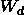
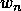

# 多语言搜索:用特定语言的词典进行分解

> 原文：<https://www.algolia.com/blog/engineering/increase-decompounding-accuracy-by-generating-a-language-specific-lexicon/>

分解是将一个复合词切割成有意义的部分的行为。对于多语言搜索引擎来说，这是一个重要的过程，因为在许多语言中，复合被大量用于生成新词。一个德国用户在寻找一个*hundehütte*(*狗屋* )想要得到的结果就好像他们已经输入了*hütte für meine Hund*(*狗屋* )一样。由于大多数电子商务搜索都是基于关键词的，一旦我们删除了停用词()和*meine*(*my*)，打破了复合词 *Hundehütte*

在这篇博文中，我们将定义一个复合，并讨论分解的概念。我们将讨论典型的分解方法，并向您介绍我们在 Algolia 使用的方法。我们还将讨论知道何时 *而非* 被分解的挑战(例如在 *机场* 被拆分为 *航空* 和 *港口* 的情况下)。

## 什么是复合？

如果你剪过头发或见过摩托车，你会对复合词很熟悉。复合词是两个或两个以上的词(词位)组合成一个新词。复合词通常由名词、形容词和动词组成。例如:

*   打开，如 *酱油*
*   连字符，如 *基于概率的* 和 *白发苍苍的*
*   关闭，如 *快捷方式* 和 *白板*

在搜索的上下文中，我们感兴趣的是最后一种类型，、**、**、为闭合复合词，其他两种更容易拆分。

大多数语言使用复合词来创造新词。例如:

*   荷兰语:*verjaardagskalander*(*生日日历*)=*verjaardag*(*生日* ) + *卡伦德* (
*   在完成:*kukkakimppu*花束)=*kukka*(*花*)+*kimppu*
*   In Japanese: *お好み焼き* (*okonomiyaki*) = *お好み* (*okonomi, preference*) + *焼き* (*yaki, cooking*)

在某些语言中，复合词可以产生极长的单词。在德语中，复合词没有大小限制。1996 年， *吉尼斯世界纪录* 认定[Donau dampfschifahrts elektrizitten hauptbetriebswerkbau unterbeamten Gesellschaft](https://en.wikipedia.org/wiki/Donaudampfschiffahrtselektrizit%C3%A4tenhauptbetriebswerkbauunterbeamtengesellschaft)(出自多瑙河轮船电气服务公司主要维修大楼下属官员协会)为最长公布的字。

在日耳曼语中，一个复合词通常由一个**和一个或几个 **修饰语组成。** 头在右边(字尾)，修饰语分支在左边。他们经常使用 **连接语素** 来连接。在语言学中，一个语素是最小的意义单位(想想*狗* = *狗* + *s* 或*不舒服* = *un* + *舒服* + *能干*)，连接语素用来连接词语 *。* 它们也可以用来表示某种程度的屈折，比如在使用所有格或复数时:**

 ***   **洪德** **鄂** **胡特**
*   **Voorlichting****s****systeme**(*预防系统* 荷兰语)
*   **Eftermiddag****s****kaffe**(丹麦语*下午茶*

连接语素是语言依赖性的。以下是几种语言的例子:

*   瑞典语:o，u，e，s
*   荷兰语:南、东、英
*   德语:南、东、恩、恩、嫩、ens、ns

有些单词在连接时可能会被部分删减，如*Fahrschule*(*驾校*)；动词*Fahren*(*带动* )被削去了茎。

## 什么是分解？

分解是将化合物分解成有意义的词位的行为；提取每一个有意义的单元。

我们必须避免的一件事是过分分解单词。比如荷兰语单词*Voorlichtingssysteem*(*预防系统* )可以剪成*Voorlichting*(*预防*)+*s*停在那里是有意义的。我们可以把*【Voorlichting】**Voor*(*在* 前面)+*lichting*(【T77)

## 典型的分解方法

大多数分解方法都是基于不应该被进一步分解的单词的 **词典** 。我们将这些字称为 **原子。** 例如，在德语单词*wissenschaftscolleg*(*理学院* )，原子是*Wissenschaft*(*理科* )和 *Kolleg*Wissenschaft*可切割成*Wissen*(*知识* )和*Schaft*(*轴使用这个词汇，我们可以很容易地通过找到最长的原子来拆分化合物。**

我们可以用几种方法做到这一点。分解技术应用不同的方法:

更高级的方法使用单词的统计特性。他们查看大量数据中原子出现的频率，只有当整个单词有意义的概率比其各部分的概率低时，才拆分单词。机器学习也被用来解决分解分词问题。在一个关于[分解查询词](#footnote1) 的引用最多的资源中，作者结合了一个词的统计属性，如在大型语料库中出现的频率和在查询中的共现，并使用 [支持向量机(SVM)](https://en.wikipedia.org/wiki/Support-vector_machine) 将它们结合起来。

最近，研究人员 Martin Riedl 和 Chris Biemann 提出了一种叫做 SECOS 的方法，该方法使用分布式词库上单词和距离的统计属性来将复合词分成可能的和相关的单词。

## Algolia 方法: 为分解构建一个好的词典

在 Algolia，速度至关重要。我们不能实现一种会显著降低搜索引擎速度的方法，从而破坏像“随键入搜索”这样的功能。因此，我们不能在查询时使用复杂或繁重的基于机器学习的方法。

考虑到这一点，我们得出结论，一个好的词典是一个高效的分解系统最重要的部分。下面是一个德语测试集的例子，我们使用一个仅由测试集中出现的原子组成的词典来计算下面的度量。通过使用简单的 **贪婪最长匹配** 算法进行匹配。一半的测试集由不应被分解的单词组成，例如 *Handschuh，glove，* 其不应被划分为*Hand*+*schuh*(*Hand*+*shoe【t 另一半含有应该被分解的化合物。*

| **复合** | **翻译** | **分裂** |
| *Wissenschaftskolleg* | *理学院* | *Wissenschaft+kol leg* |
| *洪德胡特* | *狗屋* | *洪+胡* |
| *手抖* | *手套* | *手抖* |
| *Hinterziehung* | *闪避 * | *Hinterziehung* |

我们使用测试集的所有原子作为我们的词典(例如 *Wissenschaft，Kolleg，Hunde* )，得到如下结果:

| **方法** | **词汇** | **F1-得分** | **精度** | **召回** | **精度** |
| 贪心最长 | 3702 字 | 0.998 | 0.998 | 0.998 | 0.999 |

这是相当可观的，但这是作弊。在现实生活中，我们没有一套完美的原子。例如，如果测试集仅由*Hund*和*hütte*组成，那么仅由*Hund*Hund和hütte组成的词典将会得到完美的分数，但是在真实数据上它不会表现得很好。

我们需要建立一个更加可靠和详尽的词典。我们的方法包括以下步骤:

1.  在我们的目标语言中寻找大量文本
2.  提取频繁使用的名词、形容词和动词以创建第一词典
3.  根据给定的分数，通过仅保留不能被其他单词分解的单词来修整词典(下面详述)
4.  用单词的潜在变化丰富词典

### **寻找目标语言的大量数据**

免费使用、无人监管的文本数据可以从几个来源在线获得。我们喜欢 [维基媒体的数据](https://dumps.wikimedia.org/) ，尤其是维基百科和维基新闻的数据。(对于维基百科没有提供足够数据的语言，[OSCAR](https://oscar-corpus.com/)也是一个选项，虽然我们没有用过)。当然，必须通过提取文章的文本，然后使用标准的文本预处理来清理数据，并使用语言分类器来确保我们提取的大多数句子都是所需的语言(在线选项包括[【fast text】](https://github.com/facebookresearch/fastText)[lang detect](https://pypi.org/project/langdetect/)，以及[CLD 3](https://github.com/google/cld3))。

### **提取名词、形容词和动词**

现在我们有了大量的目标语言文本，我们想在其中找到潜在的原子。我们知道化合物是由名词、形容词和动词组成的，如果我们能在数据中找到常用的名词、形容词和动词，我们就会有一组很好的潜在原子。

为了提取我们的原子，我们使用了词性标注，这是一种将单词与其词性(例如，名词、代词、形容词、副词)匹配的分类任务。幸运的是，有一些图书馆拥有针对几种语言的词性标注训练的深度学习模型。最广为人知的有[spaCy](https://spacy.io/)[Stanza](https://stanfordnlp.github.io/stanza/)[flair](https://github.com/flairNLP/flair)，以及[trankit](https://github.com/nlp-uoregon/trankit)。我们还计算了这些潜在原子的出现次数，这在我们的下一步中是有用的。

词条解释是识别一个屈折词的基本形式或字典形式(其词条)。例如， *狗* 的基本形态是狗， *的基本形态是* 是 *be，* 和的基本形态是 由于词会受到形态变化的影响，我们将其词条化以得到更详尽的数量。然后我们过滤掉不常用的单词，因为它们可能是噪音或错别字，以及很长的单词，这些单词不太可能是原子。

### **修剪我们的词库**

在这个阶段，我们的词汇由相对频繁使用的名词、形容词和动词组成，我们认为它们是潜在的原子。然而，许多潜在的原子很可能是化合物。为了过滤掉这些不需要的化合物，我们使用了潜在原子的统计特性。如果一个给定的单词可以被其他单词的组合分解，并且这些其他单词的概率的几何平均值(见下文)高于整个单词的概率，我们就把它从我们的词典中去掉。

我们计算潜在原子的概率如下:

其中*total word count*是我们语料库中的总字数，而*word count(**)*在语料库中出现的次数。

我们计算潜在分解  的概率的几何平均值为:

T33

其中 N 是分裂中的原子数。

如果，对于一个给定的词   ，我们可以找到一个拆分的词，其中概率的几何平均值【p】()高于全词的概率【p】()，我们就可以去掉请注意，我们在潜在的拆分中还考虑了特定语言的连接语素。

例如，如果在我们的语料库中，我们有*Akustikgitarre*50 次，*Akustik*75 次，*Gitarre*150 次，总字数为 5 万:

因为*Akustikgitarre*比*Akustik*和*gi tarre*加起来的概率低，我们可以把它从我们的词典里去掉。

### **丰富了词汇**

对于我们的最后一步，我们恢复了我们对引理化所做的。我们有一个内部词形变化词典，列出了几种语言中给定单词的潜在变体。我们用它来把我们原子的所有变体添加到我们的原子词典中。

## 分解算法

现在我们有了词典，我们可以在索引和查询时对潜在的复合词应用分解算法。不幸的是，使用上述概率的几何平均值的分解在计算上是昂贵的(它产生了指数数量的潜在分裂)。也就是说，如果我们有一个单词，比如[*Donau dampfschifahrts elektrizitten hauptbetriebswerkbau unterbeamten Gesellschaft*](https://en.wikipedia.org/wiki/Donaudampfschiffahrtselektrizit%C3%A4tenhauptbetriebswerkbauunterbeamtengesellschaft)，有大约 20 种可能的拆分，我们就必须测试一百万种可能性。所以我们坚持简单的从右到左(从右到左，因为我们所有的目标语言都是左分支)，最长匹配算法。这种贪婪算法简单地从单词的末尾开始，尝试匹配我们词典中最长的单词，从右到左增长。然后，它继续搜索单词的剩余部分，直到匹配到单词中的所有原子。我们也允许特定语言的原子间连接语素。

## 评估分解

我们将我们的结果与 SECOS 的结果进行了比较。 我们的评估指标详见附录。

作为测试集，我们使用了 [SECOS GitHub 页面](https://github.com/riedlma/SECOS) 上提供的德国数据集。基础数据集只提供复合词，不提供不应分解的词(如*Handschuh*)。

在评估我们方法的精确度时，拥有不应被分解的单词是很重要的。我们利用测试集中不被其他原子分解的至少 7 个字符的原子作为我们不应该被分裂的集合。最终的测试集由 3702 个单词组成，包括 1851 个复合词和 1851 个不应分解的单词。它有点嘈杂，但对于比较方法来说已经足够好了。

通过修改生成的词典的大小(使用词频作为过滤标准)来制作下面的图。请注意，随着词典的增长，召回率会增加(我们能够分解更多的化合物)，但精确度会下降(我们开始分解不应该被拆分的单词)。

*组合* 在通过我们的方法建立的词典上使用上述组合方法(使用几何平均)直到第三点(在用我们的变格词典扩充词典之前)。 *贪婪* 代表使用同一词典的贪婪方法。 *贪婪+替代* 是我们的词形变化词典(到第 4 点为止)充实的全词库。注意， *贪婪+另类* 的词汇量不对，因为它没有计入附加词形变化。SECOS 词汇表没有变化，我们使用了他们的 GitHub 页面上提供的预训练模型。

再一次，我们不能在实践中使用组合方法，因为它的计算成本。我们的方法( *贪婪+选择* )以快得多的计算时间达到接近的 F1 分数。

你可能已经注意到 SECOS 的结果与研究人员文章中报道的结果并不相似。那是因为我们的评估比他们用的更严格。我们按照一篇关于 [复合拆分方法](#footnote3) 的文章中定义的评估，认为拆分是错误的，即使它是部分正确的。例如，虽然*Wissenschaftskolleg*->*Wissen+Schaft+kol leg*对我们来说是完全错误的，但对 SECOS 的评价却是部分正确的。然而，在德国测试集上使用他们的评估脚本，他们的方法的 F1 得分为 0.87，而我们的方法( *贪婪* + *备选方案* )的 F1 得分为 0.92。

## 动作中的分解特性

Algolia 支持六种语言的分解:荷兰语(nl)、德语(de)、芬兰语(fi)、丹麦语(da)、瑞典语(sv)和挪威语博克马尔语(no)。要了解更多关于分解的内容，请看一下我们关于分解复合词 的 [文档。](https://www.algolia.com/doc/guides/managing-results/optimize-search-results/handling-natural-languages-nlp/in-depth/language-specific-configurations/#splitting-compound-words)

生成的词汇对于一般数据来说是很好的，但是我们的许多客户工作在具有非常特殊词汇的利基领域。使用我们的 [客户词典](https://www.algolia.com/doc/api-reference/api-methods/save-dictionary-entries/#save-compound-entries) ，你可以以任何你想要的方式强制分解一个给定的单词。

## 总之

我们证明了找到合适的词典是一个好的分解算法的最重要的部分。我们实现了一种计算好词典的方法，它只需要:

*   大量目标语言文本
*   目标语言的词性标注分类器
*   特定语言连接语素列表

这个词典，结合贪婪的最长匹配分解算法，击败了更复杂的实现，并且没有牺牲查询和索引速度。

[从复合语言中分解查询关键字](https://www.aclweb.org/anthology/P08-2064.pdf) 。E. Alfonseca 等人，ACL-08 会议录:HLT，短文，2008 年。

[无监督复合分裂与分布语义的有监督方法](https://www.inf.uni-hamburg.de/en/inst/ab/lt/publications/2016-riedletal-naacl.pdf) 。M. Riedl，C. Biemann，HLT-NAACL，2016 年。

[复合拆分的经验方法](https://www.aclweb.org/anthology/E03-1076/) 。P. Koehn，K. Knight，计算语言学协会欧洲分会第 10 届会议，2003 年。

## 附录

### **A.1 措施**

为了评估一个分解的质量，我们使用了精确度、召回率、F1 值和准确度的常规测试。对于精确度、召回率和 F1 分数，我们遵循 Koehn 和 Knight 在他们关于分解的大多数论文中使用的定义:

*   *正确拆分= #应拆分且被正确拆分的字数*

 **   *错不= #字该拆却未拆*

*   *错误拆分= #单词本不该拆分却被*

*   *错了错了= #本该拆分的字，被拆分了，却错了*

*   *正确=正确泼+正确非*

*   *错=错不+错拆分+错错*

这让我们想到:

我们也认为一个拆分是正确的，如果它匹配期望的拆分+/-连接语素。例如，在分解*Adressen Liste*时，如果我们找到*Adressen*+*Liste*而不是*Adresse*+*list 请注意，我们使用的是严格的评估，因为它认为分割是错误的，即使它是部分正确的。****