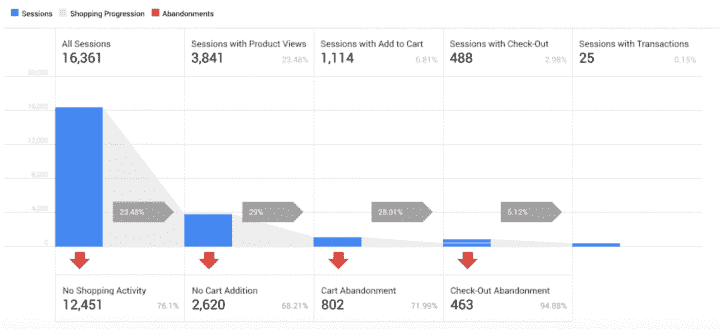
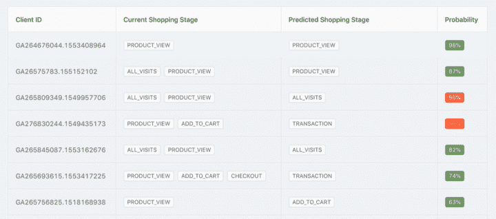

# 通过预测用户的下一个购物阶段来提高您的电子商务投资回报率

> 原文：<https://www.algolia.com/blog/ai/increase-your-ecommerce-roi-by-predicting-users-next-shopping-stages/>

当事情井井有条时，我们会有一种特殊的满足感。我们有一种平静的感觉，事情做得很好，如果赌注足够高，我们对人类的希望可能会恢复。

想想这是什么感觉:

*   在你的第一次谷歌搜索中找到你需要的东西
*   找到你看中的打折夹克(而且是你的尺码！)
*   比预期提前收到货物

作为顾客，我们重视这类体验。我们根据对交易的满意度来判断和评估我们购买的品牌和公司。但是当我们转换角色时，从消费者到产品建设者，我们可能会陷入我们的燃眉之急，不知不觉地忘记了创造良好客户体验的重要性。然而，我们的客户永远不会忘记，我们的 KPI 清楚地反映了他们的满意度。

了解客户的需求是你的一张王牌，可以帮助你满足他们(以及你的经理)的期望。

更令人兴奋的是，你可以接触到直到最近只有世界上最大的公司才能负担得起的技术。你可以利用机器学习和人工智能优化将你的营销业绩提升到新的高度。

## 做出细微的改进产生巨大的影响

一家领先的营销传播机构的首席执行官兼《福布斯》撰稿人乔恩伯德(Jon Bird)表示，对下一阶段营销技术的电子商务预测集中在一个共同的想法上:购物 [*将更加数字化，但会感觉更加人性化*](https://www.forbes.com/sites/jonbird1/2018/06/10/7-predictions-on-the-next-era-of-digital-retail/#42fc57947db1) *，技术将更不可见，但会更加强大* 。

使用人工智能对你的客户来说没有什么影响 *除非* 他们的体验更好、更快、更相关、更令人满意。能够预测他们的下一个购物阶段可以帮助你让他们更容易转变。

您可以为在线购物者提供:，让他们更容易转换

*   定制优惠
*   个性化折扣
*   匹配产品的更多相关建议
*   目标通知

此外，通过细分和锁定更有可能通过您的再营销活动购买的用户，您的营销预算可以获得更高的投资回报率。以下是人工智能如何让整个过程变得更容易、更快、更有效。

## 吸引你从来不知道想要购买的用户群

为网上购物者打造定制体验的想法并不新鲜。通常，这种类型的个性化会转化为细分。这包括识别客户之间的共同特征，然后根据预定义的用户群锁定他们。

传统上，营销专家依靠创建一个虚构的客户档案来定义一个最有可能转化的理想用户。他们的假设基于从研究和分析中得出的标准，例如:

*   年龄
*   性别
*   位置
*   使用的装置

这种方法已经成为标准；公司倾向于使用类似的策略。标准营销工具箱包括:

*   网络广告
*   电子邮件通知，提示他们完成已添加到购物车或标记为收藏夹的商品的购买
*   折扣率
*   基于规则的行动要求

除了对顾客注意力的高度竞争，这种方法还有其他一些不太明显的缺点。

首先，它完全忽略了离群值:同样致力于购买但不勾选相同复选框的用户。如果你能找到有效接触这些“幽灵用户”的方法，他们会成为你生意的收入来源。

客户细分也有其他缺点:那些符合相同特征(年龄、性别、地点)的人将收到相同的交易或行动号召，而不管他们在购买过程中的哪个阶段:产品页面、添加到购物车、结账等。

将所有用户放在同一个桶中，不管他们的意图如何，这是一个缺点，可能会导致失去机会、浪费金钱，有时甚至会导致沮丧的客户放弃他们的忠诚度，或者减少用户成为忠诚客户的机会。

谢天谢地，人工智能可以在这方面提供帮助，我们提出的细分方法比标准的营销方法更加细致入微。我们不是对客户的个人特征做出假设，而是依靠机器学习来分析他们的浏览活动和历史。我们仍然可以对用户进行相互比较，以确定他们之间的模式，但我们现在也在个人层面上计算他们转换的概率。这就产生了一个瞄准用户的新标准:转换用户与非转换用户。

这可能是如何工作的。

## 最有可能转化的现货用户

如果你已经在电子商务领域工作了一段时间，你可能会对谷歌分析服务很熟悉。您可以生成活动报告或对用户进行细分，以更好地了解谁在使用您的网站及其原因。此外，在 [增强型电子商务](https://developers.google.com/analytics/devguides/collection/analyticsjs/enhanced-ecommerce) 模块中，您可以找到您的销售漏斗概览。漏斗显示在您的 GA 仪表板的购物行为部分，为您提供了一个高层次的视图。但是，它并没有提供任何关于 *为什么* 有些用户转化而有些不转化的定性信息。 

你当然可以在每份报告中挖掘得更深入。例如， **受众>用户浏览器** 报告对于分析单个用户的行为特别有用。GA 通过浏览器 cookie 或用户 ID 来识别每个用户，如果您的电子商务应用程序有用户帐户，则可以使用浏览器 cookie 或用户 ID。但是，无论你多么仔细地检查你的 GA 数据，谜团依然存在: *营销人员如何识别即将转化的用户？*

## 利用客户情境预测他们下一步要做什么

我们的假设是，用户的活动和历史是其转化概率的最相关指标。

学习算法基于来自先前会话的信息，通过直接插入数据源来预测用户浏览会话的结果，数据源可以是[Google Analytics](https://developers.google.com/analytics/devguides/reporting/core/v4/)free 或 360、BigQuery 或任何其他第三方分析平台。

AI/ML 不仅仅是将用户分为转化者和非转化者，它还能帮助你实现更具体的目标。这使您能够根据用户最有可能进入的购物阶段来吸引他们。

您可以自动计算客户的概率:

*   继续浏览产品
*   向购物车添加产品
*   结账
*   完成交易

通过比较这些概率，ML 模型可以帮助您确定顾客可能会进入哪个购物阶段。因此，您可以正确地将用户放在相应的细分市场中(例如，那些可能将产品添加到购物车中的用户)。

## 幕后发生的事情

在后台，我们可以把从 Google Analytics API 中提取的数据分为三类:

*   **用户/浏览器:** 用户信息(由 cookie ID 标识)；包括浏览器和移动设备等详细信息
*   **会话:** 购物阶段、会话持续时间、交易次数、收入、会话间隔天数等信息
*   **点击:** 关于浏览、添加到购物车、通过结账处理或购买的产品的详细信息(例如，价格、名称、类别)，以及关于来自 Google Analytics 的产品和其他点击事件的详细信息。

用户拥有可变的会话数量，会话拥有可变的点击数。

我们的模型可以有一个递归的架构:它以时间顺序使用数据。会话和命中数据从最早到最新进行组织，并一次一个会话地输入到 AI 模型中。在处理完特定用户的所有会话后，模型会计算每个购物阶段在未来会话中出现的概率。

到目前为止，我们已经用两个归因模型进行了冗长的实验:

*   **线性属性建模，** 其中一个事务对所有会话同等重要，不管第一个会话和最后一个会话之间经过了多长时间
*   **时间衰减属性建模，** 通过应用基于会话年龄的半衰期权重，对最近的会话赋予更多价值

## 一个真实世界的 AI 实验预测下一个购物阶段

为了向你展示这种实际的人工智能应用在现实生活中是如何工作的，我们基于一个家具电子商务网站的数据创建了一个实验。我们的数据来自 24，188 名在线购物者。其中，98 人在最后一次会话中进行了交易。总收入为 151，674 美元，平均交易价值为 1，547 美元。

在现实世界中，每个目标用户都有一个客户获取成本。对于这个实验，我们假设它是 50 美元。我们在下面的计算中没有考虑毛利润。

实验的目的是评估不同靶向方法的效率:

*   其中两个基于上述机器学习模型(两个属性模型)
*   一个随机
*   一种使用统计方法

对于每个场景，我们计算了真阳性(目标正确的用户)和假阳性(目标错误的用户)的百分比。

基于每个用户和他们的历史，我们计算了一个介于 0 和 1 之间的交易概率。如果用户成为目标并进行购买，我们就有了真正的正面信息。如果用户是目标，但没有完成交易，我们有一个误报。

下面是结果的样子:

| 方法 | 进行购买的目标用户(真阳性) | 没有购买的目标用户(误报) | 预计总收入 | 目标成本为 50 美元/用户 | 收入–成本 |
| 随机 | 90.84 | 11949.12 | 102456.14 美元 | 601，998 美元 | -499，541.86 美元 |
| 统计 | 9.99 | 525.12 | 8508.40 美元 | 26755.5 美元 | -18247.10 美元 |
| ML，时间衰减归因 | 20.02 | 135.72 | 21842.74 美元 | 7787 美元 | 14，055.74 美元 |
| ML，线性归属 | 34.04 | 98.93 | 39524.48 美元 | 6648.5 美元 | $ 32875.98 |

使用随机方案，我们得到了最真实的肯定(正确的目标用户)，但是高成本意味着利润不在账面上。相比之下，线性模型虽然针对的用户群较小，但误报率较低(0.41%)。从这些预测中，很明显，线性归因是最有利可图的定位方法。

## 利用购物阶段预测推动电子商务业绩

一旦你有了下一个购物阶段的预测，你可以做很多事情来优化你的电子商务网站和营销流程。 您可以通过以下方式成为顾客更相关、更有帮助的购物目的地:

*   通过根据意图对受众进行细分来改善搜索结果
*   根据意图过滤建议
*   显示带有个性化行动要求的弹出窗口
*   发送个性化电子邮件提醒
*   向更有可能转化的用户进行再营销

使用人工智能即服务平台意味着你可以节省阅读谷歌分析报告的时间。你的团队可以更快地调整并充分利用你的洞察力，而不是停留在汇报会议上。

此外，预测可以通过 API 提供，您可以轻松地将其与您的报告仪表板集成。此外，拥有一个完全自动化模型训练和预测的基础架构是一个可扩展的解决方案。下面是集成在电子商务场景中的工作方式:

*   用户访问您的电子商务网站
*   网站通过浏览器 cookie 识别用户并调用 API
*   返回用户完成交易的概率
*   根据交易概率，网站会显示一个带有个性化信息的弹出窗口，其中可能包括行动号召、折扣代码或创意触发

毫无疑问，AI/ML 是创造更好客户体验的强大驱动力。要实现这一点，你只需要一个开放的心态，并愿意尝试用新的方式来看待你现有的数据。