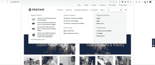
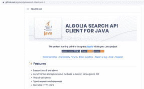
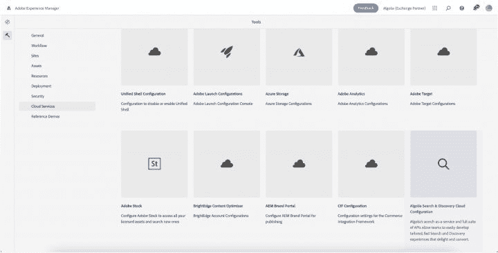
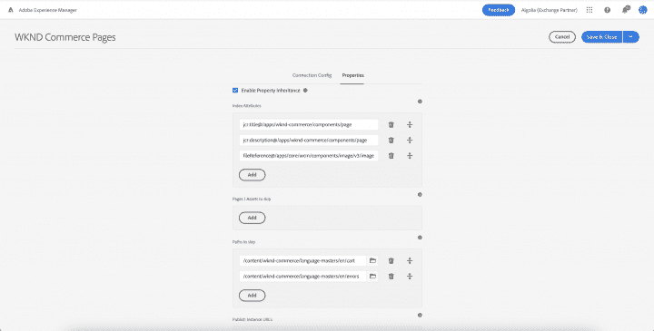
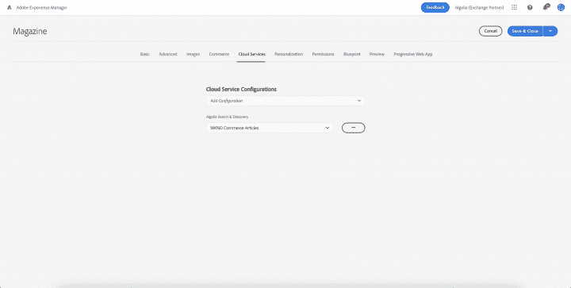
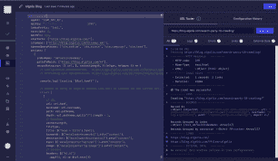

# 如何以三种方式从 Adobe Experience Manager (AEM)获取数据

> 原文：<https://www.algolia.com/blog/product/ingesting-data-from-adobe-experience-manager-aem-for-search-discovery/>

企业花费大量的时间和资源开发能够支持产品销售、提升品牌和思想领导力、教育用户或回答常见问题的内容。重要的是，他们可以组织他们的内容，为给定的角色提供最相关的信息。虽然对于营销人员和数字出版商来说，这可能最终是一个手动过程，但 Algolia 等更智能的搜索和发现平台可以使这变得更容易，并推动更强的参与。

Algolia 是一个 API 优先的解决方案，可以轻松地与单片和无头平台集成，包括 Adobe 广受欢迎的 CMS、Adobe Experience Manager (AEM)。随着我们看到越来越多的 Adobe 客户在 AEM 上使用 Algolia 来管理和呈现他们的内容，我们想讨论他们连接这两个系统的三种方式:通过 API、合作伙伴构建的集成和 Algolia Crawler。

Adobe Experience Manager 拥有通过数字渠道管理的所有页面、资产和内容。此外，其他内容可以存储在外部系统中，例如 Zendesk 或电子商务系统，例如 Adobe Commerce。通过将所有内容索引到 Algolia，客户可以轻松创建统一的搜索体验，从而允许他们的客户通过一个搜索栏搜索不同类型的内容。这可能是一个大型 CPG 品牌的所有品牌网站，一个流媒体服务的媒体内容，或者一个设备公司的产品、手册和常见问题。在所有这些情况下，将来自 AEM 和其他平台的所有内容聚合并呈现到一个体验中是非常重要的。此外，所有的内容都以一种高性能的方式呈现，每次击键的结果都在几毫秒内更新。

Pentair 是 B2C / B2B 公司的一个很好的例子，它使用 Algolia 将 AEM 内容和 Adobe 商务产品结合在一起。他们为用户建立了一个漂亮、统一的搜索和发现体验。

## 我们如何把 AEM 和 Algolia 联系起来？

### 选项 1: Java API 客户端

作为索引数据的直接方式，Algolia 提供了一个 Java API。 [Java API 客户端](https://www.algolia.com/developers/search-api-java/) 是一个开源的、生产就绪的 API 包装器，它从与 Algolia 搜索 API 直接交互的复杂性中抽象出来。例如，它处理网络重试策略、记录批处理和重新索引。因为 AEM 是一个 OSGi 平台，需要一个 uber JAR 作为依赖，所以我们提供了与这些平台兼容的[algoliasearch-Apache-Uber](https://www.algolia.com/doc/guides/getting-started/quick-start/tutorials/quick-start-with-the-api-client/java/?client=java#osgi-platforms-and-adobe-experience-manager-aem)。

直接使用 Algolia Java API 可以更灵活地满足您的业务需求。Java API 客户端可能需要额外的投资和时间，但允许您根据自己的内容结构和规范进行定制。利用 AEM 的事件引擎将根据配置中定义的 Algolia 索引的内容变化提供近乎实时的索引。

至于搜索体验，你有两个选择:你可以使用 Algolia 的 API 客户端(Java、JavaScript、PHP 和其他八种语言)中的一种，从头开始开发定制体验；或者，您可以利用 Algolia 的搜索小部件及其 [即时搜索](https://www.algolia.com/doc/api-reference/widgets/js/) 库，可用在 vanilla Javascript、ReactJS、AngularJS 等中。Algolia 的 InstantSearch 库调用 Algolia 最接近的服务器，提供了令人难以置信的快速搜索体验。InstantSearch 小部件可以嵌入到 AEM 组件中，而不是构建自己的 UI 组件，发布者可以使用它在自己的网站上构建搜索体验和结果页面，从而提升网站的性能和速度。

#### **你为什么会选择这种方法**

许多客户和 SI /机构合作伙伴选择使用我们的 Java API 客户端和 InstantSearch 库在 AEM 和 Algolia 之间构建定制集成。这种内部解决方案为客户定制数据结构的方式提供了额外的灵活性。

### 

### 选项 Adobe 体验管理器的 Algolia 索引器加速器

为了加快开发过程，我们构建了一个加速器，利用 Java API 来索引来自 AEM 的数据。可以通过 Adobe Exchange 请求该包，或者您可以在【adobe-algolia-solutions@algolia.com的[进行请求。该连接器包括配置模块、将配置分配给内容路径的方法以及触发手动重建索引的重建索引服务。](mailto:adobe-algolia-solutions@algolia.com)

**配置:** 在 AEM Author 实例上安装连接器后，作者需要配置索引服务，导航到云服务下的“Algolia”。在那里，您可以为每个站点属性配置索引，包括要索引的字段、属性名称和发布 URL。如果启用了继承，配置控制台将允许继承，以便在祖先节点中找到任何缺失的配置属性。

一旦创建了配置，现在就可以将它们分配给任何级别的站点树。

**索引:** 索引服务然后在发布事件上索引页面、组件、属性、资产和片段。对于站点的完整索引，连接器在“部署”下提供了 Algolia 索引器控制台。向作者呈现路径查找器来选择开始索引的起始路径。如果选中了“树激活”复选框，索引器将对站点树进行爬网和索引。

页面/资产上的“发布”操作将在页面内容和 Algolia 索引中查找已配置的属性。“取消发布”事件将从 Algolia 索引中删除页面或资产。如果存在的话，可以在发布实例上部署一个额外的服务来检索页面的虚拟 url。

#### **你为什么会选择这种方法**

AEM Algolia 连接器将加速 Algolia 的开发周期。只需少量投资和一些定制，这种集成将允许您索引所有内容，并随着每次更改实时更新。

### 选项三:爬虫

爬虫是 Algolia 专有的自动网络抓取程序。当给定一组起始 URL 和配置好的提取定义后，爬虫会访问这些页面并从中提取内容。然后，它访问链接到这些网页的网址，并为这些网页重复这个过程。只需很少的配置，爬虫就可以通过时间表定期从你的网页中提取内容来为你填充和维护 Algolia 索引。

爬虫可以帮助你从多个站点提取内容，格式化内容，并上传到 Algolia。爬虫:

*   快速聚合您分发的内容
*   自动定期更新您的汇总内容
*   使您能够快速准确地搜索您的记录(并为您的客户提供同样的搜索体验)

对于前端搜索体验，仍然需要创建组件，如 **选项 1** 所述。使用 Algolia 的 [即时搜索库](https://www.algolia.com/doc/api-reference/widgets/js/) ，您可以通过将我们预先构建的搜索小部件嵌入到您的 AEM 组件中或使用它们来构建无头前端，从而加快您的搜索体验的交付。

#### **你为什么会选择这种方法**

如果您的数据位于 AEM 内部和外部的许多地方，或者如果您没有大量的元数据来对您的内容进行分类，或者如果您的上线时间很短，您可以考虑使用爬虫作为一种有效的方法来将您的数据索引到 Algolia 中，并根据站点结构用类别标记每条内容。

## 结论

一旦您将 AEM 内容编入 Algolia，您将使其更容易被发现，并可以开始配置您的相关性和排名顺序，以及 A/B 测试，以了解如何在您的内容上获得最大的参与度。我们期待听到您关于哪种索引方法最适合您的意见，以及您希望与社区分享的任何反馈或最佳实践。在 adobe-algolia-solutions@algolia.com[联系我们](mailto:adobe-algolia-solutions@algolia.com)。

查看我们“Algolia x Adobe Integrations”系列的下一篇博客，了解如何利用 Algolia 中的 [Adobe 发布活动](https://www.algolia.com/blog/product/leveraging-adobe-launch-events-in-algolia-for-personalization/)和 [Adobe 分析指标](https://www.algolia.com/blog/product/leveraging-adobe-analytics-for-algolia-search/)来增强您的搜索结果！