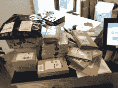
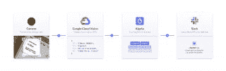

# 将 OCR 集成到搜索包标签扫描应用程序中- Algolia Blog | Algolia Blog

> 原文：<https://www.algolia.com/blog/engineering/integrate-ocr-into-search-in-a-package-label-scanning-app/>

在没有 T2 的情况下，使用搜索栏来查找难以找到的信息听起来有些矛盾，但是以包装标签为例。快递公司以许多不同且不可预测的方式构建标签信息。通常，我们只是自己阅读标签并找到相关信息——在这种情况下，包裹是给谁的。但是我们更喜欢将 OCR 集成到搜索中。

但是，如果有成千上万的标签，所有的结构都不一样——不同的内容，有时是手写的，几乎不可读的灰色阴影，奇怪的文本方向，随机的线条，图形，污迹和撕掉的角落，会怎么样？OCR 有帮助吗？

光学字符识别(OCR)尽最大努力从图像中提取文本，但产生的文本通常很大且无结构。此外，如果 OCR 软件不能破译一些字母，文本将有错别字。

这就是集成搜索技术的用武之地。**具有健壮的、适应性强的相关性的搜索引擎可以将 OCR 的非结构化文本与结构化数据集进行匹配，并返回正确的结果。**

## [](#integrate-ocr-into-search)将 OCR 集成到搜索中

我们将搜索引擎整合到两项技术中:

本质上，我们扫描了一个标签，并使用谷歌云视觉 API 将标签转换为文本。然后，我们将不可预测的输出输入到搜索引擎中，搜索引擎将它与 BambooHR 的结构化数据进行匹配，找到并返回收件人的姓名。重要的是，我们不需要预处理或解析输入数据。这个工作流程也可以用于贴纸、邮票，甚至墙上的电影海报。

在线零售商和媒体公司正在利用这种 OCR +搜索集成来查询他们的后端系统。

## [](#our-story-why-we-needed-to-integrate-ocr-into-search)我们的故事:为什么我们需要将 OCR 集成到搜索中

每天，Algolia 的员工都会在巴黎办公室收到大量包裹。我们办公室的协调员久美子一直在照顾他们。每当有新包裹到达，久美子就会搜索标签，找出是给谁的，然后找到 Slack 上的人，让他们知道他们的包裹正在前台等待。

但是阿尔戈利亚发展迅速。Kumiko 开始花费越来越多的时间来手工处理包裹分发。在节日期间，它变得非常难以控制



显然，手动搬运不成规模。我认为应该有一种 **更快、更容易、可扩展的方式来帮助分派包裹。我决定为它建立一个 web 应用程序。我的目标是尽可能地自动化这个过程，从扫描标签到通知人们有空闲时间。**

我最初想到使用条形码。不幸的是，我很快发现条形码不包含与二维码相同的数据。很多时候，它们只包含[](https://en.wikipedia.org/wiki/International_Article_Number)标识符。这些数字旨在查询私有运营商 API 以获取包裹的详细信息。

所以我决定用光学字符识别引擎([OCR](https://en.wikipedia.org/wiki/Optical_character_recognition))读取包裹标签，并将 OCR 文本按原样发送给搜索引擎*，将其与索引中的正确记录进行匹配。*

 *## [](#how-to-integrate-ocr-into-search)如何将 OCR 整合到搜索中

### [](#step-1-finding-the-right-ocr-software)第一步:寻找合适的 OCR 软件

有几个处理 OCR 部分的开源库。最受欢迎的是 [宇宙魔方](https://github.com/tesseract-ocr/tesseract) 。但是，您通常需要对图像 执行 [一些预处理，然后再将其发送到 Tesseract 以识别字符(例如，去饱和、对比度、去倾斜)此外，我们收到的一些包裹标签是手写的！宇宙魔方不擅长读手写的字。](https://github.com/tesseract-ocr/tesseract/wiki/ImproveQuality)

谷歌的 [视觉 API](https://cloud.google.com/vision/) 提供 OCR 功能，所以我决定试一试。除其他外，它规定:

*   每月 1，000 次免费 API 调用(这足以启动)
*   手写字符检测

我们将在第 3 步中看到它是如何工作的。首先，让我们看看将 Algolia 搜索与 OCR 集成的代码。

### [](#step-2-creating-the-react-app)**第二步:创建 React app**

我创建了一个 React app，安装了[React web cam](https://www.npmjs.com/package/react-webcam)组件来访问设备的摄像头。在内部，React 组件利用了[getuser media API](https://developer.mozilla.org/en-US/docs/Web/API/MediaDevices/getUserMedia)。

一旦用户用手机捕捉到标签，应用程序会将其发送到快递后端。这负责将 base64 编码的图像代理到 Google Vision API。然后，Vision 返回一个 JSON 有效负载，其中包含文本形式的数据。

```
// Initialize the Google Cloud Vision client
visionClient = new vision.ImageAnnotatorClient();

// Ask Vision API to return the text from the label
// https://cloud.google.com/vision/docs/ocr
const [result] = await visionClient.textDetection({
  image: {
    content: labelImage.data, // Uploaded image data
  },
});

const detections = result.textAnnotations; // This contains all the text
const labelText = detections[0].description.replace(new RegExp("\n", "g"), " "); // Replace the line breaks by a space

```

### [](#step-3-reading-the-label-with-google-vision-api%c2%a0)**第三步:用谷歌视觉 API 读取标签**

以下是谷歌视觉给我们的信息(以及我们最终将作为查询发送给搜索引擎的信息):

```
ORY1\n0.7 KG\nDENOIX Clément\nALGOLIA\n55 rue d'Amsterdam\n75008 Paris, France\nC20199352333\nDIF4\nCYCLE\nlove of boo\nAnod

```

如你所见，lAbel 并不漂亮。它们包含许多噪音。相关信息就在那里的某个地方，被其他数据包围着。它们包含与递送人相关的字符，例如标签号、发件人地址等。此外，顺序并不一致，信息也不总是完整的，所以在发送给 Algolia 之前，我们不能依靠单词排序或元素位置来提取相关部分。我们将在步骤 5 中完成。首先，让我们看一下将要搜索的后端数据。

### [](#step-4-data-indexing-bamboohrs-back-end-data)**第四步:数据索引 BambooHR 的后端数据**

这部分不需要提供任何代码。索引来自其他系统的数据是所有搜索引擎的基础。其思想是从一个或多个系统中获取 *相关的* 数据，并将其全部推入一个称为索引的独立数据源。它在后端运行，运行频率与数据不断变化的性质相匹配。请注意，搜索引擎只需要一些与搜索目的相关的数据，用于查询、显示、排序和过滤。

Algolia 的 API 提供了[更新方法](https://www.algolia.com/doc/api-reference/api-methods/save-objects/)来实现这一点。我们的文档提供了关于如何发送数据的教程。

### [](#step-5-searching-with-algolia)**第五步:用 Algolia 搜索**

如你所见，谷歌的视觉应用编程接口给了我们大量的信息。但是搜索引擎怎么定位名字呢？

幸运的是，**Algolia 搜索 API 有一个有趣的参数**:[`removeWordsIfNoResults`](https://www.algolia.com/doc/api-reference/api-parameters/removeWordsIfNoResults/)。

当您将此参数设置为 `allOptional` 并且引擎未能找到原始查询的任何结果时， *将进行第二次尝试，* 将所有单词视为可选。这相当于将单词之间隐含的`AND`运算符转换为`OR`。

```
// Initialize the Algolia client and the Algolia employees index.
const algoliaClient = algoliaearch(process.env.ALGOLIA_APP_ID, process.env.ALGOLIA_API_KEY)
const index = algoliaClient.initIndex(process.env.ALGOLIA_INDEX_NAME);

// Search our employees index for a match, using the `removeWordsIfNoResults=allOptional` option.
// https://www.algolia.com/doc/api-reference/api-parameters/removeWordsIfNoResults/
const algoliaResult = await index.search(labelText, {
    'removeWordsIfNoResults': 'allOptional'
})

```

注意，`labelText`包含了 Google Vision API 返回的没有任何预处理的字符串(除了去掉`'\n’`)。我已经突出显示了搜索引擎从标签上的噪音中抽出的 名称(`DENOIX Clément`)——大海捞针:

```
ORY1 0.7 KG DENOIX Clément ALGOLIA 55 rue d'Amsterdam 75008 Paris, France C20199352333 DIF4 CYCLE love of boo Anod

```

通常，该参数有助于 [在查询过于严格](https://www.algolia.com/doc/guides/managing-results/optimize-search-results/empty-or-insufficient-results/in-depth/why-use-remove-words-if-no-results/) 时改善结果。在我的情况下，它允许我发送未经处理的提取数据。我能够信任 Algolia 引擎“忽略”查询中无关的单词，只考虑重要的单词。

```
{
  "displayName": "Clement Denoix",
  "firstName": "Clement",
  "lastName": "Denoix",
  "location": "Paris",
  "slack": {
    "id": "U0000000",
    "handle": "clement.denoix",
    "image": "https://avatars.slack-edge.com/2018-04-03/340713326613_2890719b5a8d4506f30c_512.jpg"
  },
}

```

只剩下几个步骤:从 Algolia 搜索结果列表中提取第一个匹配项并显示出来。从那里，我们的办公室经理可以确认结果，并自动向正确的员工发送 Slack 消息。

这是该应用的完整流程图:



如此处所示:我们拍下包装标签的照片。该应用程序通过 Express 后端将其发送到 Google Vision API。Google Vision 返回一个包含已识别文本的 JSON 有效负载，后端将其作为搜索查询发送给 Algolia。搜索引擎使用 `removeWordsIfNoResults` 选项来确保匹配成功。Algolia 然后返回一个匹配记录的列表，后端从中提取第一个命中的记录，并将其返回给 React 应用程序。

## [](#conclusion-next-steps)结论&下一步

Algolia 强大的搜索引擎不仅限于搜索框。凭借想象力，您可以将 Algolia 的使用远远超出盒子的范围，并解决各种问题。

标签读取只是 OCR 集成的一种。有*图像识别，*在线零售商可以从图像中识别服装的类型、风格、颜色和尺寸。还有*语音识别，*网站可以与人们说话的非结构化方式互动。

有很多方法可以做到这一点。在这种情况下，我们使用搜索引擎的内置功能来实现这一点，这些功能使它能够根据非结构化查询数据的多样性和不可预测性来调整其相关性算法。下一步是将人工智能和机器学习结合起来，使搜索引擎的适应性和用例范围更大。*