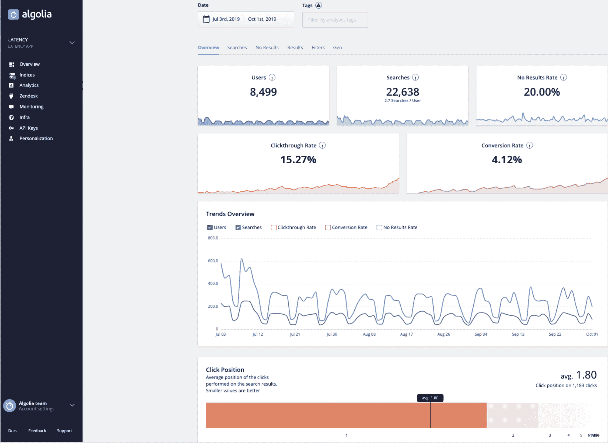
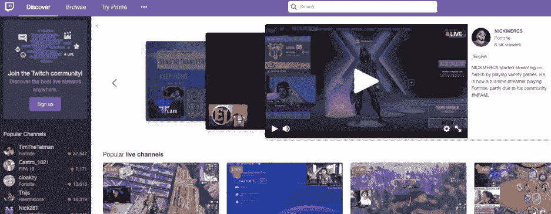

# 如何分析你的内部网站搜索数据

> 原文：<https://www.algolia.com/blog/product/internal-site-search-analysis/>

您上一次对网站进行站点搜索分析是什么时候？如果你的答案是“永远不会”，你不是唯一一个。很少有公司投入资源挖掘网站搜索数据。但即使你不是一个人，你也肯定错过了。每次访问者搜索你的网站，他们都会产生大量有用的数据，这些数据可能会回答你迫切的问题。

## 什么是站点搜索分析？

网站搜索分析是对您网站上访问者搜索行为的详细检查。这些行为包括关键字和关键短语搜索、过滤器和方面选择以及搜索建议点击。这种分析可以通过专门的网站搜索分析仪表板来完成。

  有了网站搜索分析，你就能根据你不断发现的用户信息，每周甚至每天改进你的网站。例如:

*   [零售和电子商务网站](https://www.algolia.com/blog/ecommerce/e-commerce-2019-tips/) 可以发现本周最受欢迎的商品，并让它们出现在更多的搜索中。
*   媒体网站可以发掘热门话题，开发更能引起用户共鸣的内容。
*   几乎任何类型的网站都可以根据最新的用户洞察来改进设计和功能。

分析是实现这些改进的关键步骤。但这只是它能让你做的事情的开始。

## 网站搜索分析能产生影响的 6 种方式

站点搜索分析的优势是巨大的。它提高了销售额和盈利能力，增强了竞争力，并促进了长期客户满意度。以下是分析你的网站搜索对你的业务产生影响的六种方式:

### **揭示你的站点搜索质量**

一旦你开始查看你的数据，你可能会惊讶于使用你的网站搜索 *和* 的访问者的比例。如果访问者在搜索后立即离开，这清楚地表明他们的需求没有得到满足。你可以也应该致力于改进搜索功能。

### **揭开你的用户和他们的用户意图**

每次你网站的访问者在搜索栏中输入一些东西或应用搜索过滤器，他们都在告诉你 [关于他们想要什么的有价值的信息](https://www.algolia.com/blog/product/supercharging-search-analytics/) 。了解客户对任何企业或网站的成功都至关重要，对市场细分等营销工作尤其有益。

### **提升用户体验(UX)**

当访问者搜索和浏览你的网站时，他们会留下痕迹，表明有多容易(或多难！)是为了找到他们想要的东西。你可以利用这些线索来微调你的网站，调整设计以提供最[【UX](https://www.algolia.com/blog/ux/mobile-search-ux-8-obstacles/)。现在，您可以确保浏览您的网站是直截了当和直观的访问者。

### **提高转化率**

转化率与站点搜索 之间的 [联系由来已久。运行网站搜索的网站用户比不运行网站搜索的用户更有可能转化。在实施网站搜索解决方案后，Lacoste 将其转化率](https://embed.vidyard.com/share/4Wo9c1Yoj45ssGRGcG1NUh)提高了 37%，其搜索销售额提高了 150%。但要实现这些高转化率，你需要洞察客户意图，以确保你的搜索功能得到完美调整，并引导访问者到正确的地方。

### **降低跳出率**

KISSmetrics 发现，在一次不满意的搜索后，12%的网站访问者会离开并选择竞争对手的网站。网站搜索分析数据可以帮助您优化搜索结果的准确性和速度。

### **增强 SEO 力度**

虽然网站搜索分析并不是为了 SEO 工具而设计的，但它对 SEO 有着的间接积极影响。实施来自网站搜索分析的见解支持了 UX，而且由于谷歌偏爱具有优秀 UX 的网站，所以一些排名最高的网站也很容易搜索就不是巧合了。

## 如何分析你的站点搜索

因为每个网站和客户群都是不同的，所以对于一个企业来说，根据他们的网站搜索分析采取行动并不只有一种“正确的方式”。

有很多东西需要学习，但在开始之前，你需要在你的网站搜索平台的仪表板中设置跟踪分析。这将允许您分析您的站点搜索的性能。

一旦你做好了准备，你就可以开始使用对任何网站都有益的网站搜索策略了。这里有一些网站搜索分析提供的内容和搜索配置的提示。

### **提高内容搜索的技巧**

现代营销人员明白 [高绩效内容](https://www.forbes.com/sites/forbesagencycouncil/2019/03/11/five-must-try-tactics-for-better-content-marketing/#146cbd0026b4) 的重要性。但是，即使你的内容团队在你的网站上放满了业内最高质量的文章、信息图表和视频，如果它们不符合客户需求或者找不到，这些资产也没有价值。为了弥合你和你的网站访问者之间的差距，你需要检查他们的搜索行为并采取行动。

### **围绕关键词优化内容**

你越是使用网站搜索分析来继续了解你的客户和客户意图，你就越能更好地制作迅速出现在他们搜索结果中的内容。包括用户搜索的关键词和关键短语，并确保你在内容策略中预见到他们的需求。

### **修复“0 结果”的出现次数**

返回“0 个结果”的搜索肯定会让访问者远离你的网站。

这可能表明内容标记不正确或不充分，或者你的访问者正在搜索你在你的网站上根本没有涉及的内容主题。当这种情况发生时，是时候填补内容空白了。

也许你遗漏了关于特定产品特性、演示视频、常见问题解答或规格表的信息。不管它是什么，一旦你制作了它，你就可以确定你提供的是有目的的内容，因为它已经被你的分析所证实。

### **当用户不点击搜索结果时改善内容**

在你的网站搜索分析中，你可能会发现访问者的搜索 *会返回* 结果，但是你的访问者不会点击这些结果。这可能是一个信号，尽管你的内容可能与关键词一致，但它并不符合查询背后的用户意图。同样，这可能是一个确保内容被正确标记的简单问题，也可能意味着修改你的内容，以解决你的访问者对这些主题的疑问和好奇。

### **用更好的网站设计让内容更易访问**

一旦您执行了搜索站点分析，并发现了访问者搜索次数最多的内容主题，明智的做法是通过 [直观导航](https://smallbiztrends.com/2019/01/easy-website-navigation-is-important.html) *以及* 搜索功能，轻松访问这些内容。

不要把频繁搜索的内容话题埋没在无数点击和层层页面下。相反，突出显示受欢迎的内容，让每个访问者都能看到。你甚至可以考虑添加突出的侧栏来显示你网站上搜索最多的内容。

此外，在用户搜索关键词或短语之前，分析他们正在访问的页面也是一种很有价值的做法。该页面是否已经提供了访问者搜索的信息？如果是这样，用户可能因为糟糕的 UX 设计而没有看到这些信息。

## 为您的搜索配置提示

最先进的网站搜索平台提供强大的工具和配置，帮助您为用户提供最简单快捷的搜索体验。这里有一些最大化这些特性的技巧。

### **添加过滤器和刻面以防止搜索过载**

如果你在亚马逊搜索“iphone 充电器”，你会得到超过 4 万个结果。拥有选项几乎总是一个优势，但是当 *显示太多* 结果而没有优先顺序感时，用户可能会不知所措。一个查询有数百个(甚至数千个)搜索结果会导致搜索结果超载，使访问者容易迷路、分心和不满意。

激活搜索平台中的过滤器和方面，为您的访问者提供更相关、范围更窄的搜索结果，从而简化搜索体验。

### **根据用户点击深度配置搜索设置**

如果网站访问者点击进入我们搜索结果的第二、第三和第四页，你应该引起注意。用户达到目标花费的时间越长，他们的体验就越不令人满意。

如果你的分析揭示了这个问题，那么 [点击深度](https://www.searchenginejournal.com/google-click-depth-matters-seo-url-structure/256779/#close) 就需要改进了。考虑利用 [查询建议](https://www.algolia.com/blog/product/introducing-query-suggestions-better-autocomplete/) ，这是一种在用户键入时建议关键字的搜索功能，作为减少这种麻烦的潜在方法。查询建议有效地将相关信息在搜索栏中带给用户。例如，当用户键入“mac”时，“MacBook Air”和“MacBook Air 15 英寸”可能会显示出来，以帮助用户更快地找到他们需要的东西。

### **根据变化的产品需求配置搜索设置**

产品需求经常随着季节或最新的流行时尚而变化，很容易让人措手不及。使用网站搜索分析，您可以观察特定产品搜索频率的变化，从而实时了解当前哪些产品最热门，哪些不热门。

随着对当前需求的深入了解，网站所有者可以配置自定义排名设置，将最畅销的项目(或阅读量最大的内容)放在搜索结果的顶部。

### **根据自己的日常测试配置搜索设置**

在你的网站上运行你自己的搜索很重要，而且要经常这样做。搜索突出的关键词并分析搜索结果。    您的搜索是否返回相关结果？如果没有，您需要根据您在搜索中发现的问题来配置您的搜索设置。这可能意味着创建 [搜索同义词](https://www.algolia.com/blog/engineering/inside-the-engine-part-6-handling-synonyms-the-right-way/) (例如“soda”结果与“pop”结果一起列出)，以及添加过滤、备选排序和其他配置。    

## 试用 Algolia 网站搜索分析免费

使用 Algolia 的直观分析仪表板，您可以跟踪关键的网站搜索指标:

*   **搜索** **查询:** 最热门的查询和没有返回结果的查询
*   **搜索过滤器:** 最常用的过滤器属性和值
*   **搜索结果:** 所有查询中返回给用户最多的结果
*   **点击:** 跟踪用户对给定查询的点击位置和点击率
*   **转化率:** 所有搜索查询的转化率

仪表盘以易于理解的图形格式解释了每个指标，并提供了您根据客观数据采取正确行动所需的所有洞察力。

立即试用 Algolia 强大的网站搜索分析功能，享受 14 天的免费试用。