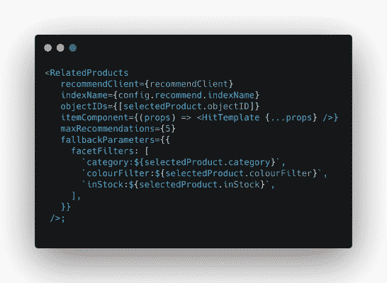
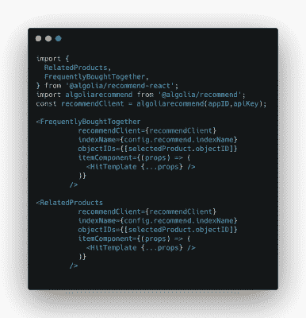
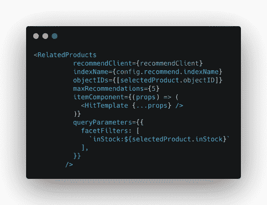
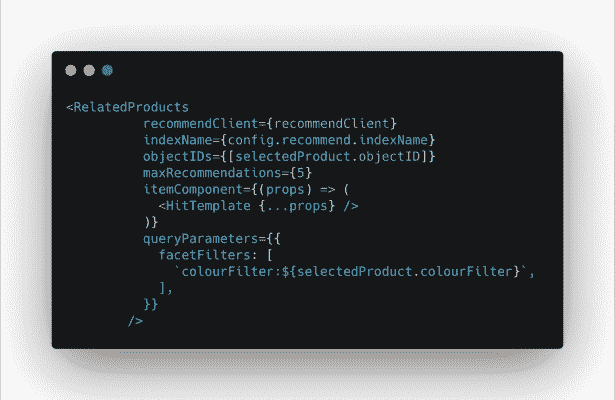
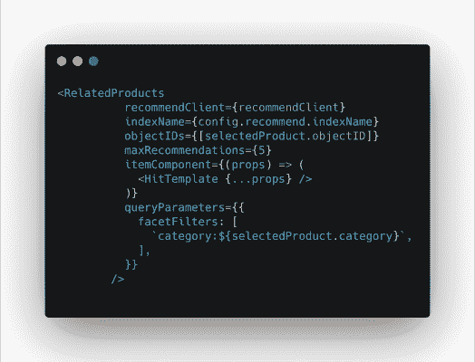
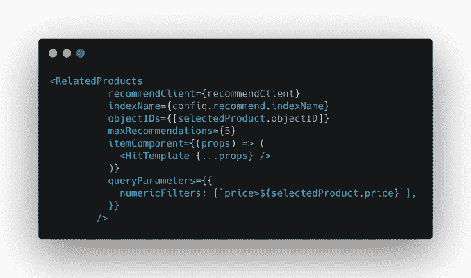

# 介绍 Algolia 推荐:开发者增加收入的下一个最佳方式- Algolia 博客

> 原文：<https://www.algolia.com/blog/product/introducing-algolia-recommend-the-next-best-way-for-developers-to-increase-revenue/>

从一开始，Algolia 就利用其托管搜索和导航 API，帮助开发者打造独特、差异化的数字商务体验。因此，Algolia 是我们零售客户年收入超过 250 亿美元的重要组成部分。

现在，随着 Algolia Recommend 的推出，Algolia 进一步使开发人员能够释放体验的组成部分，推动产品发现体验的剩余部分:产品推荐。

就像搜索和导航一样，我们认为负责产品推荐的开发人员不应该把时间花在排除基础设施故障、维护和扩展低级代码库，或者与具有不同开发人员体验的各种供应商打交道上，而是应该利用构建模块来帮助他们释放创造力，创造独特的体验，并加速他们的业务增长。

  在这个世界上，越来越多的企业开始上网，消费者有了更多的选择，更换品牌的成本和便利性都很低，因此，通过打造差异化体验和不断创新来获得和保持竞争优势至关重要。API 构建块对于建立这种差异至关重要——因为它们具有显著的灵活性、易于实现，以及它们如何允许开发人员和产品经理动态迭代。

有了 Algolia 的推荐，Algolia 在开发人员的工具包中增加了一个新的强大设备，因此他们有钥匙来增加 100%的零售商 GMV。(商品总值)。

让我们深入了解 Algolia 推荐的独特之处……

# 机器学习推荐模型一个 API 调用走

Algolia Recommend 根据生成建议

*   您的产品目录被编入 Algolia
*   您的用户对您的数字财产的互动

然后，它依靠机器学习模型来提供相关的建议，从以下几个开始:

### **经常一起买**

经常一起买的模型推荐经常一起买的物品。对于给定的项目，它会根据用户在您的平台上执行的转换事件推荐一个项目列表。

这种模式通过向顾客展示补充他们当前选择的产品，让你创造交叉销售机会。

### **相关产品**

相关产品模型推荐彼此相关的项目。对于给定的项目，它根据用户在平台上执行的点击和转换事件返回项目列表。

这种模式最大限度地提高了转化率和目录曝光率。

频繁一起购买模型使用转换事件，因为我们需要在购买过程中检测产品的互补性。相关产品模式依赖于点击和转化，因为关联性可以通过购买和浏览来传递:搜索，然后探索选项。

对于这两个模型，收集了对应于过去 30 天的数据。结果是一个矩阵，其中列是 userTokens，行是 objectIDs。每个单元格代表 userToken 和 objectID 之间的交互(点击和/或转换)次数。然后，我们应用一种[协同过滤](https://en.wikipedia.org/wiki/Collaborative_filtering)算法:对于每一件商品，我们会找到在顾客中拥有相似购买模式的其他商品。如果同一组用户与项目交互，则项目将被认为是相似的。如果同一组用户购买了物品，则这些物品将被认为是一起购买的。

然而，协同过滤的局限性在于冷启动问题。对于最近添加到目录中的项目，产生大量流量的机会较低，因此它们不太可能出现在推荐中，并且它们的推荐可能没有那么好。

我们正在努力消除这一限制，方法是根据商品的内容整合某种程度的商品相似性(例如，我们知道属于同一产品类别的商品已经有些相关)。与此同时，我们引入了一个后备策略，直接利用产品属性来解决冷启动问题和缺少事件。

### **回退策略**

目录中的某些商品可能没有经历足够多的事件，因此 Algolia 推荐模型无法生成相关推荐，例如新列出的商品。Algolia 考虑到了这一点，并添加了一个“后备策略”，以确保使用 `fallbackParameters`
仍能提出相关建议

**更多来了！**

Algolia 将增加一系列新的推荐模式。今年晚些时候，Algolia 将增加“个性化推荐”,根据购物者的偏好显示更多相关产品。

Algolia 还将利用 Algolia 搜索 API 的功能，更轻松地生成基于内容的推荐，例如，将热门产品、新品、畅销书等打包到 Algolia 推荐中。

# 轻松实施，同时尊重您的网站或应用程序的外观和感觉

我们的 API first 方法的一个优势是，您可以使用 6 行代码在任何需要的地方显示 Algolia Recomend 生成的建议。 

遵循与 Algolia 搜索相同的标准，Algolia 提供前端小部件，以简化推荐在前端的显示和格式化，从 Vanilla JS 和 React 开始。

> “我们对 Algolia 推荐系统的简易和快速实施留下了深刻的印象，这使我们能够在仅 4 天内完全投入 hicart.com 的生产。”
> –hi cart 技术主管劳尔·拉里奥

# 神奇发生在哪里:总弹性

当你开始在你的数字接触点上显示推荐时，事情开始变得令人兴奋:Algolia 的 API 优先方法与前端小部件相结合，使开发人员能够使用 Algolia 的 `facetFilters` 属性，根据业务需求完全控制和微调返回的推荐。  

### **全店过滤器**

Algolia Recommend 允许您对整个商店展示的所有推荐进行过滤。例如，大多数时候从推荐中排除缺货产品是有意义的: 

但是你可以走得更远！让我们探索一些更复杂的用例:

**情境化建议**

通过这种过滤逻辑，您可以根据购物者当前正在浏览的类别，甚至是他们当前正在查看的或购物篮中的产品的特定属性来过滤推荐。以下是一些例子:

仅显示与显示项目颜色相同的项目:

只显示与所显示项目类别相同的项目: 

仅显示利润比显示的项目多的项目:

### **本地化推荐**

一个 Algolia 推荐用户是一家位于加利福尼亚州的在线零售商。他们的实体店网络对他们来说是一个真正的优势，所以他们尽可能地在网上体验中利用它。当你浏览他们的网站时，你可以选择你喜欢的位置。一旦你这样做了，推荐将会个性化，只展示你的首选商店中的产品。

### **能见度**

Algolia Recommend 附带一个模拟器，因此您可以在生产中实施之前评估模型生成的建议的质量。

# 统一平台的优势为您带来全方位体验

Algolia Recommend 的一个关键优势是，它依赖于与 Algolia Search 相同的基础，并采用相同的标准开发，为您的开发人员和企业带来各种优势:

### **不重复实施努力**

利用 Algolia 搜索+推荐来增强搜索、导航和推荐，您只需为所有产品目录创建一个索引集成，并将您的用户事件发送到一个 API。

### **为您的用户带来内聚体验**

由于 Algolia 搜索和 Algolia 推荐依赖的索引是相同的，您的用户将在您的整个在线商店中看到相同的产品信息，具有相同的新鲜度。

### **一个开发者的经历**

Algolia Recommend 秉承与 Algolia Search 相同的开发标准和开发人员卓越体验，这意味着开发人员将受益于相同的实施原则，以及相同质量的开发人员工具和文档来构建您的整个搜索、导航和推荐体验。

### **可扩展且可靠**

Algolia Recommend 由与 Algolia Search 相同的团队在相同的基础上构建，每月为 10，000 多名客户的 100 多亿次请求提供支持。所以你可以专注于创造体验，不必担心你的推荐引擎会在黑色星期五崩溃。

# 指标一次，处处兑现。今天就开始

与 Algolia Search 相结合，Algolia Recommend 允许您在一个地方索引您的目录，并将其发送到您需要的任何地方。我们的客户已经在他们的数字商店中看到了很好的效果:

> “Orange Romania 一直在使用 Algolia 推荐技术来留住和转化购买断货产品的顾客。通过向他们推荐相关产品，我们的在线商店增加了 8%的收入。”
> 
> –Orange Romania 的数字营销经理 Florin Spataru

> “自从实施以来，我们已经看到每个会话的产品页面浏览量显著增加，并预计这将对我们的收入产生巨大影响。”
> 
> HiCart 技术主管劳尔·拉里奥

如果您准备好测试 Algolia 推荐，您可以立即注册 Algolia.com 或 [登录您的账户](https://www.algolia.com/users/sign_in) ，每月可获得 10，000 次免费推荐 API 请求。你会在我们的文档 中找到实现它所需要的一切 [。](https://www.algolia.com/doc/guides/algolia-recommend/overview/)

如果您想了解更多关于 Algolia 推荐的信息，请随时联系您的客户成功经理我们的团队，请点击 