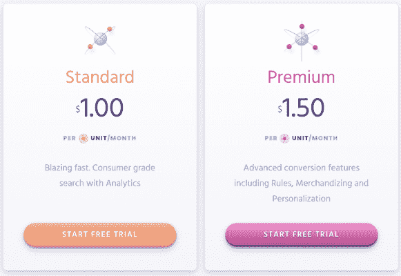
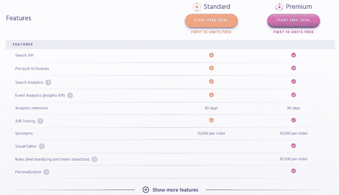

# 介绍 Algolia 最人性化的定价- Algolia 博客

> 原文：<https://www.algolia.com/blog/algolia/introducing-algolias-most-customer-friendly-pricing/>

在 Algolia，我们的使命是让每一个开发者和公司——无论大小——都能创造愉快的搜索和发现体验。牢记这一使命，我们正在对我们的定价进行重大更新，目标是让 Algolia 更容易访问，并让每个人都能提供出色的搜索体验。从最小的项目到大规模的部署，我们的价格现在是市场上对客户最友好的。

从今天开始，我们的新定价包括长期承诺较少的选项、较低的入门级价格以及针对增加使用量的批量折扣。现在，无论你是从事小型项目的开发人员，还是希望提供更好的消费级搜索体验的大公司，Algolia 都能满足你。

作为一家开发者至上的公司，如果没有对开发者的友好，Algolia 就不会有今天。作为联合创始人，Nicolas 和我自己也是早期开发人员，所以坚持我们的愿景一直是我们 DNA 的一部分。因此，我们听取了开发人员的反馈，并使我们的入门级价格更容易为开发人员所接受，即使他们需要访问我们的高级功能。

我们的新定价模式基于以下原则:

*   **易于尝试，易于购买:** 客户有更多选择，包括无长期承诺、每月仅 1 美元的付费计划。
*   **访问:** 我们的一些高级功能现在可以在我们的标准计划中使用；您不再需要成为企业客户就可以访问高级功能，如查询建议和 A/B 测试。
*   **透明度:** 我们的定价已经过简化，因此更容易理解和预测。
*   **按使用付费:** 我们新的定价是基于你的搜索量和你的索引大小；您也可以选择按月付费或按年付费，以获得年度承诺的折扣。
*   **可扩展:** 批量折扣奖励使用量增加的客户，使他们能够随着业务增长进行经济高效的扩展。

### **更简单的定价，可根据您的需求进行调整**

为了让“按使用付费”模式更加清晰，在新的定价中，我们将不再对索引操作(对您的索引的更改)收费。相反，我们引入了单位的概念。

一个单元表示给定数量的两个容易测量的月值: **搜索请求数*** 和**Algolia 索引内的记录数** 。

在每月“按使用量付费”模型中，一个单位代表一个月内消费的 1，000 个搜索请求和该月内 Algolia 索引中的 1，000 条记录。如果这两个值中的一个超过 1000，那么你就已经消耗了那个单位。单位是您需要支付的费用，标准的现收现付月度计划的起价为每月每单位 1.00 美元，年度计划的起价甚至更低。

在新的定价模式下，消耗的设备越多，每台设备就越便宜，随着使用量的增加，可以实现规模经济。

在新定价中，有两种主要计划: **标准版和高级版，具有以下更多功能。**

此外，为了让更多客户能够使用我们的一些高级功能，标准计划中现已提供了一些高级功能，如 **、搜索分析、事件分析和 A/B 测试** 。

我们知道你会喜欢 Algolia，所以在决定是否适合你之前，请随意尝试。我们提供为期 14 天的免费试用(包括多达 500 台)，甚至可以访问我们的许多高级功能，包括 **规则、可视化编辑器和个性化** 。[在这里报名](https://www.algolia.com/pricing/)。

### **概要**

我们相信，新的定价计划将为我们的客户带来好处和积极影响，特别是现在能够轻松试用然后轻松购买 Algolia 的开发人员社区——成本透明且可预测，并且可以获得比以往更高级的功能。

我们希望您喜欢它，并一如既往地欢迎您的反馈。

最后，如果你现在是 Algolia 的顾客，并且对你的计划感到满意，那太好了！你可以无限期地保持现有的计划。我们支持您第一次注册我们的服务时所做的承诺，并将让您决定什么最适合您的发展。如果您有兴趣利用即将推出的新功能，我们可以随时提供帮助，指导您迁移到我们的新定价计划。

要了解更多关于 Algolia 的新定价，请访问[www . algolia.com/pricing/](https://www.algolia.com/pricing/)。

**如果您是 Algolia 的现有客户，值得注意的是，我们将“搜索操作”概念替换为“搜索请求”。这是一个重大变化，根据客户反馈，我们的定价变得更加简单。我们的批处理查询 API 端点现在只计为一(1)个请求，这意味着您可以使用分面和联合搜索，而不必考虑成本。*