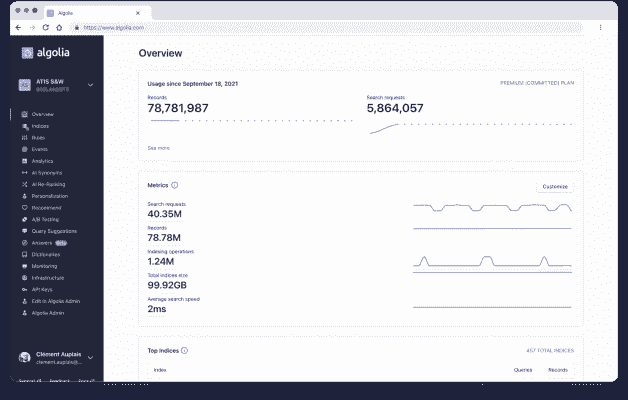
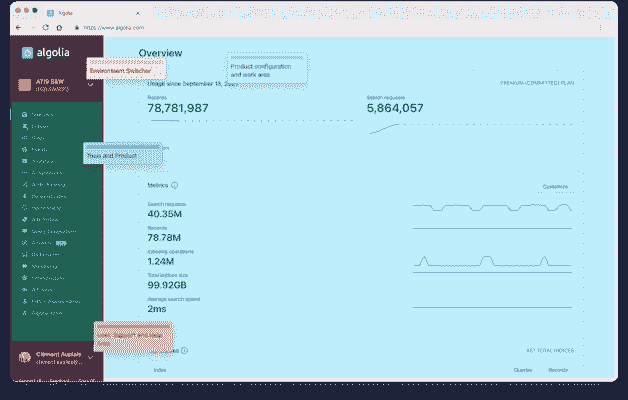
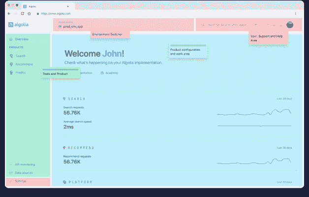
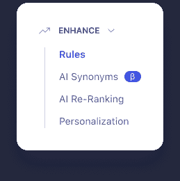
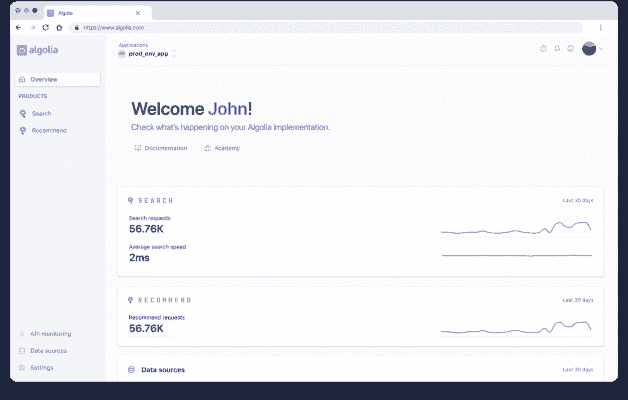

# 介绍我们的新导航

> 原文：<https://www.algolia.com/blog/product/introducing-our-new-navigation/>

我们很高兴能分享我们全新设计的导航系统的幕后故事。重新设计是大量研究和努力工作的结果，它仍在发展。我们一直在认真听取反馈意见，现在它已经推出，我们将继续听取意见，并使它变得更好。

# 小安正在成长

有很多很好的理由来重新思考我们的用户在仪表盘上导航的方式。我们不断地对我们的用户进行研究，我们已经积累了他们在现有导航中遇到的越来越多的问题。当我们拥有更少的功能时，有意义的选择不再起作用。在特定的屏幕尺寸下，我们的导航会从屏幕底部消失。

例如，我们使用侧边栏来处理:

*   管理和切换应用程序
*   浏览不同的搜索功能
*   管理计费和团队角色
*   管理个人账户设置

我们的航行实际上已经人满为患了！

# ……而且越来越大！

最重要的是，我们最近发布了我们的第二款产品:推荐(psst， [)更多信息请点击这里。](https://www.algolia.com/blog/product/introducing-algolia-recommend-the-next-best-way-for-developers-to-increase-revenue/) 超级爽！).因此，除了导航中所有其他争夺注意力的东西，现在我们需要一种方式让我们的用户在两个不同的产品之间移动，搜索和推荐，很容易。他们必须始终清楚地知道自己在仪表板中的位置，并且他们需要能够理解为什么他们应该使用一种产品而不是另一种。我们需要一个能够随着更多产品的出现而扩展的解决方案。

# 反思等级制度

我们的第一步是给每个独立的功能一个家。正如你在旧设计中看到的，我们要求侧边栏承载很重的负载。应用程序切换、搜索导航、个人设置和帮助都在一个共享空间中。不幸的结果是，精神负担被转移到了用户身上，他们被期望理解这一切。

因此，我们设计了一个新模型，其中每种行为都有一个确定的位置。现在，侧边栏是专门为浏览仪表板而保留的。 *想要更改或添加应用程序或索引？* 永远在屏幕的正上方中央。通过更具体地定义这些空间，我们允许用户根据他们过去的经验来假设在哪里可以找到东西。当我们需要添加新的东西时，它的归属是毫无疑问的。

我们还在右上角专门留出空间，用于存放支持、文档和帮助相关项目。如果您需要快速获取文档，只需点击一下鼠标即可。

# 设计直观的导航

### **分离出我们的产品**

在导航 Algolia 仪表盘时，我们做了一些更改，以帮助您找到所需的内容。最明显的变化是，我们在导航中给了每个产品自己的位置。这是我们对 Algolia 仪表盘工作方式的一个小转变，但它允许我们在您需要时展示更多具体功能。

例如，如果您使用推荐，您将只能看到与推荐相关的功能。搜索也是如此。一次又一次，我们看到用户在测试中变得沮丧和困惑，因为他们看到的导航与他们使用的产品无关。

### **创建单一平台**

提供多种产品带来了一些我们需要解决的新的复杂性。许多一直与搜索联系在一起的东西，比如索引，现在可能被用在其他地方。完全有可能有只用于推荐的索引，所以我们突然需要一个你可以同时看到搜索和推荐索引的地方。所以我们增加了第三个部分，叫做“平台”

最初，我们添加了平台来存放跨多个产品的导航项目。它与我们的产品处于同一水平，但用于聚合共享元素。我说最初，因为，嗯，它已经不存在了。但是我一会儿会讲到这个。😉

### **分组相关功能**

对我来说，这是事情开始变得真正有趣的地方。关于 Algolia 的仪表盘，需要意识到的一件重要事情是，我们的用户并不都是技术人员。很多都是，但有些 *真的* 不是。我们看到许多项目经理、业务员，甚至设计师，支持他们对我们来说同样重要。

考虑到这一点，我们知道某些对一类用户来说显而易见的术语对另一类用户来说却完全莫名其妙。用户测试表明，在技术理解方面有一点悬崖——基本上非技术用户一次又一次地被相同的术语难住了。我们需要建一座桥。

我们添加了功能组来帮助我们解决这个问题，方法是根据功能将项目重新分组。一次又一次，我们看到测试人员使用组标题作为线索来找出导航中可能存在的东西。作为设计师，这正是我们希望看到他们做的事情。

在每款产品中，我们对功能进行了分组，以便它们更好地与用户的旅程联系起来。例如，在搜索中，您会找到“配置”、“观察”和“增强”组。

正如这里所看到的，增强小组一起“增强”相关性的方法。在 Configure 中，您可以添加索引或提出查询建议。在 Observe 中，您可以检查搜索分析或启动 A/B 测试。

### **还有更多！**

当然，我们并不仅仅坚持那些更新。我们还借此机会对 UI 做了一些调整，为计划中的更新做准备。总的来说，我们已经尽可能地进行了清理，并进行了许多细微的改进。现在我们有了一个更干净的未来。

我想提到的最后一个重大变化实际上是当你来到 Algolia 仪表盘时首先会遇到的:一个改进的概览页面。我知道这听起来很疯狂，但我们希望概览页面实际上是一个概览。所以现在你可以鸟瞰你在阿尔戈利亚做的一切，而不仅仅是搜索。我们为您最需要的东西添加了快速链接，并且我们有许多有趣的计划来让这个屏幕对您更加有用。你今天看到的只是这个屏幕的第一步。

# Beta 测试

对我来说，设计过程中最好的部分发生在人们开始使用界面之后。事实是，到目前为止，我刚刚谈到的所有变化都是猜测。我们通过一个设计过程让他们 *受过良好教育的* 猜测，但他们仍然是猜测。当真正的用户开始告诉我们使用 Algolia 做他们的工作是什么感觉时，情况就变了。

当我们在 7 月发布公开测试版时，我们马上发现了一些问题。人们很难找到一些真正重要的东西，比如 API 键、账单和团队设置。他们很难找到它们的原因是，将它们都放在一个名为“平台”的部分没有意义。在一些非常有见地的用户访谈的帮助下，我们最终在导航中将平台分成了三个新的部分:API 监控、数据源和设置。我喜欢它，因为如果没有用户的帮助，我们永远也不会找到那个解决方案。

虽然没有那么大和引人注目，但我们在测试版中也做了一些其他重要的改变。我们对用户界面的对比进行了调整，使层次更加明显。我们反复讨论了二级导航是如何打开和关闭的。我们收紧了产品导航最小化时出现的工具提示。一般人可能不会注意到它们，但总的来说，它们在使用导航的方式上有很大的不同。

# 走吧！

我为这个团队感到无比自豪，正是他们的努力让导航成为今天的样子。团队合作在反思长期导航中的作用怎么强调都不为过。

在这次导航之后，有很多很棒的产品更新。说实话，这真的感觉导航就像是我们正在打开的一扇门，让我们一直在做的其他事情呼啸而出。在阿尔戈利亚，这是一个非常激动人心的时刻，我迫不及待地想让你们知道接下来会发生什么。