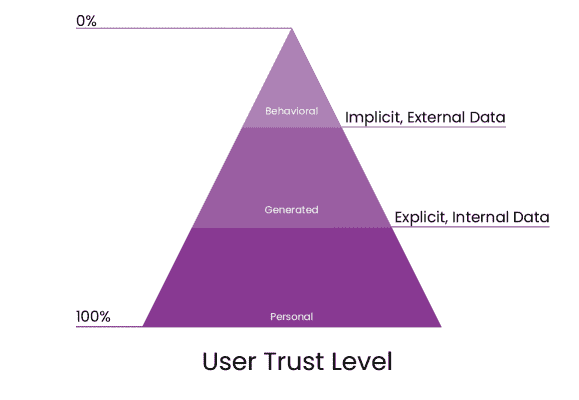
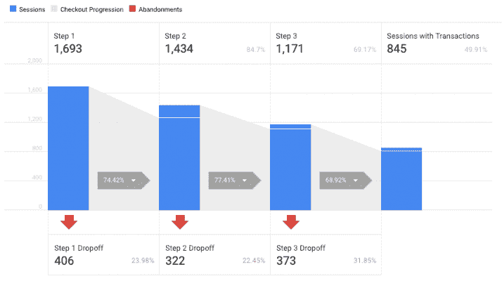
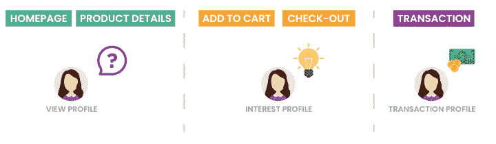
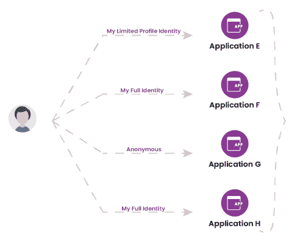
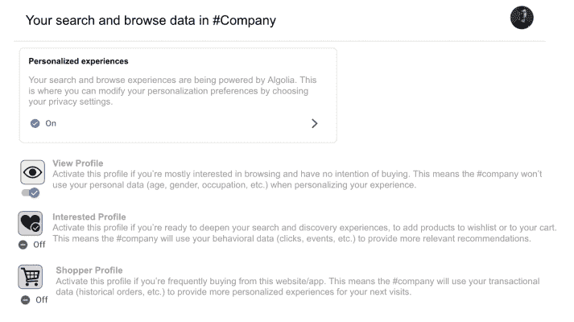

# 介绍用于个性化和隐私感知体验的用户数据资料- Algolia 博客

> 原文：<https://www.algolia.com/blog/ux/introducing-user-data-profiles-for-personalized-and-privacy-aware-experiences/>

数据是各种规模的蓬勃发展的公司所拥有的最重要的资产之一。不幸的是，这并不总是转化为良好的实践，特别是对于那些个人数据可能被肆意滥用而又无能为力的用户。

这是用户认为使用人工智能系统个性化体验的在线公司缺乏诚意的众多原因之一。然而，情况并不总是如此，这当然不是所有公司的经验法则，主要是因为有一些基本力量在阻止他们这样做:

就在最近(2022 年 1 月)奥地利数据监管机构发现，使用 [谷歌分析违反了【GDPR】](https://www.wired.com/story/google-analytics-europe-austria-privacy-shield/)。虽然一半的解决方案可能会采用新的[EU-美国数据传输协议](https://www.cnbc.com/2022/03/25/eu-and-us-agree-new-data-transfer-pact-to-replace-privacy-shield.html) 的形式，但它确实会引起对另一半的关注: *最终用户如何才能更好地控制自己的数据？*

是的， [83%的消费者](https://www.forbes.com/sites/jimvinoski/2020/01/20/new-research-shows-consumers-already-expect-mass-personalization-time-to-get-ready) 确实期望个性化 在瞬间和几个小时内完成。同时，高达 [80%的消费者对公司关于其在线数据的安全和隐私做法](https://www.mckinsey.com/business-functions/risk-and-resilience/our-insights/the-consumer-data-opportunity-and-the-privacy-imperative) 非常敏感。

乍一看，这似乎是一个悖论: *个性化用户体验，同时保护他们的数据隐私* ？

根据我们的经验，只要我们小心翼翼地为用户提供价值和便利，并且不成为干扰，基于人工智能的个性化是一种可以鼓励和广泛采用的实践。

当我们衡量这些个性化技术的有效性时，有几个方面需要考虑

1.  技术部分，对于最智能的推荐系统，涉及机器学习；
2.  业务关键绩效指标的演变(转化率、平均订单价值、收入增长等。).
3.  用户满意度，通常被认为是隐含的:如果用户转化了，就意味着他们很满意。

难以忽视的事实是，在网络领域，个性化技术的有效性大多与底线相关:“ *推荐引擎必须是我们用户的热门，因为我们的收入飙升* ！”这种逻辑是部分有效的，因为它没有描绘出整个画面。收入的增加并不一定意味着用户满意度的提高，而用户满意度等难以衡量的指标通常会排在优先级列表的末尾。

另外，它揭示了一个至关重要的盲点——问题的答案: *我们以用户为中心的 AI 系统是否具有隐私意识？T13*

## 什么是隐私感知 AI 系统？

具有隐私意识的人工智能系统知道，一个人的个人数据分散在不同的账户中，只能由个人自己访问。

因此，为了在与第三方 AI 系统的交互中从个人数据中获得价值，个人必须“ *激活* ”该个人数据。换句话说，个人应该决定他们的用户数据配置文件如何被第三方使用，包括人工智能系统。

受到两篇深入探讨该主题的论文的启发，每篇论文都有自己的方法，但最终都试图解决相同的问题( [我的数据，我的术语:个人数据使用许可提案](https://jolt.law.harvard.edu/assets/digestImages/Paulius-Data-licenses-HJOLTDigest-Feb20.pdf) 和 [固体:基于关联数据的去中心化社交应用平台](https://emansour.com/research/lusail/solid_protocols.pdf) )根据面向消费者的公司现有的数据使用实践，我们正在重新设想第三方人工智能系统

1.  **完全或有限匿名。** 例如，在线购物者可能选择保持匿名，不向在线零售商透露任何个人信息。
2.  **追踪许可。** 通过授予对其用户数据档案的访问权，个人可以对服务提供商施加不跟踪该特定用户的义务(即，不跟踪个人在特定会话期间或之后的活动)。
3.  **存储数据的许可。** 这意味着，即使服务提供商有权访问特定个人的用户数据档案，服务提供商也无权在其系统中保留用户数据档案。  
4.  **允许捆绑数据。** 个人还应有权阻止服务提供商将特定个人的用户数据资料与其他个人的用户数据资料进行汇总。  
5.  **共享数据的许可。** 个人应当能够强制要求服务提供商不与其他第三方共享该个人的个人数据。  
6.  出售数据的许可。目前最有争议的问题之一是，在没有客户同意的情况下，公司之间出售个人客户数据。

今天理解这种用户数据档案的含义，可以通过成为早期采用者，引领这一变革浪潮，而不是落后和抵制它，给公司明天带来实质性的竞争优势。

我们采用用户数据档案(可以由在线零售商、市场甚至媒体公司整合)的愿景包括在以用户为中心的人工智能生态系统中的 3 层实施策略。

### 1。用户数据类型

大多数网上商家处理的用户数据类型至少有 3 种:  

*   **个人资料。** 年龄、姓名、性别、地点、身份证号等详细信息。T49
    
*   **生成的用户数据(显式；内部)。** 除了每个用户拥有的默认个人数据外，其他数据点也通过订单、联系表、反馈表、与聊天代理的交互、电子邮件消息等方式收集。用户在与网站或应用程序交互时会明确给出这些信息，这些信息通常被视为内部数据，因为在线企业通常会将这些信息存储在他们的数据仓库中。
*   **行为用户数据(隐式；外部)。** 行为用户数据是存储的最浅层的数据类型，因为它在大多数时候是匿名的或者至少是半匿名的。想想所有使用第三方分析平台(如 Google Analytics)来跟踪其网站/应用程序访客的在线企业，这就是其外部性。因为访问者以“ *客人* ”的方式与网站进行交互，而不透露任何个人信息，所以这种行为用户数据可以被表征为是隐含的。

### 2。用户意向档案

一个经典的电子商务漏斗由以下步骤组成:  

1.  主页/类别
2.  产品视图/详情
3.  添加到购物车
4.  结账/交易。

如果用户在漏斗的每一步都表现出某种意图，我们可以想象可以授予个人数据档案的某些权限:

1.  **查看个人资料**——供无意购买，只是来浏览的用户使用。这意味着在线零售商在查看主页、产品类别甚至产品详情时，无法获得消费者的个人数据(年龄、性别、职业等)。这是否意味着用户不会从高度个性化中受益？是的，如果用户选择保持半匿名，并且只允许访问他的视图配置文件。在这种情况下，我们操作的数据类型是行为的，可以提供的个性化级别是最低的。
2.  **兴趣简档**–当用户的意图改变并决定将一件或多件商品添加到他们的购物车时，兴趣简档就会起作用。为什么？嗯，他们可能需要选择 t 恤的尺寸(或性别)，如果这是他们要买的东西，不仅要透露购买该商品的兴趣，还要透露生成的数据类型。或者他们可能开始使用网站上的实时聊天功能。此时，由于与在线平台共享了新的数据点，用户可以收到更个性化(和相关)的推荐。
3.  **购物者资料。**一旦用户准备购买，他们将不可避免地添加他们的信用卡信息。当用户达到这一点时，他们对操作其数据的在线企业的信任程度可能接近 100%。
    

### 3。人类-人工智能隐私握手

如果我们把所有这些放在一起，我们揭示的形象与目前的现状大相径庭。这种形象对在线企业和用户都有破坏性。以用户为中心且可能由用户持有的数据模型将服务提供商从从第三方(数据经纪人)收集数据中解放出来，并为他们提供了直接从其客户处获取最准确数据的工具(在客户同意的情况下)。

这种新的数据模型还将帮助企业为客户创造更个性化的体验，并增加试图提供更多客户价值的企业之间的竞争。此外，个人将受益于更好地控制其个人信息的使用，并获得更好、更相关的产品和服务。

如果我们看看本文中提出的核心概念，并分析用户将如何在以用户为中心的范式中管理他们的身份，我们很快就会意识到，每个网站或应用程序都可以被授予不同的权限。

根据客户的电子商务偏好自动识别和管理权限的潜力正在形成。假设用户登陆一家在线家具店寻找一把办公椅——只是为了浏览并获得一些灵感，因为她还没有准备好购买。在这种情况下，可以打开“ *”视图配置文件* ”，这意味着商店的人工智能系统可以跟踪并仅使用被授权访问的数据配置文件。

或者，如果他们是一个重度网上时尚购买者，并将他们的 *兴趣档案* 设置为开启，他们允许网站或应用程序提示更个性化的体验。

我们可以称之为人类与人工智能的隐私握手！想想看，在最少的人工干预下，以无缝的方式，第三方人工智能系统可以更好地了解用户的隐私设置，并采取相应的行动，甚至是强调。

## 如何启用用户资料档案？

在线零售商启用用户数据档案的一种方式是在其网站/应用程序的“ *我的账户* ”部分。从那里，最终用户可以授予对其用户数据资料的访问权限，这取决于他们的具体意图: *视图* ， *兴趣* 或 *购物者* 。

在网站/应用程序上导航时，人工智能系统将只接收和处理它有权访问的数据。如果我们谈论的是个性化的搜索结果，它将返回一个条目列表，这些条目按照从共享配置文件中推断出的相关性分数进行排序。

在 [推荐产品](https://www.algolia.com/products/recommendations/) 的情况下，那些可以跨多个页面以不同格式显示，有时与个性化消息相关联，这取决于用户的交易概率。

毫无疑问，技术是改善客户体验的强大动力，无论我们站在哪一边。所提出的用户数据简档可以是对隐私感知的个性化问题的优雅解决方案。尽管如此，最重要的区别是用户授权 AI 系统访问特定级别的个性化，这是用户认为舒适的。要做到这一点，最重要的是信任。要做到这一点，需要的是开放的心态和尝试新的数据处理方式的意愿。

你对此有什么看法？您是否愿意迈出这一步，准备在您的组织中使用用户数据配置文件？ [联系我们](https://www.algolia.com/contactus/) 让我们开始讨论可能性。