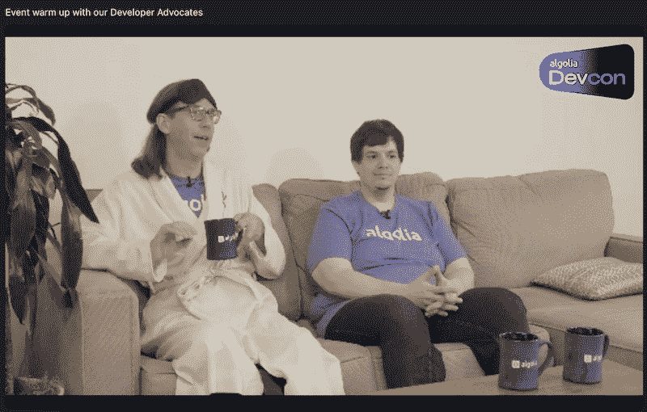

# Algolia DevCon 2022 回顾:查看视频

> 原文：<https://www.algolia.com/blog/algolia/its-a-wrap-the-algolia-devcon-2022-recap/>

9 月 14 日和 15 日，Algolia 举办了我们的首次开发者大会。这是为期两天的演示、演示和研讨会，重点是开发人员为他们的用户构建搜索和发现体验。

从我(Chuck Meyer)穿着睡袍出现在预展上，到高管团队戴着派对帽闯入总结会，我们尽最大努力为我们的开发人员社区提供一个有趣、信息丰富、休闲和真实的活动。

我们在这里整理了一份本次活动的一些亮点，包括嵌入的视频和每次会议记录的链接。YouTube 上还有一个所有会议的[播放列表。让我们来看看亮点！](https://www.youtube.com/playlist?list=PLuHdbqhRgWHLRlmvQ1OKLdjslSxXrAAjk)

* * *

## 欢迎来到 Algolia DevCon！(主题演讲和产品演示)

[https://www.youtube.com/embed/zOz-Sk4K-64?feature=oembed](https://www.youtube.com/embed/zOz-Sk4K-64?feature=oembed)

视频

在今年的主题演讲中(如上视频)，首席执行官 Bernadette Nixon 谈到了 Algolia 最近宣布的 search.io 收购以及混合搜索 API 的未来。然后，产品团队共同努力，为口袋妖怪交易卡构建了一个搜索和发现应用程序，首次推出了像 Algolia CLI (Khalid 从他的吊床上流式传输！)，然后讨论混合推荐模型，以及数据连接器和流。最后，我们看到了 search.io 的神经搜索技术在发挥作用。

## 7 个性化引擎功能障碍

[https://www.youtube.com/embed/8mXRV1xN5uI?feature=oembed](https://www.youtube.com/embed/8mXRV1xN5uI?feature=oembed)

视频

Algolia 产品经理 Ciprian (Chip) Borodescu 向我们展示了他在个性化方面的心得，个性化是客户体验的圣杯，如上面的视频所示。他谈到了一些关于个性化的错误假设，为什么你不能在这个问题上“扔更多的数据”，然后他谈到了在用户行为的背景下使用人工智能和机器学习的一些伦理问题。

## instant search，从 7 年前推出到今天

[https://www.youtube.com/embed/9c5Wqv9LWyc?feature=oembed](https://www.youtube.com/embed/9c5Wqv9LWyc?feature=oembed)

视频

一个伟大的搜索引擎没有一个伟大的用户界面，用户可以很容易地互动，寻找和探索的东西。Algolia 产品经理 Alexandre Collin 带领我们走过了 7 年的 Algolia 即时搜索之旅。在上面的视频中，他分享了我们已经取得的成就，以及前端开发人员构建世界级搜索&发现体验的未来。

## 在一个遥远的世界里缩放文化

[https://www.youtube.com/embed/HIQC-938aJA?feature=oembed](https://www.youtube.com/embed/HIQC-938aJA?feature=oembed)

视频

Twilio 文化传播副总裁 Ricky Robinett 展示了惊人的坦诚(Algolia 的文化价值观)，同时分享了一些关于文化在组织中的重要性和影响的非常个人的故事。在上面的视频中，他分享了自己和父亲生活中的例子，这些例子塑造了他对现代工作场所文化复杂性的看法。

## 走向增进理解:语义搜索的未来

[https://www.youtube.com/embed/P01XNVJyh4E?feature=oembed](https://www.youtube.com/embed/P01XNVJyh4E?feature=oembed)

视频

语义搜索是未来，但它是现在吗？Algolia 首席产品经理 Dustin Coates 向我们介绍了语义搜索的关键概念(如加权向量)，以更好地理解为什么搜索引擎*必须*超越关键词，才能真正为我们的用户服务。

## 开发人员真正在寻找什么:我们在构建供 100 万开发者使用的服务时学到的 5 条经验

[https://www.youtube.com/embed/TXyP_gHQtjA?feature=oembed](https://www.youtube.com/embed/TXyP_gHQtjA?feature=oembed)

视频

Openbase 创始人兼首席执行官 Lior Grossman 主持了一个有趣的智力竞赛节目，该节目基于开发人员使用他们的网站搜索和发现开源库时收集的分析数据。看看你能否在测验中得 5 分。

## 用连接器加速您的实现&流程

[https://www.youtube.com/embed/XQ6EepICYak?feature=oembed](https://www.youtube.com/embed/XQ6EepICYak?feature=oembed)

视频

Algolia Staff 产品经理 Keshia Rose 带我们深入了解了数据同步的未来，先睹为快地介绍了今年晚些时候即将推出的两个数据功能:连接器和流。她演示了如何在自动加载数据到 Algolia 时提取和转换数据。你也可以[和 Keshia 的团队一起加入 GitHub 上的讨论](https://github.com/algolia/devcon-connectors-flow/discussions)来决定下一步要构建什么连接器！

## 传递开发者卓越体验

[https://www.youtube.com/embed/QgVFMaAX4KU?feature=oembed](https://www.youtube.com/embed/QgVFMaAX4KU?feature=oembed)

视频

Algolia 的软件工程师 Sarah Dayan 分享了她从与来自 Vercel、CodeSandbox、Tailwind 和其他公司的行业领导者的采访(在 Algolia 的开发者体验(DX)播客上)中获得的许多见解。[订阅](https://developerexperience.buzzsprout.com/1806381)播客，在你[喜欢的平台](https://plinkhq.com/i/1573728860?to=page)上收听播客过去和未来的剧集。

## 新的 Algolia CLI 将告别手工操作

[https://www.youtube.com/embed/Qs_smyilmiQ?feature=oembed](https://www.youtube.com/embed/Qs_smyilmiQ?feature=oembed)

视频

Algolia 高级技术项目经理 Khalid Elassaad 离开吊床，向我们展示了他可以通过 Algolia CLI 完成的重要任务，从而结束了第一天的工作。他填充了一个索引！他调整了配置！他通过及早发现不好的设置节省了大量时间！多好的方式来结束 DevCon 的第一天！

* * *

## 工作坊和动手实验室

我们还在第一天主持了一系列演示实验室:

DevCon 的势头持续到第二天，举办了一系列实践研讨会！

Sarah Dayan 回到 stream，教我们如何将搜索体验集成到 React 应用程序中，而她的队友 Dhaya 做了同样的事情，将搜索体验集成到 vanilla JS 店面中。

最后，Algolia 的工程师 Vlad 和 Mouaad 向我们展示了如何[使用 Flutter](https://youtu.be/ISoRfSYRGG0) 构建跨平台的搜索体验，从而结束了会议。

感谢所有来参加发布会的人！这两天有你的问题和能量和我们在一起真是太好了。我们已经等不及 2023 年再见了！