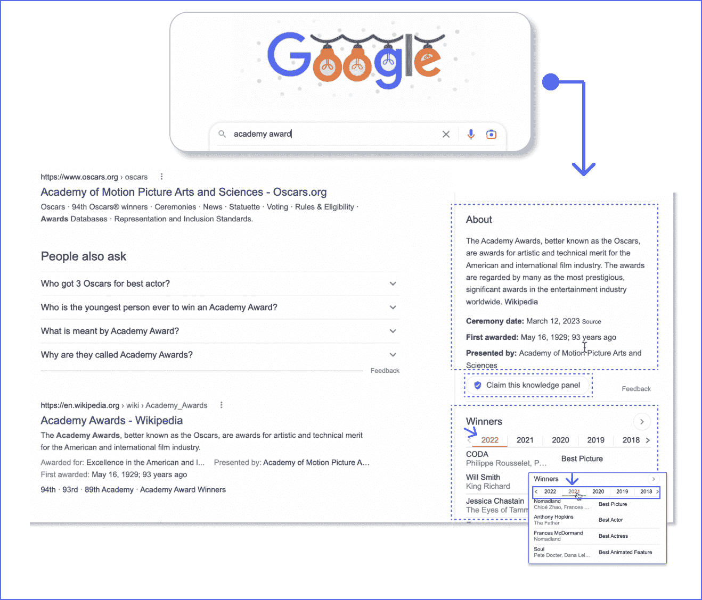
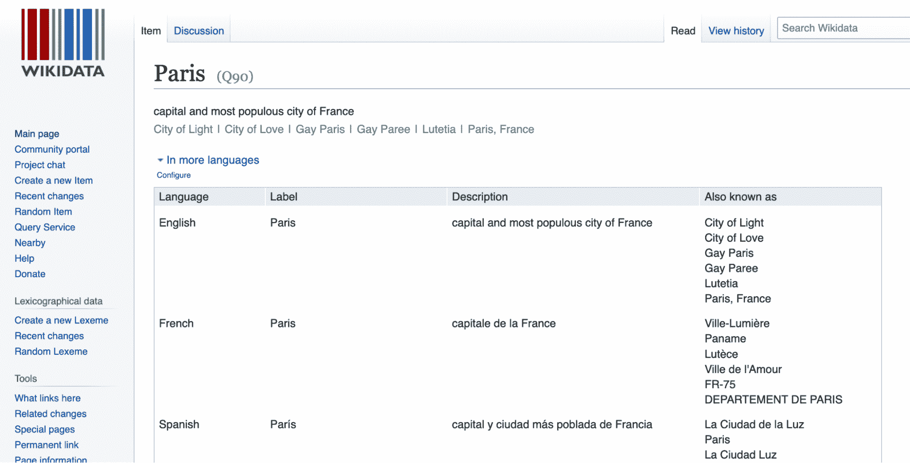
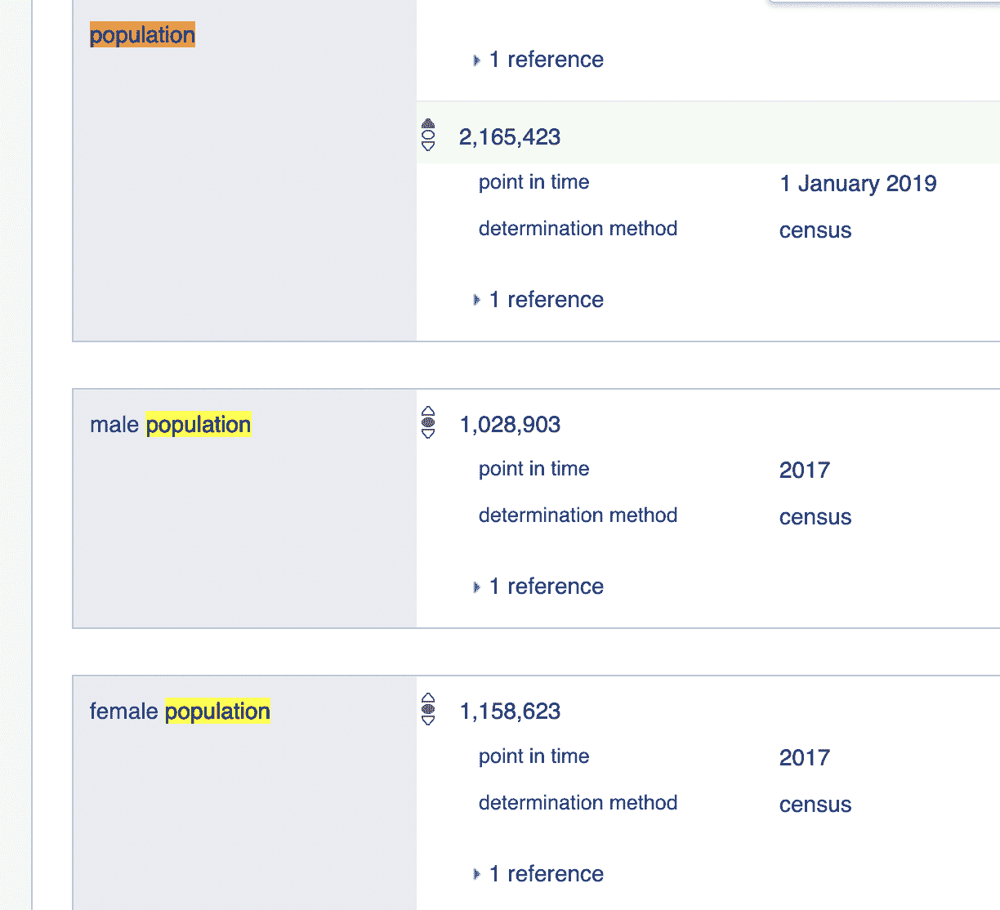
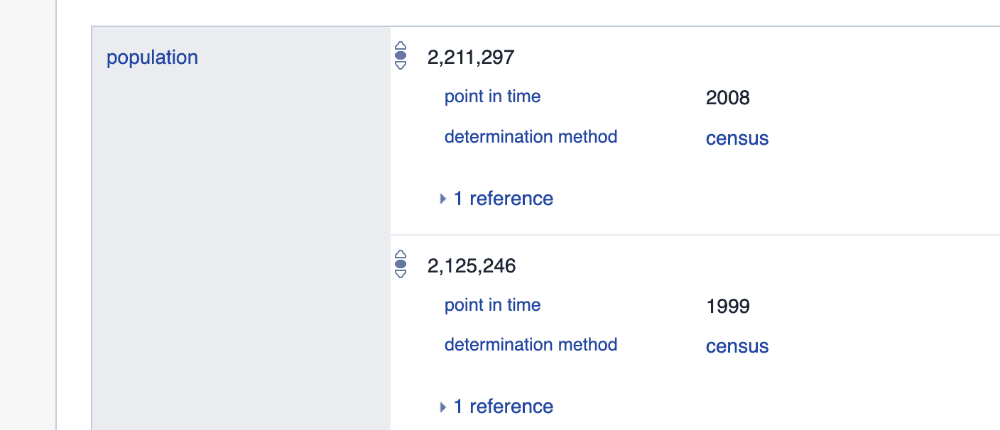
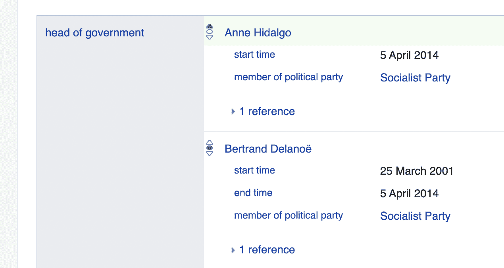
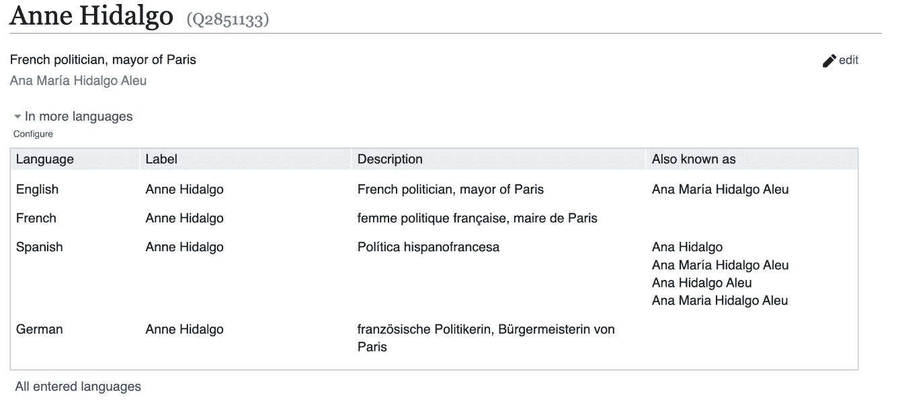
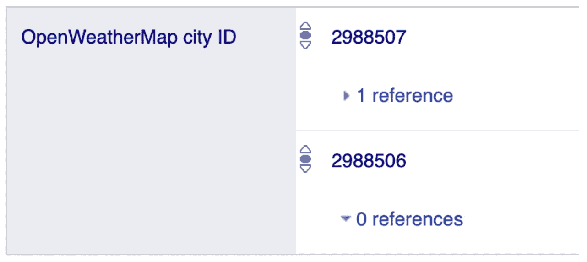
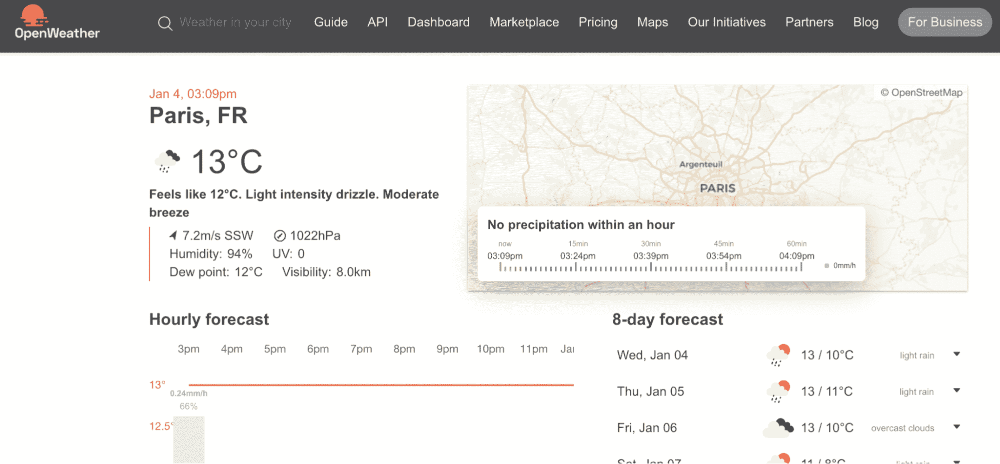

# 知识图表回答问题并返回知识而不仅仅是搜索结果

> 原文：<https://www.algolia.com/blog/ai/knowledge-graphs-and-ontologies-adding-knowledge-to-keyword-search/>

知识图表和本体代表了一种相当简单和直观的方式来组织和搜索你的内容。像 [谷歌、亚马逊、苹果](https://www.datasciencecentral.com/ten-years-of-google-knowledge-graph/)[医药](https://bioportal.bioontology.org/) 和 [金融](https://web.stanford.edu/~vinayc/kg/notes/What_Are_Some_High_Value_Use_Cases_Of_Knowledge_Graphs.html)等科技公司已经将知识图技术构建到他们的搜索应用中。

(知识图还有其他用途；例如， [自动翻译](https://arxiv.org/pdf/1902.08816.pdf) 。然而，我们这里的重点是搜索。)

在搜索的历史上，有很多不同的做法，例如 *关键词搜索* ，基于文本匹配或同义词匹配单个单词或短语。本体和知识图通过添加 *主题* 匹配向前迈进了一步，其中属于相同主题或包含相同实体(不一定是相同单词)的项目和文档也被认为与查询相关。

我们可以通过查看两个常见的用例来了解关键词搜索和知识图之间的区别:

1.  通过查看多个结果并选择您喜欢的一个来搜索项目。当你在电子商务网站上搜索一件衬衫、寻找一份土豆食谱等时，这是你在大多数专业网站上正在做的事情。
2.  搜索精确问题的答案(“问题回答”)。这就是当你搜索你喜欢的建筑的建造日期，或者你刚刚看的电影中的一个演员时你正在做的事情。问题回答是关于寻找精确的数据:日期、姓名、地点等。

关键词搜索第一个就够了。知识图表的引入是为了帮助后者——回答精确的问题。在 knowledge graphs 之前，在你刚刚观看的电影中寻找演员是一个三步的过程:找到一个描述电影和演员阵容的页面，浏览页面寻找演员，并在列表中找到你的角色。知识图可以直接显示答案。

2013 年，随着计算机科学的发展趋势，谷歌宣布对其搜索引擎进行根本性的改变，即搜索万维网应该帮助人们找到“东西而不是字符串”。这个变化就是他们对知识图表的使用。他们的想法是我们被大量的事情淹没了。事物难以简单分类，因此不包含一组简单的共享关键字。知识图表通过在给定的领域内根据事物的意义和用法来组织事物，帮助我们从众多事物中发现我们想要的东西。包含超过 5000 亿个事实的 [谷歌知识图谱](https://blog.google/products/search/about-knowledge-graph-and-knowledge-panels/) 在其所有月度搜索中使用了近三分之一。其著名的“知识面板”(有时称为“信息框”)将基于项目的关键字搜索与知识图结合起来，以返回查询的完整答案:

在上面的图片中，用户输入了一个单词(“奥斯卡奖”)，谷歌用它来找到其知识图的入口点(我们将在下面看到它是如何工作的)。然后，谷歌在其知识面板中发回了一组完整的相关事实，我们称之为故事。用户然后点击知识面板中的一些事实来更深入地挖掘故事。

接下来，用户键入一个更详细的查询(“奥斯卡金像奖 1939”)，Google 使用它来显示一个更新的知识面板(带有附加效果的图像):

相当好。Google 将查询扩展为一个 *问题* ，并返回一个 *答案* 以及一组有用的搜索结果。此时，用户可以选择继续搜索或停止搜索，因为他们的问题已经得到了回答。

## 什么是知识图？数据是什么样的？

知识图是一种专门的数据结构和查询语言，它允许人们(通常是领域专家)用易于理解的知识位来表示信息。医学专家可以将他们的专业知识输入到图表中，而其他医学专业人员可以查询图表来帮助他们诊断和治疗患者。

考虑一下 维基百科 ，一个广泛使用的知识图表，包含 越来越多的信息 ，其中许多信息是由公众进行同行评审和策划的(就像维基百科)。比如包含大量关于 [巴黎](https://www.wikidata.org/wiki/Q90) : 的结构化信息

当你在维基数据页面上滚动时，你会看到对巴黎的简短描述，以及它在多种语言中的不同名称

再往下，你会发现不同年份的人口:

注意 *概念* 在这里扮演的角色:所有的信息都被组织成主题——城市人口、按性别划分的人口，等等:

概念使知识图能够组织世界上任何一个城市的海量数据。

最后，还有其他主题的超链接。比如在巴黎页面，可以了解到现任和前任市长:

但如果你点击现任市长的名字(安妮·伊达尔戈)，你会进入一个关于她的单独信息页面:

以此类推。知识是无限的，但可以一次构建一个事实。

### 事实、关系和概念

正如我们所见，知识图将数据组织成事实关系图。这种事实关系包括:

*   一个或多个相关概念(“城市”和“人口”是概念)
*   符合概念的事实(“巴黎是一座城市”)
*   一个或多个关系(城市“巴黎”的人口为“2，165，423”)

我们称这些个体事实关系为 **三元组** ，因为它们有 3 个部分:2 个对象和 1 个关系，如:对象 1 →相关→对象 2

*   三联是“巴黎”→“是实例”→“城市”。
*   对象是“巴黎”和“城市”
*   关系是“是一个实例”

你还可以更进一步，创建一系列事实关系和推论，例如“巴黎是一个大城市，男女居民人数几乎相等。”

### 利用概念和层次创建一个本体框架

因此，图表将事实与其他事实联系起来。但这还不是知识。像人类一样，计算机需要概念(和概念的层次)来理解世界上事物的多样性和复杂性。换句话说，概念以及事实帮助我们 *认识* 世界；因此，知识图表必须创建概念关系，我们在其中放置事实。我们称之为图的 **本体框架** 。

回到 Wikidata，我们有“实例”概念，这是一种关于对象的知识。这个概念可以应用于图中的 100 多万个项目。例如，巴黎是几个类的“实例”，包括:

*   “首都”，是“城市”的子类
*   “特大城市”(超过 1000 万市民)，是“百万城市”(超过 100 万市民)的子类

没有概念，关键字搜索仍然是足够的。然而，有了概念，就有可能走得更远，增加一个城市的历史、日常事实等等，以利用一个图表可以告诉我们的关于世界上任何一个城市的网络故事。

让我们回到开头提到的两个用例:搜索一个物品或者一个精确的答案 。

### 关键词搜索

关键词搜索可以通过返回项目来回答像“城市人口”这样的最简单的问题，而知识图 可以对像“巴黎的人口是多少” 这样的问题提供精确的答案，从而显示更详细的知识作为结果。关键字搜索中的同义词 解决了搜索一个项目时语言的复杂性(通过 向查询添加备选单词)。在一般知识图的情况下，目标是提供问题的答案，复杂性是分析查询以识别实体(查询可以是像“巴黎”这样的实体，但是它也可以匹配像“1939 年奖励学院”这样的实体的几个属性)。)

### 知识图表

类似于巴黎页和其中导出的推论，专家医疗诊断系统将极大地受益于知识图的能力；然而，要做到这一点，需要以一种准确的方式将许多不同来源的数据结合起来，这是一个特别复杂和巨大的挑战。例如，如果你点击第一个参考(2988507)来查找巴黎的天气:

您将看到下面的信息屏幕，它从许多外部来源(例如，天气和地图数据提供商)获取数据。使用多个数据源，每个数据源都有自己的专有结构和特性，这是一项耗时且复杂的工程任务:

尽管面临这一挑战，强大的知识图表仍被用于以及 [科研](https://direct.mit.edu/qss/article/2/4/1296/108052/New-trends-in-scientific-knowledge-graphs-and)[金融](https://www2.deloitte.com/nl/nl/pages/financial-services/articles/knowledge-graphs-tracking-data-lineage-in-financial-services.html) 和[法律](https://research.ibm.com/publications/similar-cases-recommendation-using-legal-knowledge-graphs) 等领域，在这些领域中，信息多种多样且数量巨大，事实关系变得多维且往往难以理解。我们将讨论知识图带来的大数据和可伸缩性挑战。但是首先，让我们再来看看知识图是如何与关键词搜索相结合的。

## 结合知识图谱和关键词搜索

回到上面提到的两个用例，下面是关键字搜索如何与知识图一起工作:

关键词搜索可以用同义词回答类似“晚礼服”这样的简单查询。知识图对于这个用例是必要的。

一个寻找事实的精确问题可以通过知识图来解决。比如“巴黎的人口是多少”。

注意，像“喝葡萄酒最好的城市是哪里？”无法用知识图表来回答。虽然知识图表可能有助于回答一个精确的问题，但是它们受到它们能够回答的问题类型的限制。需要像 LLMs 这样的机器学习技术来“理解”和回答这样复杂的、基于语义的问题。

## 知识图表的挑战——优点/缺点

知识图的一个关键优势是它的信息是有管理的。例如，谷歌知识图中的大部分数据都是人工管理的。另一个优势是它能够通过提供链接来证明答案的正确性

然而，一个缺点是，一个知识图谱侧重于而不是侧重于。换句话说，知识图可以很好地回答一个小问题列表(高精度)，但不能覆盖许多问题(低召回率)。为了在不牺牲精确度的情况下提高召回率，像 [OpenAI 的 ChatGPT](https://www.algolia.com/blog/ai/why-chatgpt-wont-replace-search-engines-any-time-soon/) 这样的 LLM 虽然还处于早期阶段，但已经超越了知识图。

没有一项伟大的技术是没有挑战的。但是有些挑战可能会成为阻碍

*   构建知识图表成本高昂，而且通常无法达到回答足够多问题所需的规模，因此无法获得正投资回报(ROI)。大多数知识图没有正的 ROI，这使得许多公司寻求其他语义搜索解决方案来回答客户的问题。

*   保证 *质量* 和正确的 *数量* 的数据是一个挑战。知识图的好坏取决于它所包含的关系。成功所需的大量事实和关系令人望而生畏。如果它的知识中有任何漏洞，或错误的信息，图表就变得不可用，如果重要的数据是误导性的，那么依赖它就有风险。
*   很难规模化。信息发生变化，变得过时或陈旧；旧数据可能是错误的或错误分类的；新数据有时需要重新思考旧的概念和关系；诸如此类。这些问题使得知识图在许多情况下很难保持最新。
*   专门的知识图谱依赖于该领域专家繁琐的手工录入。这需要他们花费大量宝贵的(也是昂贵的)时间来输入正确的东西。

## 机器学习和/或知识图表

公司因此转向人工智能/人工智能技术来加强他们的关键词搜索，如预先训练的大型语言模型(LLM)和[向量空间](https://www.algolia.com/blog/ai/what-is-vector-search/)。想象一下:取代手动输入事实和概念，或者从精选的资源中提取知识，教机器阅读领域内的每个重要文档并学习如何综合这些信息以回答相关问题的技术怎么样？一台 *自学习* 机器将解决上述数据输入和可扩展性挑战等问题。

当资源的管理和解释结果的能力是一个关键优势时，知识图表对于谷歌网络搜索或较小的特定行业网站仍然是相关的。对于其他用例，大型语言模型(LLM)在捕获大多数问题的能力方面已经超过了知识图。然而，知识图仍然可以作为训练数据:最佳知识图中的质量信息经常被用作 LLMs 和其他基于 ML 的神经学习系统的输入——这是有意义的:专家信息创建了一个更透明、 [可解释的 AI](https://daselab.cs.ksu.edu/sites/default/files/2020_Wiki_KG_kgswc_conference.pdf) ，并为模型构建提供了一个彻底、可靠的起点。