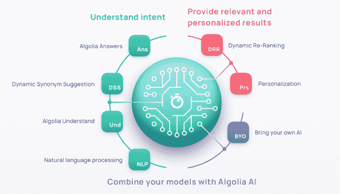

# Algolia AI:宣布业界最智能的搜索平台- Algolia 博客

> 原文：<https://www.algolia.com/blog/ai/launching-an-industry-leading-artificially-intelligent-search-platform/>

今天，Algolia 非常兴奋地推出我们的[最新人工智能功能](https://www.algolia.com/about/news/?section=news)，使我们在帮助任何规模的企业通过个性化和相关的体验来控制人们如何搜索、发现和找到他们的产品和内容的使命上向前迈进了一步。

我们一直希望利用最好的技术来解决消费级搜索的众多挑战，[包括人工智能](https://blog.algolia.com/using-ai-to-deliver-smarter-search/)。 但是首先，为什么 AI 对于搜索是必要的？

## 搜索是一个不断进化的谜题

搜索是一个永远无法解决的问题——它伴随着一系列不断演变的独特挑战。每个客户都是不同的，甚至单个客户的需求也会随着时间的推移而变化，因此搜索发现不可能有“一刀切”的配置。

有四个主要原因:

*   我们都在以一种“混乱的”、不可预测的方式搜索，因为我们用不同的词来描述同样的事情，打错别字，等等。
*   我们并不都期望同样的搜索得到同样的结果。
*   我们期望的结果会随着时间而改变。只要想想 2019 年和今天相比，人们在寻找“面具”时的期望是什么！
*   最相关的结果不一定是企业最想展示的结果。

所有这些挑战都让搜索变得极其困难。手动解决这些挑战是不可能的，因为有太多快速变化的参数需要考虑。

这就是为什么人工智能(AI)是应用和解决这些搜索挑战的完美技术。

## 所有 AI 驱动的搜索都不相等

直到今天，将人工智能应用于搜索的选择是从头开始构建整个搜索栈，或者购买第三方“人工智能搜索”解决方案。这两种方法都是不够的。

对于 DIY，你需要召集拥有合适技能、基础设施和工具的团队来构建你自己的人工智能模型，并将它们应用到你的搜索中。

在打包的人工智能搜索解决方案方面，大多数都是固定的，难以定制。他们没有给企业任何控制权和可见性。

## 输入阿洛艾

[Algolia AI](https://www.algolia.com/products/ai-search/) 是一个人工智能算法家族，解决了搜索和发现体验的每个维度。

首先，它能让你了解所有类型的用户和搜索。

*   自然语言处理，允许 Algolia 识别超过 70 种语言的搜索
*   [自然语言理解](https://www.algolia.com/industries-and-solutions/voice-search/)识别搜索请求中的意图和实体，以运行更有针对性的搜索。
*   [动态同义词建议](https://www.algolia.com/products/ai-search/dynamic-synonym-suggestions/)用 AI 生成的同义词不断优化体验，所以无论用户用什么词来描述一个物品，都会找到。

> “ABC 是澳大利亚最大的新闻平台，我们的受众非常多元化。在我们超过 100 万篇文章中，很难持续地将访问者与正确的内容联系起来。自从使用动态同义词建议后，我们看到我们的搜索在 [上有了很大的改进](https://www.abc.net.au)
> 
> –**彼得·布芬顿，澳大利亚广播公司产品经理**
> 
> 

一旦 Algolia 理解了用户的意图，下一步就是返回最相关的结果。Algolia AI 为每个搜索和用户提供完美的结果。

*   [动态重新排序](https://www.algolia.com/products/ai-search/dynamic-reranking/)，根据过去的用户行为优化每次搜索的结果排序，突出显示最高性能的结果
*   [个性化](https://www.algolia.com/products/search-and-discovery/personalization/)根据每个人过去的行为定制结果

> “对于像我们这样目录中有超过 25，000 种产品的零售商来说，能够改善我们每个用户在搜索过程中的体验的解决方案会带来巨大的价值。Algolia 的内置个性化代表了迪卡侬新加坡在数字时代的真正进步。”
> 
> –**理查德·米格特，迪卡侬新加坡电子商务项目负责人**
> 
> 

## 掌控企业

会有 Algolia AI 代替不了人类的情况。这就是它与我们的搜索和发现管理工具紧密集成的原因。它与我们的定制排名公式一起工作，因此我们的客户可以使用利润、可用性、用户评论或任何其他数据来影响相关性，并且仍然可以使用我们的[规则](https://www.algolia.com/products/search-and-discovery/search-relevance-rules/)和我们的[可视化编辑器](https://www.algolia.com/products/search-and-discovery/visual-merchandising-curation/)对任何搜索进行商品销售。通过这种方式，业务用户始终可以控制体验。

最后，Algolia AI 允许您带来自己的 AI，将您的数据和定制模型的输出与 Algolia 的速度、相关性和灵活性相结合，为您的用户创造出色的体验，同时优化您的业务指标，从您的 AI 投资中释放更多回报。

> “由于 Algolia 的灵活性及其强大的规则 API，我们能够将我们独特的数据科学专业知识与 Algolia 最先进的文本相关性相结合。这种方法极大地提高了我们的搜索和 Algolia 支持的谷歌购物登录页面的转化率。”
> 
> –**艾蒂安·德布里埃，马诺马诺高级产品经理**
> 
> 

## 还有一件事……阿哥利亚解答！

今天，我们还宣布了另一个自然语言理解功能:[Algolia Answers](https://www.algolia.com/)！

Algolia Answers 将 Algolia 的可调相关性与人工智能驱动的自然语言和现实世界理解相结合。基于 Algolia 和 OpenAI 的技术，Algolia Answers 解决了最困难的自然语言问题，不仅找到了答案，还找到了对搜索者问题的最佳回应。

> “我们已经从 Algolia 的答案中看到了很好的结果，这些问题很难单独通过文本搜索来回答。它能够从我们的新闻档案中返回非常相关的常青内容，例如“火山为什么会爆发”
> 
> –**彼得·布芬顿，美国广播公司产品经理**
> 
> 

## 现在就开始吧！

以下是如何开始使用我们最新的人工智能功能:

标准计划和高级计划已经提供自然语言处理功能，高级计划还提供个性化功能。 [报名入门](https://www.algolia.com/users/sign_up) 。

[**动态同义词建议**](https://www.algolia.com/products/ai-search/dynamic-synonym-suggestions/) 和 [**动态重新排名**](https://www.algolia.com/products/ai-search/dynamic-reranking/) 将普遍适用于我们的 [保费计划](https://www.algolia.com/pricing/) 客户。但是任何人都可以在他们还在测试阶段的时候测试他们！ [今天报名](https://www.algolia.com/users/sign_up) 受益于 Algolia AI，或者阅读 [动态同义词建议](https://www.algolia.com/doc/guides/algolia-ai/dynamic-synonym-suggestions/) 和 [动态重排名](https://www.algolia.com/doc/guides/algolia-ai/dynamic-synonym-suggestions/) 。 终于， [**阿果懂**](https://www.algolia.com/industries-and-solutions/voice-search/) 和 [**阿果答**](https://www.algolia.com/) 在封闭 beta 中出道。点击链接加入等候名单。