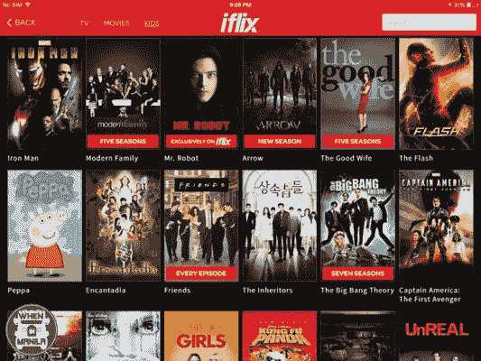

# 网站搜索的 5 个最佳实践

> 原文：<https://www.algolia.com/blog/product/learn-about-site-search-best-practices/>

在一个用户期望相关、及时结果的网络世界里，网站搜索不仅仅是一个基本的搜索栏。

当用户进入你的网站却没有找到他们想要的东西，他们会在几秒钟内转到其他地方。然而，正确使用的话，网站搜索可以成为一个非常重要的商业工具，推动转换，参与，并产生有价值的见解。

设计和优化是满意的用户和不满意的用户之间的区别，满意的用户可以自信地在你的网站上操作，而不满意的用户会因为负面的搜索体验而离开。

这里有五个需要记住的关键最佳实践:

1.  使搜索框用户友好。
2.  分析搜索数据。
3.  针对移动搜索进行优化。(或者您的用户可能在的任何地方！)
4.  使用自动完成、自动更正、过滤器和方面来帮助搜索。
5.  让结果页面直观、有帮助、有启发性。

通过遵循这些关键实践，你将为你的网站配备强大的网站搜索，让用户找到他们需要的东西——甚至可能发现他们甚至不知道自己需要的东西。

## 为什么要优化站点搜索？

网站搜索是用户体验中非常宝贵的一部分。致力于相关结果和直观设计的伟大搜索体验可以快速启动你的网站并满足访问者。

有些访问者在进入你的网站时，很清楚他们想要什么。其他人没有。伟大的网站搜索迎合浏览器和搜索者。

[超过 40%的网站访问者](https://www.forrester.com/report/MustHave+eCommerce+Features/-/E-RES89561) 会直接进入搜索框。这些目标导向的网站搜索者是你网站成功的重要组成部分，因为他们比浏览器更有可能转化【216】。使用站点搜索，你可以帮助他们快速找到他们需要的东西，有意义地改进他们的搜索，并帮助他们在你的站点上使用其他相关内容。顺利，优化的搜索意味着快乐，参与转化访问者。

对于没有明确目标的网站浏览者来说，网站搜索功能可以为他们提供有意义的后续步骤。搜索和发现工具，如相关搜索、推广横幅、过滤器和方面，可以帮助激起他们的兴趣，引导他们获得满意的体验、内容和产品。只要他们的点击继续带来价值，他们就会继续关注你的网站。

## 网站搜索的 5 个最佳实践

这里有五种方法可以让你的网站搜索发挥最大作用

### 1。使搜索框对用户友好

搜索栏是用户参与网站搜索的门户。不留任何怀疑的余地。

你可以通过几种重要的方式让搜索框变得直观:

*   将搜索框放在一个有意义的地方。
*   确保搜索栏在所有页面上的位置都相同，这样用户在浏览网站时就能准确地知道在哪里可以找到它。
*   使用[microcopy](https://uxdesign.cc/the-magic-of-microcopy-a56c5decbe1f)作为文本提示帮助用户解决。
*   确保搜索栏足够大，能够引起人们的注意。
*   创建一个足够长的搜索栏来接受平均搜索字符串。如果您需要节省空间，请确保搜索框可以在单击时展开。

### 2。分析搜索数据

每次用户与您的网站交互时，他们都会生成有价值且可操作的数据，您可以使用这些数据来阐明用户意图并推动业务优先级。 [分析你的站点搜索数据](https://blog.algolia.com/internal-site-search-analysis) 可以帮助你评估你的搜索功能的质量，揭示重要的关键词，给你提高转化率的洞察力。

数据还可以推动不同类型站点的具体改进:

*   电子商务网站所有者可以识别最受欢迎的产品，发现搜索中出现的新趋势，然后相应地配置搜索。使受欢迎的产品易于查找，突出显示流行或特价商品，并帮助搜索者发现受欢迎的相关产品。
*   内容密集型网站(如媒体网站)的所有者可以发现内容缺口——用户正在搜索的主题，但没有相关内容——并填补这些缺口。让受欢迎的视频或资源更容易找到，并将用户指向与他们最初观看或搜索的内容相关的内容。

### 3。针对移动搜索(或您的用户可能在的任何地方)进行优化！)

如今，用户不仅仅是通过桌面上的浏览器进行搜索。从手机到语音到虚拟助手，访问者使用的每一个设备都需要优化的相关搜索。

移动搜索正在迅速发展，在移动设备上执行的搜索比标准计算机上执行的搜索更多。

移动搜索应该建立在优秀搜索的基础上，增加即时结果、输入错误容忍和查询建议等功能。移动搜索还应该考虑到等手机特有的 UX 元素，无论是标签栏、全搜索栏还是图标都最适合你的内容。

[语音搜索](https://blog.algolia.com/amazon-alexa-voice-search/) 功能也是必备。大致 36%的消费者拥有 [智能音箱](https://www.cmo.com/adobe-digital-insights/articles/2019/2/22/adobe-voice-report-feb19.html#gs.bk56q7) ，75%的智能音箱拥有者日常使用。出色的语音搜索通过使用动态过滤、提供上下文和个性化结果来提供相关结果。确保你的生活经得起挑战。

目前没有智能音箱的客户，未来可能仍会使用语音搜索。允许用户使用自然语言模式与应用程序和网站互动的对话式搜索也在兴起。

### 4。使用自动完成、自动更正、过滤器和方面来帮助搜索

不幸的是，在线访问者并不总是搜索专家。 [研究显示](https://www.nngroup.com/articles/search-not-enough/) 客户不仅需要好的搜索，还需要出色的导航和 UX 来找到他们在网站上需要的东西。

因此，一个好的网站搜索的作用是引导用户找到他们最终想要的东西。这包括帮助他们提炼和完善他们的搜索词，或者帮助他们找到他们需要的东西，而不需要输入完美的查询。

有很多方法可以让搜索变得更容易，包括:

*   **将搜索词留在搜索框** 中，这样用户可以方便地编辑他们当前的搜索。如果搜索使用自动更正，这可能特别重要。
*   **使用自动建议和推荐的搜索词** 帮助用户进一步定义他们的搜索。
*   确保你的网站搜索能够容忍错别字 和 [使用文本相关性](https://blog.algolia.com/inside-the-algolia-enginepart-4-textual-relevance/) 这样用户无论如何都能得到结果。
*   **提供过滤器和方面** 来帮助他们的搜索更加具体。对于电子商务网站，一些常见的过滤器可能包括大小、颜色和价格。

### 5。让结果页面直观、有帮助、有启发性

结果页面应该易于阅读，内容全面，并能预见用户需求——但又不至于让人不知所措。考虑一些给你的结果页面增加价值的方法

*   **通过在搜索结果中使用推广的横幅** 来激发用户寻找新的兴趣，而 [通过在站点搜索中使用营销功能](https://www.algolia.com/doc/guides/managing-results/rules/merchandising-and-promoting/) 。
*   **考虑在结果中加粗或突出显示搜索词** 。确保搜索栏出现在页面上，以便用户可以改进或更改他们的查询。

*   不惜一切代价避免“无结果页面”。确保你的同义词库已经建好，用户资料已经定义好，所有相关的页面、产品和内容都可以被你的网站搜索索引。不要显示“没有找到结果”的页面，引导用户找到相关的产品或内容来帮助他们转化，即使你没有他们想要的确切产品。

*   **结果页面的格式可以决定用户体验的成败。** 的结果应该包含来自你网站各处的所有类型的相关内容，就像一个 [的联合搜索界面](https://blog.algolia.com/federated-search-types/) 一样。对以图像为主的结果使用网格布局，对以文本为主的结果使用列表布局。如果两者都没有明显的优势，查看用户统计数据，看看哪个是最有益的信息布局。

## 3 个伟大站点搜索的例子

一个优秀的网站搜索可以成就或破坏用户体验，尤其是对于拥有多样化内容的大型网站。看看这些伟大的网站搜索的例子:

### LegalZoom:超凡爬虫

LegalZoom 是一家提供在线法律援助和资源的公司，该公司面临的挑战是让用户能够访问其网站上丰富的法律信息。为了提供相关和及时的结果，Legalzoom 使用一个高级爬虫 [优化了他们的网站搜索，该爬虫可以有效地索引所有内容，并帮助用户回答甚至最细微的法律问题。](https://goto.algolia.com/legalzoom)

### Coursera:前沿搜索 UX

随着 Coursera 的课程目录的扩大，开发团队发现自己陷入了一个代价高昂的迭代周期，无法让搜索达到标准。他们知道他们需要改善移动用户的体验，支持网站上的发现，并提供直观的界面。

Coursera 实现了一个新的搜索 UX，它是移动友好的，提供随你输入的搜索功能和打字错误容忍，并允许用户跨内容类型进行搜索。通过这些改进，Coursera 的目标页面浏览量增加了 10%，现在 30%的注册学生来自搜索。

### iflix:闪电迭代

iflix 是一个面向新兴市场的娱乐平台，它依靠强大的用户分析数据来为用户提供新内容。尽管搜索是访问者浏览网站不可或缺的方式，但 iFlix 的搜索结果并不相关，也不直观。

用手机友好的搜索取代低效的搜索，让 [更容易、更快地迭代](https://goto.algolia.com/iflix) 让他们的转化率提高了 20%。

# 【网站搜索入门】

优化的网站搜索让用户在更短的时间内更轻松地找到他们想要的产品、内容和服务。这是鼓励用户参与、转化和购买的关键。

Algolia 的快速搜索和直观界面建立在所有有效网站搜索的最佳实践之上。Algolia 配备了语音搜索、移动优化和分析仪表板，可帮助您联系到您的客户，无论他们身在何处。

观看我们的 [演示](https://go.algolia.com/deep-dove-demo-nav) 来了解在世界各地的网站上使用的功能。