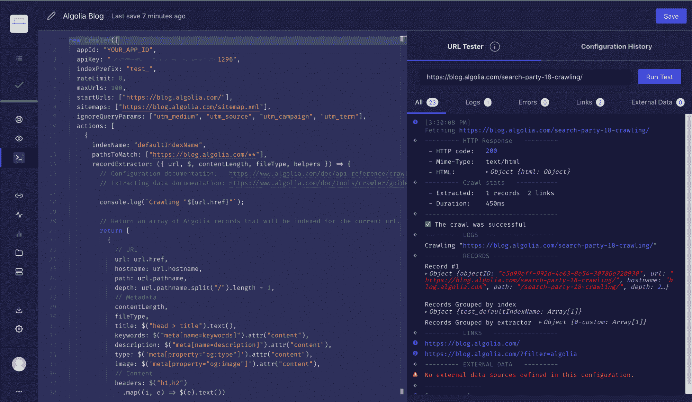
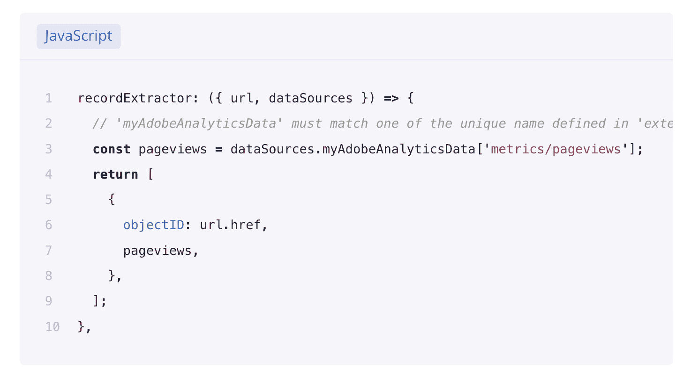
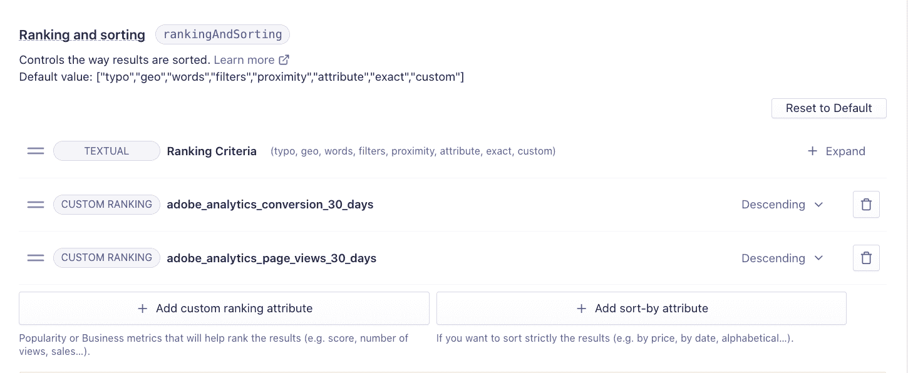

# 如何使用 Adobe Analytics 数据对 Algolia 搜索结果进行排名

> 原文：<https://www.algolia.com/blog/product/leveraging-adobe-analytics-for-algolia-search/>

众所周知，Algolia 为企业管理搜索结果及其排名提供了细粒度的控制。虽然首要任务是文本相关性，但接下来是打破排名关系的定制方式——例如，在 100 件不同的“polo 衫”之间。该定制逻辑可以基于销售排名、库存量、受欢迎程度、评级或企业正在跟踪的任何其他东西。考虑一家企业如何在搜索结果的第一行优先显示一个 polo，并在第三页隐藏另一个 polo，最终会对转化率和收入产生巨大影响。对于 Lacoste 来说，使用 Algolia 来改善搜索结果的排序，导致转化率提高了 37%。其他一些搜索优先级排序示例包括可能使用两个指标(最近和点击次数)对文章进行排序的新闻出版物，或者可能通过首先显示导致最多“联系我们”表单提交的内容来对其搜索结果进行优先级排序的咨询公司。

对于我们的 Adobe 客户，我们希望分享他们如何从 Adobe Analytics 引入指标，例如点击率最高的文章和页面，以便他们可以在排名逻辑中无缝利用。有几种不同的方法可以实现这一点:

1。Algolia Crawler 能够链接到您的 Adobe Analytics，以提供业务指标来改善您的发现体验。通过 [几个步骤](https://www.algolia.com/doc/tools/crawler/guides/enriching-extraction-with-external-data/how-to/linking-adobe-analytics/) ，爬虫将自动连接并从 Adobe Analytics 检索页面数据，使您的解决方案保持最新并与您的客户相关。

2。可以编写一个外部脚本来连接到 Adobe Analytics 获取数据，并丰富 Algolia 内部的记录。一个 [的阿果前端库](https://www.algolia.com/doc/api-client/getting-started/install/javascript/?client=javascript) 可以方便的丰富阿果的记录。

3。Algolia InstantSearch 包括一个 [小部件](https://www.algolia.com/doc/guides/building-search-ui/going-further/integrate-google-analytics/js/) ，可以轻松地将搜索数据直接发送到 Adobe Analytics 等分析系统。搜索是去抖的(只捕获完整的单词，而不是按下的键)，并且可以为 Adobe Analytics 进行配置。

一旦您连接了您的数据，您就可以开始使用您的 Adobe Analytics 指标来战略性地优先排序您的搜索结果。

除此之外，您还可以利用 Algolia 内置的 A/B 测试功能来衡量如何在参与度和转化度上更进一步。我们很高兴听到你的结果！在 adobe-algolia-solutions@algolia.com 与我们联系。

查看“Algolia x Adobe Integrations”系列中的其他博客，关于如何将 AEM 内容导入 Algolia 和[如何利用 Adobe Launch 个性化您的搜索体验](https://www.algolia.com/blog/product/leveraging-adobe-launch-events-in-algolia-for-personalization/)！