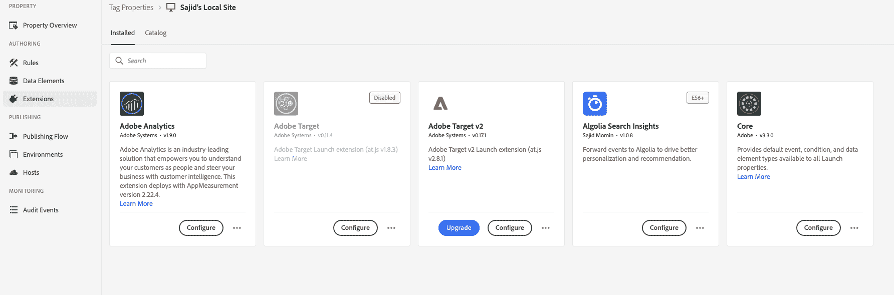
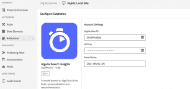
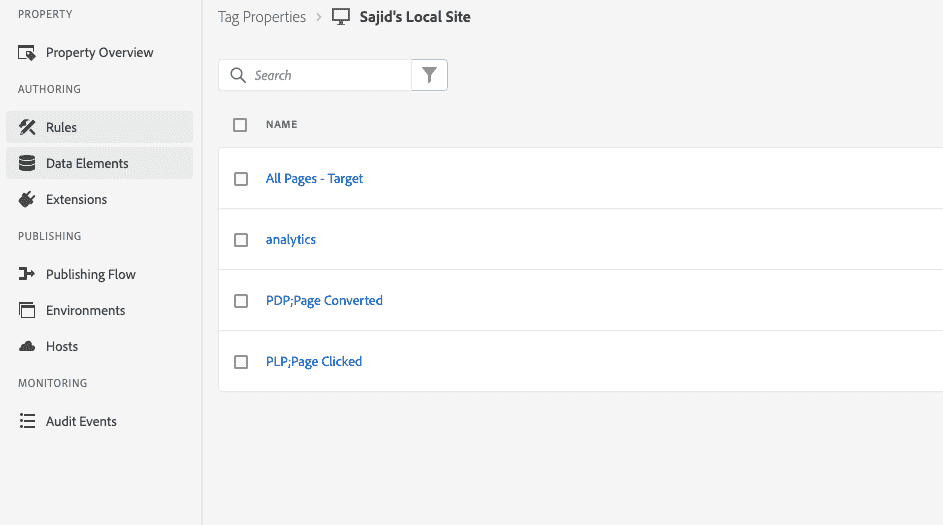
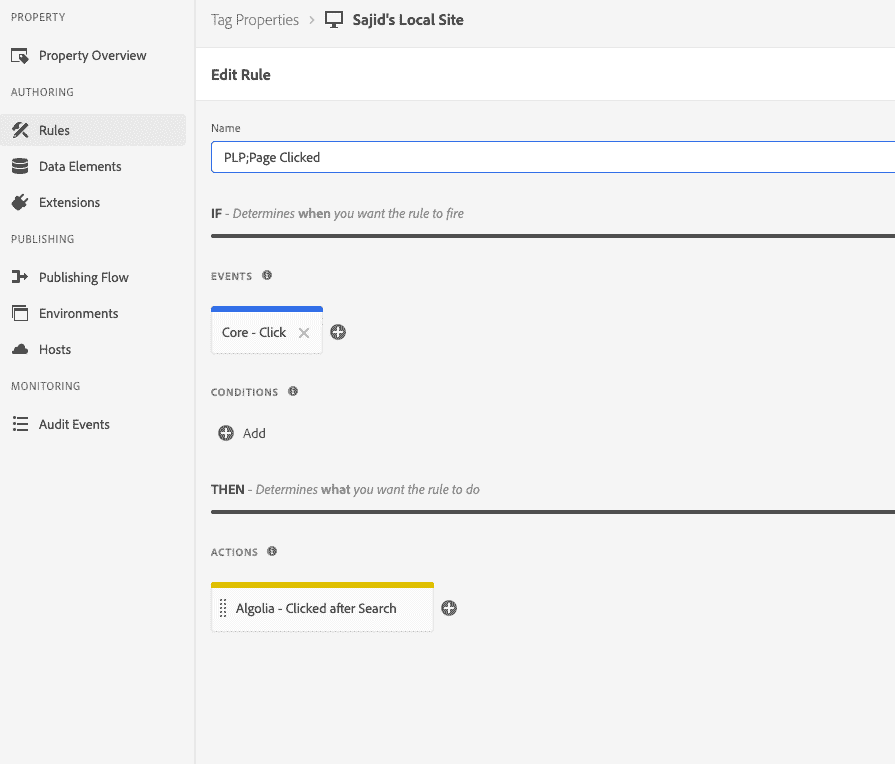
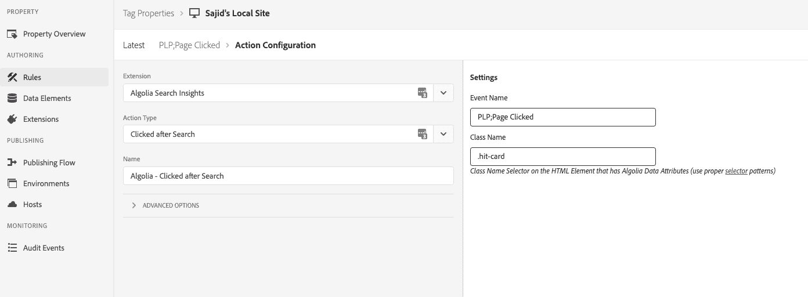
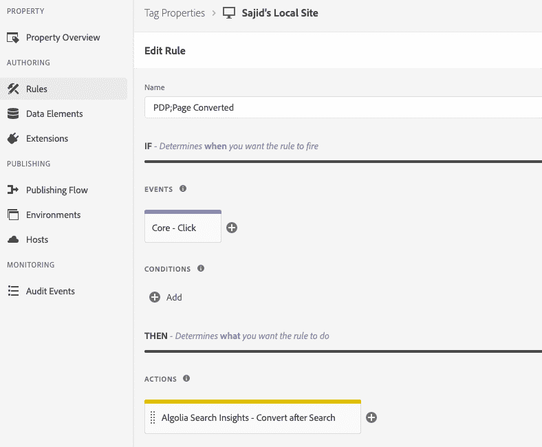
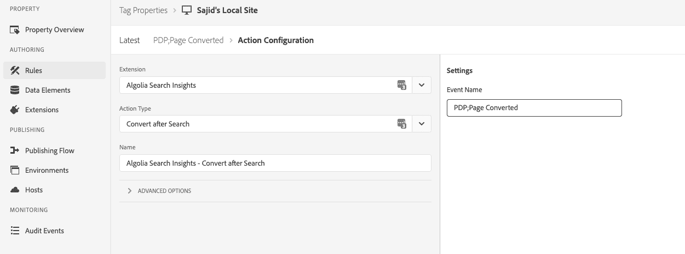
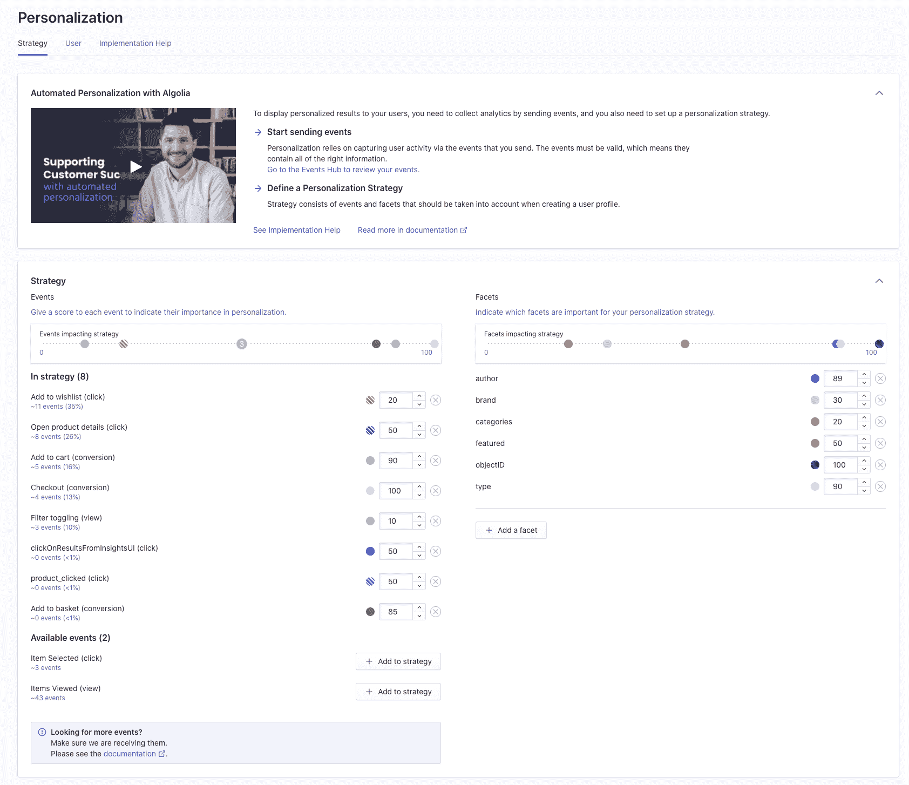

# 了解如何在 Adobe Launch \n 中个性化您的 Algolia 搜索

> 原文：<https://www.algolia.com/blog/product/leveraging-adobe-launch-events-in-algolia-for-personalization/>

当潜在客户使用您的数字财产时，每一秒都是创造相关且难忘体验的关键。丰富的搜索和发现体验赢得了客户忠诚度，并提供了他们可能会参与的信息或产品。Algolia 的平台可以轻松利用来自多个数据源的见解，为搜索体验提供超强的个性化。与我们的合作伙伴 Adobe 合作，我们专注于将 Adobe Launch 的活动数据引入 Algolia，以了解客户在线上和线下采取了哪些行为和行动。这些事件以匿名方式进入 Algolia，用于了解哪些商品与每位顾客最相关。例如，我们可能会获得事件数据，表明一个人点击了布朗尼混合的多个 Instagram 广告。后来，当他们去搜索栏开始搜索“b-r-o-w”时，我们会知道将布朗尼混合食品排在比眉笔或棕色裤子更高的位置。让用户留在你的网站上，每一秒都很重要，拥有尽可能多的上下文有助于企业理解亲缘关系和解释意图。

我们之前的文章向您展示了各种[数据摄取](https://www.algolia.com/blog/product/ingesting-data-from-adobe-experience-manager-aem-for-search-discovery/)方法，让您开始使用 Adobe Experience Manager (AEM)。本文向您展示如何通过捕捉用户的点击和转换事件来[个性化](https://www.algolia.com/doc/guides/personalization/what-is-personalization/)您的用户的搜索结果。

## 工作原理

Adobe Launch 是一个标签管理器和分发容器，允许数字团队在其 web 属性上收集用户行为，并在其工作流程中利用这些事件。当客户浏览网站时，Launch 会在页面上添加一个 Javascript。该脚本执行并绑定页面上可操作元素的启动规则，比如搜索或点击。

Launch 允许营销人员在一个地方管理跟踪脚本，他们希望将这些脚本添加到基于表单的体验页面中。例如，营销人员可以创建一个启动规则，在按钮上发生事件(例如，单击或鼠标悬停)时发送用户、页面和浏览器属性。

我们为 Adobe Launch 构建了一个 [Algolia Insights 扩展](https://github.com/algolia/algolia-launch-extension) ，它提供了两个预打包的[Algolia Insights](https://www.algolia.com/doc/rest-api/insights/)事件(“搜索后单击”和“搜索后转换”)。这段代码是启发性的(不支持)，但是可以给你一个如何开始和添加更多事件的想法。

## 扩展仪表板

扩展仪表板提供了一种浏览可用安装启动扩展的方式。它还允许根据您的需求进行扩展配置。

Adobe Launch Extensions dashboard

### 分机配置

Algolia Insights 扩展需要在使用前进行配置。

Algolia dashboard

这两个事件——“搜索后点击”和“搜索后转换”——被创建为“Adobe 动作”。这些操作需要输入，比如查询 ID、产品 ID、位置和用户 ID，我们可以从搜索结果中获得这些信息。我们可以将这些属性直接添加到 DOM 中，放在动作可以获取的 HTML 元素上。用户 ID 来自 API 调用。

## 创建规则和事件

使用 Algolia Insights 操作需要启动规则。

Algolia Rules dashboard

### 点击后搜索

Algolia Insights API 包含在一个启动操作中。此操作必须配置如下:

*   事件名称–在 Algolia 中识别事件的任意标签
*   类名 HTML 元素上使用的 CSS 类，该元素包含 Algolia Hit widget 设置的数据属性

[文档](https://github.com/algolia/algolia-launch-extension) 提供了关于此操作的更多详细信息。

Algolia’s dashboard screen to create the click event Rule

Algolia’s dashboard screen to configure the click event

### 搜索后转换

Algolia Insights API 包装在一个启动动作上。该动作需要以下配置:

*   事件名称–在 Algolia 中识别事件的任意标签

附加属性是必需的，但从 url 中提取。Algolia Hit 小部件需要在可操作的链接上添加查询字符串。 [文档](https://github.com/algolia/algolia-launch-extension) 提供了关于此操作的更多详细信息。

Algolia’s dashboard screen to create the click event

Algolia’s dashboard screen to configure the conversion event

## 

Algolia Personalization dashboard

当其中一个用户事件在页面上发生时，Launch 会将事件和适当的元数据发送回 Algolia，我们的搜索引擎将使用这些信息来重新排列产品，以反映趋势和个人喜好。上面，你可以看到一个例子，我们如何使用特定的事件来定义 Algolia 中的搜索个性化策略。

我们欢迎您来到我们的助手 的 [build off，与我们分享您如何利用 Adobe 发布活动在 Algolia 中推动动态重新排名和搜索个性化！在 adobe-algolia-solutions@algolia.com](https://github.com/algolia/algolia-launch-extension)联系我们。

查看“Algolia x Adobe Integrations”系列中的其他博客，关于[如何将 AEM 内容导入 Algolia](https://www.algolia.com/blog/product/ingesting-data-from-adobe-experience-manager-aem-for-search-discovery/) 以及[如何利用 Adobe Analytics 指标进行搜索排名](https://www.algolia.com/blog/product/leveraging-adobe-analytics-for-algolia-search/)。