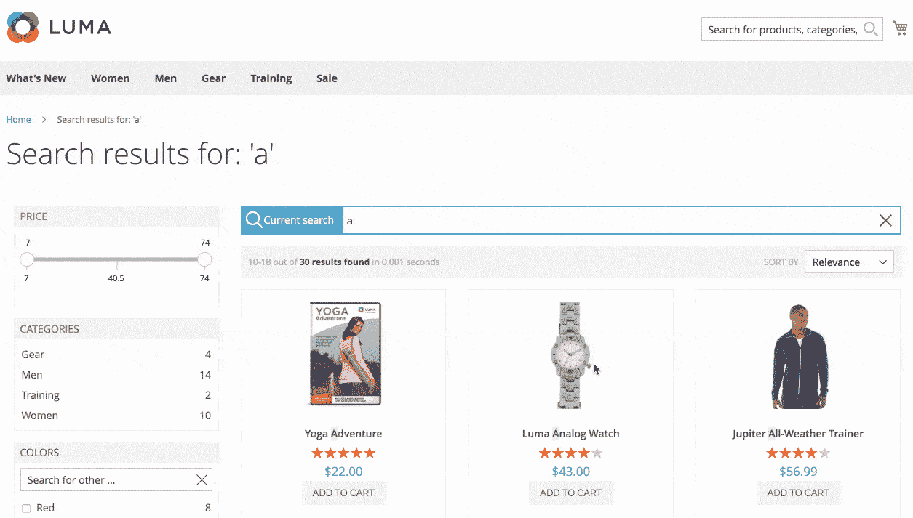
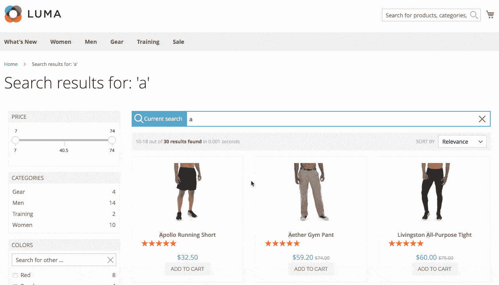
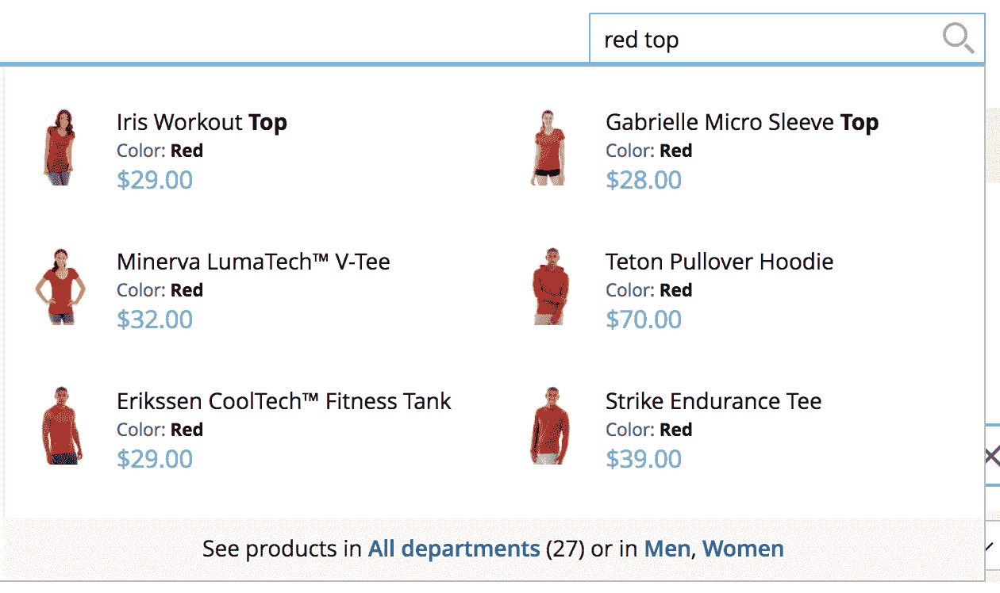
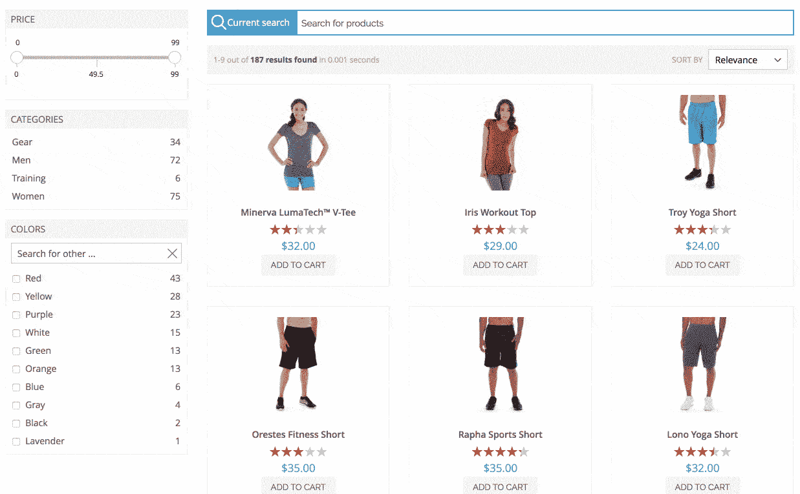

# Magento 2:我们的新扩展在这里，它充满了新功能

> 原文：<https://www.algolia.com/blog/product/magento-2-search-extension/>

在电子商务网站上搜索是一个棘手的问题:如果你想赢得并留住客户，你需要在数字体验游戏中保持领先。我们的 Magento 客户相信我们能帮助完成这项工作。以下是 Magento 2 的新 Algolia 扩展如何走得更远。

## 无限滚动

你要求的，现在你得到了！没有更多恼人的分页为您的客户。让他们在同一页面上顺利浏览你的目录。只需在 Magento 的 Algolia 配置中打开它，就万事俱备了！

标准分页:

无限滚动:

## 适应性图像

你的用户是否一直在搜索一件黑色夹克、蓝色 t 恤或一条橙色短裤，而他们得到的只是一个充满不同颜色产品图片的结果页面？不会再发生了。该扩展现在可以索引所有颜色的图像，无论您是在搜索某种颜色的项目还是按颜色过滤，正确的图像都会显示在结果页面上。

您的客户不再困惑和沮丧。

## 防止后端渲染

当您在服务器上加载和生成所有页面时，不要让您的客户等待。Algolia 扩展会在前端重新呈现页面。该扩展现在提供了一个实验性的特性，可以禁止在服务器上生成 HTML 目录。

它从生成的 HTML 代码中移除目录的所有 HTML。这意味着像 Googlebot、Bingbot 和其他搜索爬虫可能找不到你所有的产品，并从他们的索引中删除一些页面。

在启用此功能之前，请[阅读文档](https://community.algolia.com/magento/doc/m2/prevent-backend-rendering/)并确保您关注您的搜索引擎流量。

## 搜索方面值

如果您有一个包含大量属性及其值的大型商店，您肯定会从[搜索方面值](https://www.algolia.com/doc/api-reference/api-methods/search-for-facet-values/)特性中受益。该功能在您的过滤器上添加了一个搜索栏，让您的客户搜索正确的值。对方面值的搜索包括突出显示，以使其对客户来说尽可能平滑。

## 开发者友好

该扩展提供了许多方法来扩展它，修改它的功能，并处理每一种边缘情况。这样，您的开发人员就不必花费宝贵的时间来编写样板代码——我们为他们做了这些。

这里有一个[定制的 Algolia Magento 2 扩展](https://github.com/algolia/algoliasearch-custom-algolia-magento-2)，它帮助编写事件监听器、覆盖模板和修改前端。您可以使用的所有事件都可以在这里找到:

## 接下来是什么？

我们听说你缺少基于类别的产品定制排序，这正是你可以从下一个版本中期待的。如果你使用类别列表的扩展，在下一个版本中，它将会考虑你在类别配置中设置的产品在类别中的顺序。

## 保持联系

延伸最重要的部分是…你！—扩展的用户。无论你是店长、设计师还是开发者，欢迎反馈！[给我们留言](mailto:support+magento@algolia.com)、[创建问题](https://github.com/algolia/algoliasearch-magento-2/issues/new)、[发送拉请求](https://github.com/algolia/algoliasearch-magento-2/pulls)或向我们展示您在 [Algolia 论坛上构建的内容](https://discourse.algolia.com/)。

我们会很高兴见到你的🙂。