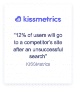
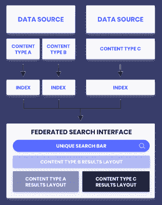
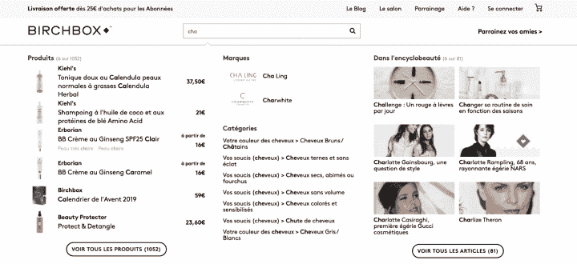
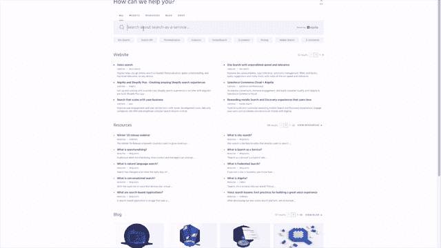

# 让杂乱无章的内容被发现的 2 个步骤

> 原文：<https://www.algolia.com/blog/product/make-disorganized-content-discoverable/>

今天的用户对他们的在线体验有很高的标准，无论是界面还是设备。一个组织混乱的网站，很难搜索和找到相关的内容，往往不能满足用户的期望，使企业失去了吸引用户和满足他们需求的重要机会。

无论你是 B2C 还是 B2B，一个有优化搜索栏的有组织的网站可以让用户通过一个简单的按键在任何地方搜索你想让他们去的任何地方。

在这篇文章中，我们将讨论站点抓取和联合搜索如何让你的站点更有条理，内容更容易被发现。

## 为什么可发现性是任何网站搜索体验的关键

不管你的垂直行业如何，为了给你的用户提供相关和有效的结果，你的内部搜索引擎需要能够系统地访问你的网站内容。通常情况下，搜索不成功不是因为内容或产品不存在，而是因为 [搜索没有得到适当的优化](https://blog.algolia.com/learn-about-site-search-best-practices/) 。

**B2C 公司可以从使来自不同地方的产品、产品指南、视频、文章和其他内容一次被发现中获益。为什么？高达 43%的访问者在访问一个网站时会立即导航到搜索栏。可发现的内容构成了有用的搜索体验的基础，并为企业带来好处，包括:**

*   推动转化率、用户参与度和其他指标。当用户找到相关结果时，他们会增加与您网站的互动，更有可能购买产品、观看视频、阅读文章、转化等等。【T2
*   **降低跳出率。来自 KISSmetrics 的研究表明，12%的网站访问者在不满意的搜索后会离开去竞争对手的网站。如果用户可以找到他们需要的东西，他们就不必去其他网站寻找了。**

B2B 公司**面临的挑战是确保用户能够轻松找到可能位于不同位置的文档和资源。在您的域 **上组织内容可以改善用户体验** 并使用户能够找到帮助他们成功解决问题和回答他们自己的问题的内容。反过来，这可以减少您的团队必须处理的服务单数量，从而腾出时间来处理可能实际上需要专业知识的请求。**

 **## 用站点抓取和联合搜索改善你的搜索

每个用户都可以从一个有组织的网站中受益。一个网站满足这种需求有两种主要方式

1.  使用定制的 **网站爬虫**控制你的内容
2.  用 **联合搜索**向用户展示综合结果

搜索功能是一个强大的工具，帮助用户从无关的内容和产品中找到他们需要的东西。没有搜索，用户很难知道从哪里开始。网站抓取和联合搜索都是 [搜索和发现](https://blog.algolia.com/site-search-content-discovery/) 体验的基本驱动力，将用户与他们当前和未来的需求联系起来。

## 用站点爬虫构建你的站点

网站抓取是一个强大的后端工具，它使内容更有组织性，因此可以被用户发现。一个 **站点爬虫** 提取并构建一个站点的内容，并有能力使任何对象或记录可被搜索。

一个网站爬虫分几步实现:

1.  定义入口点。
2.  爬虫提取并格式化数据。
3.  数据被发送给搜索提供商。
4.  你的团队可以专注于搜索界面，如果正在构建的话。

一旦站点爬虫结构化了你的数据，你就可以把结果用于的一系列应用，包括搜索。请注意，提取步骤通常需要一些中级编码技能。虽然不完全是一个无代码的过程，但开发人员受益于极大的灵活性。寻找一个站点爬行工具，它允许开发人员控制何时调用爬行器，何时进行提取，从而在这个过程中给你最大的灵活性。

## 使用站点爬虫的好处

网站爬虫提供了一些独特的好处，包括:

*   制作任意网页结构化内容
*   消除了在每个内容存储库之间构建数据管道的需要
*   用商业数据丰富抓取和提取的内容
*   无需编辑源代码即可抓取网站
*   将 [爬虫插入 Google Analytics](https://www.algolia.com/doc/tools/crawler/guides/enriching-extraction-with-external-data/how-to/linking-google-analytics/) 丰富网站记录，提高相关性
*   索引任何需要 JavaScript 才能工作的网站(特定于 Algolia 的爬虫

此外，基于您选择的爬虫，还有竞争优势和好处:

*   **白盒方法。对于一些供应商来说，搜索引擎和爬虫被打包在一起，本质上是在一个用户无法破译的黑盒子里。这意味着开发人员不能独立利用爬虫或 API。像 Algolia 这样的提供商明确区分了搜索引擎 API 和爬虫。通过这种白盒方法，您可以看到两者的不同功能，并使用最符合您需求的功能。**
*   **支持 SEO 和站点监控。当爬虫出于结构化的目的调用整个网站时，它们也可以暴露次要或主要的站点构建错误，例如没有标题的页面、断开的链接或 SEO 问题。**
*   **[用爬虫建立 POCs](https://www.cloudshare.com/virtual-it-labs-glossary/what-is-a-sales-poc) 或站点搜索的初始演示。 Algolia 客户可以使用爬虫来演示 Algolia，看看它是否合适。虽然这不是爬虫的主要目的，但它允许潜在客户评估产品如何工作，而不必做任何额外的编码或雇人来实现演示。**

## 用联邦搜索让搜索体验更全面

与用户相关的产品和内容通常存储在不同的产品目录、领域和数据库中，但是导航到这些不同的位置会在搜索体验中产生摩擦。

联合搜索是一个强大的用户界面元素，通过一次提供来自多个数据源的所有相关结果来简化搜索过程。使用对使用多个索引在不同数据位置上运行单独搜索的 [搜索时间合并方法](https://blog.algolia.com/what-is-federated-search/) 的扩展，联合搜索界面在一个组合界面中呈现每种类型内容的结果列表。

****

构建联合搜索界面需要对您希望您的用户拥有的搜索体验类型进行一些规划和预先考虑。一旦建立起来，它可以大大增强用户体验，使每次搜索都有一个广泛的范围。它还为企业提供了增强的控制，因为搜索体验可以由最了解内容和/或产品以及业务目标的人来管理。

## 5 联合搜索的好处

联邦搜索可以通过 [多种方式受益网站](https://blog.algolia.com/federated-search-benefits-and-challenges/)

1.  允许产品所有者微调每类内容的相关性
2.  使网站所有者能够控制他们希望访问者获得的体验
3.  通过使不同类别易于访问来支持可浏览性
4.  当产品和内容被添加到站点时，使站点保持可搜索状态
5.  提高安全性，因为只有一个搜索引擎需要维护

提供精心策划的、易于理解的结果可以大大简化用户体验，提高用户参与度。当然，在设计界面时仔细考虑用户的需求是很重要的，这样才不会用无用的结果淹没他们。

## 在你的站点上使用站点抓取和联合搜索的 3 种方式

公司正在以多种方式使用网站抓取和联合搜索。这里有几个应用网站爬虫和联合搜索来改善用户体验和网站的例子:

### 示例 1:使内部网内容可被发现

公司通常会托管多个不同的子域名，以战略性地细分不同类型的内容、产品和信息。然而，这些不同的子域名会使内部用户感到沮丧，特别是当一个公司的内部网内容也分布在 10-20 个不同的站点时。

企业可以使用网站爬虫来解决这个问题。有了 crawler，该网站可以将所有关于公司政策、产品和服务信息、公司战略等的文档和 pdf 文件收集到一个页面中，因此用户不再需要费力寻找他们需要的内容。

### 示例 2:通过网站爬行提高国际网站的可见性(并控制这些网站)

大公司在不同的国家和语言中维护不同的站点版本，这些版本通常由本地团队管理。对于这些公司来说，简化和复制跨站点的搜索体验是很重要的，但为此收集数据通常是一个主要问题。本地团队可能无法访问所有站点数据来正确实施搜索。这可能是因为他们缺乏正确的许可级别，因为他们的 CMS 不允许他们控制而无法访问必要的数据，或者他们缺乏工程资源或时间来收集数据。

这是网站爬虫可以利用的地方。站点爬虫可以提取和构建站点内容，而无需后端许可。该公司可以使用这些数据，或者将其发送给 Algolia 这样的搜索提供商，开始在各个网站上建立一致而强大的搜索用户界面。

### 例 3:爬虫支持的联合搜索

Algolia 的搜索提供了一个联合搜索和站点爬虫协同工作的很好的例子。事实上，Algolia 的联邦搜索界面部分由爬虫提供动力。

安哥利亚使用不同的爬虫为 [文档](https://www.algolia.com/doc/)[营销网站](https://www.algolia.com/products/) ，以及 [博客](https://blog.algolia.com/) 。这些爬虫产生三种不同的可搜索索引。当用户在搜索栏中键入时，爬虫创建的三个索引和其他集成创建的索引，如 [搜索 API](https://blog.algolia.com/what-to-look-for-in-a-search-api/) ，在联合搜索界面中返回结果。通过一个简单的查询，该界面返回来自站点每个部分的结果，这些结果是健壮的、易于理解的并且是不断更新的。

## 通过网站爬虫和联合搜索将您的用户与重要内容联系起来

有效的搜索是在你的网站上获得有益的用户体验的基础。Algolia 提供强大的搜索工具，最大限度地缩短上市时间，最大限度地提高搜索投资回报。借助 Algolia 的定制 [爬虫](https://www.algolia.com/products/search-and-discovery/crawler/) ，让您的开发者无缝释放您的内容并提高您的相关性。使用 Algolia 的现成 [即时搜索](https://www.algolia.com/products/search-and-discovery/ui-component-libraries/) 工具，如联合搜索、键入时搜索、过滤器和刻面等，让您的用户感到愉悦。出色的搜索体验应该根据你的用户和业务需求量身定制。阅读我们的电子书“[【7 种方式从 Algolia 搜索中获取更多信息](https://resources.algolia.com/ebooks/7-ways-to-get-more-out-of-algolia-search) ”以了解更多方式来微调您的搜索策略并提高可发现性、相关性和用户参与度。**