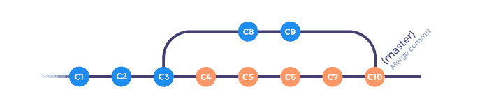
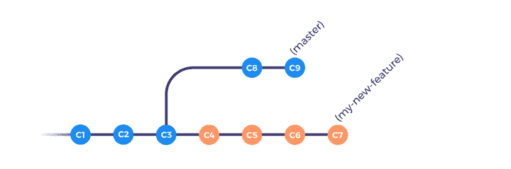
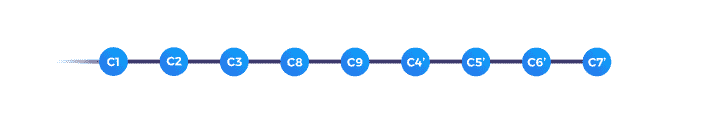
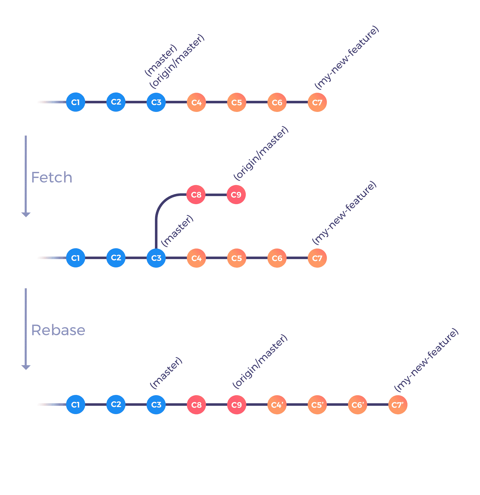

# 掌握 Rebase(反之亦然)

> 原文：<https://www.algolia.com/blog/engineering/master-git-rebase/>

git‘rebase’是您可能听说过的替代‘merge’的命令之一。事实上，不止如此——“rebase”是一套完全不同的工具，与“merge”所实现的目标相互交叉。迷茫？放心吧！这篇博文是关于“rebase”的不同用法。首先，作为一种在两个分支之间整合和交换你的工作的方式(就像“合并”一样)，也作为一种历史重写工具。

## 从合并到变基

合并分支是集成两个 Git 分支之间变更的最常见方式。GitHub 或 Gitlab 等服务常见的 Git 工作流程如下:

*   从基础分支(如“主”或“开发”)创建名为“我的新功能”的新“功能”分支
*   做一些工作，并将更改提交到特征分支
*   将功能分支推送到集中共享回购
*   为“我的新功能”打开新的拉式请求
*   等待您的测试通过，并从您的同事那里收集反馈

从那以后，一切都很好。您最终会得到一个漂亮、干净的分支，例如:

然而，在一个不完美的世界里，接下来可能会发生什么:

*   代码审查人员在您的第一次提交中发现了一些错误和打字错误，您的测试没有通过
*   您进行一些更改，并在本地提交修复
*   您将更新后的特性分支推送到集中共享的 repo(以下模式中的 C6 和 C7)
*   同时，其他提交被合并到基础分支(C8 和 C9)
*   您的拉请求最终被接受，并被合并到基础分支(C10)中

从那以后，你的历史变得有点复杂:

这个工作流程没什么问题；特别是，你不必担心你的同事在做什么，这样你就可以专注于自己的工作。由于 Git 将您的变更与来自基础分支的变更组合(或合并)的关键部分只发生一次，所以您只需要处理一次最终的冲突——在合并步骤。

然而，有几件事也有点不对劲。首先，如果您在您的分支上工作的时间足够长，您可能会在几天或几周内与基础分支失去同步。这可能不是一个问题，但有时你真的会感激包括你的团队合并的那个特定的修正，或者摆脱那个每次编译都使你变慢的巨大的依赖。其次，一旦您的所有同事都将自己的分支机构合并到基础分支机构，历史记录可能会变得过于复杂而难以理解。最后——这个可能更主观一些——您可能在分支的提交之间保留了一个逻辑分解。拥有一个包含对所有文件的所有更改的合并提交可能不是您最终想要公开的。

让我们来看看重定基准如何帮助您解决所有这些问题。

## 在基础分支上重设基础

2016 年 9 月，GitHub 推出了[合并拉取请求的新方式](https://github.com/blog/2243-rebase-and-merge-pull-requests):“Rebase and merge”按钮。其他库管理器(如 GitLab)也可以使用它，它是“rebase 前门”。它允许您在您的基本分支之上执行您的拉请求提交的单个 rebase 操作，然后执行合并。观察这两个操作是按顺序执行的，并且重定基础不是合并的替代，这一点非常重要。因此，rebase 不用于替换合并，但是它完成了合并。

考虑前面的例子。在最终合并之前，我们处于这种情况:

通过执行以下命令，您可以模拟当您单击“Rebase and merge”(没有冲突时)时会发生什么:

这样做，你最终会得到一个“线性历史”:

 如你所见，重置基础并不能替代合并步骤。如前所述，这两个操作不是在同一个分支上执行的:在特征分支上使用“rebase ”,而在基本分支上执行“merge”。目前，这个操作只是阻止了一个包含所有变更的合并提交，它仍然是一个发生在您的贡献的最后一步的操作(例如，当您想要共享您的工作时)。

到目前为止，我们只与“大师”作为我们的基本分支进行互动。为了与基础分支的变更保持同步，只需要用最新的基础分支执行 rebase 步骤。你等待的时间越长，你就越不同步。

您的基本分支的最新版本隐藏在显眼的地方。它是基本分支的只读版本，以您所连接的远程的名称为前缀，或者更简单地说:它是来自您的远程实例(如 GitHub 或 GitLab)的分支的只读副本。首次克隆存储库时，默认前缀是“origin”。更具体地说，您的“主”分支是 master 的本地版本，而“origin/master”是该分支的远程版本，是您上次执行“git fetch”操作时在您的计算机上复制的。

我们已经浏览了很多理论材料，但结果是，最终结果相对简单明了；以下是如何同步遥控器上发生的变化:

第一步是从“主文件”的远程副本中检索最新的更改到您的本地“源/主文件”分支中。第二个检查您的特征分支。最后一个执行“rebase ”,这样您所有的提交现在都被添加到与您自己的工作并行发生的最新变更之上。通过在我们的第一个示例中应用这些命令，将会发生以下情况:

 如你所见，特性分支现在包含了所有最新的变更，所以你可以和你团队的其他成员同步工作。通过使用上面的工作流，您将能够更早地逐步处理潜在的冲突，而不是在最后一刻(当您想要在基本分支内合并您的工作时)。人们经常忽略“Rebase and merge”按钮，因为他们预计在过程的最后一步会有太多的冲突(所以他们更喜欢执行常规的合并提交)。最终，它需要一点积极的努力来与最新的变化保持同步。

## 调整自己的工作

到目前为止，我们只使用“rebase”将提交从一个分支应用到另一个分支。这几乎是“rebase”的基本用例:只有默认选项、动作和结果。此外，我们只是使用“rebase”将不同分支的变更整合到我们自己的分支中。但是——它也可以用来直接从您自己的分支添加/更改/删除您的提交！您重定基础的“基础”实际上可以是任何提交——甚至是直接祖先。

事实上，如果你想看看在我们做的 rebase 期间发生了什么，你可以使用 rebase 的“交互模式”,添加`-i '或`–interactive '参数。通过这样做，Git 将打开您选择的编辑器(在您的“editor”环境变量中定义的编辑器),并列出将受 rebase 操作影响的所有提交，以及应该对每一个提交做什么。这就是“重定基数”的真正力量所在。

从您的编辑器中，Git 允许您重新排序、重命名或删除提交，但是您也可以将单个提交拆分成多个提交，将两个或多个提交合并在一起，或者同时更改它们的提交消息！几乎所有你想对你的历史做的事情都可以通过“rebase”实现。令人惊叹的是，告诉 Git 做什么相对简单。每个提交都在自己的行上按顺序显示，以将要应用的命令为前缀。对提交进行重新排序就像对行进行重新排序一样简单，最近的提交在列表的底部。删除提交只是删除相应的行，或者指定' d '或' drop '命令作为前缀。你的信息中有一个打字错误？只需使用“r”或“reword”命令来保持提交，但更改相关的提交消息。

总而言之，“rebase”只是一个 Git 命令，它可以让您:

*   选择一个或多个连续提交
*   基于您的存储库的任何提交
*   将更改应用到此提交序列，因为它们被添加到新的基本提交之上

为了更好地说明这一点，考虑以下一系列提交:

正如您在这里看到的，我们有第一个“根提交”，这将作为我们的基本提交，随后是 4 个提交，将总共 5 个文件添加到存储库中。为了便于练习，假设这一系列提交是您的拉请求，您对它不满意，原因如下:

*   第一个提交消息是错误的:它应该是“添加文件”，而不是“添加 A”
*   文件 B 和 C 以错误的顺序添加
*   文件 D 应该与文件 C 同时添加，而不是与文件 E 一起添加
*   最后，文件 E 应该添加到它自己单独的提交中

所有这些变化都可以用一个简单的重定基准来完成。最终的历史将如下所示:

请注意，除了我们的基本提交之外，所有提交散列都已更改。这是由于 Git 生成提交散列的方式，它不仅基于更改本身，还基于父提交散列和其他元数据。

无论如何，让我们重新开始！

让我们从一个‘git rebase-I HEAD ~ 4’开始。这告诉 Git 交互地重新设置 HEAD 中最后 4 次提交的基础。“head～4”指向“根提交”,这是我们将重新基于的提交。按 ENTER 键后，您选择的编辑器将打开(在 Unix 风格的系统上，默认为“vi”)。在这里，Git 只是简单地问你想对你执行的提交做什么。

如前所述，每一行都代表一次提交，以将要应用的相应 rebase 命令为前缀。所有的注释行在重定基础时都会被忽略，这里是提醒你现在该做什么。在我们的例子中，我们将使用以下命令:

在这里，我们告诉 Git 在 rebase 期间为我们执行三项任务:

*   在第一次提交时停止，让我们更改提交消息
*   对第二个和第三个提交进行重新排序，使它们具有正确的顺序
*   停在最后一个提交，让我们做一些手动修改

保存文件并退出编辑器后，您将再次看到编辑器，第一条提交消息将出现在您面前。重置正在进行，系统会提示您更改第一个提交消息。我们把它从“添加一个”改成“添加一个文件”，然后保存并退出。

第二次和第三次提交的重新排序是由 Git 透明地完成的。这给我们留下了我们要求执行的最后一个修改。这里，我们在“添加 D 和 E 文件”提交后停止。因为我们想用 C 和 D 文件创建一个提交，并且只为 E 创建一个新的提交，所以我们需要执行以下步骤，就像我们在我们的分支顶部修改附加提交一样:

这些命令(除了最后一个)使“添加 C 文件”和“添加 D 和 E 文件”提交成为我们想要的“添加 C 和 D 文件”和“添加 E 文件”提交。不过，最后一个命令只是通知 Git 我们已经完成了“编辑”步骤。之后，Git 会很高兴地告诉你 rebase 成功完成。太好了！

我们已经介绍了您可能想对提交历史做的几乎所有事情。还有一些命令可用，根据您的使用情况，它们可能会对您有更好的帮助。

## 处理矛盾

当谈到使用“重定基础”时，人们经常对如何解决冲突感到困惑，这种冲突可能发生在将一个分支重定基础到另一个分支之上时。由于多种原因，当 Git 出现冲突时，解决冲突实际上很方便。

首先，当冲突出现时，Git 不会试图比你更聪明——它会停止当前的“rebase ”,并要求你解决冲突。冲突文件将被标记为“均已修改”，冲突部分将有一些标记来帮助您找到不同之处。当您完成修改后，您可以“git add”修改后的文件，并运行“git rebase–continue”让 rebase 继续运行。

第二，当你对正在进行的重定基数或重定基数出错没有信心时，有两种工具非常有效。考虑“git rebase–abort ”,它将历史倒回到当前 Git rebase 操作之前。

通过这些技术，使用“rebase”所做的更改可以撤消，因此出错的风险最小。

最后，你可能会发现自己在处理一个漫长而无聊的冲突，即使这样，同样的冲突也有可能在不同的时间再次发生。例如，不幸的是，当您在自己的分支上工作时，基础分支发生变化是很常见的。另一种情况是，您中止了一个重定基础，现在正试图重做该重定基础。为了避免再次解决相同的冲突，Git 提供了一个默认禁用的解决方案。此功能名为“重复使用记录的分辨率”或“rerere ”,可通过“git config–global rerere . enabled true”启用。这样，Git 将跟踪您执行的所有冲突解决方案。当完全相同的冲突再次发生时，您应该从 Git 输出中看到使用了记录的解决方案。

## 更进一步

我希望这篇文章能帮助你了解“rebase”命令的作用。当然，学习 Git 的最好方法是使用它，但是第二好的方法是阅读它。如果你想阅读更多，我强烈推荐 [Pro Git](https://git-scm.com/book/) 这本书——特别是关于 [rebase](https://git-scm.com/book/en/v2/Git-Branching-Rebasing) 本身的部分。而且，因为偶尔我们都会陷入糟糕的境地，所以您可能应该看看[维护和数据恢复部分](https://git-scm.com/book/en/v2/Git-Internals-Maintenance-and-Data-Recovery)中的数据恢复。如果你不喜欢阅读整个文档，也许你更喜欢这些 [Git 飞行规则](https://github.com/k88hudson/git-flight-rules)。

对这篇文章有更多的建议或反馈吗？我很想听听他们:[@ a sure](https://twitter.com/aseure)。感谢您的阅读——祝您愉快！