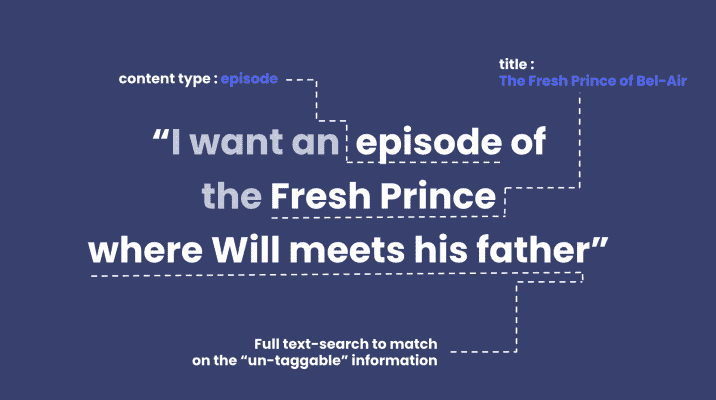
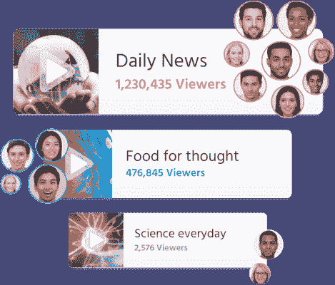

# 将人工智能引入媒体，以取悦观众，优化编辑工作流程，并最大限度地提高收入- Algolia 博客

> 原文：<https://www.algolia.com/blog/ai/maximizing-revenue-for-publishers-and-media-companies-with-algolia-ai/>

你的团队努力制作、策划和润色数以千计的优质内容，但其中大多数在上线一两周之后就被埋没了。与此同时，你的读者努力寻找与他们独特的需求和兴趣相关的最权威、最有智慧或最有趣的内容。

阿尔戈莉娅前来救援。

我们的使命是在几毫秒内将媒体消费者与最相关的内容联系起来，这一使命现在被最新的人工智能所强化。随着我们 2010 年秋季的人工智能发布，我们为出版商提供了最完整的人工智能搜索和发现方法。

# 更了解你的用户需求

在处理成千上万的内容时，将访问者与正确的内容联系起来是一个真正的挑战。人类以“混乱”的方式进行搜索，使用不同的同义词来描述同一件事(“浪漫喜剧”的“romcom”)，我们会打错字(“烹饪”的“cooking”)，有时会问问题，而不是输入清晰的搜索术语。此外，我们说不同的语言，有其自身的特点，例如很长的单词或不带空格的单词。所有这些使得人工预测用户可能搜索术语或概念的每一种新方式几乎是不可能的。

## Algolia 理解:得益于对自然语言最优秀的理解  

有了 [**阿洛理解**](https://www.algolia.com/industries-and-solutions/voice-search/) (现在处于封闭测试版)，你就能处理最复杂的用户查询。  

用户表达意图有两种方式:  

1.  明确地，通过软件容易理解和标记的词语，例如当他们在寻找“新鲜的贝莱尔王子第二季第四集”时，以及
2.  含蓄地，通过自然语言，就像他们在寻找“威尔遇见他父亲的那一集”时一样

有了 Algolia Understand，你可以识别用户提出的两种类型的问题，并向他们展示正确的内容，包括那些隐藏的宝石。

对你来说，这意味着从现有内容中获得更多，并为最复杂的请求带回最好的内容。

*[阿果明白](https://www.algolia.com/industries-and-solutions/voice-search/)出道于封闭测试版。点击链接加入等候名单！*

## 动态同义词建议:让用户用自己的话说出来

同义词是提高搜索结果相关性和避免给用户“没有结果”的一种强有力的方式，这种方式会使用户认为你没有他们查询的相关内容(并导致他们反弹)。但是手动管理同义词也很麻烦:一个一个地定义它，并考虑所有各种可能的场景。

Algolia AI 让同义词管理变得简单。

我们新的动态同义词建议会自动检测和建议您的受众用来查找内容的新同义词，甚至是那些您不会怀疑的同义词！

【桉树】<>【桉树】
【数据】< >【图表】
【双向胶带】< >【双面胶带】

> 
> 
> **ABC 是澳洲最大的新闻平台***，我们的受众非常多元化。在我们的* ***1M+的文章中，很难持续地将我们的访客与正确的内容联系起来。*** *阿尔戈利亚动态同义词建议帮助我们* ***让我们的观众获得正确的内容*** *通过自动建议特定事件或特定部分观众的相关同义词，没有摩擦。自从使用了它，* ***我们看到我们的搜索在 www.abc.net.au"*** 上有了很大的提高**
> 
>  **彼得·布芬顿，产品经理**

 ***[动态同义词建议](https://www.algolia.com/products/ai-search/dynamic-synonym-suggestions/) 现已面向我们标准版和高级版计划的 Algolia 客户推出公测版！*

# 语境决定一切:提供相关的、个性化的体验

许多事情会影响用户找到最相关的东西:季节性、趋势、个人偏好。想想那些寻找蒂姆·伯顿电影的人。临近圣诞节最相关的结果可能是 *圣诞节前的噩梦、* ，而 2019 年初最相关的结果可能是刚刚发布的*Dumbo*。一个用户可能更喜欢哥特式恐怖电影(提供给他们 *【断头谷】* )，而另一个用户可能喜欢音乐喜剧(更好的结果是 *《查理和巧克力工厂》)。*

我们新的人工智能功能使您能够根据用户行为定制推荐内容，从而创建更加个性化的浏览和导航体验。

## 动态重新排名:提升每个用户查询的最高执行结果

Algolia Dynamic Re-ranking 利用人工智能来分析用户对您的数字资产的行为，然后为每个搜索词提供最佳搜索结果。    Algolia 已经提供了一整套工具来管理相关性，同时考虑到个人访客输入和您自己的业务规则。

有了 Algolia AI，我们现在可以利用集体智慧。动态重新排序使用人工智能来分析每个查询，并在搜索结果中提升与该查询相关的最佳表现项目。这对于相关性边缘情况尤其有益，因为相关性是相对于最终用户 。

我们在您现有的规则基础上，根据您的用户发送的大量信号，应用了一个新的排名。通过为每个访问者提供前所未有的内容相关性，我们的动态重新排名将使您的观众再次光临。

*[动态重新排名](https://www.algolia.com/products/ai-search/dynamic-reranking/) 现已面向我们标准计划和高级计划的 Algolia 客户公开测试！*

## 个性化:将你的受众最有亲和力的内容呈现出来

你的访问者会接触到来自各种数字来源的大量内容。他们期望内容推荐多样化和个性化，他们在这方面的门槛只会越来越高。    打造个性化体验需要时间和资源。很难决定从哪里开始个性化体验，对哪些数据采取行动，以及将哪些系统连接在一起。依赖一刀切的解决方案是有风险的——每个企业和每个受众都是不同的，所以你需要调整个性化逻辑以适应一对一的体验。

我们的个性化功能利用人工智能为您的每位访客提供量身定制的体验。它负责计算个性化评分并自动重新排列您的内容，但也附带了一个模拟器，向您展示它如何为每个用户和每个查询优化结果。

这使您能够展示您的受众最感兴趣的内容，从最受欢迎的内容片段，到他们很难在其他地方找到的非常小众的内容标题。

[Algolia 个性化](https://www.algolia.com/products/search-and-discovery/personalization/) 已在 Algolia Premium 计划中提供。在这里 阅读更多关于个性化 [的内容。](https://www.algolia.com/doc/guides/personalization/what-is-personalization/)

# [T34<path fill-rule="evenodd" d="M4 9h1v1H4c-1.5 0-3-1.69-3-3.5S2.55 3 4 3h4c1.45 0 3 1.69 3 3.5 0 1.41-.91 2.72-2 3.25V8.59c.58-.45 1-1.27 1-2.09C10 5.22 8.98 4 8 4H4c-.98 0-2 1.22-2 2.5S3 9 4 9zm9-3h-1v1h1c1 0 2 1.22 2 2.5S13.98 12 13 12H9c-.98 0-2-1.22-2-2.5 0-.83.42-1.64 1-2.09V6.25c-1.09.53-2 1.84-2 3.25C6 11.31 7.55 13 9 13h4c1.45 0 3-1.69 3-3.5S14.5 6 13 6z"></path>](#)

# 授权您的编辑团队并改进内容管理

为您的编辑团队提供合适的工具来搜索、检索和管理内容至关重要。有成千上万的文章要挖掘，通常很难从他们那里知道什么是已经产生的，什么是交叉引用或重用的。

Algolia AI 让您的编辑轻松搜索相关内容，并在几毫秒内最大限度地提高您的目录曝光率，从而为他们提供与您的受众相同的优质体验。

## 阿果答

在封闭测试版中发布，**[Algolia Answers](https://www.algolia.com/)**为文本搜索带来了现实世界的语义理解，搜索者可以用自然语言或关键字进行搜索，并在回答他们问题的文本深处找到答案。

Algolia Answers 使用真实世界的语义理解来超越文本相关性。例如，Algolia Answers 知道三星 Galaxy 是一部“大型手机”，或者《星球大战》是一部 70 年代的科幻电影。

如果你的编辑要搜索: *“星系 S10 的存储量是多少？”* Algolia Answers 很聪明，知道“存储”在这里指的是 GB——并在你的索引中找到了讨论 Galaxy S10 如何有 256 GB 和 512 GB 两种版本的文章。

Algolia Answers 结合了你对 Algolia 的已知知识，如文本相关性、规则和可定制的排名公式，以及顶级的机器学习技术，包括 OpenAI 的技术。Algolia Answers 是一个理想的搜索体验，适合那些拥有包含重要信息的长期内容的人。

*[阿洛利亚答案](https://www.algolia.com/) 封闭内测出道。点击链接加入等候名单！*

# 

# 带来你自己的人工智能以获得更多的结果。
或者:这对你的业务意味着什么？

借助这套人工智能支持的功能，您的访客和编辑甚至可以通过您的应用、网站或内部工具中无缝、自然的交互，获得最相关的内容。使用率和订阅量将会增加，同时减少跳出率和无结果率。

但是我们知道每个媒体业务都是独一无二的，我们希望考虑到您自己的编辑策略和商业逻辑。这就是为什么 Algolia AI 是一个开放平台，使组织能够将自己的 AI 带入 Algolia。通过将您的人工智能模型的输出发送到我们的平台，Algolia 允许您将多年来使您的业务独一无二的东西与我们久经考验的搜索和发现产品结合起来。

NBC、FranceTV、The Times、Ouest France 和政治等客户使用 Algolia。[阅读他们所说的](https://resources.algolia.com/customer-stories)和[今天和我们谈谈加入俱乐部的事情](https://www.algolia.com/demorequest/)。**