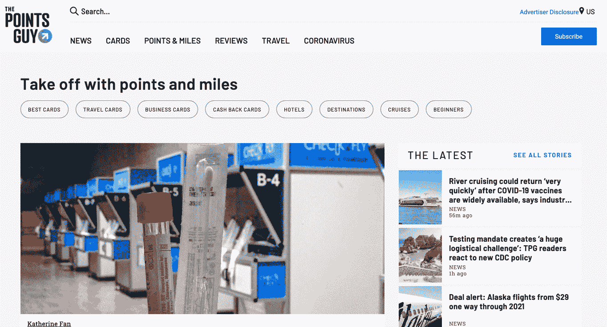
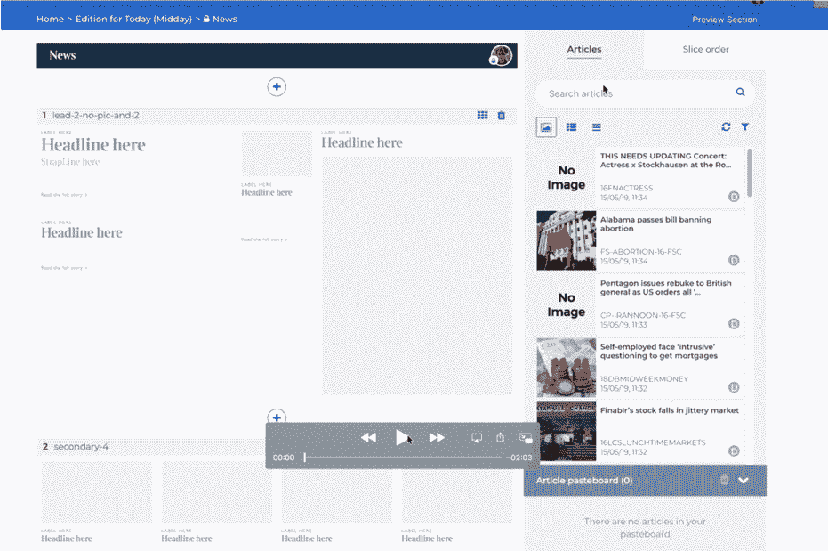
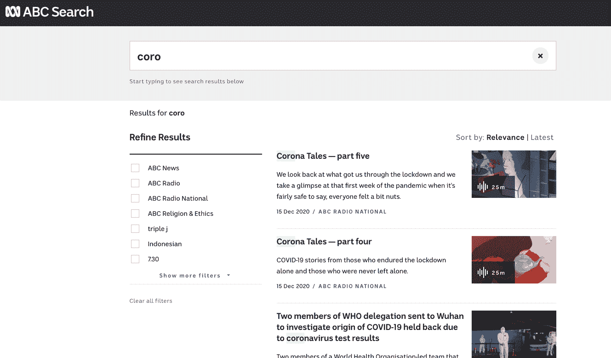
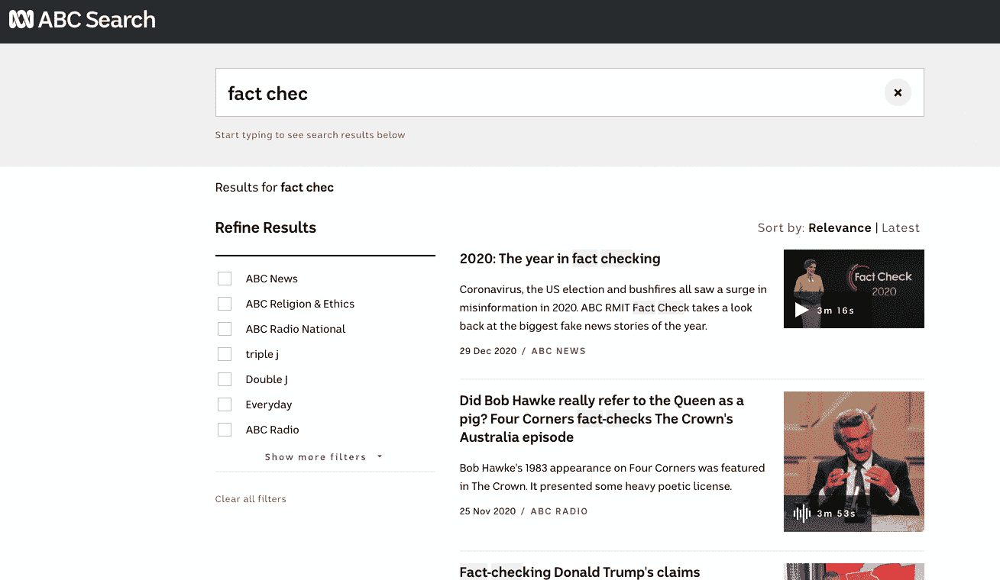
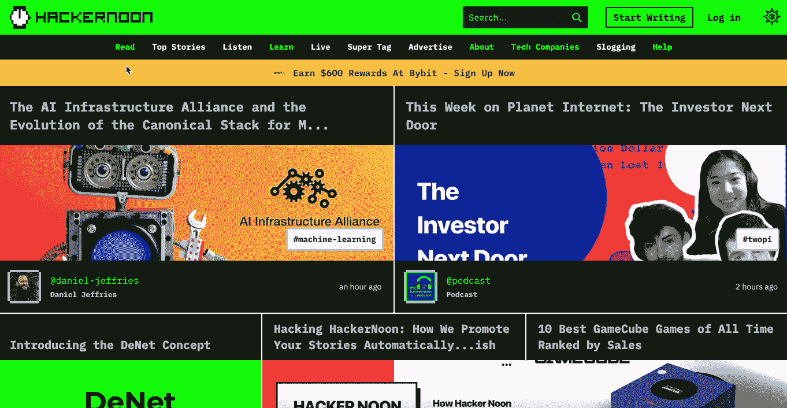
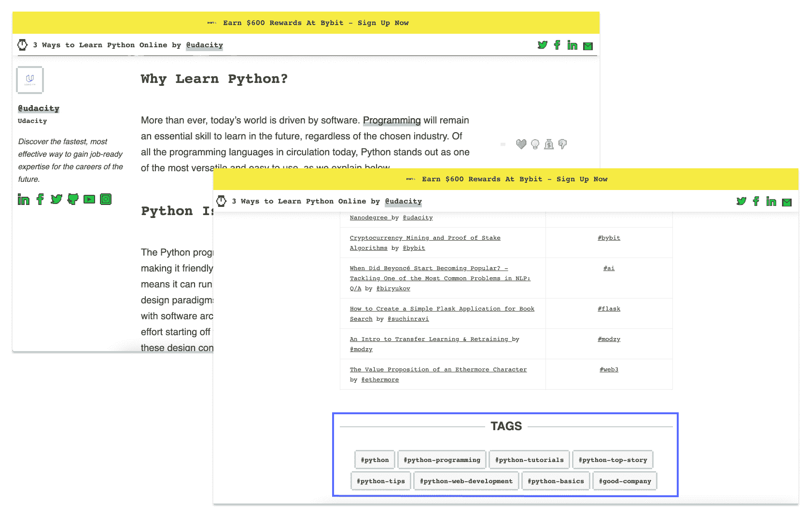
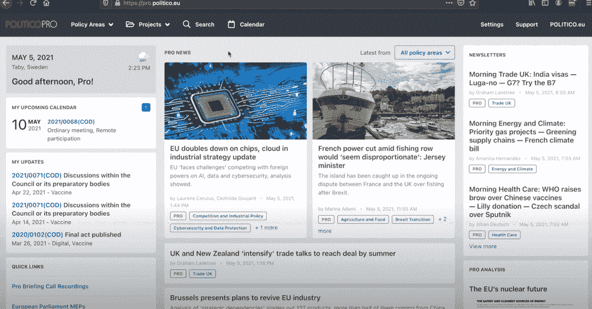
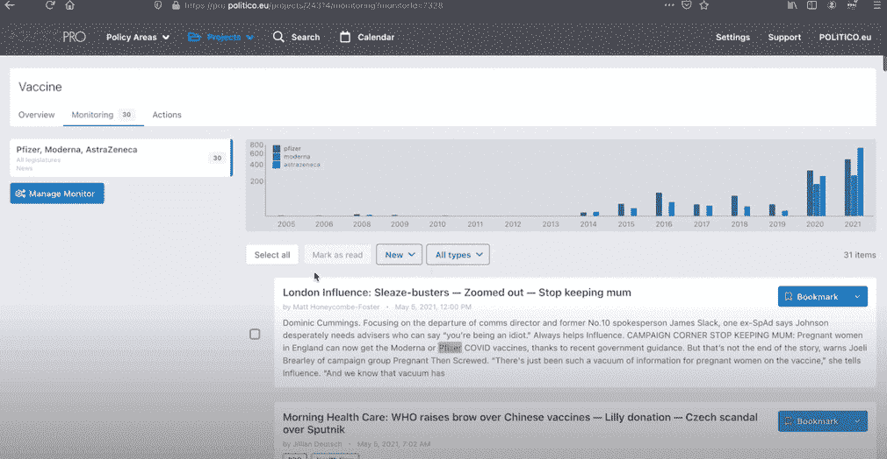

# 出版商指南:如何将你的故事呈现在正确的读者面前

> 原文：<https://www.algolia.com/blog/product/media-guide-for-publishers-how-to-get-your-story-in-front-of-the-right-audience/>

在线出版商在一个快速且持续增长的行业中运营。为了“赢得”读者，出版商必须在正确的时间向正确的人提供相关信息。

在这个快节奏的行业中，用户对他们找到的内容的相关性以及内容出现的速度的信心是至关重要的。读者的注意力是有限的，因此在线阅读体验应该完善和优化到最微小的细节。

## 你需要什么来建立一个成功的媒体发现？

每一篇推送到索引中的新文章(即发布的文章)都应该立即可供读者使用，并出现在查询或给定类别的正确上下文中

*   **通过多标签和多类别导航构建简单的用户旅程**

对媒体公司来说，最大化内容曝光率在两个方面至关重要:将自己与竞争对手区分开来，以及吸引观众。不幸的是，这种方法会同时向读者展示太多的内容，很快让他们不知所措。最佳解决方案是通过利用“联合”内容原则实现的，如下所述，这有助于同时满足这两种需求。

*   **基于人和基于人工智能的相关性混合**

与任何其他行业相比，媒体更需要复杂的相关性模型来考虑各种类型的内容(长期或短期；文章或视频)。媒体公司需要定义通用或特定的规则，以便在正确的时间呈现正确的内容。虽然人工智能功能可以自动进行相关性优化，但它是完全透明的，并允许人类控制结果。这种自动/手动平衡对于满足独特的新闻要求至关重要。

*   **内部工作流程优化**

如果没有高效和有才华的内容团队，就不可能获得与观众最相关的内容。使用快速、现代化的 CMS 优化编辑工作流程，使记者能够更快、更高效地进行内容监管和交叉引用。

下面是一些成功实施这些媒体发现策略的公司的例子。

## 多类别即时搜索页面**:中**

对于许多商业行业来说，多类别即时搜索体验已经变得越来越流行。对于出版商来说，多索引搜索——通常称为， *联合搜索*——在内容发现中发挥着重要作用，允许用户在单个统一界面中从各种来源发现相关结果。

发布站点媒体的用户界面使搜索变得简单。通过一次搜索，读者不仅会看到相关的搜索结果，还会看到有趣的备选方案，如建议的故事、标签(关键词)和人(作家、组织、出版物)。

https://www . algolia . com/doc/guides/building-search-ui/ui-and-UX-patterns/multi-index-search/js/

## 自动完成——对空查询的联邦建议:分家伙

出版商网站的一个共同目标是帮助用户浏览网站，方便快捷地找到相关信息。除了提供自动完成功能之外，发布者可以在用户在搜索栏中键入时显示查询建议，从而甚至在用户开始键入之前就引导用户通过来自多个来源和索引的建议内容。

要在空查询上配置联合建议，您可以创建一个规则，每当有空查询上下文时，该规则将提升或隐藏特定类别，提升或隐藏项目。一旦用户开始键入，该规则被禁用，以向用户提供完整的搜索体验。

对于专注于旅游的网站 The Points Guy，除了等待用户查询的搜索框之外，还会提供相关的有用内容，包括度假目的地的最新消息、酒店评论和热门旅游交易。

 

## 社论内容内部搜索:时报

传统上，在出版业工作需要员工花费大量的工作日时间在内部企业搜索上，试图找到现有的文章。这通常是一个缓慢而耗时的过程，效率低，结果不匹配。对于现代出版商网站来说，内部企业搜索与面向客户的外部搜索一样重要。

编辑和记者需要配备快速高效的平台，以便每天构建、编辑和发布他们的故事。正确选择高性能工具将极大地提高生产效率。

上面的例子展示了最佳的内部工具，有效地满足了不断增长的数字出版业的需求。在英国历史最悠久的全国性日报《泰晤士报》&星期日泰晤士报的内部网站上，员工可以在搜索框中输入关键词，根据主题找到新闻文章，然后将内容拖放到报纸风格的布局中。

成功指标:

*   ~每周为生产团队节省 4 小时时间
*   搜索速度提高 300-500 倍，工作效率提高

[**阅读更多关于时代提升生产力的旅程**](https://resources.algolia.com/media/the-times)

## 搜索中的促销横幅:ABC

在澳大利亚广播公司(ABC)网站上，当访问者在搜索框中输入关于感兴趣的主题如“事实核查”或“冠状病毒”的查询时，一个可点击的横幅广告会出现在框下方，宣传事实核查新闻内容。这种类型的功能由相关性规则触发，是应用于数据索引的全局相关性策略的一部分。

您可以为您的网站实现不同类型的横幅:

### 关键词触发的横幅

*   根据用户输入的内容，在搜索结果周围或内部显示促销横幅
*   实施步骤:
    *   建立横幅索引
    *   建立一个索引来保存不同横幅的详细信息以及它们应该为显示的关键字

### 分类广告条

*   某些横幅只应在过滤某些类别或品牌时显示，匹配或不匹配某些关键字。
*   实施步骤:
    *   以关键字触发的横幅广告方式开始
    *   将横幅广告适用的类别添加到您的记录中
    *   将 *类别* 添加到条幅索引的刻面属性中
    *   向您的横幅索引发送查询时，使用 *过滤器* 对当前类别进行分面，以便只返回对其有效的横幅。

### 地理位置横幅

*   根据用户的地理位置显示不同的横幅
*   实施步骤:
    *   将地理位置数据添加到您的横幅记录中，将它们绑定到相关的特定位置
    *   如有必要，您可以使用地理定位点阵列添加多个位置
    *   当您发送查询以查找可能的横幅时，请确保在请求中包含您当前用户的位置

### 个性化横幅

*   某些横幅广告必须只向特定用户或部分用户显示
*   实施步骤:
    *   将相关用户 id 或细分市场 id 添加到您的横幅广告记录中
    *   如果横幅对所有用户都有效，则将该属性的值设置为“*all*”
    *   将 *段* 或 *用户* (取决于您的使用案例)添加到您的横幅索引的刻面属性中
    *   在发送到横幅索引的查询中包含一个过滤器，以确保您只找到正确的横幅

[T31](https://www.algolia.com/doc/guides/managing-results/rules/merchandising-and-promoting/how-to/add-banners/)

[T34](https://www.algolia.com/search-inspiration-library/promotion-banners-search-publishers-desktop)

## 全文随搜式体验:ABC

澳大利亚广播公司(ABC)网站拥有强大的搜索体验，确保内容的可发现性和相关性。ABC 网站的搜索功能包括“随键入内容进行全文搜索”功能，用户不仅可以通过文章的主标题搜索文章和新闻，还可以通过每篇文章的正文搜索，为用户突出显示所有相关内容。

## 带标签过滤器的动态登陆页面:Hackernoon

Hackernoon 网站使用基于标签的过滤器，在专门的登录页面上向用户显示他们感兴趣的类别中最相关的结果。通过实施过滤和导航策略，Hackernoon 保证了网站上发布的每一篇文章都能被标签过滤。Algolia 通过允许出版商标记他们的文章来过滤结果，确保他们获得的内容结果是基于他们的读者最可能想看的内容。

## 保存搜索:政治

### 内容通知服务

保存搜索功能允许媒体公司在网站上出现新的匹配内容时自动通知用户。保存的搜索非常适合自动化重复的搜索查询，并与不断变化的内容保持同步，这在新闻和其他出版商的使用案例中尤其常见。

在政治的网站上，用户可以切换开关来保存搜索，并在与查询匹配的内容发布时得到新闻网站的通知。可以同时保存多个搜索。

https://www . algolia . com/doc/guides/solutions/sample-apps/# search-alerts-with-algolia-firebase-twilio-and-send grid

### 推送通知&监控仪表盘

除了发送通知之外，出版商的网站还可以为用户提供额外的便捷方式来发现与他们感兴趣的主题相关的新内容。在这个例子中，出版商使用 Algolia 来触发推送通知，并在政治的网站上提供一个监控仪表板。

## NLU 搜索:政治

随着谷歌等搜索引擎的技术进步，用户现在习惯于使用他们的自然语言提问，而不是在搜索栏中键入人工搜索查询。NLP 从用户的问题中提取用户的意图(语义理解),并提供最佳匹配的答案，而不需要对模型进行额外的训练。在这里，在政治的网站上，用户可以看到他们问题的相关答案。这种类型的功能使用户能够轻松找到与他们的问题最相关的答案。此外，呈现给他们的结果会随着他们输入的每一次击键而动态更新。

成功指标:

*   快 8 倍的搜索速度
*   高度相关的结果
*   直观的用户体验
*   不会因为用户没有找到他们想要的东西而失去销售

## 聊天机器人上的对话搜索

对于寻找可靠信息的用户来说，聊天机器人将是比大量浏览更直观的选择。聊天机器人会立即回答用户的问题。这种功能可以通过使用 Google Cloud Dialogflow Messenger 来实现聊天机器人，并利用自然语言处理从您的内容中返回最佳匹配的答案来实现。

## 结论

最好的出版商网站提供快速搜索、高度相关的结果和直观的用户体验。公司不希望由于用户没有找到他们想要的东西而失去销售。这就是为什么他们使用多种工具来改善他们网站上的用户旅程和内容可发现性，例如对每个用户搜索的查询建议，与用户查询相关的推广横幅，以及首先显示最相关和推广的内容。此外，他们使用更加个性化的方法，通过整合保存的搜索提醒和推送通知以及监控仪表板，为用户提供他们最感兴趣的主题。最后，他们使用对话式搜索来提供更加互动和直观的搜索体验，通过利用自然语言处理来提供准确和相关的答案。