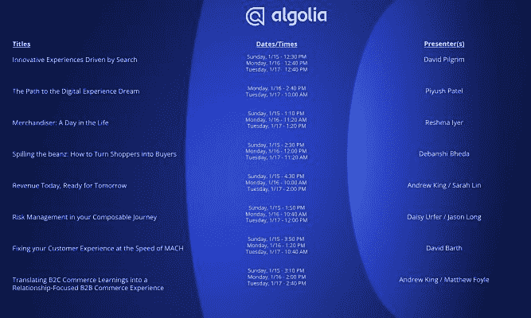

# 通过 Algolia 让你的搜索更有价值——我们将在 NRF - Algolia 博客\n 向你展示

> 原文：<https://www.algolia.com/blog/algolia/meet-algolia-at-nrf-2023/>

当资金紧张时，投资客户之旅必须是你的首要任务。购物者没有任何时间可以浪费。你需要给他们一个惊人的快速，直观，无缝的数字体验。

搜索和发现是你的客户在你网站上花费的每一微秒的支柱。它必须是您的堆栈中最强大的工具。现在，每个人都需要做更多的预算。选择正确的搜索平台让您的投资发挥作用，并在创纪录的时间内获得投资回报。

当消费者支出下降时，拥有正确工具包的企业会取得成功。他们知道如何接触顾客并获得他们应得的份额。

## 从行业巨头那里获得内幕消息

Algolia 专家随时准备提供帮助。 **[在 1 月 15 日至 17 日于纽约市贾维茨中心举行的零售大展上，我们的团队将在 4046 号展位展示产品](https://www.algolia.com/lp/event-nrf-2023/)。**

我们每周为全球 1.7 万名客户处理 300 亿次请求。我们很高兴向您展示什么是可能的。来看看我们，揭开市场上最强大的搜索和发现工具的面纱。

## **挖掘潜力，寻找混合零售**

有这么多事情要考虑，有这么多风险，零售商们并不总是能看到搜索带来的不同。你需要知道如何利用搜索来为你和你的客户服务。这意味着在混合零售体验的每一个接触点都有卓越的搜索和产品导航。

没有哪两个在线零售商是一样的。你需要量身定制的解决方案。对某个特定用例有疑问吗？我们有最先进的答案和内部技术提示:

*   了解人工智能产品推荐等独家功能如何推动转化率飙升
*   了解 Algolia 如何通过文本和基于向量的语义搜索改变游戏规则
*   了解将 Algolia 与您现有的电子商务平台集成有多容易
*   了解如何利用我们久经考验、行业领先的搜索和发现解决方案提升购物体验

## **演示系列来自业界首个混合搜索引擎**

为了应对共同的挑战并展示顶级搜索的潜力，我们将在 4046 号展位举办一系列展示活动。查看 [日程](https://res.cloudinary.com/hilnmyskv/image/upload/v1671048870/Algolia_NRF_Presentation_Schedule_v2_xbew8q.jpg) 并标记你的日历。

从我们的专家那里听到关于这些以及更多热门搜索和商品主题的第一手信息:

*   搜索的价值与搜索创新
*   跟单员的一天
*   优化马赫速度下的 CX
*   将 Algolia 与 Adobe、SFCC、Shopify、commercetools 和 BigCommerce 整合

## **让 2023 年成为你提升搜索的年份**

我们迫不及待地想在 NRF 一起开启 2023 年。我们希望听到您的挑战和机遇，并使用 Algolia 的发电站搜索找到共同解决它们的方法。

参观我们的展位并与我们的团队交流，了解选择合适的搜索平台为何如此重要，以及我们的搜索和发现平台如何帮助您的客户惊艳全场并销售更多产品。

更好的办法是，在节目开始前与我们的团队进行一对一的预约，然后来纽约见我们:

**[预定会议](https://www.algolia.com/lp/event-nrf-2023/)**

我们在纽约见！