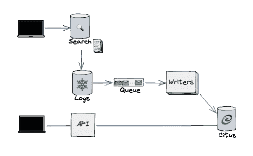
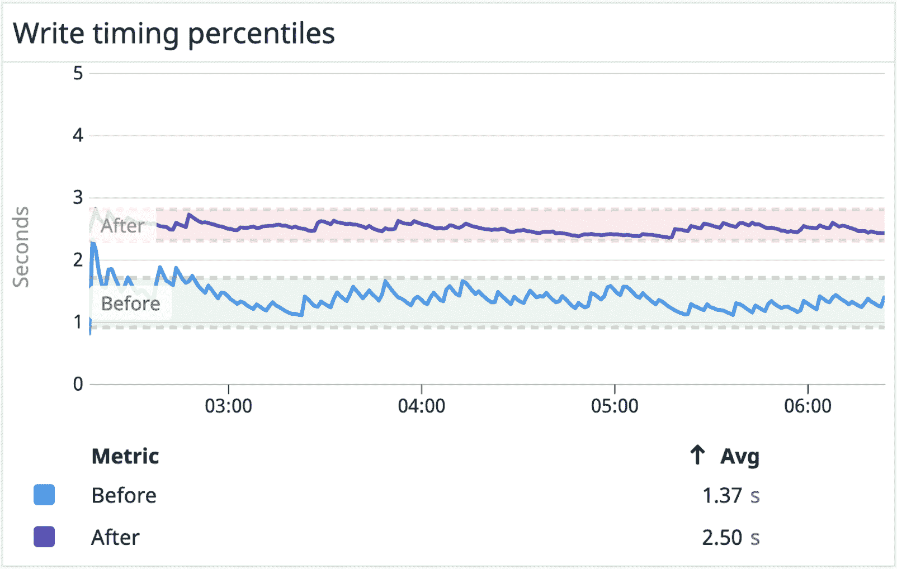
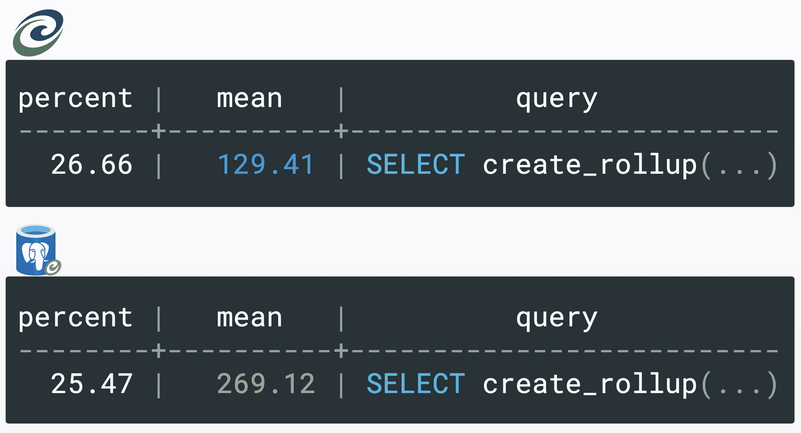
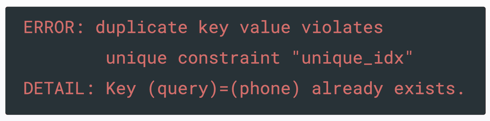
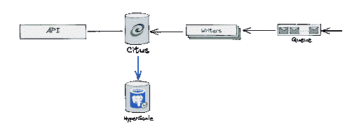
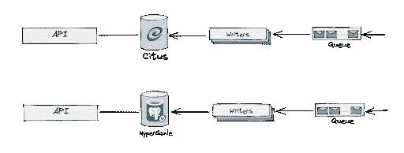
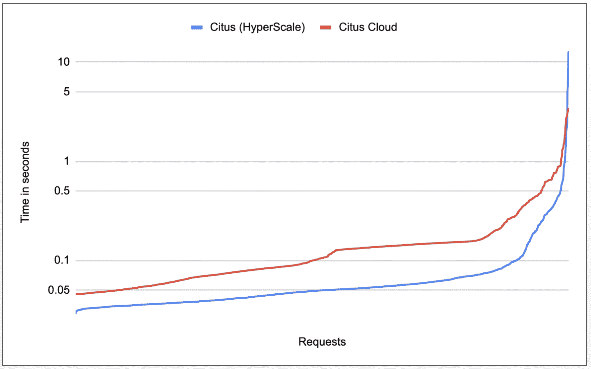
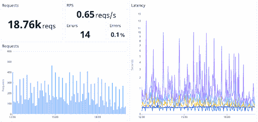
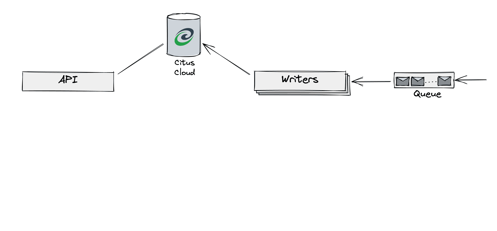

# 将 AWS 上的 Citus 迁移到 Azure 上的 Citus 的剧本和测试策略

> 原文：<https://www.algolia.com/blog/engineering/migrating-citus-on-aws-to-citus-on-azure-our-playbook-and-testing-strategies/>

是时候将我们大量的分析数据迁移到另一台服务器上了。当我们得知微软收购 Citus Data 时，我们已经在亚马逊 AWS 的 Citus Cloud 上处理了五年的分析数据。我们还了解到，Citus 初创公司的联合创始人和团队开始在微软 Azure 上提供类似的服务，名为 HyperScale (Citus)。在[他们的帮助下](https://www.citusdata.com/customers/algolia)，我们决定将 Citus 云数据库迁移到 Azure 上的 Citus。

此时迁移的一大优势是 Citus 团队拥有两个系统的所有权，因此他们能够为我们执行部分迁移过程。

### [](#the-data-pipeline-and-postgresql)数据、管道和 PostgreSQL

我们的实时 [分析数据](https://www.algolia.com/doc/guides/getting-analytics/search-analytics/out-of-the-box-analytics/) 存在于两个不同的地区:一个在美国，一个在欧洲。为了让您对迁移有一些了解，这两个集群代表了分布在 20 台机器上的大约 5TB 的数据。

[Citus 数据](https://www.citusdata.com/) 将[PostgreSQL](https://www.postgresql.org/)转换成分布式数据库。这是我们的分析渠道:



1.  在左上角，用户进行搜索，生成日志
2.  日志被聚集并发送到远程存储器
3.  每当存储器接收到新的日志文件时，队列中就会添加一条消息
4.  我们的写作人员阅读这些信息并计算储存在 Citus 数据库中的总量

左下角显示了通过我们的分析 API 面向客户访问分析数据。API 查询我们的 Citus 数据库，在数据库中已经存储的聚合之上执行额外的聚合。

那么，我们如何在不停机的情况下迁移这些数据呢？

## [](#upfront-constraints-no-disruption-of-services-100-transparency)前期约束:不中断服务，100%透明

我们从定义指导方针和约束开始:

*   **迁移期间停机时间最短。** 我们的分析数据全天候全球可用。它是我们产品基础和机器学习系统的核心。借助分析，我们的客户可以扩展并持续改进和配置他们的解决方案。
*   **对用户透明。** 我们不能打扰用法。透明不仅意味着没有停机时间，还意味着不引入任何性能或服务差异或倒退。
*   **没有重构。我们希望专注于基础设施和数据，而不是在现有的代码库中添加任何新功能或不稳定性。**
*   价格没有变化。在任何情况下，我们都不想增加客户的基础设施成本。

## [](#plan-and-design-before-doing-writing-a-playbook)做之前的计划和设计:写剧本

由于这些无服务中断/透明的限制，我们决定在项目开始前写下我们将采取的每一项行动。我们从经验中知道，迁移实时、分布式大数据系统不仅仅是将数据移动到不同的机器上并更改连接字符串。

### [](#the-playbook)战术手册

*   **对比分析:**
    *   确保新旧系统之间没有重大差异

*   **初步考虑:**

*   *   与供应商和内部团队协调行动(例如，与微软和我们的基础设施团队同步，列出他们将采取的行动)
    *   在流程的多个阶段建立验证步骤，以确保没有隐性故障未被发现
    *   计划一个恢复过程，在任何时候都可以使用它来恢复和回滚到我们之前的实例，以防出现任何问题

*   *   将旧的复制到新的
    *   测试迁移过程的每一块
    *   进行模拟测试
    *   生产中的测试
    *   首次展示/上线
    *   监视器

对于行动手册中的每一项，我们都写下了完成每项任务所需的行动、工具和人员。

有一点要注意。虽然剧本应该建立信心，但它不应该制造一种虚假的安全感。每个剧本都会包含隐藏的偏见，有时甚至是错误的假设。在我们的案例中，剧本包含了一个重要的偏见，我们将在下面讨论。幸运的是，我们在预测试阶段就发现了偏差。

我们将讨论行动手册的两个部分:比较分析和迁移步骤。

## [](#comparing-the-old-with-the-new)新旧对比

为了确保完美的切换，我们检查了每个物理层和软件层。我们希望确保目标源不会在当前工作流中引入任何不同的或新的元素。

根据我们的约束，我们查看了以下内容:

*   硬件:CPU、RAM 和磁盘性能
    *   好消息:Azure 有类似的机器，这方面一切看起来都很好
*   软件
    *   好消息:相同的 Citus & PostgreSQL 版本，所以我们可以迁移而不必升级到任何主要版本
    *   好消息:微软将在迁移过程中管理版本
*   基础设施
    *   好消息:相同的 SLA
    *   好消息:我们的服务器可以在相同的地区使用
    *   好消息:相同的安全性&保密特性

我们注意到的一个差异与文件系统有关。对于 AWS，我们依赖 ZFS 文件系统的压缩功能。但是，Azure 不支持 ZFS 文件系统。我们检查了这是否会成为迁移的问题。如果没有这样的压缩，我们必须记住，我们在超大规模上需要更多的磁盘空间，在我们的情况下，需要多 2 到 3 倍。

得益于这一对比分析，我们确信新系统与旧系统不会有任何重大差异。

所以，有了这些前期的设计和分析，我们就可以开始了。

最好把这篇文章的其余部分分成两部分:

*   测试策略
*   复制和替换

## [](#testing-strategy-test-every-link-in-the-chain)测试策略:测试链条中的每一个环节

测试的核心是将一个过程分解成最离散的部分。在我们的例子中，主要是读/写故障。我们想单独测试每一个过程。

### [](#performance-problems-with-our-write-operations)性能问题用我们的*写*操作

读取操作没有引起任何问题——正如您稍后将看到的，没有任何回归。另一方面，我们立即注意到超大规模(Citus)中的一个倒退:它慢了两倍，占用了两倍的资源。



这里我们发现了一个重要的偏差。我们已经进入测试阶段，主要关注读取回归，因为我们的产品以速度著称。但是 read 部分开箱即可完美运行。延迟发生在写入端，这也影响了终端用户的体验，包括性能和服务。

因此，我们必须在这里调整行动手册。我们需要添加额外的步骤和工具来关注写作过程。在这一点上，我们有工具来检查阅读的问题。现在，我们必须添加以下工具来检查写:

*   审计“pg_stat_statements”系统视图，以跟踪正在数据库上执行的查询的性能。
*   SQL 查询计划，运行“解释分析”命令来比较新旧性能

使用 PostGreSQL 的“pg_stat_statements ”,我们能够确定我们的存储过程“create_rollup”在 HyperScale 上比在 Citus 上慢。事实上，它的平均执行时间比 Citus 慢两倍。但是为什么呢？



我们必须使用查询计划更深入地挖掘。在那里，我们发现 HyperScale 触发了*JIT*，而 Citus 没有。

对于不知道的人来说， *JIT* 代表“及时编译”。简而言之，它的作用是在运行时优化特定的查询。在我们的例子中，JIT 不断地被执行——甚至在查询被优化的时候！这大大降低了这个特定查询的执行速度。


查询计划还给出了不必要的触发器的原因:我们意识到 JIT 没有考虑我们已经设置的配置选项。 更具体地说，我们禁用了 [嵌套循环](https://postgresqlco.nf/doc/en/param/enable_nestloop/) 。

```
   ALTER ROLE citus SET enable_nestloop = off;
   SELECT run_command_on_workers('ALTER ROLE citus SET enable_nestloop = off')

```

实际上，嵌套循环对我们的插入查询的 Citus 设置产生了反效果的性能影响。 然而，如文档中所述，嵌套循环永远不能被完全禁用。当查看查询计划时，我们看到 JIT 确实使用了一些。

我们的解决方案是完全禁用 JIT:

```
   ALTER ROLE citus SET jit = off;
   SELECT run_command_on_workers('ALTER ROLE citus SET jit = off');

```

然后，我们确认它解决了我们的问题:在超大规模实例上禁用 JIT 后，两个系统以相同的性能运行，并消耗了相同数量的资源。

### [](#an-update-failure%c2%a0)一次更新失败

然而……缓慢的查询并不是我们唯一的问题。我们在日志中收到了这个令人惊讶的错误消息:



由于我们的系统被设计为只有唯一的密钥，所以“重复密钥”的错误让我们非常惊讶。我们意识到，不知何故，我们的索引已经损坏，但像以前一样，我们不知道为什么，所以我们必须深入研究。

这一次，我们通过在网上搜索遇到类似问题的人找到了答案。原来是操作系统的` [libc](https://en.wikipedia.org/wiki/C_standard_library) `造成了那个错误。

按照 ISO C 标准的规定，C 标准库或 libc 是 C 编程语言的标准库。几乎所有程序都使用这个库，包括 PostgreSQL。Postgres 依赖 libc 来计算索引使用的 UTF-8 排序规则。但不幸的是，Azure 上的“libc”版本不同，导致了这种错误行为。

从这篇 [博文中我们得知](https://postgresql.verite.pro/blog/2018/08/27/glibc-upgrade.html) : *当心 libc！* 由于“libc”不同，相同的 Citus 和 PostgreSQL 版本并不意味着相同的行为。

我们精心制作了一个恢复程序，以防在迁移过程中发生错误:如果发生错误，对表进行简单的重新索引。一如既往——最好事先知道这种操纵。

关于这个问题的最后一个警告是，后者不是特定于迁移的。例如，如果您的提供商或您的基础设施团队升级了运行 Postgres 的机器上的操作系统或“libc ”,就可能在您的生产数据库上发生这种情况。

## [](#migration-replicating-replacing)迁移:复制&替换

现在我们已经测试了所有的部分，解释一下我们如何从一个已经运行了五年的系统到另一个需要在第一天以完全相同的方式运行的系统是很重要的。

### [](#replicating)复制

涉及的复制:

*   运行拷贝程序，将大数据从一个系统切换到另一个系统
*   测试零件(上面已经讨论过)
*   对整个过程进行模拟测试
*   生产中的测试
*   切换管道

这里的目标是在超大规模数据库上复制 Citus 数据库。

*   在微软 Citus 团队的帮助下，我们从现有的 Citus 云备份中创建了一个超大规模数据库。那时，我们在 Azure 中有了一个完全复制的超大规模数据库。



*   在我们这边，一旦数据库被复制，我们就“只是”将复制的服务连接到这个新实例。



就是这么“简单”。多亏了我们的测试，重定向的管道可以与新的基础架构无缝协作。

### [](#simulating-production)模拟生产

我们已经讨论了如何测试管道的每一部分。对于最后的测试，我们在测试服务器上运行了整个过程，以确保我们在两个系统中有相同的数据和性能。

我们通过模拟相同的条件并运行我们最常用的请求进行了测试。我们记录了当前实例在给定时间段内收到的 1000 个最长的 API 调用。然后，我们在新实例上重放这些内容。正如您在该图中看到的，我们得到的结果非常相似，足以让我们感到进一步测试是安全的:



至于整体用户体验，我们可以看到新旧版本的读取速度相同:

### [](#)

### [](#testing-in-production)生产中测试

为了绝对确定我们准备好了，我们做了一些可怕的事情:我们在生产中测试。虽然一般来说，这是我们尽可能避免的事情，但在这种情况下，它似乎是正确的选择，因为它允许我们测试我们的迁移剧本的一部分。

工作方式很简单:

*   和以前一样，Citus 团队创建了 Citus 云实例的超大规模追随者。与我们的写测试相反，这里我们等待实例完全赶上活动实例。
*   然后，我们将超大规模实例提升为自治实例。在这个阶段，这个新实例上的 Azure 数据不会再发生变化。我们的客户主要是查看过去几天的历史数据。所以功能不会改变。在我们的分析管道上提供少量时间的陈旧数据是我们可以承受的，这就是为什么我们只是将读取流量切换到目标超大规模实例一小时。在此期间，我们观察了我们的监控指标。

你可以在那些图表上看到迁徙的无缝衔接。你能发现转换吗？我们不能。



### [](#going-live)即将上线

下面是我们为迁移执行的步骤，如 GIF 所示:



总的来说，一切都很顺利。唯一严重的问题发生在预测试阶段——这是他们应该做的。整个迁移过程耗时 40 分钟。第二天，我们在我们的美国集群上运行了相同的迁移，进行方式完全相同。

## [](#takeaways)外卖

总的来说，我们了解了创建详尽的迁移行动手册、挑战我们的偏见以及监控错误和性能退化的重要性。

还有其他外卖:

*   如果你的系统不要求实时，可以考虑使用 [最终一致性](https://en.wikipedia.org/wiki/Eventual_consistency) 。能够在迁移过程中对消息进行排队使我们能够在零停机时间的情况下执行迁移。
*   [幂等](https://en.wikipedia.org/wiki/Idempotence) 我们写道，是研究性能问题的一个伟大盟友。我们可以简单地在不同的场景中重放相同的写查询，而不需要重新创建一个模拟生产的测试环境。
*   为意外做好准备。即使我们做了如此多的计划，我们仍然在迁移日遇到了一些小问题。例如，我们在 GitHub 上看到了一些堆叠拉取请求的合并问题。然而，我们知道我们可以在不改变剧本的情况下解决这个问题。

最后一点是团队合作，更具体地说，是两人一组。事实上，这就是为什么这里有两个作者:我们一起执行这个迁移，几乎每一步都互相验证。结对是挑战想法和确保我们不犯任何手动错误的好方法。因此，我们在整个过程中感到自信。如果你将来不得不处理一个复杂的操作项目，我们只能建议你结对！