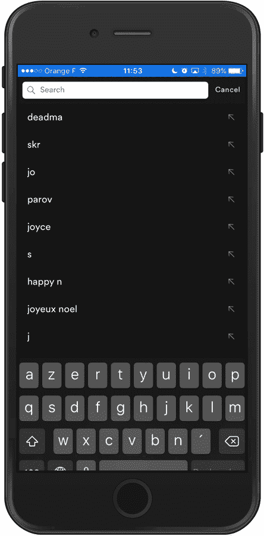
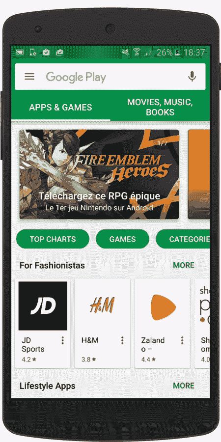
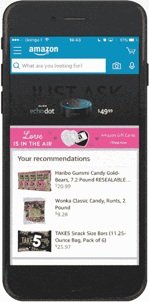
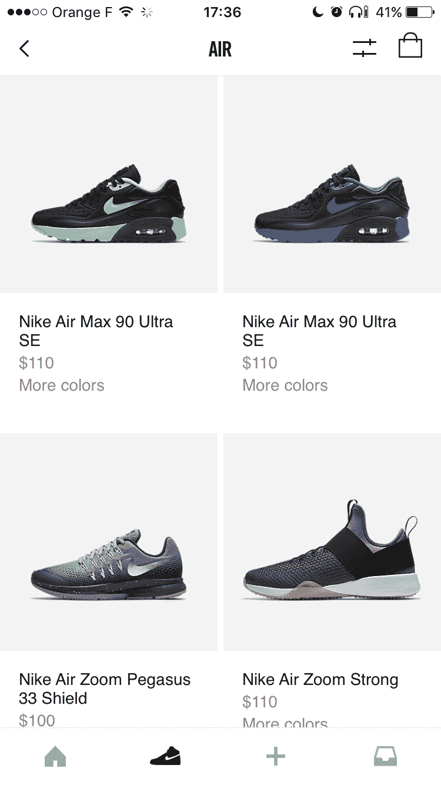
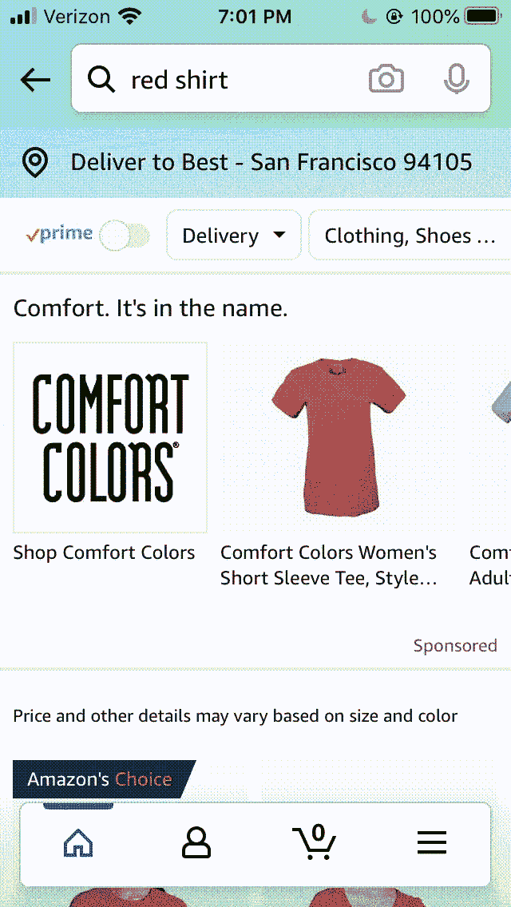
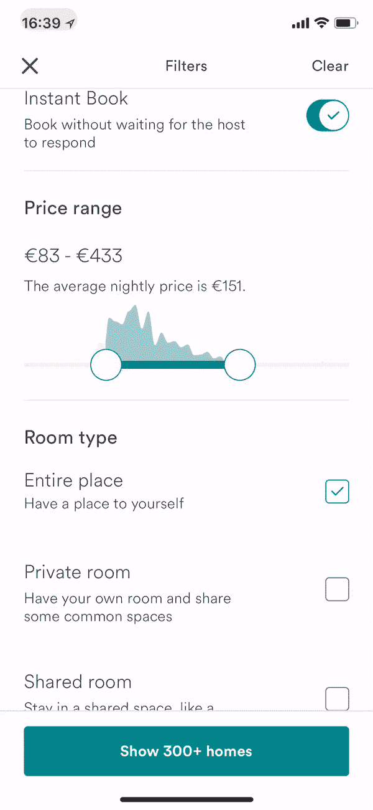
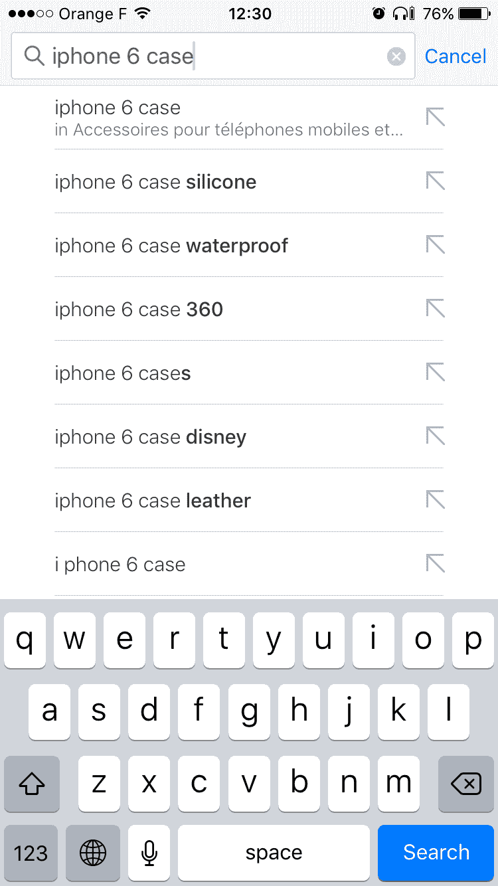

# 应用内移动搜索的最佳实践 UX 设计

> 原文：<https://www.algolia.com/blog/ux/mobile-search-ux-best-practices/>

你刚刚在苹果 iPhone 上发现了一件很酷的东西，当地哪里有零售商在卖呢？根据你的安卓系统上的“附近”应用程序，当地最好的寿司店在哪里？

对大多数人来说，在移动设备上搜索从产品到餐馆到新闻文章的各种东西是一项基本活动:根据统计数据(2021 年)，美国 各州几乎一半的网络流量(全球超过一半)是由使用移动设备的人产生的。除了能够在外出时找到东西，人们还喜欢用手机看电影和视频(通过苹果应用商店的移动应用网飞、腾讯或亚马逊 Prime)，浏览社交媒体，以及收发电子邮件。

鉴于这一永恒的现实，专注于成功的公司必须拥有一流的移动应用。 他们需要提供快速、智能、易用的搜索和发现体验。

说实话……你的手机应用程序使用起来完全是一种乐趣吗？人们能立即找到他们需要的东西吗？ 你设计手机应用的方式可以让人们长期使用并坚持使用它。

## 让移动变得简单(有趣)的设计挑战

移动搜索 UX 的设计和发现提出了一些独特的挑战:

*   手机屏幕比台式机和笔记本电脑屏幕小得多
*   微型虚拟键盘对于人类手指来说很难掌握
*   移动连接可以消长
*   手机通常在不坐下的时候使用–走路、开车、坐地铁、在公园和孩子争吵
*   一个优秀的移动 UX(用户体验)需要最少的交互，但是成功的搜索和发现可能会很复杂

幸运的是，有一些行之有效的方法可以克服这些挑战，从有效定位你的搜索栏到优化显示你的搜索结果。

## 是什么造就了 A 级移动搜索和发现？

移动应用程序设计师的使命可以归结为三个任务:应用可靠的设计概念，确保卓越的可用性，以及适应不稳定的连接。所有这些都必须在考虑 : 的情况下确定

*   数据集的大小和复杂性
*   用户对他们正在寻找的东西的预期知识量
*   在搜索体验中，有多强调意图(寻找特定的东西)与有多强调发现(浏览和听取想法)

如果你想在移动设备上创造出色的用户体验，有多种方法可以实现。以下是一些业内专家关于创造移动搜索和发现体验的秘密，这种体验会震撼你的用户世界，无疑会增加你的转化率，让你的生意更上一层楼。

### 小就空间，大就可用性

在手机上，显示搜索结果和数据的首要原则是“少即是多” 你想要一个小屏幕的易用设计和布局。

人们应该能够在一个小屏幕上快速搜索、找到并购买一件商品，如果他们使用的是电子商务移动应用程序的话。你想提供相关的内容，但不要让人们不知所措，也不要要求他们不断改进搜索。你需要用最少的文字提供正确的信息。用户访问搜索结果的第二页应该很简单。对于不一定需要搜索框的内容发现，或者有助于改进搜索的内容发现，您的选择工具，如切换和滑块，应该是直观的。

### 一个“刚刚好”的搜索栏

当用户自动开始搜索栏时，一些移动应用程序工作得最好，而在其他情况下，内容的开放性，如媒体内容，使浏览成为最有效的方法。

根据总部位于丹麦的网络 UX 研究组织 [贝玛研究所](https://baymard.com/blog/search-field-design) 的研究，搜索栏的大小、位置和对比度有助于确定搜索是“推荐”的查找方法。如果搜索相对重要，比如在电子商务应用程序中(研究表明，通过搜索开始的购物者往往更容易转化)，搜索栏是正确的选择。如果搜索是可选的，你可以通过替换一个可点击的上下文搜索图标来弱化它的重要性。

### 右侧搜索-过渡屏幕

下一个要优化的 UI 元素是搜索转换屏幕 — 用户在搜索结果显示之前看到的内容。设计选项:

*   **最近的搜索:** 当用户搜索一个产品时，他们会看到以前的搜索，以供比较或作为提醒，就像下面的 RetailMeNot 应用程序一样。
*   **趋势:** 向他们展示其他用户通常想要的东西。这可以帮助购物者发现有趣的商品。
*   **类别:** 它们显示类别过滤器。

*   **即时结果:** 每次击键都会动态出现结果(下图)。当数据集较小时，或者用户对自己想要的东西有更明确的想法时，这种设计是最有效的。例如，在 Spotify 应用程序中，搜索仅限于专辑、歌曲等。，所以查询建议看起来大部分都是多余的。用户总是可以通过点击“显示更多”来进入一个类别

*   **查询建议*和*即时结果:**如果你有一个大的数据集，并且想用建议来指导用户，你可以自信地确定[一个好的匹配](https://www.algolia.com/doc/guides/managing-results/optimize-search-results/override-search-engine-defaults/in-depth/adjust-exact-settings/)是否发生了。Google Play 应用商店(下图)在查询建议上方插入即时结果。

### 自动收录自动完成

当用户输入搜索项时，自动完成提示用户搜索查询；当他们想要的短语出现时，他们可以简单地点击它。

在 [*移动设计模式图库*](https://www.oreilly.com/library/view/mobile-design-pattern/9781449368586/ch04.html)(2014)*，* Theresa Neil 列举了集成自动完成在增强移动搜索中的重要性。如果你的自动补全功能还可以直观地区分移动搜索引擎的建议，例如，将建议的术语加粗添加到用户的短语中，那就更好了。

### 一个 Rx 对于移动错别字

谁没有因为看到自己输入了充满错别字的废话却没有任何结果而感到恼火呢？

您可以使用 [错别字容忍度](https://www.algolia.com/doc/guides/managing-results/optimize-search-results/typo-tolerance/) 来猜测用户意图，并在用户输入 查询时实时捕捉文本输入、键入和拼写错误，从而帮助用户保持冷静:

### 随你键入搜索和查询建议

你可以预测用户想要什么，并提供 [随你输入的搜索结果](https://www.algolia.com/products/search-and-discovery/search-autocomplete) ，以及通过提供 [搜索查询建议](https://www.algolia.com/blog/product/introducing-query-suggestions-better-autocomplete/) 来帮助他们更具体地了解他们想要什么。

使用查询建议，可以很好地在大型数据集中向下钻取， 用户在输入时不会立即看到结果；相反，它们显示的是流行的或相关的查询。例如，如果他们输入“iPhone”，(下面)建议包括像“iPhone 充电器”这样的短语

### 结果提炼

如果有必要，使用你的应用程序的人应该能够很容易地微调他们的搜索结果。您可以通过将包含该人输入的查询的搜索字段放在他们生成的搜索结果上方来实现这一点。

### 直观过滤

您可以使用 [分面搜索](https://www.algolia.com/blog/ux/faceted-search-and-navigation/) 来最大化小屏幕空间，让搜索者通过应用过滤器来缩小搜索结果，通常是通过选择“托盘”样式的覆盖图中提供的选项。

分面搜索在电子商务零售商(以及移动电子商务)和旅游服务提供商，以及媒体网站的在线搜索工具中很受欢迎。

### 一贯无错的体验

专业对应用程序的用户友好大有帮助，其中一个方面就是一致性。你不希望用户想知道为什么搜索界面看起来半生不熟；你希望他们喜欢无缝地找到他们需要的东西。

按照这些思路，搜索栏应该出现在应用程序每个页面的同一个位置 。用于扩展地图或滚动搜索结果的触摸手势应该每次都以相同的方式操作。

在发布之前，对你的应用做一些深入的质量保证。

### 最新技术

跳过小屏幕带来的挫败感的一个很酷的新方法是语音搜索。根据 eMarketer 的数据，2019 年，40%的美国互联网用户在他们的移动设备上说出查询 ，所以你的应用程序可能有理由将 [语音作为搜索选项](https://www.algolia.com/industries-and-solutions/voice-search/) 。

### 一种个性化的购物体验

你可以使用从用户那里收集信息的人工智能工具来创建符合用户需求的电子商务搜索。8 个在线零售商中只有 [1 个在做这个](https://resources.algolia.com/top-resources/report-stateofsearch21) ，尽管它能大幅提高转化率。例如，根据购物者已经搜索的内容，你可以向他们推荐相似或互补的商品，或者让他们去当地零售商的实体店，在那里他们可以立即挑选商品。

## 移动搜索结果页面:最佳实践

万岁！您的用户有一些搜索结果要查看。现在你也要确保这里一切都好。

### 做人要快

好的搜索体验必须满足移动用户对速度的期望。我们都被超高速的谷歌搜索宠坏了。如果你像大多数移动用户一样，你不会容忍一个耗时的搜索；你只要离开应用程序。这是一个大问题:根据[Inc .](https://www.inc.com/anna-meyer/google-cloud-retail-search.html)的数据，搜索放弃每年会让电子商务公司损失 3000 亿美元。

如何保证速度？用 [右键工具](https://support.algolia.com/hc/en-us/articles/4406975267089-How-fast-is-Algolia-) 。

### 根据产品类型显示结果

你的用户希望如何查看物品？对于一双鞋或衣服这样的产品，一张照片胜过千言万语。

如果强调规格比照片更有意义，比如餐厅，你可以展示食物种类、价格范围、评分和距离等细节，并附上一张小图片。

### 使用过滤来剪切屏幕上的杂物

在高级搜索中，过滤选项是必不可少的，以避免弄乱屏幕。你可以使用一个滚动的过滤栏，就像亚马逊下面做的那样，它容纳了大量的过滤选项:

一个好的过滤工具也会在用户使用过滤器时做出反应。例如，Airbnb 应用程序的底部有一个按钮，当编辑一个过滤器时，它会通知用户搜索结果的数量:

### 只显示最相关的结果

由于移动设备上的空间有限，只能看到顶部的搜索结果，所以它们最好是相关的。您可以通过同时考虑文本和业务排名规则 [来评估您的](https://www.algolia.com/doc/paths/improve-relevance/#relevance-overview) [相关性](https://www.algolia.com/doc/guides/managing-results/relevance-overview/) 。

### 鼓励扫描

大多数移动中的人都希望能够快速浏览他们的搜索结果。高亮显示有助于人们理解为什么他们会得到特定的结果，是一种允许浏览的有效方式。

标准突出显示适用于查询的精确匹配，在显示即时搜索结果时效果很好:

倒置高亮显示调出 *除了* 之外的一切搜索查询，便于识别建议之间的差异。一个很好的应用场景是查询建议:

### 预见连通性不良

网络覆盖对移动用户来说很少是完美的–这是移动应用程序设计必须考虑的一个事实。移动搜索体验还是要流畅。让用户知道他们的信息会尽快加载的一个方法是提供一个移动搜索 引擎 进度指示器，比如滴答作响的时钟图标或进度条。

另一种方法是使用带有占位符的框架屏幕:

第三个想法是使用延迟加载，它优先处理某些内容，并根据需要一次获取一点剩余内容。

## 未来是移动的

[移动搜索](https://www.algolia.com/industries-and-solutions/mobile-search/)这是一个随着新技术而不断变化的动态领域，例如可以在电子商务应用程序中进行人工智能相关的推荐和 [个性化](https://www.algolia.com/blog/ux/search-personalization-101/) 购物体验。

一个有效的移动搜索应用本身就很强大。通过优化您的移动体验，您可以提高转化率并降低跳出率，而不会牺牲内容的相关性或完整性。虽然许多公司尚未优化他们的移动搜索应用程序，但正如他们所做的那样，他们的用户也很高兴，移动搜索肯定会成为一项更令人愉快的活动，也是一项有利可图的业务。

[今天就在 Algolia 联系我们](https://www.algolia.com/contactus/) ，这样我们就可以帮助您打造令人惊叹的移动用户体验。