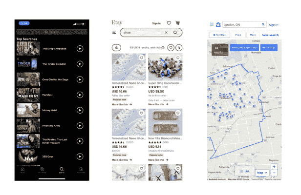

# 如何增强用户的移动搜索结果| Algolia

> 原文：<https://www.algolia.com/blog/ux/mobile-search-ux-part-three-seach-results-display/>

在本博文系列的 [第一部分](https://www.algolia.com/blog/ux/mobile-search-ux-8-obstacles/) 中，我们探讨了移动搜索体验中的应用程序界面设计障碍。

在 [第 2 部分](https://www.algolia.com/blog/ux/mobile-search-ux-part-two-deconstructing-mobile-search/) 中，我们考察了设计移动搜索体验以避免常见陷阱的要素，考虑了移动搜索栏的用户界面需求以及哪些搜索选项最适合在移动设备上指导用户。

现在，让我们来看看在为您的移动用户创建搜索体验时，如何创建最佳搜索结果页面。

与手机网站或 app 的功能一样，与其他搜索功能的设计一样，搜索结果的设计必须 *恰到好处。没有什么比在苹果 iPhone 或安卓手机上向下滚动搜索结果更糟糕的了，因为文字显示杂乱无章，掩盖了相关信息。一个好的移动搜索结果页面设计以一种易于阅读的方式提供最准确的信息来帮助用户。*

为移动用户体验而设计的优秀用户界面也反映了正在进行的搜索的类型。例如，对于一些移动搜索类别——一个很好的例子是餐馆——用易于理解的图标显示结果是有意义的，这些图标表示价格、评级和与搜索者的距离。这取决于您特定的移动应用程序用例，以及您的客户希望在搜索结果页面上看到什么。当你可以收集所有相关的可用性数据，并根据你所知道的仔细考虑呈现移动屏幕搜索结果的最佳方式时，移动设计阶段应该相对容易。

## 呈现最相关的结果

没有对优秀 [搜索相关性](https://www.algolia.com/doc/guides/managing-results/relevance-overview/#relevance-overview) 的承诺，你还不如不去担心如何优化其他移动 UX 的最佳实践。相关性在移动设备上非常关键，因为微小的屏幕可以容纳如此极端有限的结果。因为最小的浏览不动产，与常规网页相比，只有顶部的搜索结果是可见的，所以它们最好是有针对性的。

## 高亮文本便于扫描

一般来说，人们不喜欢——或者觉得他们有时间——阅读搜索屏幕上的所有内容，尤其是当他们只是浏览可用内容而不是确切知道他们需要什么时。他们更愿意做的是浏览文本，寻找告诉他们是的，这个搜索结果似乎有希望的信息。

帮助人们指出那些值得点击的项目的一种方法是主动为它们应用虚拟荧光笔(或粗体或一些其他文本处理)。突出显示关键词——他们在搜索框中键入的词出现在搜索结果中——可以简化他们的信息查找体验。

使用搜索结果高亮显示有两种有效的方法:

*   **高亮显示与其查询文本完全匹配的单词。** 这是一种直观的方式，当搜索词出现在找到的文本中时，就可以调出它们。它特别适合立竿见影的效果。
*   **高亮显示一切** ***但*** **自己搜索查询文本** (称为“倒置”高亮显示)。这使得搜索者使用突出显示来容易地聚焦并识别结果之间的 *差异* 。这种方法工作良好的另一个地方是查询建议。

## 隐藏自己的搜索历史

好的移动搜索 UX 设计包括存储人们最近的搜索，以及他们自己保存的搜索。这样，例如当他们在一个电子商务应用程序中，意识到他们喜欢之前看到的一个项目时，他们可以很容易地追溯到它，避免浪费时间。如果允许人们自己保存搜索结果，以便以后重复使用，例如，他们定期搜索相同的特定项目，将会受到欢迎。

## 确认搜索失败

这种情况时有发生:移动搜索有时不会提供任何结果。在这种情况下，您可以委婉地告知用户状态。当然，更好的办法是包括一个相当具体的错误解释:某个版本的“我们没有任何符合你想要的”是一个流行的搜索响应。

而且不要就此打住。借助移动用户界面/UX 元素，当一扇搜索之门关闭时，另一扇可能会打开:您可以 [利用这个机会](https://www.algolia.com/blog/ux/3-examples-to-help-you-transform-the-no-results-search-results-page/) 通过建议有用的相关或替代内容或过滤选项来帮助他们走出搜索空白。

## 尽快提供结果

移动用户可能没有 WiFi，他们的 4G 网络可能很慢，或者他们可能正在使用更快的 5G，但存在其他一些实时问题。不幸的是，信息搜索者的搜索结果出现的任何延迟都可能意味着负面的用户体验和较低的参与度。如果搜索结果没有立即显示出来，用户可能会认为有问题。

就 UX 设计而言，虽然你不能控制连接性，但你可以控制以满足用户需求的一件事是确保搜索结果尽可能即时出现。怎么会？通过设计你的搜索功能，不要因为降低用户体验而使问题复杂化。通过优化您的图像:正确地调整它们的大小，压缩它们，使用快速加载的图像格式，并使用分页来限制每页显示的结果数量。

在你的搜索界面中显示一个进度条或其他类型的指示器——旋转的轮子,“加载”图标，或进度条——表示有事情正在发生。

您也可以显示带有占位符的框架屏幕:

最后一种方法是实现惰性加载:将某些类型的内容优先于其他类型的内容，并分别获取它们。

尽管如此，可怕的无网络可用性将在某个时候出现，它必须被处理，而不仅仅是提供一个“重试”按钮。一种解决方案是离线缓存用户搜索的热门结果，然后提供基本的本地搜索体验。一个更好的方法是在设备上提供一个轻型的成熟的搜索引擎，它能够做在线引擎会做的大部分事情。然而，这需要大量的技能和资源。

## 使用谄媚的搜索结果显示

你的应用程序用户希望如何浏览你的目录项目:以列表、网格、缩略图、地图上的“图钉”的形式，还是以多种方式，并能够来回切换？对于他们想要视觉选择的商品，比如一双鞋，把搜索结果显示成图片才有意义。

哪种布局最适合您的产品或服务？以下是网飞、Etsy 和 Zillow 移动应用程序如何显示其用例的搜索结果:

网飞的格式让你无需滚动就能查看更长的项目列表。Etsy 使用网格强调引人注目的创作，同时也提供产品细节。Zillow 在地图上绘制房屋。

如果对你的用例有意义，并且用户不必采取多个步骤来切换视图， 你也可以给他们在格式之间切换的选项。

## 让您的搜索结果易于访问

最后，您可以通过满足行业 [可访问性标准](https://www.algolia.com/blog/ux/web-content-accessibility-guidelines-wcag-how-to-make-site-search-work-for-people-with-disabilities/) ，让您的移动搜索结果，甚至是您的整个移动用户界面，更容易被所有用户访问。

两个想法:

*   **在搜索图标上启用 alt-text。** 然后，允许用户使用键盘浏览搜索结果
*   **当搜索结果找到** 或找不到时，显示一条可被屏幕阅读器读取的状态消息

## 【最终结果】

有效地为你的移动应用程序设计搜索体验，让你的漫游用户高兴，并让他们想坚持下去，这可能会有一些令人畏惧的时刻，但如果你想要一个成功的移动体验，坚持不懈是值得的。记住，好的移动搜索设计模式能让你的用户无缝地找到他们想要的东西。移动设备上设计良好的搜索不仅可以改善应用内的用户体验，还可以提高你的转化率、客户忠诚度和利润率。

这总结了我们的移动搜索 UX 设计系列——希望你发现这个设计灵感很有见地！

现在你已经知道了移动应用程序设计的所有秘密，你准备好提供令人满意的体验，让人们一次又一次地回到你的应用程序了吗？一种选择是:Algolia 可以将我们的高级搜索功能 [专业知识](https://www.algolia.com/industries-and-solutions/mobile-search/) 带到你的移动应用程序设计师的桌子上。如果你有兴趣了解细节，只需 [让我们了解](https://www.algolia.com/contactus/) 。我们期待您的回复。