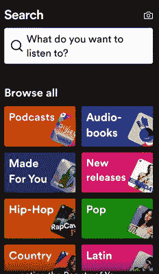
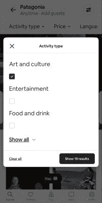
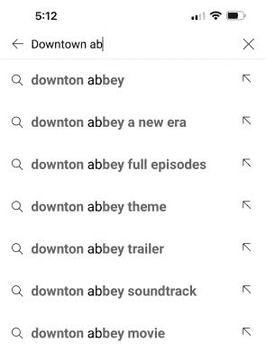

# 如何使用正确的设计功能改进您的移动搜索用户界面| Algolia

> 原文：<https://www.algolia.com/blog/ux/mobile-search-ux-part-two-deconstructing-mobile-search/>

在本系列关于移动 UX 设计的第一部分 中，我们谈到了如何在移动设备上为人们设计成功的搜索用户体验意味着克服某些可用性挑战，从有限的移动屏幕空间到膨胀的用户期望。在第二篇文章中，我们将看看如何避免新手设计错误，实现成功的设计模式，并确保您的用户可以通过实现正确的移动 UI 元素来有效地获得最佳搜索结果。

你选择引导搜索者通过你的移动用户体验和导航你的用户界面的方式将取决于你的数据集的大小和复杂性，你的访问者对他们正在搜索的数据集的预期知识，以及你应该在多大程度上试图平衡搜索意图和更有机的项目“发现”不管这些细微差别，当谈到移动搜索时，有一些屡试不爽的方法。

## 邀请移动用户搜索

搜索栏是移动应用程序或网页中许多内容的入口。如果你的大多数用户想在你的网站或你的应用程序中通过一个知识渊博的搜索引擎的指导开始，这个字段应该放在主页的显著位置，或者通过点击一个醒目的搜索图标(如放大镜)很容易被调出。

你可以通过添加提示文本(一个占位符)，向你的网站访问者或应用程序用户强调他们正在查看搜索栏，搜索栏正在等待他们的输入，并准备好提供有用的搜索体验。下面是 Spotify 的版本截图:

搜索是不是人们可能只想在你网站的某些部分或应用程序的某些区域使用的东西？那么上下文搜索图标就是一个不太显眼的选项:你只在搜索有意义的地方显示图标。

## 提供搜索过滤器和方面

衬衫还是罩衫？哪个牌子的？什么颜色？

在一个充满商品的电子商务应用程序中，过滤器和方面可以帮助搜索者减少相关搜索结果的数量和滚动，他们会受到轰炸。对于零售商来说，当顾客能够快速锁定一个目标，而不是疲于应付太多的可能性，并可能对这个过程失去兴趣时，这总是一个优势。

滤镜和刻面有什么区别？毕竟，刻面不就是一种过滤形式吗？

嗯，是的。但是过滤器通常是静态实体。例如，如果有人在亚马逊搜索“笔记本电脑”，他们可以在下拉列表中选择基本的过滤器，如品牌名称。

过滤选项是一个迹象，表明公司已经建立了一个具有高级搜索选项的移动界面，如果需要的话。作为一家企业，您可以参考您的元数据来确定正确的过滤器选项，以便为用户提供指导。

[Facets](https://www.algolia.com/blog/ux/faceted-search-and-navigation/) 是根据搜索类型变化的类别的动态列表。一个很好的例子:考虑不同层次的用户需求。在亚马逊搜索笔记本电脑的过程中，可能会产生一些非常昂贵的型号，“500 美元以下”这个词迎合了那些可能需要坚持预算的人:

### 带过滤，显示反馈

对于小屏幕的房地产，很难在视图中同时包含过滤器和搜索结果而不造成混乱。有时你可以在屏幕的顶部挤进一些关键的过滤器，但是呈现所有可能的过滤器的专用视图可能更有意义。

好的移动过滤体验有一个共同点:当选择一个过滤器时，会显示某种类型的反馈。例如，Airbnb 应用程序会调整每种活动类型的可用结果数量:

## 预见人们可能想要的东西

让用户每次点击都有价值的一个方法是提供 [自动完成](https://www.algolia.com/products/search-and-discovery/search-autocomplete/?utm_medium=cpc_brand&utm_campaign=SignupTrial_Google_NAM_Search_BR&utm_term=algolia%20autocomplete&_bt=545984583721&gclid=CjwKCAjwtfqKBhBoEiwAZuesiAk0-R0CwU8nuaiWjRIWjTy88ccOzBDIE8c5MVUFTXedrxBZUzBI2RoCiUIQAvD_BwE&utm_content=free-trial&_bm=e&_bg=79897981658&_bn=g&utm_source=google&_bk=algolia%20autocomplete) 作为移动界面设计的一个元素。有了这个功能，当用户输入搜索词时，即时搜索查询“猜测”就会更新。

## 实现拼写和错别字容差

如果客户拼错了查询，你不希望他们看到“没有结果”的页面。此外还有错别字:对于使用移动设备的人来说，用他们的小键盘来写错别字特别容易。解决方案是主动检测拼写错误并提出纠正建议。

以下是尽管有拼写错误，YouTube 如何找出想要的内容:

## 报价查询-相关建议

当有人输入短语时，查询建议通常会出现在搜索栏下方。这些建议看似直接相关，但不一定。 [查询建议](https://www.algolia.com/doc/guides/building-search-ui/ui-and-ux-patterns/query-suggestions/js/) 帮助用户找到保证返回结果的查询。

它们可能是由他人输入的分析生成的流行搜索查询，这些查询有可能吸引搜索者进入一些看起来有趣或足够相关的内容。

或者，它们可以是基于搜索者输入的术语的更完整的查询。假设你准备好了下一个苹果 iOS 或 Android 设备，你在谷歌的搜索框中输入“iphone”。这些建议可以是与各种最新型号相关的更具体的查询，例如“iPhone 14 Pro Max”:

鉴于查询建议对用户来说是一个额外的步骤，用户可能会自然地被所有的选择淹没，当一个网站或应用程序有大量数据集时，它们是最有帮助的。通过问“这些是你正在寻找的吗？”，它们帮助引导搜索者通过所有选项找到最相关的项目。

## 积极主动，立竿见影

执行移动搜索任务的人希望体验是即时的，不仅是搜索结果的获取速度，还有更新的频率。因此，不用等待用户输入完整的查询，您可以在用户第一次击键时就显示预期的、动态的搜索结果。

一个选项是通过每次击键调出实际的搜索结果，并将它们显示在结果页面上。当数据集更有限或者用户对他们需要什么有更明确的想法时，这种方法是最有效的。

另一种方法是移动用户界面通过为每种类型的内容显示有限数量的项目来划分其屏幕空间(例如，在音乐流媒体应用程序中，五位艺术家和五个乐队)。最相关的结果会出现在这些列表中，您可以在每个列表的底部包含“显示更多”按钮。

### 将建议与立竿见影的效果结合起来

当您有一个非常大的数据集，并且想要指导用户并确定是否已经进行了良好的匹配时，建议和即时结果是优化您的移动设计的好方法。例如，Google Play 应用商店可能会显示一个它认为可能是正确的应用搜索结果，并在其下方显示查询建议，以防结果与目标不符。

## 提供联邦搜索

如果你有企业级的搜索应用，可以考虑提供 [联邦搜索](https://www.algolia.com/doc/ui-libraries/autocomplete/solutions/advanced-federated-search-experience-for-ecommerce/) 的综合选项。除了搜索结果，您还可以在单个搜索结果界面中包括最近的搜索、热门搜索和从多个索引收集的内容。

## 提供语音搜索选项

移动应用程序越来越多地提供 [语音搜索选项](https://www.algolia.com/industries-and-solutions/voice-search/) ，让用户在旅途中通过对着麦克风说话来输入搜索查询。例如，谷歌地图让人们在开车时方便地说出搜索查询。

## 不要让搜索-过渡屏幕空白

因此，在您的搜索 UI 中，您的搜索者已经输入了一个查询，可能选择了一个查询建议，并点击了放大镜图标。他们可以通过一个漂亮的空白屏幕或进度条指示器放松一下，他们的搜索已经开始，他们很快就会看到一些很棒的结果。

是的，你可以为他们提供 Zenlike 应用内休息，作为你 r UI 设计的一部分，然而，到他们搜索结果的过渡页面是一个吸引他们的机会——基于你目前对他们搜索查询的了解——甚至在他们到达他们的搜索结果之前。因此，如果他们输入的内容不够具体，你可以给他们建议，而不是在你的搜索 UX 中出现一个空白页面。您的搜索功能还可以向他们显示实时趋势或最近的搜索、 或他们可能喜欢探索的类别，以取代或补充他们当前的搜索兴趣。

## 下一站:搜索结果页面

现在你已经获得了一些用户界面/UX 设计的灵感和利用强大的移动应用程序设计来帮助搜索过程的初步方法，你已经为 [第 3 部分](https://www.algolia.com/blog/ux/mobile-search-ux-part-three-seach-results-display/) :优化构建移动搜索结果做好了准备。

[关于阿哥利亚](https://www.algolia.com/)