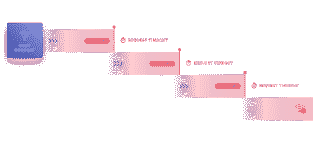
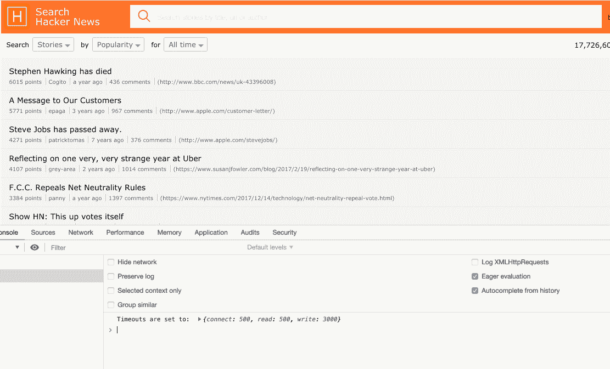
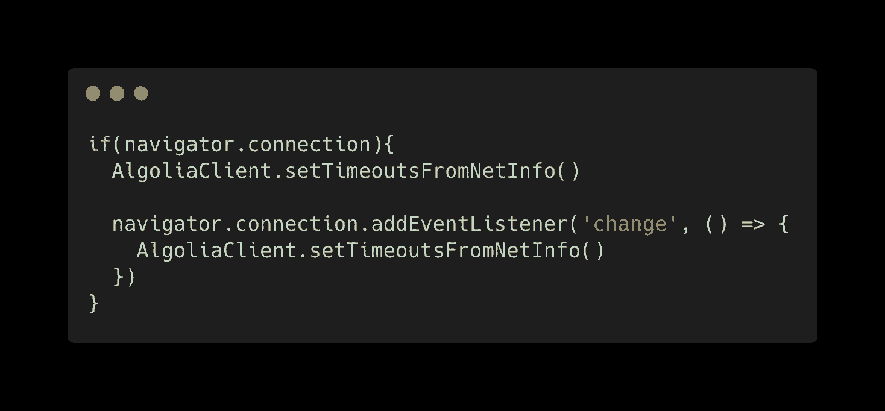
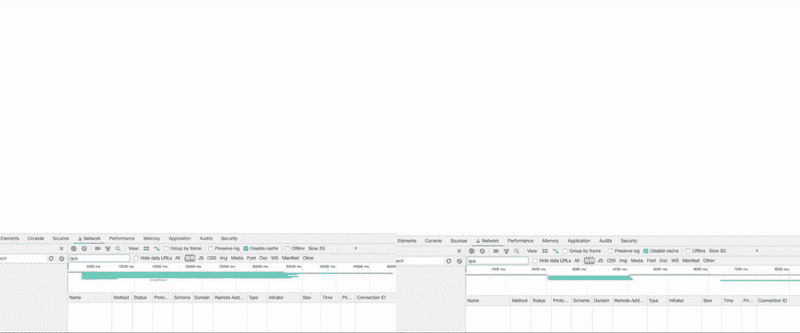
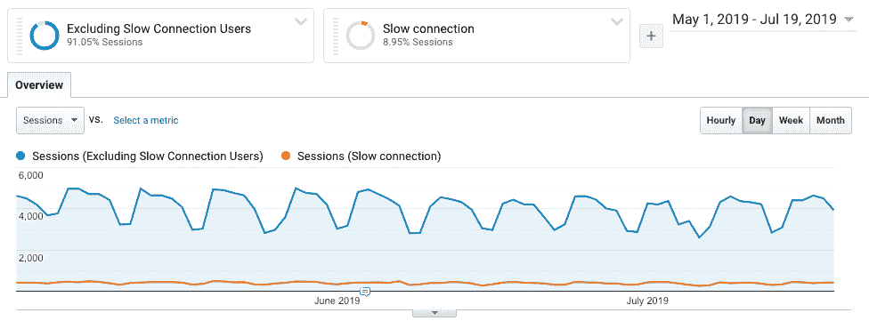
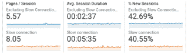
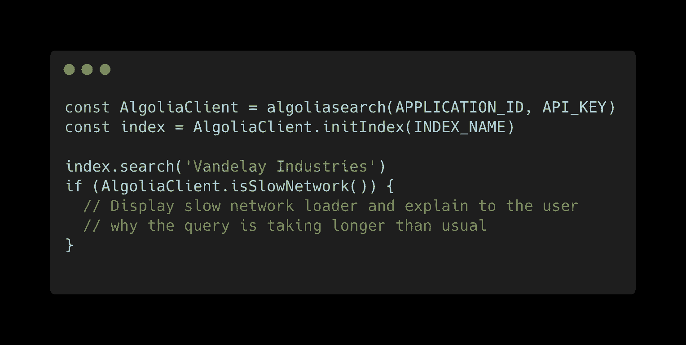
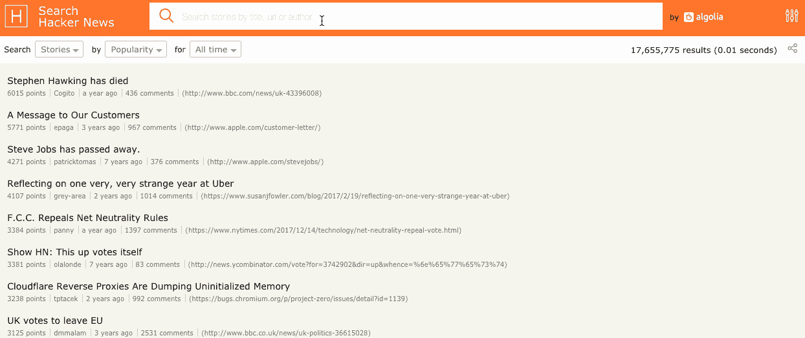
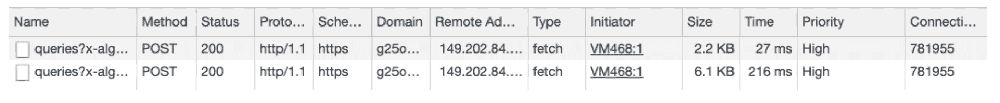

# 使用 NetInfo API 改进 Algolia 的 JavaScript 客户端

> 原文：<https://www.algolia.com/blog/engineering/netinfo-api-algolia-javascript-client/>

Algolia 的架构高度冗余，在至少三个不同的服务器(称为集群)上托管每个应用程序。我们这样做是为了确保最大可能的可靠性。 这巩固了我们的 SLA，确保 99.99(9)%的正常运行时间，让您能够可靠地交付企业级搜索，而不必担心底层基础架构。

然而，冗余只是高可用性系统的一部分；在我们的用户和我们的基础设施之间仍然有很大的未知——**网络** 。所有搜索查询都依赖于网络可用性，并受到其潜在延迟的影响。为了管理网络易错性，Algolia 的 API 客户端实现了一种" *重试策略* "，其中基于一组简单的试探法，服务器被确定为"""，当该试探法被触发时，使得 API 客户端通过绕过主应用 DNS 记录并直接以服务器节点之一为目标来重试相同的查询。

此 [重试逻辑](https://www.algolia.com/doc/guides/scaling/distributed-search-network-dsn/#retries-and-fallback-failover-logic) 每当检测到其中一台服务器关闭或无法访问时，就会切换目标服务器。因此，给定的请求不会失败，除非所有 se 服务器同时关闭或不可达。这不太可能——尤其是考虑到集群的服务器位于地理位置分散的不同数据中心。

出于这个目的，我们需要确定“不可用”是什么意思(这个话题应该有自己的博文)。为简单起见，如果检索结果的请求花费的时间超过 X，则服务器节点被视为不可用。每当一个请求花费的时间超过 X 的时候，我们就增加 Y 并开始一个新的请求，这次的目标是一个特定的服务器节点。我们将 X 定义为起始值[1000 毫秒](https://github.com/algolia/algoliasearch-client-javascript/blob/065e7d8b7c58f6c306cf27b4dc27131d0b684e52/src/AlgoliaSearchCore.js#L67-L71) 乘以 [Y](https://github.com/algolia/algoliasearch-client-javascript/blob/065e7d8b7c58f6c306cf27b4dc27131d0b684e52/src/AlgoliaSearchCore.js#L890-L893) ，其中 Y 是当前会话中请求超时的次数。这给了我们一个基本的重试策略，它可以工作，但是不能根据不同的网络条件进行调整。

## **为多变的网络环境做出调整**

遗憾的是，没有完美可靠的网络，也没有两个完全相同的网络或提供商。进入一个老旧的 [混凝土建筑](https://eyesaas.com/wifi-signal-loss/) 或者当地网络被同行超载的事件，你会很快明白 Wi-Fi 或 4G 会变得多么不可靠。作为一家 SaaS 企业，我们不能保证用户的连接，但我们确实希望为所有用户提供良好的搜索体验，无论他们的网络能力如何。

这是我们的重试策略定义与我们的业务目标重叠的地方，并构成了潜在的风险。因为我们为超时逻辑使用了默认的静态数字(1000 毫秒)，所以我们并没有迎合客户所面临的真实网络条件。慢速连接的用户将在他们第一次查询 algolia 服务器时触发我们的重试策略，因为我们的客户端超时默认值太低；这反过来导致他们最初的搜索请求被取消，而另一个请求被发送到 Algolia-**使他们接收请求** 所需的时间加倍。

如果我们能够知道这些用户的网络能力，我们可以将超时设置得足够高，以防止误报，同时仍然保留服务器请求可能失败时的重试逻辑。

## **改进的动机**

### **传递快速(呃)查询**

如果你从事电子商务、媒体或任何其他类型的在线业务，客户维系和满意度是关键。在一个没有人喜欢等待的世界里，你最不希望的事情就是让你的用户盯着一个空白的屏幕等待搜索查询的结果。 [亚马逊发现](https://glinden.blogspot.com/2006/11/marissa-mayer-at-web-20.html)100 毫秒的延迟会导致收入下降约 1%，加载 30 个结果而不是 10 个会导致页面渲染延迟 0.5 秒，并导致流量下降 20%。

利用快速搜索体验可能是你和你的竞争对手之间的关键区别之一，这也可能是用户最终使用你的网站而不是竞争对手的网站的原因。

### **推卸责任**

然而，缓慢的服务器响应时间不一定是工程故障。作为软件工程师，我们可以做很多事情来改善我们的内容交付方式，但因为我们不能完全控制网络堆栈，我们的用户仍然只能得到 尽力而为 的服务，这种服务经常会遇到 [最后一英里问题](https://en.wikipedia.org/wiki/Last_mile) 。

举个例子，一个用户正试图从一个糟糕的网络访问你的网站。如果你告诉这个用户 **“你的结果正在加载】** ，他们可能会对你的服务感到失望，离开你的网站——即使是 *他们的* 网络，而不是你的服务导致速度变慢。

通过说 **“你在一个糟糕的网络上，结果可能需要一段时间”** 来增强体验，将责任推给他们的提供商，使他们 更有可能等待实际结果 的到来，知道你的网站不应该受到指责。(脸书[研究](https://mercury.io/blog/the-psychology-of-waiting-loading-animations-and-facebook)关于装载机的心理效应。)

Google Maps example (center of Paris on iPhone XS, Free provider)

## 

## 

# **使用 NetInfo API**

[网络信息 API](https://wicg.github.io/netinfo/) 目前是 WICG 下的活草案文档。它保存有关客户端网络能力的重要信息，如其有效连接类型、下行链路和 [往返时间](https://wicg.github.io/netinfo/#rtt-attribute) 信息。如果我们以前盲目地将超时时间初始化为一个任意的数字，我们现在可以进行更好的调整，并用更好的超时配置初始化客户端。

网络信息 API 还附带了一个非常有用的*[onchange](https://wicg.github.io/netinfo/#onchange-attribute)*回调，当我们的用户的连接发生变化时就会调用这个回调。这意味着我们现在可以满足那些开始在良好连接上使用我们的页面，但后来由于外部条件(如上面的混凝土建筑示例)而体验到缓慢连接的用户。反之亦然。

通过利用 NetInfo API，我们可以开始针对以前无法处理的一些用例进行调整。下面我们来看一些例子:

#### **完美网络条件(4G、Wi-Fi)下的搜索查询:**

查询是在良好的网络条件下发送的，没有触发超时，请求在网络上传输总共花费了 600 毫秒。这包括解析 DNS、协商 TLS 和建立 TCP 连接。

#### **慢速网络条件下的搜索查询(3G):**

查询是在降级的网络条件下发送的，这又超过了我们最初设置的静态超时(1000 毫秒),查询被重试。我们可以很快看到，不知道客户端所服从的网络是如何让我们付出额外的请求代价的，这增加了检索响应所需的总时间(在本例中是 1000 毫秒+1500 毫秒，而不是仅仅 1500 毫秒)。

#### **恶劣网络条件下的搜索查询(慢 2G):**

搜索查询是在恶劣的网络条件下发送的，每个请求都以指数增长的超时重试，最终检索到响应。

#### **变化网络条件下的搜索查询:**

搜索查询是在良好的网络条件下发送的，这在会话期间可能会改变。

#### **调网搜索查询:**

通过利用 NetInfo API，我们可以调整客户端的超时设置，并根据用户遇到的实际网络条件适当地设置超时，从而减少重试请求的次数，并减少搜索引擎响应结果所需的总时间。

# **实施我们的方案**

知道了用例、API 和我们想要的结果，我们现在可以利用 NetInfo API 根据真实的网络条件来调整客户端的超时策略。

因为网络信息是一个实验性的 API，我们需要检查特性支持。一旦我们断言了 API 的可用性，我们就可以从网络 RTT 时报初始化我们的 JavaScript 客户机的超时，并注册 *onchange* 处理程序。

*(重要:* *你还应该检查一下 connection.rtt 是不是一个数字，因为在 [有些情况下部分支持。](https://github.com/algolia/hn-search/issues/141) 注意，上面的伪代码不是要复制粘贴的。 )*

如果 NetInfo API 不可用，我们可以使用 [资源定时 API](https://developer.mozilla.org/en-US/docs/Web/API/Resource_Timing_API/Using_the_Resource_Timing_API) 。正如 [伊利亚](https://www.igvita.com/) 在 [推特](https://twitter.com/JonasBadalic/status/1100129105834577920) 上指出的，它包含了足够的信息让我们在没有 NetInfo API 可用的情况下构建一个更明智的重试策略。

使用这两个 API，我们现在更接近于拥有一个基于真实网络条件的动态重试策略。见下面的例子，hn.algolia.com 已被更新，以模拟真实的网络条件。

 

我们现在能够设置更好的超时默认值，避免由于错误的默认值而触发重试策略；当用户遇到恶劣的网络条件时，不再取消和重试原始请求。这反过来减少了这些用户获得搜索结果所需的时间，节省了设备带宽，并节省了我们搜索服务器的 CPU(因为只发送了一个请求，所以引擎不必做两次)。

这里是在 3G 网络受限的情况下，我们的旧策略(左)与新策略(右)的并行渲染性能比较。

Left: Static timeout value. Right: network adjusted timeout value.

如果你看一下左边的 Chrome 开发者工具，你会发现最初的请求超时了，由我们的客户端重试，而在右边，超时是根据实际的网络条件设置的。**通过这一修改，我们在当前模拟下成功节省了大约 800 毫秒。**

## **确保我们有数据**

在进行所有这些更改之前，我们设置了一个监控 API，以便我们可以测量我们的更改。该 API 报告每次超时以及客户端和网络信息。我们在 GoogleAnalytics 中添加了 **【慢速连接】** 事件，以备用户每次看到“你在慢速连接”加载器时使用。这允许将用户会话分为慢速和快速连接。

虽然 Algolia 提供了速度最快的搜索引擎之一，这在一定程度上要归功于它的分布式搜索网络，这使得数据更接近您的用户，但我们仍然可以观察到，大约 **~9%** 的该应用程序用户正经历着从查询到呈现结果的缓慢时间，这是由缓慢的网络造成的。

使用 Google Analytics，我们现在可以比较慢速连接上的用户，并看到他们在页面上花费的时间几乎是原来的两倍。因为搜索是 hn.algolia.com 的一个主要功能，我们可以想象用户大部分时间都在等待结果。

## **改善开发者和用户体验**

知道响应会很慢，我们可以通过展示加载器并解释延迟来自哪里来增强用户体验。这使我们能够更好地管理用户期望，并解释为什么某个动作会延迟体验，避免沮丧，并有希望导致用户愿意花更多时间等待。

让我们看看下面的例子:

通过添加一个内置方法，我们将为开发人员提供一种快速决定如何处理这些情况的方法，帮助他们专注于搜索 UI 的实际实现，并让他们的用户即使在降级的网络条件下也能保持快乐。这个 让我们离帮助你为你的用户建立最佳搜索体验更近了一步。

Example of hn.algolia.com handling users on slow connections.

## **超越慢速网络加载器**

拥有一个慢速网络指示器是很好的第一步，但是我们现在可以超越解释这种情况，实际上加速这些用户的查询。我们现在可以考虑的选项之一是减少我们请求的搜索结果的数量，减少总的响应大小，并让用户更快地在屏幕上看到这些结果。根据搜索结果的传输大小，这会对搜索结果的显示速度产生重大影响。

Tested on algolia.com/doc, same query with different hitsPerPage parameter. Response size is ~3x lower and the query only takes 10% of it’s original time.

我们现在可以考虑的另一个选项是针对慢速连接用户的去抖动查询。如果我们知道请求将会很慢，我们可以节省带宽，而不是在每次击键时都发送查询，从而节省设备带宽用于其他可能需要它的关键操作。如果 navigator . connection .[saveData](https://wicg.github.io/netinfo/#savedata-attribute)为真，我们也可以这样做，该属性指示用户是否请求了缩减数据使用模式。

# **这对我们 Algolia 和我们的用户意味着什么**

针对这些情况进行调整，可以为我们所有的用户提供更好的搜索体验，无论他们的位置、网络或设备性能如何，并且让我们向为每个人提供更好的搜索体验又迈进了一步。NetInfo API 还为开发人员提供了测试和决定如何最好地处理这些用例的机会。随着我们继续努力为您和您的用户改进搜索，我们正在寻找反馈和早期采用者。如果你对此感兴趣，请在下面的评论中联系我们，我们希望听到你的想法。

非常感谢 [Adam Surak](https://twitter.com/AdamSurak) 参与到这个话题的讨论中来！

*奖励链接:有一个类似的规范叫做客户端提示，它通过一组新的请求头来表达网络信息。我建议你阅读[规范草案](https://httpwg.org/http-extensions/client-hints.html)本身或者阅读[谷歌开发者](https://developers.google.com/web/fundamentals/performance/optimizing-content-efficiency/client-hints/)的博客文章，看看你如何利用这些标题。*