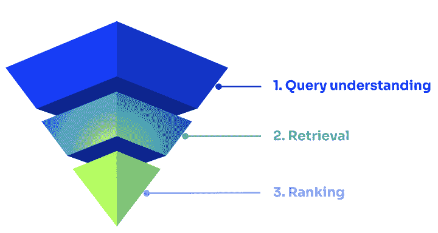
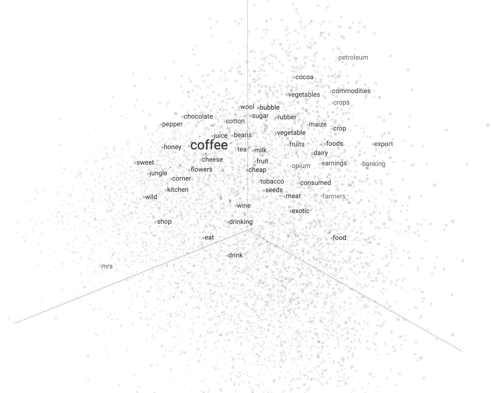
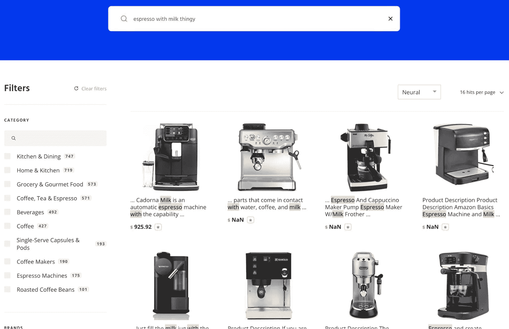
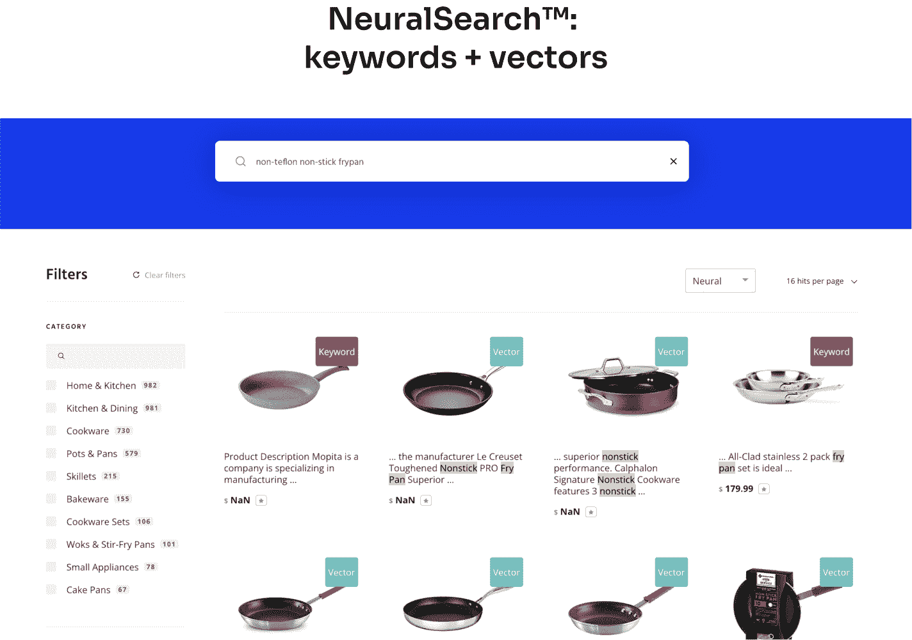

# 神经哈希如何释放人工智能检索的全部潜力

> 原文：<https://www.algolia.com/blog/ai/neural-hashing-ai-search-retrieval/>

搜索可以同时感受到简单和复杂。在谷歌上搜索很简单，搜索结果也非常相关(尽管这一点在最近几年谷歌推出大量赞助搜索结果的情况下仍有争议)。虽然不是搜索，但 ChatGPT 让这种体验变得更加神奇。但是，任何实现过搜索的人都知道，信息检索是一个高度复杂的话题。

为了简化，从搜索查询到结果的生命周期，s earch 可以分为三个不同的过程:查询理解、检索和排名。

1.  **查询理解** :自然语言处理(NLP)技术为搜索引擎分析准备和构造查询；
2.  **检索**
3.  **排名** :最后还有一个重新排名的过程，把最好的结果推到最前面(基于点击、转化等)。)并应用客户的规则、个性化等等。

机器学习人工智能已经应用于查询处理和排序有一段时间了，它极大地改善了这两者。缺失的部分是检索，而检索对于提高结果的整体质量更为重要。

我们可以用*召回* 来衡量检索质量。Precision 是检索到的相关文档的百分比，recall 是检索到的相关文档的百分比。这两个指标可以帮助我们确定搜索结果是否好。

举例来说，假设是时候升级你的厨具了，所以你在你最喜欢的卖家网站上搜索“煎锅”。在这些结果中，有些项目非常相关。但是，有些不是——比如带平底锅的炊具套装(截图如下)。这就是精准。然而，网站上还有许多其他相关产品是 *而不是* 包含在结果中。我们称之为召回。

现在，假设您决定改进搜索查询。您可能会搜索“不粘锅”，这一次(见下文)(1)此查询会有不同数量的结果，因为我们引入了略有不同的关键字，以及(2)会有更多您期望的结果(煎锅，而不是炊具套装)。

其实精准和召回之间可以有一个阴阳；提高精确度(准确性)可能会影响召回率，而提高召回率(完整性)可能会损害精确度。圣杯正在改善这两者，这正是人工智能检索可以做到的。

检索是人工智能搜索难题的最后一块，也是最难的一块，原因如下:

*   管理人工智能检索规模和性能的成本过高。存储、CPU 和算法都需要专门化。
*   人工智能检索模型是“脆弱的”——搜索索引随着新的或改变的内容而更新，模型将需要更新。
*   在精确匹配和广义概念匹配之间有一个折衷。

在这篇文章中，我将解释我们如何着手解决人工智能检索的最后一个挑战。在以后的文章中，我会更多地谈论搜索金字塔的其他部分。

## 人工智能信息检索

搜索检索需要技术来确定任何特定查询的相关性。多年来，它是由关键词搜索引擎驱动的。这种情况正在改变。随着向量搜索的引入，它超越了关键字搜索，概念可以被理解。

[矢量搜索](https://www.algolia.com/blog/ai/what-is-vector-search/) 是一种用于 AI 搜索的机器学习技术。向量是用数学方法表示单词的一种方式。向量在多个维度(也称为 n 维空间)中被绘制和聚集。向量搜索通过多个对象的向量表示来比较它们与搜索查询或主题项目的相似性。为了找到相似的匹配，使用用于将对象(即数据或内容)转换成向量的相同模型，将查询(或主题)转换成向量。彼此相似的向量从数据库返回，找到最接近的匹配，提供准确的结果，同时消除传统搜索技术可能返回的不相关的结果。

An example of what vectors in an n-dimensional space might look like for the term “coffee”, visualized via [Tensorflow image projector](https://projector.tensorflow.org/)

诸如 [HNSW(分层可导航小世界)](https://en.wikipedia.org/wiki/Nearest_neighbor_search) 、IVF(倒排文件)或 PQ(乘积量化，一种减少向量维数的技术)的技术是一些最流行的近似最近邻(ANN)方法，用于找到向量之间的相似性。每种技术都侧重于改善特定的性能属性，例如使用 PQ 减少内存，或者使用 HNSW 和 IVF 快速而准确地缩短搜索时间。常见的做法是混合几个组件来产生一个“复合”指数，以实现给定用例的最佳性能。

可以有成千上万个维度。每个向量之间的接近度和角度有助于搜索引擎确定术语和含义之间的相似性。输入“加牛奶的意式浓缩咖啡”，矢量搜索引擎会寻找相似之处，返回带有蒸汽棒的意式浓缩咖啡机。然而，键入一个词，如“德隆基”(一个浓缩咖啡机品牌)，一个 [矢量搜索引擎](https://www.algolia.com/blog/ai/what-is-vector-search/) 就有可能返回其他品牌和不同的机器——Nespresso、Keurig、凯膳怡等。那是因为 vectors 只理解德隆基的 *概念* 。

与较新的矢量引擎不同，传统的关键词搜索引擎快速而精确。因此，搜索“德隆基 Magnifica”就能给出确切的答案。然而，当查询与您的搜索索引中的内容不匹配时，关键字搜索引擎可能会陷入困境。为了解决这个问题，公司可以添加规则、同义词、关键字标签或其他解决方法，但不可能涵盖所有用例。

例如，您可以编写一条规则，包含关键字 *【咖啡或浓缩咖啡】【机器】【牛奶】* 的查询与 *【带蒸汽棒的浓缩咖啡机】的意思相同* 问题是你不可能为每一个可能的长尾查询覆盖每一个边缘案例。再举一个例子，搜索“java”这个词。*Java*与*coffee*和*espresso*同义使用，但除非搜索引擎中有同义词或规则，否则查询会失败。

设计和构建一个有效的可伸缩向量索引是一项复杂而昂贵的任务。同样，构建一个有效的适用于长尾查询的关键词搜索引擎也同样令人望而生畏。分开来说，向量和关键词搜索技术都相当不错。然而，在一起，他们是了不起的。

这被称为混合搜索，它适用于精确匹配、不明确的短查询和长尾查询。

## 人工智能搜索性能突破

所以，你只要把一些向量和关键词技术拼凑起来就大功告成了，对吧？混合搜索引擎解决了！

要是有这么容易就好了。正如你可能想象的，有一些挑战。最大的问题是管理矢量搜索的规模和成本。向量基本上是浮点数。计算机与浮点数进行了巨大的斗争。这就是为什么像 GPU 这样的专用计算机被用于人工智能和矢量操作。您不仅需要专门的数据库来运行 vector search，还需要全职的开发资源来持续管理生产。对于人工智能模型，输入模型的数据保持新鲜、相关和优化是至关重要的。对于数据不断更新且速度至关重要的电子商务和企业业务，人工智能搜索的计算成本太高，无法在生产中运行。

一些公司试图通过运行人工智能查询 *来解决这个问题，前提是* 关键字查询失败。这有助于最小化处理成本，但不能为客户提供最佳结果。

底线是大多数公司想把时间和金钱花在他们的业务上，而不是关注搜索引擎的基础设施。解决方案是我们首创的方法。这就叫 [*神经哈希*](https://www.algolia.com/blog/ai/vectors-vs-hashes/) 。哈希是一种允许我们在不丢失信息的情况下压缩矢量的技术。我们可以将复杂的 2000 位十进制长数字转换成简单的静态长度表达式，这使得计算它们变得非常快速和便宜。哈希在 AI 中应用于向量并不是一个新概念。

位置敏感散列(LSH)是一种众所周知的算法技术，它以很高的概率将相似的输入项散列到相同的“桶”中。典型地，在如何确定“桶”方面存在折衷——更高或更低的相似性。利用我们的神经散列技术，我们已经消除了权衡的需要。因此，我们可以用神经网络(因此得名神经哈希)将向量压缩或哈希到正常大小的 1/10，同时仍然保留高达 99%的信息。它们可以在标准硬件和数据库上存储和管理。事实上，我们可以处理散列向量或二进制向量，速度比标准向量相似度快 500 倍，使其与关键字搜索一样快。我们可以在普通的 CPU 上实现。

这里有一个关于“非特富龙不粘油炸锅”的长尾查询的例子，它运行在一个只有关键字的引擎上，而不是散列/关键字引擎上。

 

从上面的截图中可以收集到一些重要的信息:

*   混合动力引擎提供了更高的精度和更高的召回率。
*   我们在单个查询中同时运行散列和关键字，组合的混合结果按照相关性进行评分和排名。
*   这是在商用硬件上运行的，结果几乎是即时的；混合搜索结果并不比只搜索关键词慢。

还要注意,“frypan”是一个单词而不是两个单词——它也可以写成“煎锅”、“煎锅”或“煎锅”——但是搜索引擎不会跳过一个节拍。这涉及到人工智能检索的另一个重要特征:它大大减少了与提高搜索相关性相关的人工工作量。为常见术语编写同义词库或为特定类型的查询编写规则的时代已经一去不复返了。它也开启了全新的可能性，比如提供搜索服务。

Algolia neural search提供了这项新功能。它现在处于私下测试阶段，但您可以在这里注册以便在它可用时得到通知。

当然，搜索不仅仅是检索。在我们端到端的 AI 搜索金字塔中，检索(神经哈希)处于中间。人工智能金字塔的两端是查询理解和排序。在以后的博客中，我会谈到这另外两个功能。

## 下一步

神经哈希代表了将人工智能检索投入生产的一个突破，用于各种各样的用例。结合人工智能支持的查询处理和重新排名，它有望释放人工智能现场搜索的全部力量。我们很高兴即将发布这些新的端到端人工智能功能！当全新的 Algolia neural search平台推出时，立即注册成为第一个试用者。