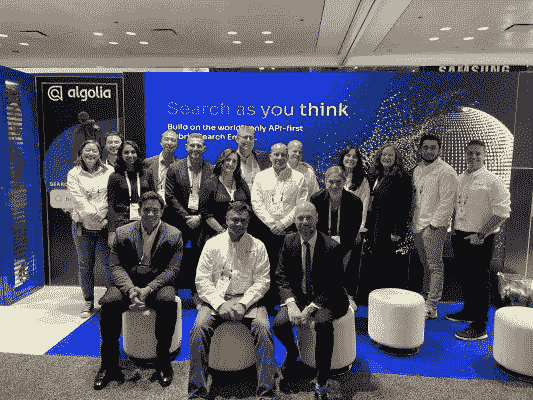

# NRF 2023 回顾:面对挑战的弹性

> 原文：<https://www.algolia.com/blog/ecommerce/nrf-2023-recap/>

## 今年 NRF 会议的收获

2023 年 NRF 的“云”这个词抓住了零售行业和邻近行业正在经历和感受的广泛领域。“云”包括疫情、通货膨胀、宏观环境、战争、全渠道、可持续发展、个性化、供应链等词，每一个词都在塑造最大的就业部门之一的现实中发挥着重要作用。在今年的 NRF 上，一个突出的词成为了它自己的主题，那就是**数据**。虽然这不是官方的会议主题，但对我来说，这是在纽约为期三天的零售活动中的一个明显的收获。

尽管这可能感觉似曾相识——因为数据已经驱动业务多年了——但今天不同的是其含义、互联性和应用。从全渠道体验到个性化、定制支持到机器学习，数据是推动高级体验的基础。作为领先的搜索和发现平台，我们依靠数据质量来快速[提供大规模超个性化体验](https://www.algolia.com/blog/ai/deliver-a-valuable-personalized-shopping-experience-while-respecting-customer-privacy/)。毕竟，规模速度对于改变消费者和企业购物、购买和采购商品和服务的方式至关重要。

会议上讨论和辩论的其他重要主题包括:

1.  实体店**不断演变的角色**——融合后大流行时代的在线和店内体验
2.  在每个接触点明确**以客户为中心**
3.  收集的数据量是一回事，但是数据的**价值和可用性**最重要
4.  超个性化体验比以往任何时候都更加重要；它们在不断发展，没有人完全解决这个问题，每个品牌看起来都不一样
5.  人工智能、元宇宙、自动化——每个人都想从中分一杯羹，只是不确定如何分以及分多少

## 在零售大展上大放异彩

作为零售业大展 NRF 2023 的金牌赞助商，我们与希望推动类似体验的品牌进行了数百次对话。重复的问题是——如何降低推动大规模个性化的障碍？在会议过程中—[通过在我们展位上的一系列展示—](https://resources.algolia.com/nrf), brands 看到了我们与众不同的地方，这是一个面向可组合商务的 API 优先解决方案。我们讨论的主题包括:

*   搜索和搜索创新的价值
*   一个业务员的一天
*   在马赫速度下优化 CX
*   将 Algolia 与 Adobe、SFCC、Shopify、commercetools 和 BigCommerce 集成

## **利用数据建立业务弹性**

**超过 17，000 名客户**依赖我们提供卓越的搜索和发现体验。事实上，在 BFCM 2022 期间，Algolia 每秒处理 98，000+个搜索查询*！我们相信，数据和人工智能的结合是未来发展的必然趋势。数据给你正确的信号，人工智能帮助你大规模地实施和采取行动。别忘了，这是一个循环。反馈给人工智能模型的洞察力训练它做出相应的反应。[作为提供个性化搜索和发现体验的领导者](https://www.algolia.com/blog/algolia/10-stats-that-show-why-algolia-is-the-leader-in-search/)，真正让我们与众不同的是处理“关键词”和“自然人类表情”以产生最大转化率的能力——这是唯一能够*“真正”*做到这一点的平台。*