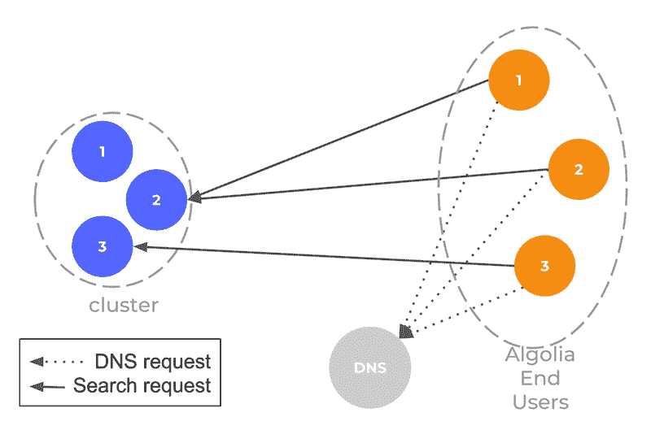
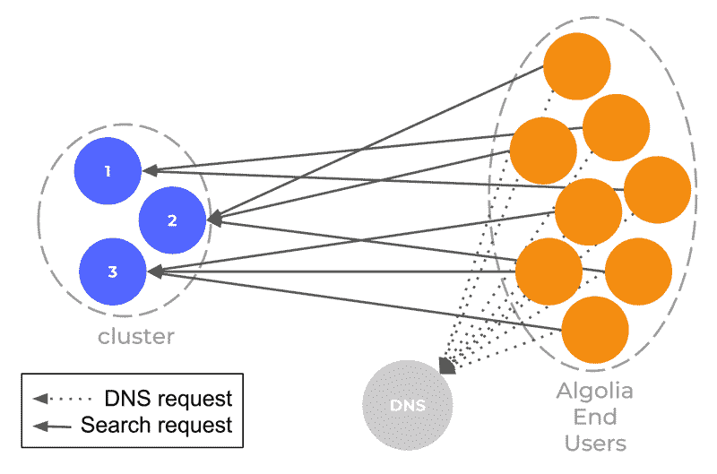
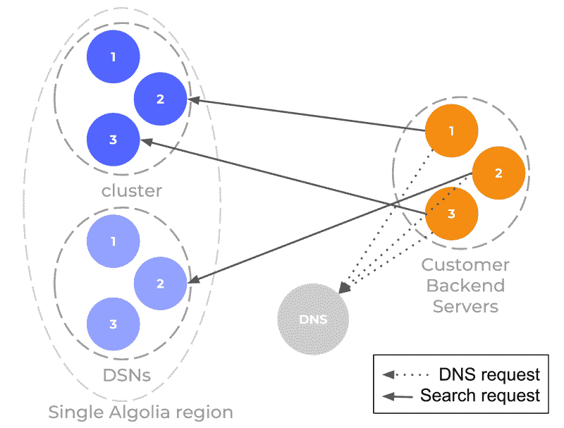
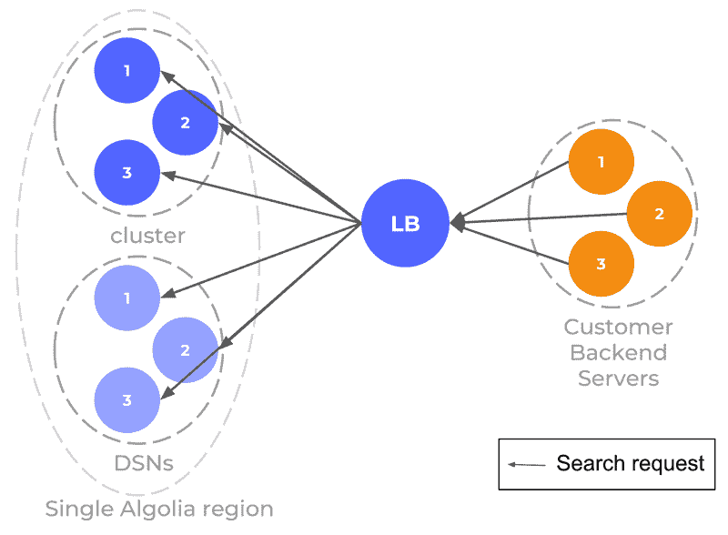
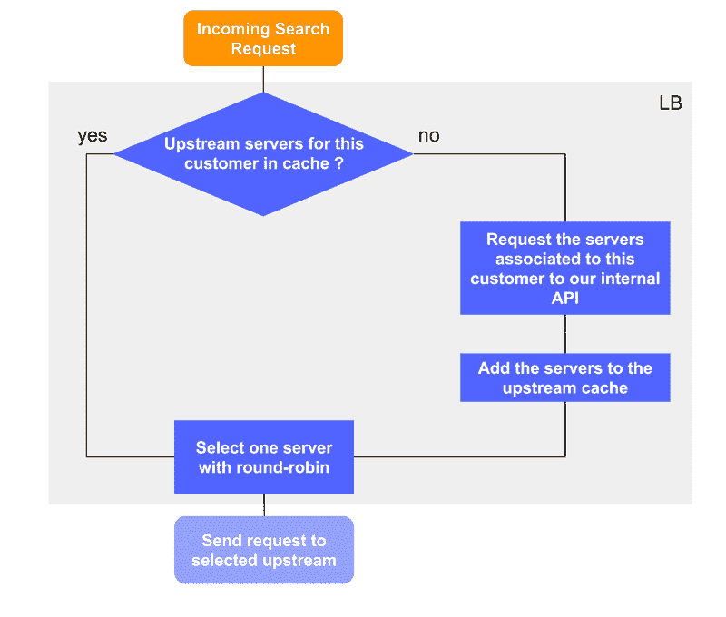
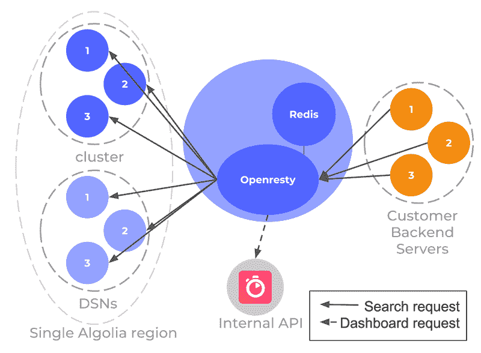
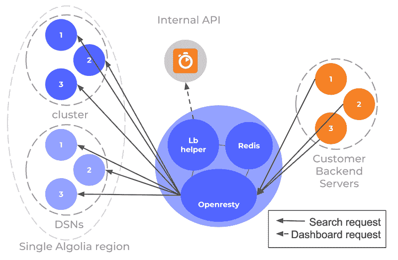
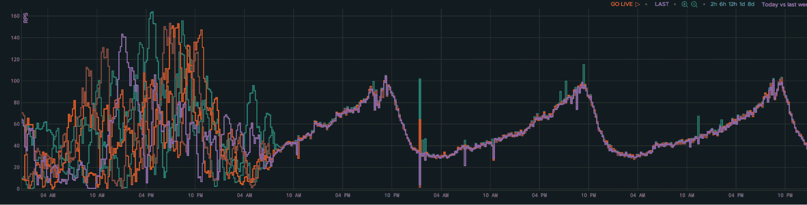

# 如何建立一个可扩展的 DNS 负载平衡系统

> 原文：<https://www.algolia.com/blog/engineering/one-year-load-balancing/>

从 Algolia 开始，我们就决定不在用户和搜索 API 服务器之间放置任何负载平衡基础设施。我们做出这一选择是为了使事情变得简单，消除任何潜在的单点故障，并避免监控和维护这样一个系统的成本。

Algolia 应用程序运行在以下基础设施组件之上:

*   一个由 3 台服务器组成的集群，处理索引和搜索查询，
*   一些[DSN](https://www.algolia.com/doc/guides/scaling/distributed-search-network-dsn/)服务器(不是 DNS)。这些是只读副本，仅用于搜索查询。它们的主要目的是为地理位置远离主集群的人提供更快的搜索。

我们没有在我们的搜索服务器和用户之间放置硬件或软件，而是选择依靠 DNS 的[循环](https://en.wikipedia.org/wiki/Round-robin_DNS)特性来跨服务器分配负载。每个 Algolia 应用程序实例都与一个唯一的 DNS 记录相关联，该记录以循环方式响应处理给定 Algolia 应用程序的裸机服务器之一。

我们认为 Algolia 最常见和最佳的用法是前端实现。在这种情况下，移动设备或笔记本电脑直接与我们的裸机服务器建立通信。在这种情况下，我们可以假设会有大量的 DNS 解析，每个解析都会导致一些搜索请求。这是依靠循环 DNS 进行负载平衡的最佳情况:大量用户请求 DNS 访问 Algolia 服务器，他们执行一些搜索。这导致服务器负载与循环 DNS 解析相匹配。此外，为了执行更多的 DNS 解析，我们将 DNS TTL 减少到一分钟。

最后，这个系统很简单。它没有使用任何专用的硬件或软件来自行管理，一切进展顺利。

也就是说，直到黑色星期五。

## 基于 DNS 的负载均衡限制

### 后端实现不均衡负载均衡

如前所述，我们强烈建议我们的客户使用前端搜索实现。许多参数都在推动这一选择；其中之一是利用我们基于 DNS 的负载平衡系统。然而，这并不总是可行的:一些客户有特定的约束，比如遗留设计或安全性问题，这导致他们选择后端实现。这样，他们的后端服务器将所有搜索查询转发给我们的基础设施。

在这个特定的环境中，我们已经知道我们基于 DNS 的负载平衡不是最理想的:

*   现在，一小组服务器执行一些 DNS 解析，并将大量请求转发到所选的后端服务器。1000 个用户每人进行 10 次查询，而现在我们有一个用户进行 10，000 次查询。
*   由于与我们的搜索服务器的会话可以存在更长时间，后端服务器可以发送更多的请求，而无需重新执行 DNS 解析。
*   有时，客户服务器甚至会覆盖我们的 DNS TTL，以便他们可以更长时间地使用他们的 DNS 缓存。

也就是说，我们在设计基础架构时主要关注的是弹性。这意味着，对于大多数客户来说，单个集群节点可以处理所有的搜索负载。因此，跨集群节点的不均匀负载不会对搜索体验产生任何影响。

### DSN 为水平缩放

最初，引入 DSN 是为了提高远离主集群执行搜索请求的用户的性能，方法是将只读服务器放在他们附近。然而，我们很快意识到，通过横向扩展服务器以吸收更多的搜索请求，这也是在给定区域带来更多搜索能力的一种简单方法。

### 黑色星期五事件

我们有一个大客户，其后端实施的负载太大，单个服务器无法处理。除了集群之外，我们已经在同一地区部署了许多 DSN，以吸收来自其后端服务器的搜索负载。

然而，当黑色星期五到来时，他们开始经历越来越多的搜索查询。即使我们努力确定基础设施的规模以吸收负载，他们最终还是会遇到搜索查询缓慢甚至失败的情况。对于最终用户来说，这意味着在一年中你期望电子商务网站高性能的时候，搜索体验会大大降低，延迟也会增加。

负载是不均衡的:我们这边处理请求的可用服务器总数超过了他们那边能够发送请求的服务器数量。我们最终的情况是，在最好的情况下，通过我们基于 DNS 的负载平衡，他们的每个服务器都会选择我们的一个服务器，并坚持使用几分钟，使其超载，并留下一些其他的服务器根本不使用。

这让我们重新考虑我们基于 DNS 的负载平衡方法，至少在这个将繁重的搜索负载与后端实现相结合的特定用例中。

## 负载平衡器来了

### 第一次迭代

为了在黑色星期五期间解决这个问题，我们进行了快速修复，并部署了一个基本的负载平衡器。我们利用了 [Nginx](https://www.nginx.com/) ，以及它代理请求并将请求负载平衡到一组上游服务器(在我们的例子中，是 Algolia 服务器)的能力。

我们化险为夷，流量负载均衡。这证实了我们在某些情况下需要这样一个系统。然而，在这一点上，它更像是一个变通办法，而不是一个真正的长期解决方案。整个事情主要是静态的，客户特定的参数硬编码在 Nginx 配置中。这种情况引起了许多疑问:

*   如何让这样的系统不依赖于客户？
*   对于给定的传入请求，如何动态地定位正确的搜索 API 服务器组？
*   如何让 it 处理我们的日常基础架构操作，如随着时间的推移更改、添加或删除服务器？

### 第二次迭代

对于第二次迭代，重点是找到一种使负载平衡器通用的方法。主要的挑战是动态地构建能够为传入请求提供服务的上游服务器列表。要解决这类问题，您可以考虑两种相反的方法:

*   负载平衡器预先知道它们操作所需的所有信息，
*   或者他们在处理传入的请求时了解他们需要知道的东西。

我们选择了第二个解决方案，主要是因为我们必须为每个请求处理的数据总量太大，影响太大，无法保持搜索请求的低延迟。我们实现了一个缓慢学习的工作流程，试图使一切尽可能简单，并避免管理一个复杂和巨大的分布式数据存储系统。

每当负载均衡器收到一个它还不知道的客户的请求时，它会经历一个较慢的过程来获取与该客户相关联的上游服务器的列表。对同一客户的所有后续请求的处理速度都快得多，因为它们直接从本地缓存中获取所需的上游信息。

为此，我们尝试了几种技术解决方案:

*   [HAProxy](https://www.haproxy.org/) 提供了对动态配置的 Lua 支持，但从我们的测试来看，它对我们的用例来说太有限了。
*   [Envoy](https://www.envoyproxy.io/) 过去(现在仍然)很有前途，但学习曲线非常陡峭，即使我们成功地制作了一个工作概念验证，他们当前的负载平衡算法对我们的长期愿景来说还是有太多限制。
*   我们尝试在 Go 中做一个定制的负载均衡器。PoC 运行良好，但是我们自己很难评估这种解决方案的安全性和性能。维护起来也困难很多。
*   我们最后尝试了 [OpenResty](https://openresty.org/en/) ，它基于 Nginx，允许您在请求处理的不同步骤运行定制的 Lua 代码。它有一个相当发达的社区，有一堆可用的模块，无论是官方的还是社区驱动的，文档也很好。

我们决定用 OpenResty。我们将它与 Redis 结合用于缓存部分，因为 OpenResty 提供了一个与 Redis 交互的方便模块:

在这次迭代中，我们设法通过寻找机制从负载均衡器中删除任何静态配置，使负载均衡器更具可伸缩性和易维护性。然而，仍然缺少一些东西来使它经得起生产考验:

*   如何确保它正确透明地处理上游服务器故障？
*   如何确保我们仍能像日常工作一样对基础设施进行变更？
*   如果它不能再访问我们的内部 API 会怎么样？

### 第三次(和当前)迭代

在第三个也是最新的实现中，我们引入了一些机制来使整个系统更加防故障。

除了 OpenResty 处理负载平衡逻辑和 Redis 缓存动态数据之外，我们还添加了 lb-helper，这是一个定制的 Go 守护进程。

完整的负载平衡器现在如下所示:

lb-helper 守护进程有两个不同的角色:

*   **抽象我们的内部 API。** OpenResty 通过本地 lb-helper 了解上游服务器，它定期从我们的内部 API 获取数据。如果负载平衡器无法连接到我们的内部 API，它仍然可以使用潜在的稍微过时的数据进行操作。
*   管理故障。每当上游服务器连续失败超过 10 次，我们就认为它停机，并将其从活动缓存中移除。从那里，lb 助手探测下游，检查它是否回来了。

## 底线

今天，我们仍然主要依靠基于 DNS 的负载平衡，因为它适合我们 99%的使用案例。也就是说，我们现在也意识到这种方法在某些情况下有一些限制，例如后端实施结合了大量搜索负载的客户。在这种情况下，部署一组负载平衡器会使搜索基础设施的负载更加均衡。

Requests per second distribution over time for a set of servers, first without, then with a load balancer.

此外，这些实验向我们表明，我们构建的不仅仅是一个简单的负载平衡设备。它在我们的搜索基础设施之上引入了一个抽象层，使故障、基础设施变化或扩展对我们的客户几乎完全透明。

由于我们目前正在进行第四次迭代，我们试图引入一种基于延迟的算法来取代当前的循环算法。长期计划是检查我们是否能在我们的搜索基础设施之上带来一个全球范围的抽象层。然而，试图以这种规模走向全球带来了一系列新的限制。那是另一篇博文的主题！