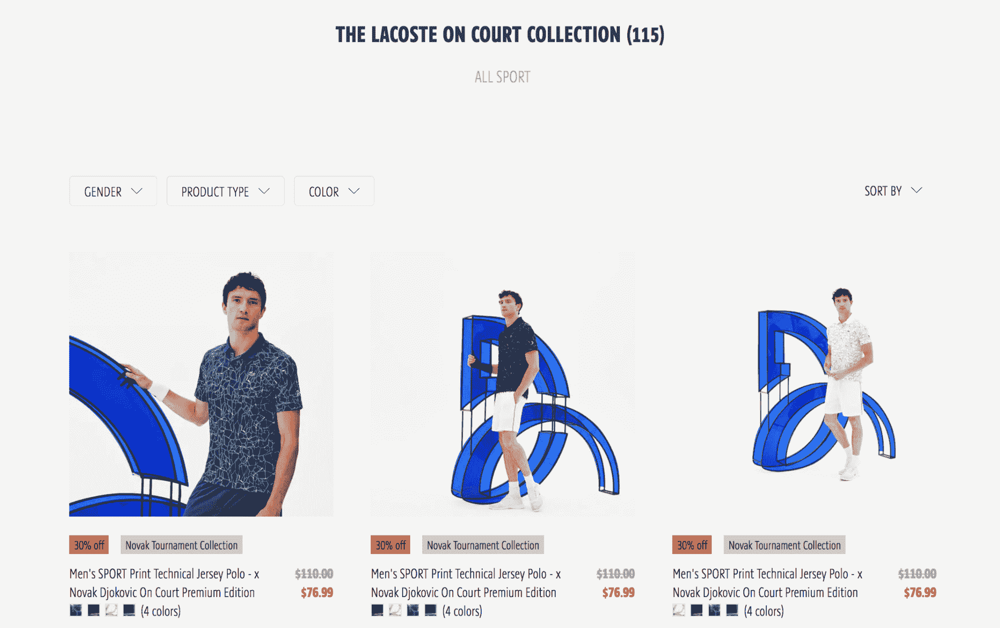
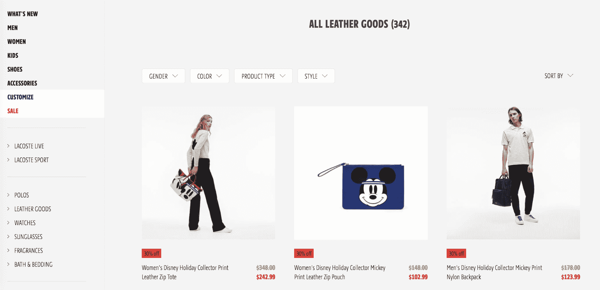

# 个性化销售:解决电子商务中的上下文问题

> 原文：<https://www.algolia.com/blog/ecommerce/personalized-merchandising-e-commerce/>

## 个性化销售如何为产品和用户提供合适的环境

告诉你“个性化销售”包括销售个性化产品，听起来是显而易见的。背景很重要。没有它，像这样的定义对你没什么好处。

但如果我告诉你，电子商务零售商面临的最大挑战之一是通过为他们的产品和顾客提供背景来进行营销，那会怎么样？

能够在你的电子商务店面上销售商品应该是理所当然的。但是，当您考虑实体店和数字全渠道生态系统之间的差异时，需要克服物理和战略两方面的挑战。

使用网站搜索和个性化销售，您可以在满足用户意图的同时考虑您的业务需求，从而解决上下文问题。这一切是如何运作的？

## 现实生活中商品销售的优势

销售是零售商为其产品添加内容的一种方式。即使环境(例如季节性、受欢迎程度或战略 KPI)不断变化，目标仍然不变:通过突出符合您环境的产品，您可以加速用户进入购物车，扩大平均购物篮大小，并提高整体转化率。

无论是实体渠道还是数字渠道，销售都应该是零售商促销策略的重要组成部分，但事实并非如此。即使目标相同，方法却大相径庭。

考虑一下传统的砖瓦店。这些商店的物理事实具有在线店面永远无法复制的真实性。

实体店受限于他们对商品的创造力。零售商知道，购物者的 [刺激阈值](https://www.shopify.com/retail/impulse-buying-how-retailers-can-get-customers-to-buy-more-on-the-fly) 可以被动摇，从而引发购买。通过有目的的营销，你可以充分利用产品的曝光度来提升知名度、客流量，当然还有销售额。这样做的一些方法包括:

*   橱窗和店内展示
*   控制楼层布局
*   五彩缤纷的装饰
*   促销产品位置
*   将相关产品分组在一起
*   柜台追加销售

经营实体店的零售商可能会想当然地做出决定和采取行动，比如，将一件季节性冬季夹克放在商店最前面进行促销。这种灵活性和移动的自由是数字战线所不具备的。

## 数字化销售是另一回事

对于电子商务来说，相比之下， 感官被滚动条和点击取代。突然间，导航变成了数字商店的一个挑战。一个典型的用户界面会有一个菜单栏，可能在边上还有一些面，依靠用户一页一页地点击来找到他们要找的东西。使用这样一个基本导航系统并不容易。

将搜索整合到你的全渠道架构中有助于导航。 [用户更喜欢通过内部搜索引擎进行操作](https://www.cludo.com/blog/search-vs-navigate-people-behave-websites-search-navigate/) — 59%的用户经常使用搜索来导航，15%的用户更愿意使用搜索而不是菜单。因此，使用搜索栏显示平均转化率[上升，从 1.7%增加到 2.4%。](https://econsultancy.com/four-reasons-why-site-search-is-vital-for-online-retailers/)

尽管如此，购物者需要解读在线界面来找到他们想要的东西，这就限制了商家如何进行数字化销售。使用搜索减轻了导航的一些障碍，但实际的销售，实际的产品聚焦，仍然是一个挑战。

电子商务人士的商品选择仅限于在主页或用户界面上进行推广。例如，你可以在主页上展示一个针对季节性冬季销售的图形广告。你甚至可以展示几个循环播放的广告，每个广告都不同，并经过优化性能测试。

然而，这种一般的销售方法能有多好呢？你看，营销并不是一个放之四海而皆准的策略。每一个用户、每一个细分市场都是独一无二的，把营销网撒得那么宽，必然会导致机会从缝隙中溜走。

电子商务零售商如何捕捉购物者的独特偏好，同时将他们的背景与正在搜索的产品联系起来？

## 个性化如何帮助？

在销售体验中加入一点个性化元素可能是答案。

个性化反映了用户自己独特的背景。事实证明，特异性对用户来说非常重要。53%的网购者认为 [个性化的购物体验是有价值的](https://www.invespcro.com/blog/online-shopping-personalization/) 。同样，当个性化和专有客户数据被整合后， [收入增加 6%至 10%](https://www.bcg.com/en-us/publications/2017/retail-marketing-sales-profiting-personalization.aspx#9-11110-1) 。

当购物体验个性化时，用户在任何接触点的行为都会实时告知结果，从而显示每个细分市场的策划内容。

这实际上只是一种奇特的说法，即个性化让你用与用户相关的内容来回应用户的意图，这是 Algolia 已经关注 [一段时间了。](https://www.algolia.com/blog/personalization-announcement/)

在搜索的背景下，你也可以说个性化是一种“超相关性”如果用户搜索“毛衣”，但看到的结果是“袜子”，购物体验可能不会很个性化。

个性化搜索根据购物者的偏好定制他们看到的结果，并在你的全渠道平台上预览行为。结果集在接近意图方面的准确程度会影响用户满意度— [74%的消费者](https://www.janrain.com/company/newsroom/press-releases/online-consumers-fed-irrelevant-content-favorite-websites-according) 在看到不相关的结果时会感到沮丧。

有了网站搜索架构，你可以保持你的相关性，进而保持你的个性化。网站搜索捕捉的意图与其说是一张大网，不如说是一个精确的箭头。衡量几个标准，如拼写和过滤器，产品排名，让用户直接看到最相关的结果。

在这些标准中，业务指标，例如利润和销售量，也可以在排名过程中考虑。正是在这里，搜索和个性化销售变得活跃起来。

## 提供个性化商品销售环境

个性化营销通过直接和单独与用户沟通，但最重要的是通过协作，来解决电子商务问题。

到目前为止，我们知道电子商务带来的物理限制使销售变得非常困难。不断发展的搜索不仅软化了导航问题——它让零售商能够调整搜索相关性，个性化购物体验。

这就是有趣的地方。

当使用网站搜索的购物者沿着他们的购物之旅前进并仔细阅读你的数码商店时，由于他们将会看到相关的结果，这种体验将会变得近乎个人化。

但这还不是全部。

[使用个性化营销，双方的声音响亮而清晰](https://goto.algolia.com/customer-business-relationship)——不仅你的用户意图被听到，你的商业目标也被听到。

每个购物者都是独一无二的，他们的意图可以代表无限的声音。一个好的网站搜索引擎提供文本相关性，确保即使是最接近的查询也能匹配用户的意图。无论是什么样的查询，你都可以返回与每个变化、每个细分市场的销售目标相关的内容。

这就是个性化营销的美妙之处——它将用户和企业的背景结合起来，共同强调它们。编织到结果中的是与用户的搜索意图以及你的业务指标相匹配的产品。

对于在 [Lacoste](https://www.lacoste.com/us/) 的人们来说，他们很清楚一个网站搜索解决方案对他们的全渠道环境的影响。

快速浏览一下他们的主页就会发现，除了聪明的商品选择，他们还在页面顶部增加了一个显著的搜索栏。

虽然我们不知道 Lacoste 团队选择强调什么样的业务指标，但很明显，他们是故意突出一些产品。

在搜索“网球”时，购物者看到的第一个结果是正在促销的高级系列，尽管描述中没有系列搜索词本身。

搜索“皮革”，Lacoste 与合作伙伴合作的产品会出现在搜索结果的顶部。

在将网站搜索整合到他们的在线和移动平台后， [Lacoste 的搜索使用量增加了 210%](https://goto.algolia.com/lacoste)。因此，转换率增加了 37%，销售贡献增加了 150%。

如果您正在寻求通过个性化商品销售来转变您的电子商务业务，并为您的购物者和您的产品提供合适的环境， [请与我们的搜索专家之一](https://www.algolia.com/schedule-demo?origin=#schedule-demo)交谈。