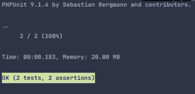
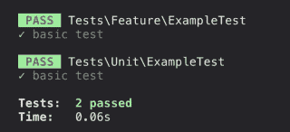
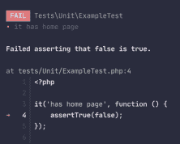
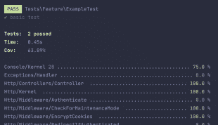

# Pest，一个简单而优雅的 PHP 测试框架，它扩展了 PHPUnit | Algolia Blog

> 原文：<https://www.algolia.com/blog/engineering/pest-a-testing-framework-that-goes-above-and-beyond-phpunit/>

构建第三方 API 时，在你见过或能预见的每一个运行时场景中测试你的代码是很重要的。为此，一个健壮且易于使用的&维护测试框架是必须的。作为 PHP 开发人员，我们严重依赖于 [PHPUnit](https://phpunit.de/) ，但是我们切换到了[害虫测试框架](https://pestphp.com/)，这简化并减少了我们庞大的测试代码库。

鉴于我们执行的测试数量，并试图覆盖我们代码库中的每个功能，我们需要简化测试代码，使其更易于维护、理解和调试。我们还想确保我们的测试框架需要很少的努力就能集成到 Laravel 中。

在本文中，我们来看看 Pest ，这是一个健壮的测试框架，构建在 PHP 的标准测试库 PHPUnit 之上。

## [](#reducing-the-testing-code-base-of-phpunit-with-php-chaining)用 PHP 链接减少 PHPUnit 的测试代码库

部分受 [Ruby Rspec](https://relishapp.com/rspec/rspec-core/docs/subject/one-liner-syntax) 中单行代码“it”语法的启发，Pest 自己的语法相当简单。Pest 去掉了 PHPUnit 中需要的命名空间和库引用，不需要 *扩展* 上百个函数。它只需要你指定测试函数——使维护和调试变得容易得多:

```
it('is an example, function () {
    assertTrue(true);
});

```

尽管如此，3 行代码乘以 100 次测试可能还是太多了。Pest 允许你 *连锁* 的功能。结果是一个 liner:

```
it('is an example', function ()->assertTrue(true);

```

因此，Pest 将 PHPUnit 下面的 8 行代码缩减为上面的 1 行代码:

```
namespace Tests\Unit;
use PHPUnit\Framework\TestCase;

class ExampleTest extends TestCase
{
    /** @test */
    public function testBasicTest()
    {
        $this->assertTrue(true);        
    } 
    // ...
}

```

## [](#improving-the-output)提高输出

PHPUnit 为 PHP 用户提供了以非常简洁的方式可视化测试结果的能力:



虽然简洁通常是好的，但我们觉得我们需要更多。Pest 为我们提供了每次测试的更多信息:



对于错误，Pest 允许您直接访问失败的代码行:



最后，如果您想显示已经测试和执行的源代码行数，您可以从`coverage`选项中获得更多信息:



## [](#adding-scalability-with-datasets)添加数据集的可扩展性

与大多数测试一样，数据的质量是关键。除了使用真实和相关的模拟内容，测试质量数据还需要:

*   对数据的大小变化进行多重测试
*   无需任何重新编码即可添加新用例的能力

使用 Pest 的“数据集”，您可以创建一个测试，该测试采用一个 *内联* 数据数组。例如，您可以测试多封电子邮件，每封代表一个不同的用例(可能是连接性):

```
it('has emails', function ($email) {
   expect($email)->not->toBeEmpty();
})->with([
   'someone@jmail.com',
   'other@example.com'
]);

```

你也可以使用多维数组:

```
it('has emails', function ($name, $email) {
   expect($email)->not->toBeEmpty();
})->with([
   ['Someone', 'someone@jmail.com'],
   ['Other', 'other@example.com']
]);

```

内联就是这么做的。您还可以将数据移出测试以获得更大的灵活性，为此，您将需要以下文件夹结构:

```
—Tests
—---testemails.php
—Datasets
—---emails.php 

```

测试函数放在文件夹`Tests`中，数据集定义在`Datasets`文件夹中的单个文件中。下面是数据集文件`emails.php`的内容示例，它替换了上面的内联电子邮件引用:

```
dataset('emails', function () {
   Return (['other@example.com', 'enunomaduro@gmail.com'];
]);

```

因此测试函数现在可以重用`emails.php`进行测试:

```
it('has emails', function ($email) {
   expect($email)->not->toBeEmpty();
   assertTrue(true);
})->with('emails');

```

## [](#and-more)还有更多

还有许多额外的特性和选项，以及许多断言、期望和异常。不要忘记，Pest 是 PHPUnit 的扩展，所以您可以在测试之前和之后执行操作，就像 PHPUnit 中的`setup`。

这里是最后一个例子。您可以`skip`测试:

```
it('has home', function () {
   // ..
})->skip();

```

`skip`函数向您展示了 Pest 是如何看待测试人员的，并简化了重要的事情。我建议你不要“跳过”Pest——它真的是 PHP 生态系统的一大亮点。

了解更多 [害虫](https://pestphp.com/) ，由[Nuno Maduro](https://twitter.com/enunomaduro)from[@ laravel](https://github.com/laravel)。