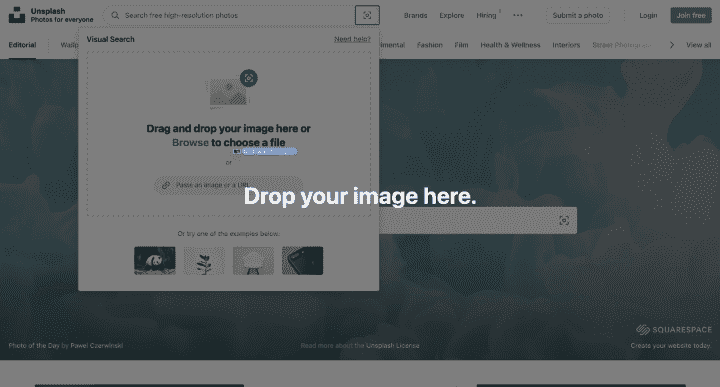
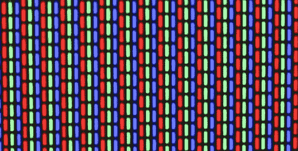
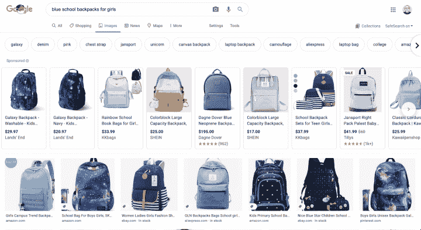
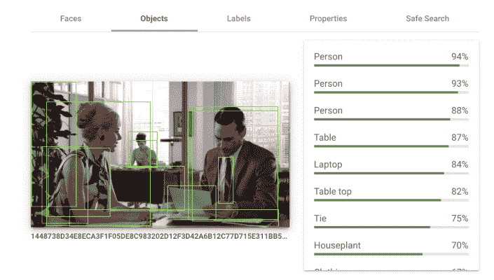
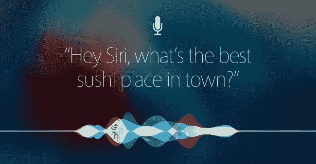

# 图片搜索是如何工作的？

> 原文：<https://www.algolia.com/blog/product/picture-search-how-does-an-image-finder-search-engine-work/>

“一幅画胜过千言万语。”现在我们有了现代图片搜索技术，这句古老的格言仍然适用吗？

所有适应症都是 *和肯定。* 据 [福布斯](https://www.forbes.com/sites/forbestechcouncil/2018/04/02/visual-content-the-future-of-storytelling/#743dc19c3a46) 举例来说，“91%的消费者更喜欢互动和视觉内容，而不是传统的、基于文本的或静态的媒体。”

这并不奇怪，因为人脑的一半以上是专门用于视觉的。

在网络上，就像在任何地方一样，一维文本永远无法与壮丽的风景照片或欢闹的宠物快照相提并论。从自然到热门产品，人们都在叫嚣着要漂亮的照片，他们对数字图像和图像搜索技术的依赖也在不断增长。携带移动设备的年轻人(比如千禧一代，尤其是 Z 世代)已经变得过于沉迷于在几秒钟内找到酷或相关图片的快乐。 所有这些导致了电子商务游戏规则的改变，[视觉购物](https://www.algolia.com/blog/ai/visual-shopping-visual-discovery-how-image-search-is-changing-online-shopping/)。

那些尚未了解图片搜索技术进步的人仍然可以在 Mac 或 PC 上的网络浏览器中输入一个单词或短语进行搜索。但不管什么操作系统，结果都是一样的:你可以调出成百上千各种格式(例如，JPG、GIF、PNG)和不同大小的图片，通过图像检索子类别可以深入了解每一种变化。你甚至可以点击相机图标，找出一个图像的网址起源于网络。

## 【J-Lo 绿色连衣裙】

这可能很难相信，但仅仅在几十年前，今天如此根深蒂固的图像搜索概念在谷歌眼中不过是一个亮点。

2001 年，一群饥肠辘辘的詹妮弗·洛佩兹粉丝在谷歌的搜索框中输入文字查询，希望能看到这位歌手在 2000 年格莱美颁奖典礼上穿过的一件独特的绿色礼服。谷歌高管注意到了这种狂热，(绿色)灯亮了。他们意识到他们必须立即推出一款以图像为中心的基于文本的搜索工具。

剩下的就成为历史了:现在，搜索穿着丛林服装的明星照片或其他任何东西的人可以奢侈地使用图像搜索引擎在数据库中搜寻合适的照片。搜索引擎的选择范围很广，从也提供图片搜索的大牌文本搜索引擎，到“反向搜索”(我们稍后会谈到)的图片搜索引擎，再到图片搜索和面向图片的应用程序。

因为多年来人们一直在成群结队地上传图片到网上(每天有 3 亿张照片上传到网上)，可供选择的照片并不缺乏(确切地说是数十亿张)。一些照片库不断更新新内容，而另一些则是可供搜索的“完整”图像集，但无论如何，找到完美图像的几率都是惊人的。

## 什么是图片搜索引擎？

让我们从基础开始:视觉搜索引擎可以让你专门在网上寻找并下载图像，用于各种目的，比如为博客文章添加插图，活跃主页，在过于冗长的报告中传达一个想法，或者定位你想购买的时尚或家居装饰物品。

人们可以通过各种方式搜索图片:

*   输入描述他们想要的图像的关键字或短语
*   选择菜单上的图像主题
*   在搜索框中粘贴 JPEG 或其他类型的图像文件作为查询(查找相似图像)

Unsplash is one site that lets you drag and drop images into the search field

## 什么是图像？

图像可能看起来很复杂，但它们实际上只是被照亮或未被照亮的像素的集合。如果你曾经近距离观察过电视，你会看到类似这样的图案，这是原色像素红色、绿色和蓝色(RGB)的照明:

To create an image, millions of pixels are assembled in a grid, and
based on which ones are lit up, you see something different

## 一个图片搜索引擎是如何工作的？

简而言之:图片搜索引擎[的工作方式与文本搜索引擎相同，都是为了给你提供最相关的结果:它根据关键词或图片调出一堆图片。当通过文本搜索时，图像搜索考虑模式，然后根据匹配将您指向网站。](https://www.algolia.com/blog/ai/visual-shopping-visual-discovery-how-image-search-is-changing-online-shopping/)

与图像相关联的文本，例如其文件名，也可以在图像搜索和发现过程中发挥作用。搜索引擎确认图像与关键字相关，这包括检查图像出现的网页上的数据。

在许多情况下，你可以根据文件名和你想要的上下文找到一个图像。根据您搜索查询的广度，图像搜索引擎还可能提供一组具有匹配内容的图像，然后您可以识别特定的上下文，以便深入查看并找到您需要的完全正确的照片、图画、绘画或其他类型的图像。

### 从漂亮的图片到数学公式…

在这个看似毫不费力的瞬间拍照任务背后，到底发生了什么？

视觉搜索基本上是将图像的网格/矩阵输入到一个经过训练的神经网络中，以解释输入。神经网络是非常强大的机器学习工具，用于从图像中分析和提取视觉信息。

通过训练网络识别相似的视觉模式来找到相似的图像。这个过程也可以用于识别特定的对象，例如人脸。

例如，如果你要求谷歌图片搜索功能找到与你提供的图片相似的东西，它会进行所谓的基于内容的图片检索(CBIR)；它分析图像以收集细节，如颜色和纹理。然后，它会创建一个查询来匹配其他(数十亿)图像，为您提供最相似的匹配。

为了使用文本输入进行视觉搜索，将文本转换成数学(向量)。为了训练和搜索优化，文本、图像替代文本和相关联的图像以数学方式一起表示。文本的概念被编码在向量空间中，通过训练，模型学习它们与图像的关系。换句话说，它会计算出图像是什么，并能够提供类似的项目结果。

### ……在艾的一点帮助下

视觉搜索也依靠[先进的算法](https://www.algolia.com/blog/ai/visual-shopping-visual-discovery-how-image-search-is-changing-online-shopping/)将它引向正确的方向。人工智能(AI)模型描述图像中发生的事情的能力——以及将它们分类到不同的组中以提供视觉搜索结果——是无与伦比的。

这种类型的搜索可以从必应、谷歌图片、谷歌搜索以及 DuckDuckGo(通过必应)获得。谷歌已经使用进行网络和谷歌照片图像搜索。

例如，这个谷歌图片标签显示了从互联网上的文章和博客文章中可能的数百万个匹配中提取的内容及其上下文:

Visual search is a transformational ecommerce feature for both sellers and buyers

最好的消息？公共图片搜索引擎使用的模型可供任何人和任何公司使用。

在线视觉搜索 API，如谷歌视觉 API，展示了可以实现的目标:

The Google Vision API analyzes an image to generate useful metadata for search

## 提取结构化数据的优势

从图像中提取结构化数据有几个积极的原因:

*   图像数据可以与其他结构化信息(如文本)结合
*   它可以与现有的文本搜索界面配合使用
*   它支持基于语音的查询

第一个优势是巨大的。将图像转换成常规文本和结构化数据在现有的搜索技术中还算不错。这意味着它可以很容易地扩展到 [滤镜、刻面](https://www.algolia.com/blog/ux/filters-vs-facets-in-site-search/) 等等。关于第二点，一个人们熟悉的搜索界面是一大优势。

与使用图像作为完整查询相比，提取结构化数据有明显的优势，同时也为您的用户提供了一种过滤数据的方式。例如，如果有人想搜索“50 美元以下的蓝色圆点连衣裙”，图像分析将非常适合识别正确颜色和图案的匹配，但它不能提供价格。因此，在这种情况下，从图像中提取信息更有意义，然后可以将数据与价格字段结合起来(从而通过过滤价格提供更强的相关性)。

第三个优势，兼容 [语音查询](https://www.algolia.com/industries-and-solutions/voice-search/) ，也是意义重大。在一篇关于视觉搜索的博客文章中，你可能会认为语音搜索的概念似乎很奇怪，但语音识别和图像分析是一个不容忽视的强大组合。Siri、Alexa 和其他语音驱动程序的崛起将语音搜索推向了主流。例如，当你将它与基于人工智能的视觉分析结合起来时，你可以搜索像“一座被红杉树环绕并能看到风景的房子”这样的东西

Visual search and voice search influence how marketers should think
about search engine optimization. Image credit: How-To Geek

## 图片搜索引擎类型

图像搜索引擎是搜索引擎的一种，图像搜索引擎还有各种子类型。主要的图像搜索引擎类型包括(有时会重叠):

### 一般图像搜索

听起来是这样的:你会访问知名搜索引擎，开始浏览一个简单的、可能有很多变化的图像，比如一束花或一个著名运动员的照片。一个通用的图像搜索引擎可能会给你提供各种各样的选择。

### 股票图片搜索

库存图片是一种已经被拍摄(或以其他方式创建，如插图)、编辑(可能经过润色)，然后在网站数据库中可供公司或个人下载使用的图片。库存图像大多是有版权的，但它们可以是许可的(你支付版税)，免版税(你支付一次性费用)，免费但要求你信任摄影师，或者完全免费(甚至可能免费改编并在你自己的项目中使用)，不需要署名。

### 反向图像搜索

如果你有一张图片，并想找到类似的其他人，或者了解谁在使用你拍摄的照片或你创作的艺术品(无论是否得到你的许可)，或者破译图片在网络上的出处，或者做任何其他 [有趣的事情](https://www.geekdashboard.com/benefits-of-reverse-image-search-in-everyday-life/) ，反向照片搜索是你的朋友。您只需将图像文件作为搜索查询粘贴进去，搜索结果就会指向图像的来源或与之相关的项目。

## 令人印象深刻的拍照引擎

具体来说，你有没有用 Google Lens 或 Pinterest Lens(“Shop the look”)用手机拍下某样东西然后用反向图片查找通过搜索一张网上图片来识别的经历？这是令人惊叹的技术，而且触手可及。

Looking for the best tulips with the Google Lens mobile app

说到图片搜索引擎，你有很多选择。这完全取决于您的图像需求和偏好，以及您喜欢如何使用功能进行搜索(例如，浏览大量一般类别的页面或使用过滤器立即获取特定内容)。

最好的图片搜索引擎通常不会由评论者进行排名，因为它们在提供的产品、界面功能、收费和版税自由以及优势方面都略有不同。然而，如果你问一个业余摄影师、平面设计师或网页内容创作者，他们可能会告诉你没有单一的“最佳”图片搜索引擎，但他们会接着提到他们更喜欢的搜索选项，以及为什么。

按照传统标准，有一些非常明显的领先者。这里有几个被广泛认为是赢家的图片搜索引擎:

### 谷歌图片

这里没什么好惊讶的。就像传统的基于文本的 Google 一样，[Google Images](https://images.google.com/)是在网上寻找大量照片和其他类型图像的精英:最全面的图像搜索体验，加上最出色的方式(强大的界面和大量的过滤器)让你可以找到它们。

如果你预算有限，你可以根据使用权对你找到的谷歌图片宝藏进行分类。

谷歌图片也有一个高级(通过设置)选项，帮助你得到具体的。它还提供了强大的照片反向查找功能:你可以简单地从手机的相机胶卷、Dropbox 文件夹或谷歌硬盘中粘贴一张照片，然后搜索相似的照片。

### 兵

想跳过领跑者，给比赛一个机会吗？访问微软 [【必应】](https://www.bing.com/visualsearch) 的图片搜索引擎的主页，它拥有下一个最大的图片数据库。它的优点包括一个超级丰富多彩的界面(而谷歌只给你显示搜索栏开始)，大缩略图，突出的过滤选项，热门项目，优秀的视频搜索功能，以及可以稍微更快地观看视频而不必被迫上传到 YouTube。

[有人](https://www.pcworld.com/article/435332/the-4-reasons-i-switched-from-google-to-bing.html) 认为由于种种原因，Bing Images 优于 Google Images。当然你不能用必应搜索一张图片，但是如果搜索体验和图片结果一样好或者更好，谁会在乎呢？

### 雅虎

为什么你会想在 [雅虎](https://images.search.yahoo.com/) 上使用图片搜索工具，而不是在谷歌或必应上使用？好吧，雅虎拥有摄影分享和社交网站 Flickr(下面会有更多)，所以它的数据库里充满了摄影师提供的很酷的照片。优雅的 Yahoo image 界面允许您使用高级过滤器来缩小图像搜索结果，例如许可证类型、文件格式和图像大小等参数。

### Flickr

业余和专业摄影师拍摄的照片组成了【Flickr】，它拥有数百亿张照片，令人惊叹的视觉体验，更不用说作为寻找正确相关图像的起点了(其中一些是免费的)。由于 Flickr 是一个社交媒体类型的网站，你可以“关注”摄影师；它还拥有惊人的*200 万用户群，* 它将其视为“我们社区的连接力量，将拥有共同兴趣的成员聚集在一起。”嗯！这个网站很可能就是“唯一”

### Pinterest

[Pinterest](https://www.pinterest.com/)用户在这个图片搜索网站上创建“图钉”——保存内容的书签，该网站自称是“寻找食谱、家居和风格灵感等想法的视觉发现引擎……”一个很酷的功能是:你可以裁剪和搜索图片的一部分。如果你是那种沉迷于装饰和快乐家务的人，Pinterest 很容易成为你的天堂(如果它还不是的话)。

## 股票照片搜索引擎

面向商业需求，图片收藏网站提供图片，其中许多图片都有吸引不同主题的主题，作为摄影师定制照片拍摄的经济替代方案。这里有几个主要的股票照片网站供你探索

### 快门

平面设计师、营销机构和其他商业人士中最大、最知名的资源之一，[Shutterstock](https://www.shutterstock.com/)是想出购买订阅以下载库存照片这一概念的人。这个网站不仅提供免版税的照片，还提供视频和音乐。

### 盖蒂图片

[Getty Images](https://www.gettyimages.com/)提供 3.5 亿张高质量的、档案性的、有时是独家的图片，目标是财大气粗的商业授权。它的图像通常价格较高，并且有使用限制(例如要求图像只能在特定的时间范围内显示)。其 [的一些做法](https://www.seattletimes.com/business/technology/its-crunchtime-for-seattle-based-photo-giant-getty-images-and-for-photographers/) 一直备受争议。

### iStock

如果你不是企业巨头或者预算有限，那么[iStock](https://www.istockphoto.com/)，盖蒂图片社的“微型图片库”子网站(免版税图片)，可能是你开心拍照的地方。

## 反向图像搜索

### TinEye

总部位于多伦多的[TinEye](https://tineye.com/)之所以出名，是因为它是 *最早的* 逆向图片搜索工具，也是第一个使用图片识别技术代替关键词的工具。这发生在谷歌增加反向图片搜索引擎功能的三年前。TinEye 还认为其匹配优于谷歌，并认为它在查找裁剪和编辑过的图像方面胜出。

一个令人失望的问题是:你可以上传到 TinEye 进行反向搜索的最大图片大小只有 20 兆字节，这意味着你可能要经历首先以较低分辨率保存照片的麻烦。

### 谷歌反向图片搜索

谷歌当然是反向图片搜索子类别的主要参与者。你可以上传的图片大小没有限制，这意味着你可以快速 [反向搜索](https://www.businessinsider.com/google-reverse-image-search) 无论你处理多少兆字节。

### 【Pinterest 镜头】

Pinterest 上的反向图片搜索功能 [Lens](https://about.pinterest.com/en/lens) ，可以方便地让人们拍摄他们在世界上看到的事物的照片(例如，某个不同国家的人穿的一件时尚衣服或朋友公寓的必备家居装饰)，然后在网上寻找类似的物品照片。2020 年，Pinterest 为 Lens 增加了一个专用的 [购物标签](https://newsroom.pinterest.com/en/post/shop-with-your-camera-pinterest-launches-shop-tab-on-lens-visual-search-results) ，将商品图片链接到公司的电子商务结账页面。

## 申请单

谷歌也有一个“镜头”功能，一个图像识别应用程序(可从 iOS 和 Android 商店下载)。[Google Lens](https://lens.google/)做视觉分析并提供相关信息；它可以翻译文本，识别动物，调出相似的图像，等等。

也有一些专门用于反向搜索的应用，包括:

## 如何找到免费图片

有些图片的许可费很高，虽然现金充裕的公司支付高额费用没有问题，但如果你只是想找些有色彩的东西来为枯燥的时事通讯增色，找到完美的图片后发现它的价格很高，而你又不能或不想付费，这可能会令人沮丧。

幸运的是，有一些图片搜索引擎不仅致力于提供免版税的图片，还提供 *实际上免费的* 图片， 一些无任何附加条件的图片。为此，你可以感谢一个名为 Creative Commons(已更名为[Openverse](https://wordpress.org/openverse/))的非营利组织，该组织致力于培养互联网上的创造力和分享。

Openverse 界面允许搜索大量图片。图像转载许可的范围从狭窄的(要求注明图像的原始来源)到非常自由的(允许以新的方式使用甚至改编艺术家的作品，用于自己的创意项目，而不引用图像来源)。

虽然你可以在普通网站上搜索 Openverse 许可的图片，但你也可以在更大范围内专注于免费图片，其中许多图片不需要付费。其中包括:

### every pixel

[every pixel](https://www.everypixel.com/about#:~:text=Everypixel%20finds%20the%20best%20photos,of%20stock%20photos%20in%20seconds.)的人工智能搜索引擎在一个巨大的数据库中索引它在 50 个图像网站上找到的内容，使用各种类型的过滤器可以很容易地进行搜索。

### 【书库】

该组织的多站点搜索引擎从许多其他免费图片收藏网站中挖掘公共领域专用(可使用，无归属)的照片，并使这些照片都可以从其界面访问。不幸的是，[libre stock](https://librestock.com/)提供的照片比其他网站少(在撰写本文时大约有 5400 张)，但是，嘿，如果它们是免费的，你怎么能抱怨呢？

### Pixabay

这张图片 [网站](https://pixabay.com/) 为搜索者提供了超过 250 万张高质量的图片(包括插图和矢量图形)，还有视频，外加音乐。

## 电子商务图片搜索应用

视觉搜索是基于文本和语音的搜索功能的强大替代，特别是对于像 [电子商务搜索](https://www.algolia.com/industries-and-solutions/ecommerce/) 这样的用例。

图片搜索引擎还包括在线商店使用的人工智能应用程序，以帮助他们的客户更快地找到并购买所需的商品。当购物者输入某样东西的图片，比如一套服装，搜索引擎会寻找完全匹配和类似的商品(也可能来自其他品牌)。它还可以基于它所知道的顾客偏好或经常与目标商品一起购买的商品来提出图像建议。

这种图片搜索技术很有前景:根据[Invesp](https://www.invespcro.com/blog/the-state-of-visual-search/)的调查，74%的网上购物者认为基于文本的搜索在找到合适的产品时是无效的，72%的人说他们“在购买前会定期或总是搜索视觉内容”

来自的统计数据支持这种强劲的消费者需求:预计到 2023 年，全球视觉搜索市场将达到近 1500 万美元。另外，[【Gartner](https://www.business2community.com/infographics/the-rising-popularity-of-visual-search-in-2021-infographic-02378495)预测，2021 年快速适应并重新设计网站以支持视觉搜索的公司将增加 30%的数字收入。

一项研究(国家研究集团)发现，消费者看到视觉搜索结果后，受影响购买的可能性增加了 50%。对于零售商来说，这是投资视觉搜索的一个相当有说服力的理由。电子商务和家居装饰可以说是最好的用例。

整个视觉搜索引擎公司也涌现出来提供人工智能驱动的“计算机视觉”，特别是针对电子商务用例。

视觉搜索不仅仅用于销售产品。 [增强现实](https://www.zdnet.com/article/augmented-reality-and-3d-will-accelerate-adoption-of-ecommerce/) (AR)预计将在未来几年产生数十亿美元的商业相关销售额，特别是在千禧一代和 Z 世代中，视觉搜索将占其中的很大一部分。就连[Snapchat](https://arinsider.co/2019/02/05/whats-behind-snapchats-visual-search-play/)也钻进了针对 AR 优化的视觉搜索的游戏。

## 视觉搜索的方向:无处不在

除了公共搜索引擎和大型电子商务，使用图片搜索的能力仍然相当有限。然而，图像搜索的世界正在快速变化。随着这项技术进入小型企业，你可以期待在未来几年看到更多的视觉搜索功能。

两个例子:

*   **脸书** 更新过去大多是文本，后来变得更加视觉化
*   **Instagram** 和 **Pinterest** 都已经成为视觉社交平台

## 实施视觉搜索

那么，你如何为你的 电子商务 网站或应用程序实施视觉搜索呢？这里有几个灵感的点子:

*   **Amazon.com**在 2019 年增加了一个名为[style snap](https://www.amazon.com/stylesnap)的视觉搜索功能。它让购物者通过使用人工智能支持的图像(或截图)搜索来寻找时尚和家居装饰物品。除此之外，这个工具还为喜欢用 iPhones 或 Android 手机在社交媒体上发布时尚发现的有影响力的人提供了燃料。
*   在 **Algolia，** 我们使用谷歌视觉 API 为电子商务数据库添加视觉搜索功能。有了这个 API，我们可以在图像被索引时自动从图像中提取 [颜色](https://www.algolia.com/search-inspiration-library/color-visual-filter-marketplace-mobile/) 和其他元数据，然后可以使用它们来设计搜索过滤器和方面。现在，每当有新产品添加到网站时，API 都会自动提取颜色数据以用于过滤器。

下面是它的样子:

Using color extraction to generate image metadata that can be used for visual search

*   Algolia 还为电子商务提供了一个 [反向图片搜索](https://www.algolia.com/doc/guides/solutions/ecommerce/visual-image-search/tutorials/search-by-image/) 应用程序:公司可以使用第三方 API 或平台来使用图片作为搜索查询。

### 其他与图像相关的应用

此外，图像搜索技术的一些应用不需要进行图像搜索，甚至不需要搜索栏。例如，Algolia 有一个应用程序，它结合了图像搜索技术，可以快速识别交付包裹的收件人，以便方便地传递物品。光学字符识别(OCR)用于从标签图像中提取文本，但产生的内容可能包含错别字，因此集成搜索技术将图像考虑在内。具有健壮的、适应性强的相关性的搜索引擎可以将 OCR 非结构化文本与结构化数据集进行匹配，并返回准确的结果。

## 一幅美丽的大图

毫无疑问，图像搜索网站和应用程序已经席卷了互联网。目前，图像搜索引擎还不会取代基于文本的搜索引擎，但它们在在线搜索世界中是一个强大且不断增长的存在。搜索的未来不会只围绕视觉、语音或文本搜索。它将包含所有这些——而它们仅仅是开始(等着瞧吧，直到我们有了)。

消费者似乎有无限的绝佳选择来挖掘完美的照片或其他视觉元素。公司正忙于优化视觉搜索，以吸引和留住客户。企业界正日益受益于 [图像搜索](https://www.algolia.com/doc/guides/solutions/ecommerce/visual-image-search/) 技术的推出。

想要优化 *你的* 电子商务网站搜索先于你的竞争对手看到像素背后的光芒？ [今天就把](https://www.algolia.com/contactus/) 和我们的团队联系起来，让我们设想你所有的可能性。