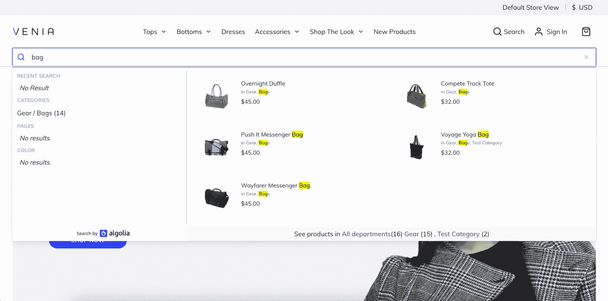

# 使用 Algolia 在 Adobe PWA Studio 中支持高级搜索

> 原文：<https://www.algolia.com/blog/product/powering-advanced-search-in-adobe-pwa-studio-using-algolia/>

渐进式网络应用(PWA)彻底改变了我们创造和消费数字体验的方式。PWAs 是 web 应用程序，提供类似本机应用程序的体验，包括离线功能和跨多个设备的流畅性能。 [Adobe 的 PWA Studio](https://developer.adobe.com/commerce/pwa-studio/guides/) 为开发者提供了一套工具和组件，帮助他们在 Adobe Commerce / Magento 开源后端之上轻松高效地构建和部署 PWA 店面。它使开发人员能够创建高质量、引人入胜的 pwa，可从任何设备访问并提供无缝功能。

## 介绍 Adobe 的 PWA Studio 的 Algolia 扩展

Algolia 是一个强大的搜索和发现平台，帮助企业提供闪电般的搜索结果并改善用户体验。Algolia 的搜索平台旨在轻松适应任何前端架构，PWA 也不例外。超过 1，300 家零售商在 Adobe Commerce / Magento 上使用 Algolia 搜索，我们希望让客户更容易理解我们的 React 组件在 PWA Studio 中的实现。我们很高兴宣布 Adobe 的 PWA Studio 的 Algolia 扩展。

要开始，在 GitHub 上查看资源库:[https://GitHub . com/algolia-samples/algolia search-magento-2-pwa](https://github.com/algolia-samples/algoliasearch-magento-2-pwa)。

Adobe PWA Studio 的 Algolia 扩展构建在 Adobe Commerce / Magento 开源后端和[Algolia search Magento 2 扩展](https://github.com/algolia/algoliasearch-magento-2) 之上。它演示了如何将 Algolia 的[自动完成](https://www.algolia.com/doc/api-reference/widgets/autocomplete/react/)、[即时搜索](https://www.algolia.com/doc/api-reference/widgets/instantsearch/react/)和[搜索洞察](https://www.algolia.com/doc/guides/building-search-ui/going-further/send-insights-events/react-hooks/)反应库集成到 PWA Studio Venia 主题中，以增强搜索体验。

扩展利用 Algolia 的 React 库为[instant search](https://www.algolia.com/doc/guides/building-search-ui/what-is-instantsearch/react/)替换 Venia 主题中的分类页面:

此外，该扩展还使用 Algolia 的 [自动完成](https://www.algolia.com/doc/ui-libraries/autocomplete/integrations/using-react/) 扩展了 Venia 主题的搜索栏，并利用 Algolia 的 [搜索洞察力](https://www.algolia.com/doc/guides/building-search-ui/going-further/send-insights-events/react/#installing-the-search-insights-library) 库发送事件:

你可以在这里 获得更多关于这个扩展中使用的库的确切版本的信息 [。该扩展需要使用](https://github.com/algolia-samples/algoliasearch-magento-2-pwa#readme)[Algolia search Magento 2 扩展](https://github.com/algolia/algoliasearch-magento-2) 创建的 Algolia 索引和后端管理配置。但是，请注意，GraphQL 端点在我们的 AlgoliaSearch Magento 2 扩展中还不可用。因此，您应该为 Algolia 配置手动创建 config.json 文件。为了帮助这个过程，我们包含了一个 [示例 config.json](https://github.com/algolia-samples/algoliasearch-magento-2-pwa/blob/main/%40algolia/src/override/config.sample.json) 以供参考。

## 想了解更多或了解如何尝试 Algolia？

联系我们adobe-algolia-solutions@algolia.com分享反馈！请注意，这不是生产就绪。在 PWA Studio 中展示 Algolia 的[instant Search](https://www.algolia.com/doc/api-reference/widgets/instantsearch/react/)[Search Insights](https://www.algolia.com/doc/guides/building-search-ui/going-further/send-insights-events/react-hooks/)React 库的用法就是一个概念证明。我们很高兴与您讨论最佳实践、权衡，并了解什么最适合您！

以防万一，如果您错过了，请查看我们的“Adobe x Algolia Integrations”系列的其余部分，包括我们的文章: [推荐给 Adobe Commerce](https://www.algolia.com/blog/product/algolia-recommend-for-adobe-commerce/) 。