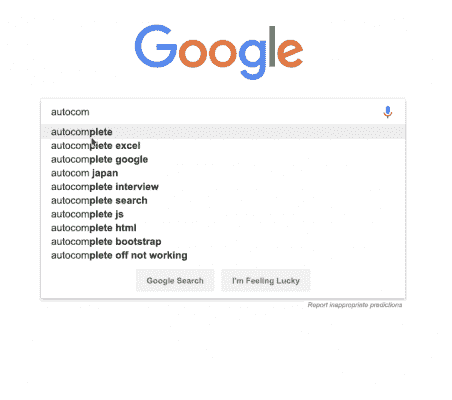
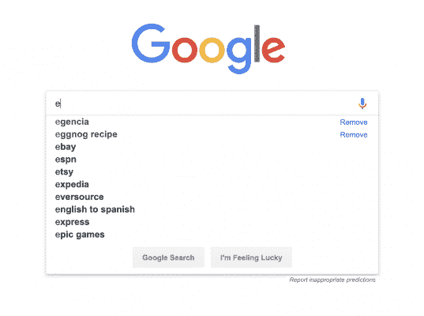
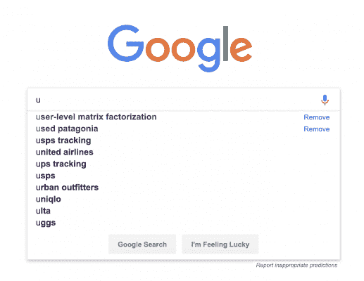
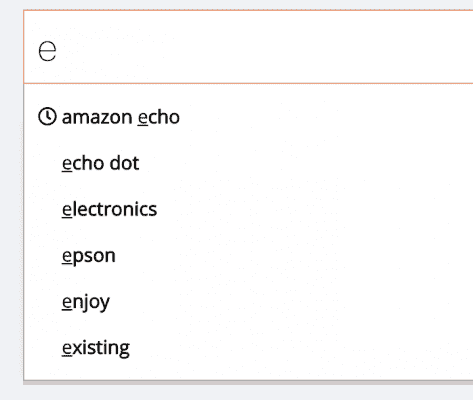

# 建立一个查询建议 UX 喜欢谷歌的-阿尔戈利亚博客|阿尔戈利亚博客

> 原文：<https://www.algolia.com/blog/algolia/query-suggestion-ux-like-googles/>

去年是对我们阿哥利亚人来说是重要的一年。我们雇佣了许多不可思议的人，发布了一些不可思议的新功能。最早的一个是二月份发布的查询建议。它利用我们的分析 API 来创建按受欢迎程度排序的动态建议。它易于实现，允许我们的用户在几个小时内创建一个被谷歌“宠坏”的消费者所期待的 UX。要详细了解该功能的工作原理，请查看这篇 [博客文章](https://www.algolia.com/blog/product/introducing-query-suggestions-better-autocomplete/) 。

TL；DR:我们的查询建议引擎创建了一个最受欢迎的搜索词索引，并每 24 小时刷新一次。这个索引可以用来创建自动完成下拉菜单，Google 让我们很多人都知道并喜欢它。

然而，与谷歌不同的是，这份名单还不是为个人用户量身定制的。

## 那个性化的体验呢？

去年的一个趋势是日益个性化的内容——广告在各种设备上跟随我们，根据我们过去的浏览历史向我们推荐精选内容。例如，谷歌保存了我们的搜索结果(以及其他信息),这样两个坐在一起搜索完全相同的东西的人可能会得到不同的建议。

Algolia 的客户可以通过结合我们当前的查询建议功能和一点额外的工作来重现这种体验:通过在每个用户或每个细分的基础上保存搜索，创建高度个性化的搜索体验。

个性化的保存搜索允许您的用户快速搜索他们经常寻找的内容，而众包建议允许他们更容易地找到他们可能一直在寻找的术语。因为来自我们的查询建议功能的建议是由更广泛的受众产生的，所以它们将更频繁地变化，并且将代表什么是趋势。出于这个原因，我们建议坚持类似于上图所示的比例:1 比 5 表示保存的搜索与建议的搜索。

一个额外的好处是——通过在 Algolia 中建立保存的搜索，而不是依赖某种缓存，如 localStorage，这些保存的搜索可以跨设备使用。这允许用户在手机上搜索，以访问他们在笔记本电脑上进行的搜索。

## 建筑它

查询建议功能可用作实现这一目的的模板。查询建议从我们的分析 API 中提取，以创建新的索引；您必须创建一个新的索引，其中包含最近的搜索。Algolia 以每个字符为基础提取结果，但最好只将“已完成”的搜索发送到 Algolia，以便通过去抖动进行索引—等待一段时间，而不输入任何新字符。

每个已完成的搜索都应该标记上时间戳、计数和进行搜索的用户的用户令牌。每当用户键入特定的搜索词时，计数属性就会增加，并且可以用作 [自定义排名](https://www.algolia.com/doc/guides/managing-results/must-do/custom-ranking/) 属性，以将最受欢迎的搜索提升到顶部。时间戳将允许你清除旧的搜索(比如那些超过 30 天的)，并根据最近的搜索排名。usertoken 将允许您仅在每个用户的基础上调出相关的已保存搜索。

最好为所有用户保存的搜索创建一个大索引，而不是为每个用户创建一个索引，因为索引多个小索引的更新比索引一个大索引的相同数量的更新要慢得多。此外，我们建议在从 API 提取结果时使用我们的 [安全 API 密钥](https://www.algolia.com/doc/guides/security/api-keys/#secured-api-keys) 功能，以增强历史容器化和安全性。

## 在前端

需要注意的是，因为下拉列表是从两个独立的索引中构建的，所以可能会出现保存的搜索和建议。这种体验看起来有点问题，占用了本应短暂停留的下拉菜单上的宝贵空间。因此，它有助于始终显示 1-2 个已保存的搜索，但随后构建额外的逻辑来不显示在已保存的搜索中也找到的任何建议。

一个很好的用户界面是区分保存的搜索和建议。谷歌通过加粗和添加“移除”选项做到了这一点。

另外一个不错的选择是添加一个图标来表示这个建议来自于搜索历史。

【T2

# 宣布自动化个性化

保存用户的搜索行为，并用它来影响未来搜索结果的输出，这是我们去年最大的功能发布背后的基本概念。

12 月 18 日，我们发布了自动化个性化功能，允许我们的用户根据他们过去的行为为他们的最终用户返回个性化的搜索结果。

要考虑历史中的哪些事件——无论是产品页面浏览量、点击“赞”按钮还是通读一篇文章、每个事件的权重以及“相似”项目的评分——都由您决定，并可在 Algolia 仪表盘上进行配置。唯一的额外开发工作是在这些事件发生时将它们发送到我们的 Insights API，并在返回结果时打开“个性化”选项。

剩下的我们会处理。

查看关于个性化的 [博文](https://www.algolia.com/blog/product/personalization-announcement/) 和 [产品页面](https://www.algolia.com/products/search-and-discovery/personalization/) 了解更多信息。

## 供货情况

目前，我们的业务和企业客户可获得查询建议，而自动化个性化仅可用于企业客户。要在您的仪表板上直接启用这些功能，请联系您的产品专家或客户成功经理。

有反馈？发推特给我们@algolia，或者在下面评论。感谢阅读！