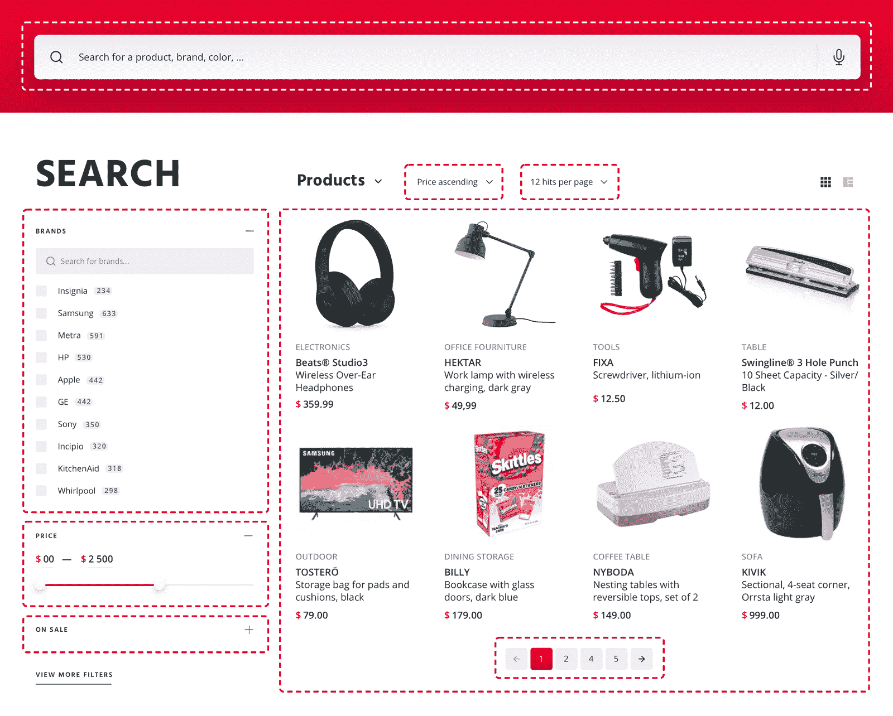
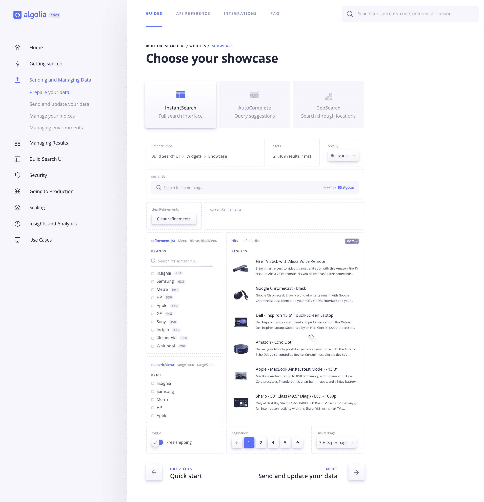

# 重新设计我们的文档——第 5 部分——构建交互式即时搜索展示平台——Algolia 博客

> 原文：<https://www.algolia.com/blog/engineering/redesigning-our-docs-part-5-building-an-interactive-instantsearch-showcase/>

> *这是由七部分组成的[系列博客](https://www.algolia.com/blog/engineering/redesigning-our-docs-part-1-why/)的第五篇文章，描述了我们对文档架构和内容的最新变更。我们在这里关注 CSS 架构和改进我们处理资产的方式。*

搜索界面就像一个拼图游戏。它由许多小部分组成，一旦组合在一起，就成了一个连贯的整体。当构建一个搜索界面时，你是在组装碎片和设计拼图。没有放之四海而皆准的解决方案，只有无数种可能性来满足独特的使用情形。

The pieces that compose a search interface

[InstantSearch](https://www.algolia.com/doc/guides/building-search-ui/what-is-instantsearch/js/) 是一个前端库家族，它提供构建块来帮助你构建搜索界面。它给了你无限的可能性来为你的用户构建你所想象的理想的搜索体验。在许多情况下，您需要的东西是现成的，但是您也可以定制现有的小部件或构建自己的小部件。

然而，当记录这样一个库时，你如何*10x*on*DX*——开发者体验？

## **记录可视化组件的挑战**

书面文档对于 API 客户端或 REST APIs 这样的无渲染软件来说是一个奇迹。在这种情况下，有意义的内容、方便的例子和强大的搜索会大有帮助。

记录 UI 小部件是另一回事。当你在构建一个用户界面时，思维过程会彻底改变。您不再考虑您拥有的数据或执行任务所需的方法。相反，你在考虑你的搜索界面应该是什么样子，你的终端用户如何与之交互。也许你甚至已经准备好了一个模型，你正试图找到合适的部件来实现它。在这种情况下，书面文档是不够的。无论你对一个视觉组件描述得多好，没有什么比看到它的实际操作更好的了。

我们想改变即时搜索的传统文档模式。我们认为，与其让用户通过指南和长长的小部件列表来搜索他们需要的东西，不如让他们直接、直观地知道自己能做什么更有帮助。我们希望在一个真实的搜索界面中展示小部件的运行，并让它们从那里访问文档。

因此，我们构建了一个完全工作的**、**、[、**即时搜索小部件**、](https://www.algolia.com/doc/guides/building-search-ui/widgets/showcase/js/)的交互展示，并将其集成到文档中。

## **UI/UX 流程**

设计橱窗是一项挑战。我们的产品设计师 Nicolas Meuzard 一开始就有复杂的规格。我们希望显示完整的库，显示每个小部件可能的变化，并重定向到它们各自的文档页面。然而，它也需要有一个内聚的感觉:**我们希望展示看起来像一个实际的搜索界面**。这一点很重要，这样用户可以展示自己，并迅速知道他们需要什么。

InstantSearch 是一个丰富的库，所以我们决定将 showcase 分成三种不同的体验:常规的完整搜索界面、自动完成小部件和地理搜索体验。

几经反复，Nicolas 提出了一个无缝集成到文档中的设计。它允许您在三个视图之间切换，并将每个小部件(或一组小部件)显示为虚线块。当您将鼠标悬停在其中任何一个上时，您会看到一个链接，将您重定向到它们的文档。

## **建筑橱窗**

InstantSearch showcase 并不是我们为文档开发的第一个交互工具。在此之前，我们开发了一个动态的[过滤器语法验证器](https://www.algolia.com/doc/api-reference/api-parameters/filters/)和一个[交互式教程](https://www.algolia.com/doc/onboarding/)。这两次，我们都认为将这些工具分开，放在它们自己的库中，并找到一种方法将它们集成到文档中，而不是将所有东西都放在文档库中，这是一个更好的主意。

对于展示，我们决定使用 Vue.js，就像我们对交互式教程所做的那样。我们在一个单独的 S3 桶上提供应用程序，并使用`iframe`将其集成到 docs 网站。

实现本身非常简单。我们使用 [Vue InstantSearch](https://www.algolia.com/doc/api-reference/widgets/vue/) 来显示小部件，它为我们完成了大部分繁重的工作。然而，它也带来了一些有趣的挑战。

### **一个展柜适合所有人**

网页即时搜索有四种风格:[香草 JavaScript](https://www.algolia.com/doc/api-reference/widgets/js/) 、 [React](https://www.algolia.com/doc/api-reference/widgets/react/) 、 [Vue](https://www.algolia.com/doc/api-reference/widgets/vue/) 和 [Angular](https://www.algolia.com/doc/api-reference/widgets/angular/) 。他们每个人都有自己的特点。比如 InstantSearch.js 和 React InstantSearch 自带地理搜索小部件，而 Vue 和 Angular InstantSearch 没有。因此，每当用户访问 vanilla JS 或 React 的 showcase 时，它应该指向地理搜索小部件文档。当访问 Vue 或 Angular 时，它应该会引导我们如何构建自己的地理搜索组件。

很明显，我们应该为所有的即时搜索风格建立并使用一个独特的展示平台。这更易于管理和维护。然而，我们也需要在不弄乱代码的情况下考虑这些特性。

我们有相对较少的不同口味，它们不会有太大的差异，所以我们决定不过度设计，走简单的道路。因为我们在文档中嵌入了带有`iframe`的 showcase，所以我们还将当前的 InstantSearch 风格作为查询参数传递。因此，如果您从`/doc/guides/building-search-ui/widgets/showcase/react/`访问 showcase，showcase 接收“react”作为当前风格，这允许它应用条件逻辑。

### **处理冲突的小部件**

一些 InstantSearch 小部件也有类似的用途，所以我们需要找到一种方法将它们全部显示给用户，而不会弄乱 UI。为此，Nicolas 想出了一个切换器模式。我们将所有相似的小部件分组到同一个块中，显示所有标题，并让用户点击它们进行切换。

然而，有时，这些小部件有不兼容的行为。这意味着你不能同时在同一个 UI 中拥有它们。

我们通过使用[动态组件](https://vuejs.org/v2/guide/components.html#Dynamic-Components)解决了这个问题，这是一个 Vue.js 特性，允许你在运行时动态加载组件。我们一次只显示一个小部件，所以我们可以利用动态组件在小部件之间交换，方法是销毁前者并安装新的，而不是显示它并隐藏其他的。

### **猜测身高**

使用`iframe`的挑战之一是如何优雅地处理高度可变的内容。在我们的例子中，showcase 加载动态内容(搜索结果),因此当您执行搜索、加载更多点击、切换到另一个体验等时会改变高度。可惜从外面看，根本察觉不到高度有变化。

我们通过利用`window.postMessage`方法绕过了这个问题，该方法让我们在文档和展示之间建立通信。Vue.js 提供了一个`updated`生命周期钩子，每次 DOM 重新渲染时都会触发这个钩子。每当展柜改变时，我们使用这个挂钩来发射身体的新高度。该网站监听新消息，并在收到新高度时更新`iframe`的高度。

## **10x DX**

这个展示窗口是即时搜索小部件列表的直接推论，但是在视觉上。它有助于发现即时搜索，而不会被大量的选择所淹没。它还可以帮助用户提高工作效率，因为他们不必浏览小部件来找到他们想要的东西。有趣的是，Algolia 的几名解决方案工程师和销售代表现在在向潜在客户推销 InstantSearch 时使用这个展示平台🙂

当然，如果没有健全的流程，这一切都不会发生。这是我们下一篇文章所涉及的内容，敬请关注！