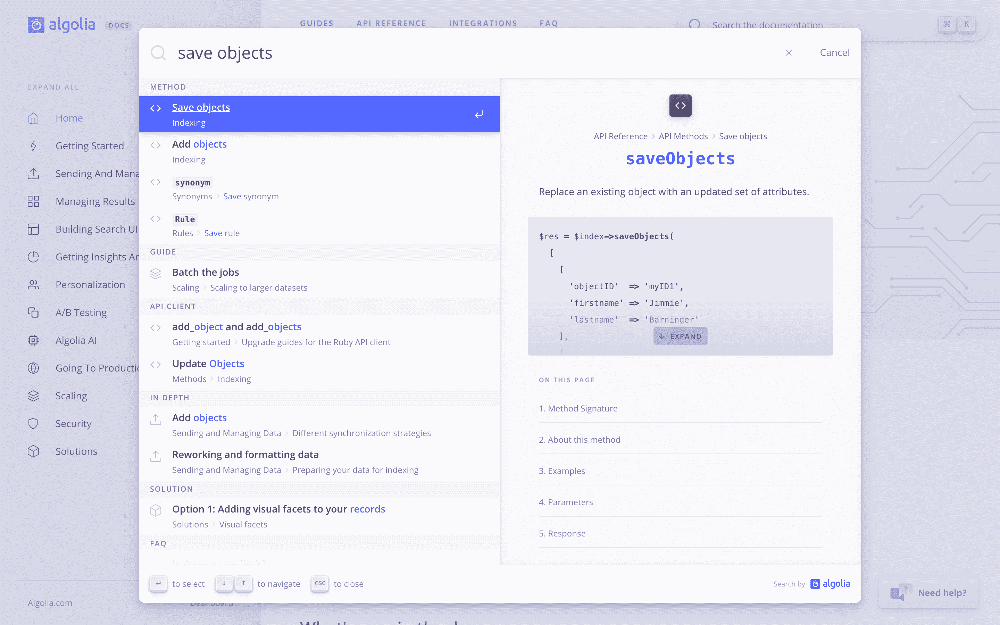
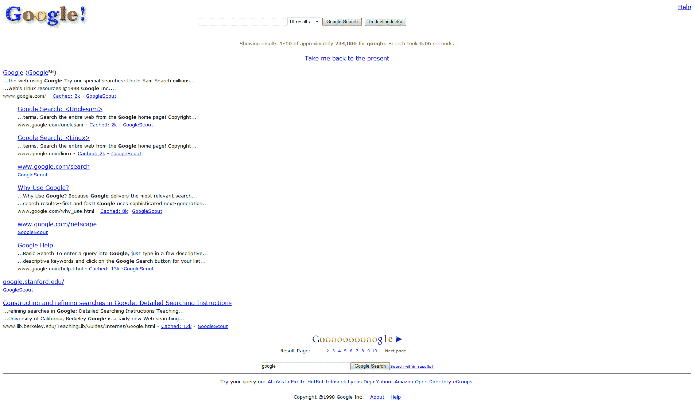
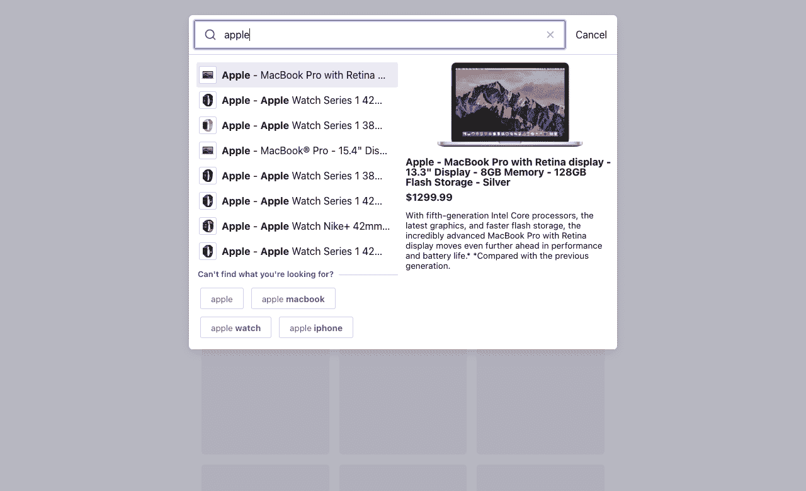
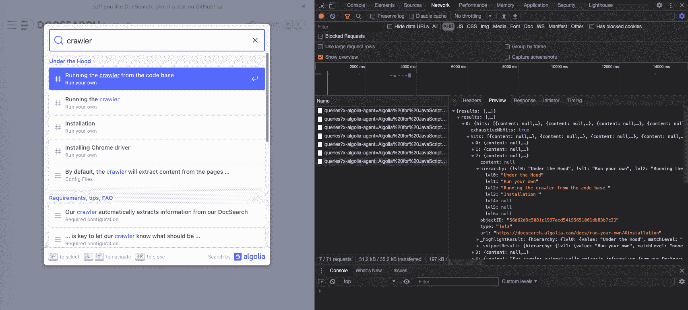

# 使用自动完成功能复制 Algolia 文档搜索

> 原文：<https://www.algolia.com/blog/ux/replicating-the-algolia-documentation-search-with-autocomplete/>

他们说一个 API 和它的文档一样好，但是**好的文档超越了内容质量。**技术文档提供了与 API 交互的体验。对于许多开发者来说，这是你产品的大门。错过这次体验，他们可能会转向下一个类似的产品。

让医生脱颖而出没有单一的秘诀；你需要确定是什么让它与众不同，并创造性地解决它。然而，大多数用户期望的共同点是**快速、相关、设计良好的搜索体验。在 Algolia，我们最近使用开源的[自动完成](https://www.algolia.com/doc/ui-libraries/autocomplete/introduction/what-is-autocomplete/)库[重新设计了我们的文档搜索](https://www.algolia.com/blog/ux/taking-documentation-search-to-new-heights-with-algolia-and-autocomplete/)。**



The new Algolia documentation search

[Autocomplete](https://www.algolia.com/doc/ui-libraries/autocomplete/introduction/what-is-autocomplete/) 是一个 JavaScript 库，用于构建自动完成搜索体验。多年来，它的 v0 已经成功地推动了产品搜索体验。经过一年的研究和努力，我们终于发布了 v1 稳定版，将自动完成搜索体验提升到了一个新的水平。

Autocomplete 已经运行 Algolia 文档搜索体验几个月了，我们已经收到了许多请求，希望教我们如何构建它。我们很高兴看到其他文档利用我们提出的模式，所以我们决定发布一个深入的指南，教你如何用 Autocomplete 构建类似的搜索体验。

## [T15<path fill-rule="evenodd" d="M4 9h1v1H4c-1.5 0-3-1.69-3-3.5S2.55 3 4 3h4c1.45 0 3 1.69 3 3.5 0 1.41-.91 2.72-2 3.25V8.59c.58-.45 1-1.27 1-2.09C10 5.22 8.98 4 8 4H4c-.98 0-2 1.22-2 2.5S3 9 4 9zm9-3h-1v1h1c1 0 2 1.22 2 2.5S13.98 12 13 12H9c-.98 0-2-1.22-2-2.5 0-.83.42-1.64 1-2.09V6.25c-1.09.53-2 1.84-2 3.25C6 11.31 7.55 13 9 13h4c1.45 0 3-1.69 3-3.5S14.5 6 13 6z">T17</path>](#getting-started)入门

首先，您需要创建一个新的 JavaScript 项目。理想的起点是一个最小的[包](https://parceljs.org/)设置，带有一个`index.html`文档和一个`index.js`入口点。你还需要[巴贝尔](https://babeljs.io/)来转换 JSX 模板。

你可以派生或下载这个[code sandbox vanilla JavaScript starter](https://codesandbox.io/s/vanilla)并把它作为一个基础。

### [](#installing-dependencies)安装依赖

本教程使用`@algolia/autocomplete-js`和 [Preact](https://preactjs.com/) 进行模板化。一旦建立了项目，您需要以下依赖项:

*   `@algolia/autocomplete-js`打造搜索体验
*   `@algolia/autocomplete-theme-classic`使它看起来漂亮
*   `algoliasearch`从 Algolia 检索搜索结果
*   `preact`作为你的虚拟 DOM 实现

`@algolia/autocomplete-js`包是自动完成的一个不可知的虚拟 DOM 实现。如果不想使用 Preact，可以在一个 [React](https://www.algolia.com/doc/ui-libraries/autocomplete/integrations/using-react/) 或 [Vue](https://www.algolia.com/doc/ui-libraries/autocomplete/integrations/using-vue/) 项目中使用它。如果您根本不想使用 JSX，[您仍然可以使用为`createElement`和`Fragment`提供的实现手工构建虚拟 DOM 节点](https://www.algolia.com/doc/ui-libraries/autocomplete/core-concepts/templates/#returning-html)。

在您的终端中运行以下命令，将它们安装到您的项目中:

```
yarn add @algolia/autocomplete-js @algolia/autocomplete-theme-classic algoliasearch preact
# or
npm install @algolia/autocomplete-js @algolia/autocomplete-theme-classic algoliasearch preact
```

### [](#initializing-your-autocomplete)初始化您的自动完成功能

首先，您需要创建一个新的 autocomplete 实例，并将其附加到 DOM。对于要显示的每组结果，Autocomplete 接受几个来源。在我们的例子中，我们将使用`algoliasearch` API 客户端和提供的`getAlgoliaResults`助手从一组 Algolia 点击开始。

在 HTML 中，添加一个带有`id`的空容器。这就是自动完成将注入搜索体验的地方。

```
<div id="autocomplete"></div>
```

然后，在 JavaScript 代码中初始化您的 autocomplete，并将其附加到您的`#autocomplete`容器。

```
import { autocomplete } from '@algolia/autocomplete-js';

autocomplete({
  container: '#autocomplete',
  getSources() {
    return [];
  },
});
```

我们有一个工作的自动完成实例！当然，它还没有返回任何东西，因为`getSources`方法当前返回一个空数组。我们需要定义在哪里检索要显示的数据，并描述 Autocomplete 应该如何与它们交互。

### [](#defining-data-sources)定义数据源

源是一个 JavaScript 对象，它实现了一个[给定接口](https://www.algolia.com/doc/ui-libraries/autocomplete/core-concepts/sources/#source)。最起码，它需要一个唯一的`sourceId`来识别数据源，并需要一个`getItems`函数来返回数据。

源可以是同步的，也可以是异步的。在我们的例子中，我们可以初始化一个 Algolia 搜索客户端，并使用 [`getAlgoliaResults`](https://www.algolia.com/doc/ui-libraries/autocomplete/api-reference/autocomplete-js/getalgoliaresults/) 助手检索条目。您可以根据需要进行任意数量的查询，并向它们传递任何 [Algolia 搜索参数](https://www.algolia.com/doc/api-reference/search-api-parameters/)。

```
import algoliasearch from 'algoliasearch/lite';
import { autocomplete, getAlgoliaResults } from '@algolia/autocomplete-js';

const searchClient = algoliasearch(
  'latency',
  '6be0576ff61c053d5f9a3225e2a90f76'
);

autocomplete({
  container: '#autocomplete',
  getSources() {
    return [
      {
        sourceId: 'hits',
        getItems({ query }) {
          return getAlgoliaResults({
            searchClient,
            queries: [
              {
                indexName: 'instant_search',
                query,
                params: {
                  hitsPerPage: 8,
                },
              },
            ],
          });
        },
      },
    ];
  },
});
```

最后，我们需要让 Autocomplete 知道如何呈现点击。来源允许您为每个项目定义模板。`@algolia/autocomplete-js`包期望模板作为虚拟 DOM 节点，所以我们将使用 Preact 通过 JSX 提供它们。

```
/** @jsx h */
import { h } from 'preact';
import algoliasearch from 'algoliasearch/lite';
import { autocomplete, getAlgoliaResults } from '@algolia/autocomplete-js';

import '@algolia/autocomplete-theme-classic';

const searchClient = algoliasearch(
  'latency',
  '6be0576ff61c053d5f9a3225e2a90f76'
);

autocomplete({
  container: '#autocomplete',
  getSources() {
    return [
      {
        // ...
        templates: {
          item({ item, components }) {
            return (
              <a className="aa-ItemLink" href={item.url}>
                <div className="aa-ItemContent">
                  <div className="aa-ItemIcon">
                    
                  </div>
                  <div className="aa-ItemContentBody">
                    <div className="aa-ItemContentTitle">
                      <components.Highlight hit={item} attribute="name" />
                    </div>
                  </div>
                </div>
              </a>
            );
          },
        },
      },
    ];
  },
});
```

确保你的项目已经安装了 Babel，这样 JSX 模板就可以传输到`h()`调用中。

请注意，我们已经导入了`@algolia/autocomplete-theme-classic`，这是一个外观时尚的 starter 主题，与 Autocomplete 及其插件完全兼容。我们还利用了 Autocomplete 的组件 API(参见提供的`components`对象)，它允许您声明组件，以便在您的体验中的任何地方重用。默认情况下，Autocomplete 提供与 Algolia 兼容的突出显示和截取组件。

**这应该会给你一个有效的自动完成体验，可以在你输入的时候呈现高亮显示的搜索结果。这是一个好的开始，但是我们离在 [Algolia 文档上的经验还很远。让我们这样做✨](https://www.algolia.com/doc/?q=what+is+algolia)**

## [](#search-in-a-modal)在一个模态中搜索

大多数自动完成体验使用下拉列表在搜索输入下方显示结果。这是电子商务网站如[亚马逊](https://www.amazon.com/)或通用搜索引擎如[谷歌](https://www.google.com/)和 [DuckDuckGo](https://duckduckgo.com) 的典型模式。在 Algolia 文档中，我们使用搜索模式来从更多的屏幕空间中获益。这创造了一种更具沉浸感的体验，可以在移动设备上全屏显示。

自动完成使切换到带有[分离模式](https://www.algolia.com/doc/ui-libraries/autocomplete/core-concepts/detached-mode/)的模态搜索变得不那么痛苦。“分离”意味着将自动完成功能从页面中分离出来并显示在顶部。默认情况下，分离模式在较小的屏幕上触发，以显示全屏自动完成。

您可以通过向`detachedMediaQuery`选项传递一个空字符串来启用所有屏幕尺寸的分离模式。

```
autocomplete({
  // ...
  detachedMediaQuery: '',
});
```

这应该会用文档中的搜索按钮替换您的搜索框。点击它，你将在一个模态中打开你的搜索体验🔥

## [](#keyboard-support)键盘支持

没有键盘的支持，现代网络交互体验是不完整的。在搜索体验中，你需要方便地在输入查询和浏览结果之间切换，而不必伸手去拿鼠标。

自动完成实现了 [WAI-ARIA 1.1 组合框设计模式](https://www.w3.org/TR/wai-aria-practices/#combobox)，这意味着它具有开箱即用的键盘可访问性。您可以使用向上和向下箭头浏览结果，并点击`Escape`关闭搜索模式。

当您找到正确的结果时，您希望通过一次击键导航到该结果。Autocomplete 提供了一个 [Navigator API](https://www.algolia.com/doc/ui-libraries/autocomplete/core-concepts/keyboard-navigation/) ，让您在点击`Enter`时决定导航到哪里。您所需要做的就是在源代码中实现`getItemUrl`函数，以提供导航到的 URL。

```
autocomplete({
  // ...
  getSources() {
    return [
      {
        // ...
        getItemUrl({ item }) {
          return item.url;
        },
      },
    ];
  },
});
```

当一个项目处于活动状态时点击`Enter`，自动完成将使用这个函数和[位置 API](https://developer.mozilla.org/en-US/docs/Web/API/Location) 导航到提供的 URL。

如果您在使用基于 JavaScript 的路由器进行内部导航的应用程序中实现您的搜索体验(例如， [Gatsby Link API](https://www.gatsbyjs.com/docs/reference/built-in-components/gatsby-link/) ， [Next.js Router](https://nextjs.org/docs/api-reference/next/router) )，您可以实现 Navigator API 的`[navigate](https://www.algolia.com/doc/ui-libraries/autocomplete/core-concepts/keyboard-navigation/#param-navigate)`函数来使用这个定制路由器。

你会注意到默认情况下没有选择任何搜索结果:你需要按一下`Down`键来选择第一个项目。在我们的例子中，我们正在构建一个随输入的体验，每次击键都会触发一个搜索请求，我们使用`Enter`键导航到结果，因此不需要手动触发搜索。

您可以通过将`defaultActiveItemId`选项设置为`0`来启用自动选择。这将预先选择第一个项目，并让您在结果中循环。

```
autocomplete({
  // ...
  defaultActiveItemId: 0,
});
```

## [](#mixing-different-types-of-results)混合不同类型的结果

你还记得谷歌的搜索结果是什么时候的样子吗？



Google search results back in 1998 | Source: [Ionos.fr](https://www.ionos.fr/digitalguide/web-marketing/search-engine-marketing/les-resultats-de-recherche-google-de-1998-a-aujourdhui/)

快进 20 年后，整体布局没有太大变化，但谷歌彻底改变了显示结果的方式。搜索“macbook”，你会得到有机的文本结果、图片、故事、答案(“人们也会问”)、地理定位经销商、评论视频、相关搜索等等。这带来了多样性，并迎合了更多用户寻找不同的东西，即使他们键入相同的查询。

在 Algolia docs 上，我们将搜索结果与[查询建议](https://www.algolia.com/doc/guides/building-search-ui/ui-and-ux-patterns/query-suggestions/js/)混合在一起。**这消除了分页的需要，当用户对结果不满意时，可以快速改进他们的查询。** Autocomplete 允许您传递任意多的源，从而可以直接混合结果类型并定制它们的外观。

使用自动完成功能，有两种方法可以添加查询建议:

### 手动设置额外的信号源

这种技术是我们在 Algolia 文档中使用的。它允许我们完全控制查询建议的位置，并用它来代替分页。您所需要做的就是向由`getSources`返回的数组中添加一个条目。

```
autocomplete({
  // ...
  getSources() {
    return [
      {
        // ...
      },
      {
        sourceId: 'suggestions',
        getItems({ query }) {
          return getAlgoliaResults({
            searchClient,
            queries: [
              {
                indexName: 'instantsearch_query_suggestions',
                query,
                params: {
                  hitsPerPage: 4,
                },
              },
            ],
          });
        },
      },
    ];
  },
});
```

使用模板，您可以定义每个项目的外观，并在列表前设置标题。

```
autocomplete({
  // ...
  getSources() {
    return [
      // ...
      {
        sourceId: 'suggestions',
        // ...
        templates: {
          header({ items, Fragment }) {
            if (items.length === 0) {
              return null;
            }

            return (
              <Fragment>
                <span className="aa-SourceHeaderTitle">
                  Can't find what you're looking for?
                </span>
                <div className="aa-SourceHeaderLine" />
              </Fragment>
            );
          },
          item({ item, components }) {
            return (
              <div className="aa-QuerySuggestion">
                <components.ReverseHighlight hit={item} attribute="query" />
              </div>
            );
          },
        },
      },
    ];
  },
});
```

自动完成源按定义的顺序显示，因此在这种情况下，它在结果列表的末尾最多添加四个查询建议。

与搜索结果不同，我们不想在选择建议时导航到另一个页面。相反，我们希望“提前输入”(或在手机上“提前点击”):用建议更新查询，并触发新的搜索。为此，您可以利用源上的`onSelect`钩子来设置查询，打开面板，并刷新状态。

```
autocomplete({
  // ...
  getSources() {
    return [
      // ...
      {
        sourceId: 'suggestions',
        // ...
        onSelect({ item, setQuery, setIsOpen, refresh }) {
          setQuery(`${item.query} `);
          setIsOpen(true);
          refresh();
        },
      },
    ];
  },
});
```

一个有用的 UX 技巧是总是在查询后附加一个空格。这为那些想继续打字的用户节省了一次击键，对 Algolia 来说没有什么不同。

### [](#using-the-query-suggestions-plugin)使用查询建议插件

你可以在亚马逊或谷歌等网站上找到的另一种搜索模式是在列表顶部提供建议，以帮助用户更有效地完成查询。这在手机上尤其有用，因为[粗手指效应](https://en.wikipedia.org/wiki/Fat-finger_error)让打字变得更加麻烦。

Autocomplete 提供了一个官方的[查询建议插件](https://www.algolia.com/doc/ui-libraries/autocomplete/api-reference/autocomplete-plugin-query-suggestions/)来将这样的建议添加到您的体验中，而不需要手动添加源。查看文档中的[示例，了解如何将插件集成到您的体验中。](https://www.algolia.com/doc/ui-libraries/autocomplete/api-reference/autocomplete-plugin-query-suggestions/createQuerySuggestionsPlugin/#example)

## [](#showing-detailed-information-in-a-preview-panel)在预览面板中显示详细信息

与搜索结果页面不同，自动完成倾向于保持结果紧凑。这使您可以显示更多的信息，但会限制您可以显示的信息量。

在 Algolia docs 上，我们通过受 macOS Spotlight 体验启发的预览面板解决了这个问题。这让你**在决定是否要导航**到相关资源之前，发现更多关于给定搜索结果的信息。


A preview panel helps you display many results while exposing in-depth information about the active item

自动完成提供了几种机制，您可以利用这些机制来组合预览面板:

*   一个[上下文 API](https://www.algolia.com/doc/ui-libraries/autocomplete/core-concepts/context/) 在自动完成生命周期中的任何地方存储和检索任意数据。
*   一个`render`函数，输出自动完成面板，打开供你自定义。
*   每个源都实现了一个`onActive`钩子，每当一个项目被激活时，这个钩子就会运行。

首先，您需要在源代码中实现`onActive`方法。它允许您访问所有的自动完成设置器，包括一个让您持久化任意数据的`setContext`函数。您可以使用它来存储活动项目，以便以后在预览面板中显示。

```
autocomplete({
  // ...
  getSources() {
    return [
      {
        sourceId: 'hits',
        // ...
        onActive({ item, setContext }) {
          setContext({ preview: item });
        },
      },
      // ...
    ];
  },
});
```

每当你浏览一个搜索结果，`preview`的值就会改变。现在，您可以使用 autocomplete 的`render`功能在结果列表旁边的面板中显示这些数据。

默认渲染实现如下:

```
import { render } from 'preact';

autocomplete({
  // ...
  render({ children }, root) {
    render(children, root);
  },
});
```

当需要重新呈现时，Autocomplete 将虚拟 DOM 节点的当前树传递给 Preact 的`render`函数，该函数将其呈现到面板容器中。我们可以覆盖它来定制要呈现的内容。

自动完成的 [`render`](https://www.algolia.com/doc/ui-libraries/autocomplete/api-reference/autocomplete-js/autocomplete/#param-render) 功能允许您访问当前的`state`，您可以在其上检索上下文。这使您可以构建预览面板并显示当前活动项目中的数据。

```
/** @jsx h */
import { h, render } from 'preact';

// ...

autocomplete({
  // ...
  render({ children, state, Fragment, components }, root) {
    const { preview } = state.context;

    render(
      <Fragment>
        <div className="aa-Grid">
          <div className="aa-Results aa-Column">{children}</div>
          <div className="aa-Preview aa-Column">
            <div className="aa-PreviewImage">
              
            </div>
            <div className="aa-PreviewTitle">
              <components.Highlight hit={preview} attribute="name" />
            </div>
            <div className="aa-PreviewPrice">${preview.price}</div>
            <div className="aa-PreviewDescription">
              <components.Highlight hit={preview} attribute="description" />
            </div>
          </div>
        </div>
      </Fragment>,
      root
    );
  },
});
```

您需要编写一些自定义 CSS 来调整 UI 并并排显示两列。你可以在已经完成的项目的 [CodeSandbox 中找到一个例子。](https://codesandbox.io/s/algoliaautocomplete-example-preview-panel-in-modal-zhhp8?file=/app.tsx)

这就对了。每次滚动浏览结果时，面板都会更新详细视图。这是一个绝佳的机会，可以发挥创意，公开相关信息，帮助用户决定他们是否选择了正确的搜索结果。根据你的用例，你可以展示其他编程语言的兄弟页面的链接(技术文档)，最多的正面和负面评论(电子商务，媒体)，可用的尺寸和颜色变化(零售)等。



The final Autocomplete implementation | Source code on [CodeSandbox](https://codesandbox.io/s/algoliaautocomplete-example-preview-panel-in-modal-zhhp8?file=/app.tsx)

# [](#using-autocomplete-with-docsearch)使用 DocSearch 自动完成

如果您在现有的文档站点上有一个开源 API，您可能已经在使用我们的免费技术文档搜索解决方案 [DocSearch](https://docsearch.algolia.com/) 。DocSearch 带有一个前端 UI(用 Autocomplete 构建的)，但是您可以将其换成一个自定义的 UI。

为此，您需要将应用程序 ID 和 API 键替换为您在现有 DocSearch 实现中使用的 ID 和 API 键。此外，确保与自动完成模板中的文档搜索记录的结构相匹配。您可以通过在您的网站上进行搜索并检查来自 Algolia 的网络响应来查看您当前的记录结构。



Inspecting the Algolia search response for a DocSearch implementation in the browser

# [](#whats-next)接下来是什么

这让您体验了使用自动完成和最少的用户代码可以构建的高级搜索体验。我们已经在开发新的 API 和插件，让您走得更远，并为您的项目带来强大的随键入搜索功能。

以下是你在不久的将来可以期待的一瞥:

*   公开状态设置器和获取器，以编程方式控制分离模式
*   一个**标签 API** 在同一个界面中细化自动完成结果
*   一个**组合 API** 来转换源组
*   一个**流 API** 通过结果设计类似图形的导航场景
*   以及更多的改进👀

请继续关注我们的[论坛](https://discourse.algolia.com/tag/autocomplete)上的未来版本，并向我们展示您使用自动完成功能构建的内容！