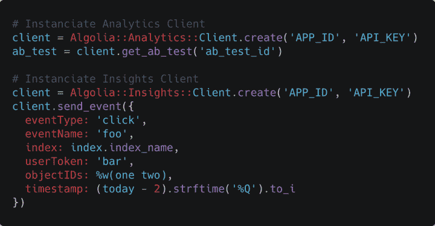
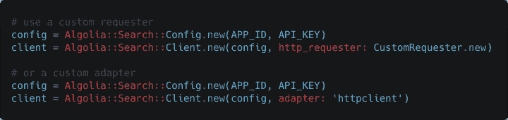
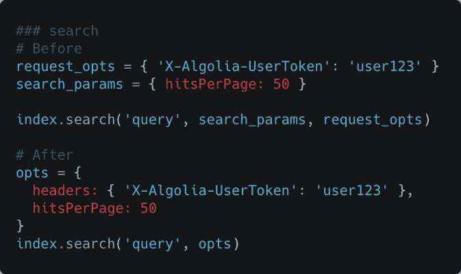
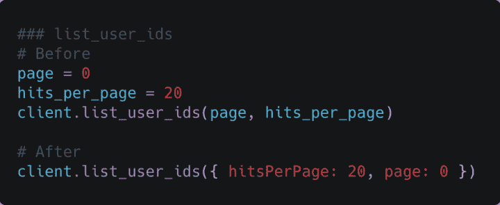
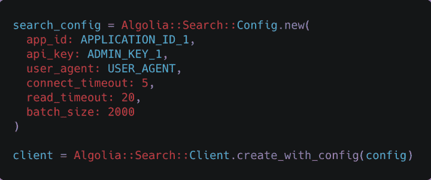
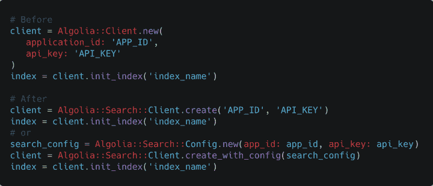
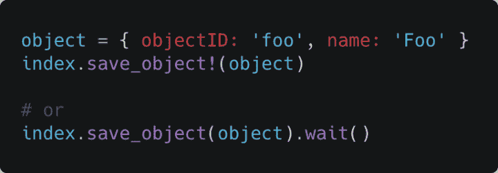

# Ruby 客户端 v2 发布了！

> 原文：<https://www.algolia.com/blog/engineering/ruby-client-v2-is-out/>

Algoliasphere 的好消息:我们刚刚发布了 Ruby 客户端的一个新的主要版本。 你知道 Ruby 客户端是我们设计的第一个吗？1.1.3 版本差不多七年前就出了！退一步说，T4 的确值得拥有一些新鲜空气。这个新版本获得了全新的设计，为您带来了大量新功能，同时 100%符合通用 API 客户端规范。我们来深究一下。

## Algolia search 变成 Algolia

你可能注意到的第一件事是，我们更改了宝石的名称。我们的 Ruby 客户端现在提供了几个截然不同的客户端，针对 Algolia 的不同特性: [搜索](https://www.algolia.com/doc/rest-api/search/) 当然，还有 [分析](https://www.algolia.com/doc/rest-api/analytics/)[见解](https://www.algolia.com/doc/rest-api/insights/) ，以及 [推荐](https://www.algolia.com/doc/rest-api/recommend/) 。由于这一变化，gem 反映新的架构并将其简单地重命名为“algolia”是有意义的。

使用我们的整个 REST API 的全部潜力现在是小菜一碟，因为您只需实例化您选择的客户端并使用我们为您量身定制的端点。他们都依赖于我们的重试策略来为您提供最佳体验(稍后将详细介绍)

## 现代工装

我们利用改造的机会在 Ruby 社区中使用了最先进的工具。任务处理测试和林挺。林挺是用[rubo COP](https://rubocop.org/)完成的，测试用[Minitest](https://github.com/seattlerb/minitest)。我们选择 Minitest 而不是 Rspec 的原因很简单:它是唯一一个提供并行测试可能性的工具。我们希望确保我们的客户端与 JRuby 兼容，这样多线程就不会被忽略，Minitest 并行测试向我们保证一切都会顺利进行。此外，所有方法都使用 [码](https://yardoc.org/) 约定进行记录。

支持的最低 Ruby 版本是 2.2。这是一个仍然在我们的用户中广泛使用的版本，也是 Rails 早期版本 v5 中支持最少的 Ruby 版本。

## 完全独立重试策略

为了给你最好的 Algolis 体验，并为你提供一个强大的客户端，我们现在实施与我们所有其他客户端相同的重试策略。它是确保最大服务可用性的关键元素，因为它是作为单独的类实现的，所以它已经过彻底的单元测试，可以作为一个系统独立工作。这也意味着您可以在我们所有不同的客户端实例中受益，甚至在您决定不使用我们捆绑的 HTTP 客户端的情况下。因为是的，您可以自由地使用您喜欢的任何 HTTP 客户端！

## DIY 客户端

这个客户端很容易定制。当我们构建 API 客户端时，最重要的是可靠性和开发者体验(DX)。我们希望您能够放心地使用我们的服务，而且是以您感觉最舒适的方式使用。在这种情况下，您可以覆盖我们的请求者，您可以覆盖我们的记录器，如果您选择继续使用我们提供的请求者， [【法拉第](https://lostisland.github.io/faraday/) ，您也可以覆盖您将与之一起使用的适配器。这就是我们选择 Faraday 作为默认 HTTP 库的原因。它不仅易于实现，而且广受欢迎并经常更新， *和* 它满足了我们旨在为您提供的灵活性需求。我们附带的默认适配器是 Nett:Http:Persistent，但是您可以很容易地将其转换为您最喜欢的 Http 库(Excon、HTTPClient 或 httpx，仅举几个例子)。

## 请求选项

我们简化了处理可选参数的方式。现在，方法签名中只需要强制参数，其他的都可以在最后一个可选参数中作为散列传递。如果要传递头、超时、connect_timeout 或 compression_type，必须显式设置它们。剩下的可以照原样通过！它缩短了方法签名，也与我们的其他动态类型客户端保持一致，如 [Python](https://github.com/algolia/algoliasearch-client-python) 或 [PHP](https://github.com/algolia/algoliasearch-client-php) 。

## 单机配置

我们已经为配置添加了专门的类。您可以在这里为每个客户端设置超时、头和特定配置。这些配置过去是直接在客户机中设置的，但现在它们有了专用的类，使它们更容易调整，并分离了它所属的客户机各个方面的逻辑。例如，您可以覆盖搜索配置中的默认主机。

## 搜索客户端

搜索客户端类已清理完毕。除了单独处理配置之外，我们还删除了协议类:现在您可以直接在主类中读取被访问的端点，并更好地了解幕后发生了什么。最重要的是，它不再是单例实例:通过传递应用 ID 和 API 键来创建客户机。这个实例将在其请求者和连接池上运行，不会干扰同时运行的任何其他实例。

## 搜索索引

搜索索引类别大部分保持不变。正如我们之前提到的，主要的改进是通过将所有可选参数放在一个散列中来缩短方法的签名。因为这是一个非常受欢迎的特性，所以我们保留了 bang 方法，让您等待整个操作完成。您也可以像我们在其他客户端中所做的那样，在您的调用之后链接“wait()”方法。

## [<svg aria-hidden="true" class="octicon octicon-link" version="1.1" viewBox="0 0 16 16">T5</svg>T7TL；博士](#tldr)

我们摆脱了当前 Ruby 客户端的主要痛点，搜索客户端的单一实例，以及我们的 Ruby 客户端与我们的通用规范不一致的事实。我们现在有了一个新的基础，它符合 Algolia 标准、Ruby 标准，并遵循 CTS 进行额外的单元测试。我们希望您会像我们喜欢构建 v2 一样喜欢使用它！如果您想获得所有更改的详尽列表，请参考我们的 [升级指南](https://www.algolia.com/doc/api-client/getting-started/update/ruby/?client=ruby) 。

感谢您的阅读！