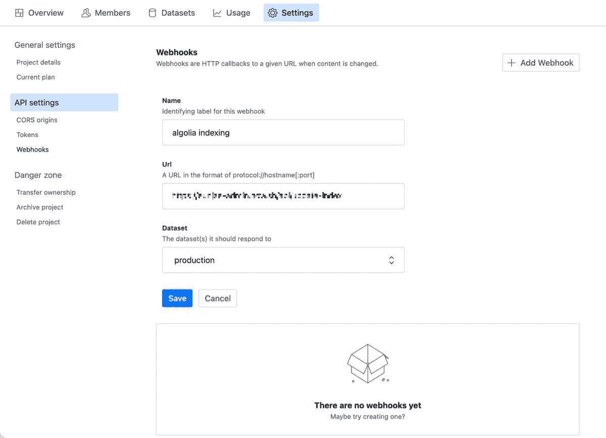
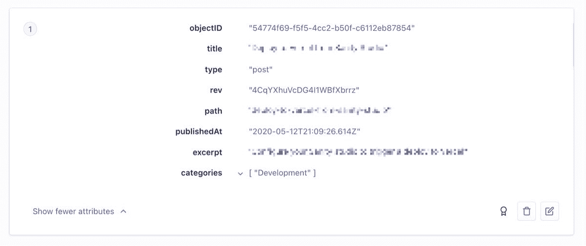

# Sanity + Algolia:向开源无头 CMS 添加搜索

> 原文：<https://www.algolia.com/blog/product/sanity-algolia-add-search-to-an-open-source-headless-cms/>

在本文中，我们将研究如何将 [Sanity.io](https://www.sanity.io/) 与 Algolia 集成。Sanity.io 是一个内容平台，附带一个可以定制的开源 headless CMS，以及一个托管的实时数据存储，允许您读取和更新数据。Sanity.io 背后的理念是，您应该能够将内容视为数据，并将其带到您拥有的任何产品或应用程序中。

现在，CMS 通常没有搜索功能。自己在上面构建一个最简单的搜索功能都不容易，更不用说包含诸如允许输入错误和分面等重要功能的东西了。这就是我们的 Algolia 插件所做的事情:它在你的 CMS 上添加了一个灵活且功能丰富的搜索功能。

## [](#cmsalgolia-using-webhooks)CMS<>Algolia 使用 webhooks

有许多方法可以将 CMS 与 Algolia 集成在一起。最有效的方法之一是利用 webhooks。您可以创建一个 API 作为 webhook 端点，并配置您的 CMS 在内容更改时触发 webhook。在您的 API 中，您可以在 Algolia 的索引中创建、更新或删除相应的记录。

因此，您需要创建一个 API 作为 webhook。如果你有一个网络服务器，你可以在那里添加一个 API。或者，如果您在 Netlify 或 Vercel 上托管了 Sanity Studio，您可以编写一个无服务器函数作为您的 API。

然而，这部分可能很麻烦。在 API 中，您需要检查触发 webhook 请求的原因:记录的创建、更新或删除。之后，您需要调用相应的方法将更改应用到 Algolia。这不是一大块代码，但是如果没有正确的数据模式，这可能会很耗时。这就是理智-algolia 的用武之地，它帮助我们处理双方的问题。

## [](#a-better-way-sanity-algolia-with-tutorial)一种更好的方式:理智——阿洛利亚(附教程)

使用 sanity-algolia，您需要为 algolia 索引转换有效负载。

以下是方法。

安装依赖项:

```
npm install algoliasearch sanity-algolia

# or

yarn add algoliasearch sanity-algolia
```

创建 API:

```
import algoliasearch from 'algoliasearch';
import sanityClient from '@sanity/client';
import indexer, { flattenBlocks } from 'sanity-algolia';

const algolia = algoliasearch(...);
const sanity = sanityClient(...);

export default function handler(req, res) {
  const sanityAlgolia = indexer(
    {
      post: {
        index: algolia.initIndex('posts'),
      },
    },
    document => {
      switch (document._type) {
        case 'post':
          return {
            title: document.title,
            path: document.slug.current,
            publishedAt: document.publishedAt,
            excerpt: flattenBlocks(document.excerpt),
          };
        default:
          throw new Error(`Unknown type: ${document.type}`);
      }
    }
  );

  return sanityAlgolia
    .webhookSync(sanity, req.body)
    .then(() => res.status(200).send('ok'));
}
```

假设这个 API 的端点部署在

```
https://my-example/api/update-algolia
```

访问您的[健全仪表板](https://manage.sanity.io)来添加 webhook。
[](https://blog-api.algolia.com/wp-content/uploads/2021/04/image1-1.jpg)

现在，每当您的 Sanity studio 中的内容发生变化，它就会触发这个 webhook，这将使用这些变化更新您的 Algolia 索引。

[](https://blog-api.algolia.com/wp-content/uploads/2021/04/image2.jpg)

感谢库 sanity-algolia，如果您定义了要获取哪些属性以及如何转换它们，其余的工作会自动为您完成。

要了解更多信息，请访问此 [GitHub repo](https://github.com/sanity-io/sanity-algolia) 。