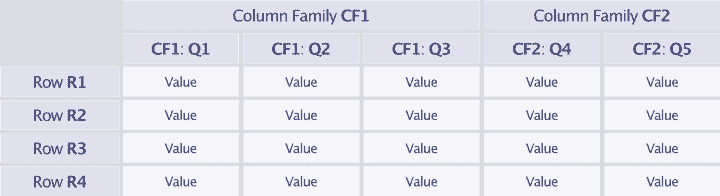
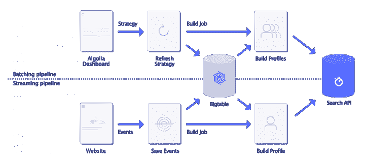
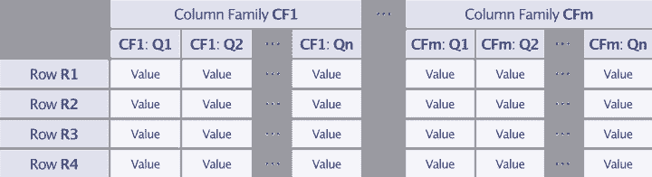
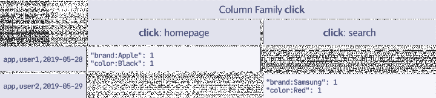
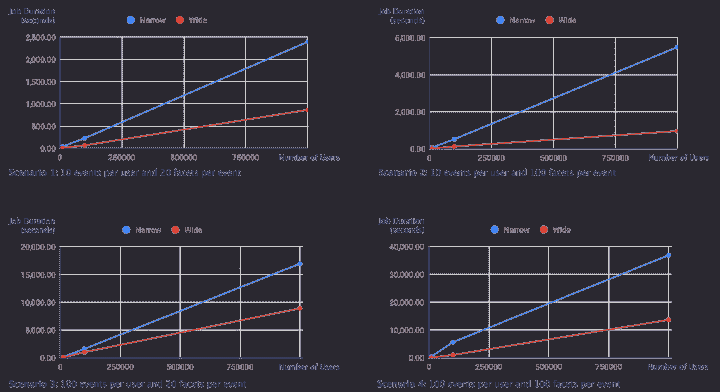

# 选择最佳模式提高 Google Bigtable 性能

> 原文：<https://www.algolia.com/blog/engineering/scaling-algolia-personalization-engine/>

我们的个性化功能依赖于 Google Bigtable，这是一个托管在 Google 云平台上的托管数据库。我们发现，在计算用户配置文件时，Bigtable 模式的变化可以带来 3 倍的性能提升。我们将带您深入了解我们如何扩展和改进 Bigtable 性能的调查，描述我们在此过程中收集的重要经验。

## [](#what-is-google-bigtable)什么是 Google Bigtable？

Bigtable 是一个用于管理结构化数据的分布式存储系统。它被设计为水平扩展。自 2004 年以来，它一直在谷歌内部开发，并于 2015 年作为谷歌云平台的一部分公开发布。

Bigtable 将数据存储为由 `row key` 、 `column key` 和 `timestamp` : 索引的排序图

```
(row:string, column:string, time:int64) -> []byte

```

它通过行键按字典顺序维护数据，这允许通过指定前缀来查询行的范围。列键由一个*族键* 和一个 *限定符* 组成。由于数据是按表和族键分割的，并一起存储在单独的 *平板* (物理硬盘)中，因此对族键有一些限制:我们需要在创建表时指定族键和表名，建议将具有相同访问模式的元素存储在同一个族键下。此外，文档建议使用一些仅包含字母数字字符的家族密钥(最多 100 个)。另一方面，限定符的约束较少，可以用任意字符创建一行。



***存储彼此相邻的相关行。***

## [](#capturing-and-storing-user-events-for-google-bigtable)为 Google Bigtable 捕获并存储用户事件

回到用例。正如我们的文档所描述的，[个性化](https://www.algolia.com/doc/guides/personalization/what-is-personalization/)依赖于用户事件，如*页面浏览*、*点击*和*转换*来建立用户档案。这些事件由我们的客户通过[洞察 API](https://www.algolia.com/doc/guides/getting-analytics/search-analytics/advanced-analytics/) 发送，并由类型(查看、点击、转换)、名称(如“主页”)和对象标识符定义。

考虑一个在线市场，用户在主页上点击了一部黑色的苹果 iPhone。我们收到以下事件，其中 `user_token` 是由 Algolia 的客户生成的唯一匿名用户标识符:

```
{
    "app_id": "app",
    "user_token": "24d64a80-8d1c-11e9-bc42-526af7764f64",
    "object_ids": ["af3d4d14-8d1c-11e9-bc42-526af7764f64"],
    "timestamp": "2019-05-28T00:04:34.000Z",
    "event_type": "click",
    "event_name": "homepage"
}

```

与产品互动的用户产生事件，我们根据这些事件建立用户档案。用户简档代表用户对类别、品牌等的密切关系和兴趣。具体地说，我们实现了一个用户配置文件，作为一个键值结构，由与分数相关联的过滤器组成。在我们下面的例子中，过滤器 `color:Red` 的分数为 12，这由用户与红色项目的隐式交互的数量来确定。

```
color:Red     ->  score: 12
brand:Apple   ->  score: 10
color:Black   ->  score: 8
brand:Sony    ->  score: 3
brand:Samsung ->  score: 2

```

用户简档中的过滤器的分数是根据定义每个事件的重要性的**策略(例如， 转换 、 查看 、 点击 )以及与事件相关联的每个过滤器的重要性来生成的。**

 **在查询时，给定用户的用户简档被用于通过匹配过滤器提升最相关的项目。这为我们的用户提供了无缝的个性化体验。

## [](#building-real-time-user-profiles)**建立实时用户档案**

速度至关重要，我们的目标是为用户提供实时的个性化体验。此外，当我们的客户更新他们的个性化策略时，我们希望尽快用新策略更新所有的用户配置文件。

这导致我们构建了两条独立的管道来计算和更新用户简档:

1.  一个 **流式管道** ，当我们接收到事件时，它计算用户简档
2.  一个 **批处理管道** ，它在策略更新之后重新计算所有用户简档

管道部署在*谷歌云平台*上托管的 Kubernetes 集群上。我们将客户发送的事件存储在 **Bigtable** 中，因为它能够处理大量数据的高读写吞吐量。作为多租户系统使用，Bigtable 的模式为隔离每个客户的数据提供了有力的保证。下图描述了两种个性化管道的高级架构。



## [](#scaling-the-batching-pipeline)**缩放配料管道**

随着越来越多的客户使用个性化搜索，我们需要在计算用户简档时处理不断增加的负载。具体来说，我们需要确保批处理管道能够扩展。例如，如果客户在 90 天的保留期内平均每天发送 1000 万个事件，那么当策略更新时，管道将必须检索和处理总共 9 亿个事件。

由于管道的性能主要取决于 Bigtable 的读取吞吐量，我们希望研究*不同的表模式*在 Bigtable 中存储事件的性能影响，并评估要检索的事件数量对管道处理持续时间的影响。

## [](#our-bigtable-schema)我们的 Bigtable 模式

为 Bigtable 设计模式包括确定行键的格式和行值的结构。

**排键。**行键设计特定于用例以及访问模式。正如我们上面解释的，我们需要访问我们的一个客户发送的所有事件或者他们的一个用户发送的所有事件。因此，读取比写入更重要，因为我们需要在每次构建用户的配置文件时检索用户的所有事件。为了对排序的键块执行有效的扫描，相关的行需要彼此靠近。因此，我们设计了以下模式，允许对客户(从其标识符、 `app_id` )及其用户(从其标识符、 `user_token` )进行顺序扫描:

```
app_id,user_token,YYYY-mm-DDTHH:MM:SS.SSSZ

```

**排值。**行值由一个列键(带有族键和限定符)和一个列值组成。一个行的值将存储一个由以下内容组成的事件:

*   事件类型( 转换 ， 点击 ， 查看 )
*   事件名称(用户自定义，如 首页 )
*   过滤器列表(格式为 `filter_name,filter_operator,filter_value` )

#### **窄行和宽行值。** 构造行值模式有不同的方法。一种模式是将完整的数据结构存储在行的值中。这导致一个又高又窄的表，每行只有少量事件，每行只有一个姓和限定符。另一方面，可以利用同一行中的多个系列和限定词来分层构造值。这导致表又短又宽，每行都有大量事件。


*窄值行模式。*



*宽值行模式。*

### [](#narrow-schema)**狭隘图式**

由于不同的事件类型是固定的，并且由字母字符组成，因此它们很适合作为家族关键字。因为是用户定义的，基数大，所以事件名不能作为族键使用；但是，它可以用作限定词。然后，过滤器计数的列表可以用作一个值，并以 JSON 格式进行编码，例如，当使用官方命令行工具 [cbt](https://cloud.google.com/bigtable/docs/cbt-overview) 与 Bigtable 交互时，可以读取表中的行。

结果模式如下:

```
row: app_id,user_token,timestamp
family key: event_type
	qualifier: event_name
		value: [filter_counts]

```

**这是我们目前用来存储事件的模式。**

因此，以下两个事件存储在表中，如下所示(注意:我们缩短了时间戳):

```
[{
    "app_id": "app",
    "object_ids": ["black-apple-iphone"],
    "user_token": "user1",
    "timestamp": "2019-05-28",
    "event_type": "click",
    "event_name": "homepage"
},
{
    "app_id": "app",
    "object_ids": ["red-samsung-s11"],
    "user_token": "user2",
    "timestamp": "2019-05-29",
    "event_type": "click",
    "event_name": "search"
}]

```

#### 

### [](#wide-schema)**广图式**

使用上面定义的窄模式，我们需要检索与每个事件相关联的所有过滤器来计算用户简档。但是，我们根据策略中定义的过滤器计算用户配置文件，这是事件中包含的过滤器的子集。不得不从容器中的事件中丢弃一些过滤器会产生吞吐量和内存开销。

相反，宽模式使用族和限定符来创建宽行格式，并在服务器端过滤事件过滤器*名称*。由于过滤器是根据它们在策略中的名称来定义的，所以我们通过带有限定符的过滤器名称来索引行值。考虑到 family 键在格式和数量方面的限制，我们只能使用限定符按过滤器名称索引行值。因此，我们将元组 `(event_type, event_name, filter_name)` 编码为 CSV 格式的限定符。系列名称限制为 100 个，需要提前定义，因此不能是客户定义的值。相反，我们使用单个字母、 `e`、 作为家族密钥，以便在通过网络传输整行时最小化其开销。请注意，族键可以具有版本控制语义，这对于将数据从一个族迁移到另一个族很有用。然后行值是一个数组的 `(filter_operator, filter_value)` 计数。然后，根据策略中的过滤器，使用交叉过滤器查询行的限定符。

这些考虑导致了以下宽模式的设计:

```
row: app_id,user_token,timestamp
family key: e
	qualifier: CSV(event_type, event_name, filter_name)
		value: [(filter_operator,filter_value)]

```

举个例子，如果我们取上面给出的两个事件，那么我们有下面的表格:


## [](#choice-of-schema-scales-performance)**选择图式音阶表现**

对于一些发送事件的应用程序，我们决定模拟真实世界的事件，以便比较两种模式的性能。我们生成了不同的应用程序配置文件，从几个用户发送数百万个日常事件到数百万个用户发送几个事件。我们在一个 staging Bigtable 实例中创建了两个表，这两个表具有上面详细描述的窄模式和宽模式。

在实现并测试了这两个模式的有效性之后，我们移除了与计算相关的开销，特别是对其他服务(包括 GCS 和 Stackdriver 日志)的读/写访问，以便只保留从 Bigtable 中“原始”读取事件和从事件中计算用户配置文件。为了运行测试，我们为每个应用程序概要文件和表模式连续构建了几次概要文件，因为并行运行多个测试可能会影响每个测试中观察到的性能。

测试结果如下图所示。随着事件数量的增加，对于所有模式，读取事件和计算用户配置文件所需的时间呈线性增长。正如我们在图上看到的那样，无论在什么场景下，传统模式的性能都是最差的，并且需要长达 16.6 小时(60，000 秒)来计算 1，000，000 个用户在 90 天内每天 100 个事件的配置文件。很明显，宽模式被证明对用户简档计算有巨大的影响，并允许不可忽略的计算增益。将我们的遗留模式迁移到更宽的模式是一个容易做出的决定。



我们决定将目前使用的窄模式迁移到最有效的宽模式。为此，我们执行了三步迁移:

1.  我们创建了一个具有宽模式的表，并开始将事件分别保存到窄模式和宽模式这两个表中。
2.  大约一周后，我们将从 90 天保留期到现在的所有事件回填到具有宽模式的表中。
3.  我们将用户档案计算从窄表转移到宽模式表。

## [](#caveats)**说明**

模式更改对`app_id`和`user_token`作业都有积极影响，特别是在客户端，因为在检索与用户令牌相关的大量事件时，减少了单个 pod 中使用的带宽、CPU 和内存。然而，我们的解决方案附带了一些警告，我们在最终选择迁移到宽模式时已经确定并权衡了这些警告。

**存储和计算。** 虽然宽模式节省了 Bigtable 客户机上的资源，但它也增加了 Bigtable 服务器上的存储和计算开销。由于 Bigtable 对行值应用压缩，因此对于较大的行值，压缩会更有效。与遗留模式相比，使用宽模式存储数据会增加存储空间的使用，但这不是问题。此外，由于对行的过滤是在 Bigtable 服务器上应用的，因此与窄模式相比，它会导致额外的计算开销，窄模式仍然远远低于 80%的建议限制。

**限定符数量。** 宽模式之所以有效，是因为我们假设客户定义的策略不会涵盖过滤数据所需的所有可能方面，尽管我们应该对不同方面的最大数量设置一些限制。但是，当策略中使用了所有可能的方面时，读取性能与使用窄模式时一样好。

## [](#it%e2%80%99s-all-about-trade-offs)**都是关于取舍**

Bigtable 的使用和访问模式应该驱动模式设计。在我们的例子中，我们需要优化读访问，因为我们只写一次数据，需要通过单个`user_token`作业或通过`app_id`作业访问几次。有三个优化级别。

在读取和访问存储在 Bigtable 中的数据时， **行键** 是最重要的。由于这些行是按行关键字按字典顺序排序的，因此需要存储相关的行，或者将被一起读取并且彼此靠近的行，以便对排序关键字块执行有效的扫描。在我们的多租户案例中，我们用应用程序标识符作为行键的前缀。这提高了需要顺序扫描应用程序以执行管理任务(如垃圾收集，而不仅仅是特定用户)的作业的性能。按应用程序对键进行分组可能会导致经常使用的应用程序出现热点，但它们的数据也可能会被拆分到多个计算节点上(因为与其他应用程序相比，它们会生成更多的数据)。或者，可以将大型应用程序移动到专用的表中，以便隔离它们并阻碍其余应用程序的性能。

**行模式** 解决了 Bigtable 服务器上的计算和存储开销与客户端的计算和带宽开销之间的权衡。尽管增加了服务器端的开销，但拥有较宽的行可以实现更好的过滤，而较窄的行会延迟客户端的过滤，因为需要检索整个单元格的值。

最后，由于行值存储为`byte[]` ，所以可以根据需要，通过使用快速 JSON 编组器、通用和复杂协议缓冲区或定制格式(如 Gob)来优化 **行编码** 。

随着 Algolia 的发展，我们将继续规划规模，以适应不断增长的客户数量。我们发现，在如何使用 Bigtable 处理和存储数十亿个事件方面的一个小小的改进，可以让我们扩展个性化，并迎接未来几个月的挑战，以改进该功能。**