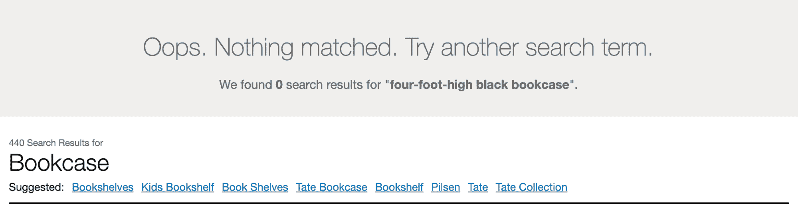
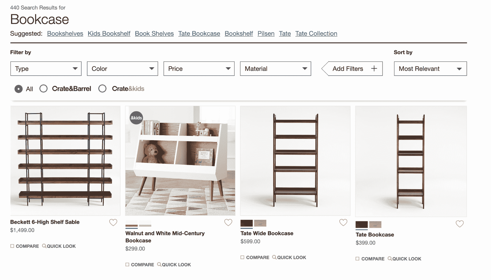
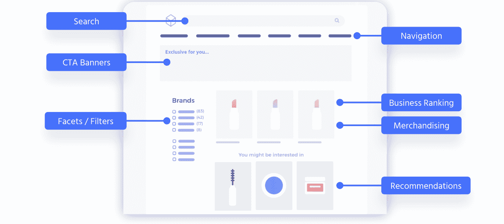
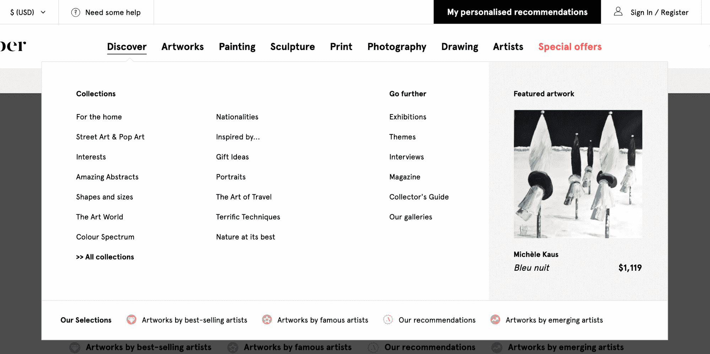
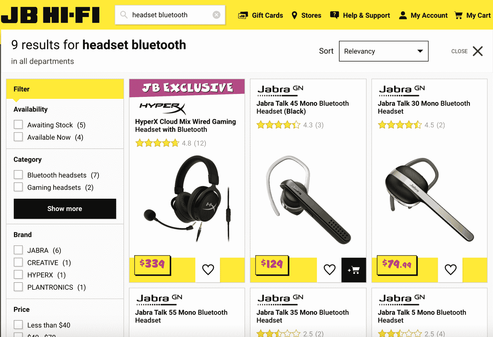
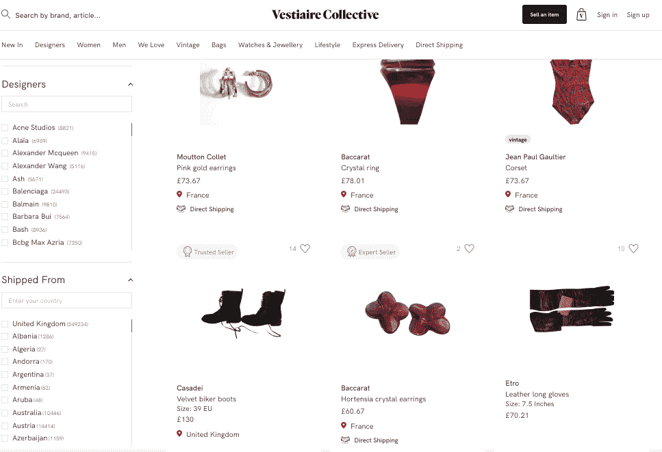
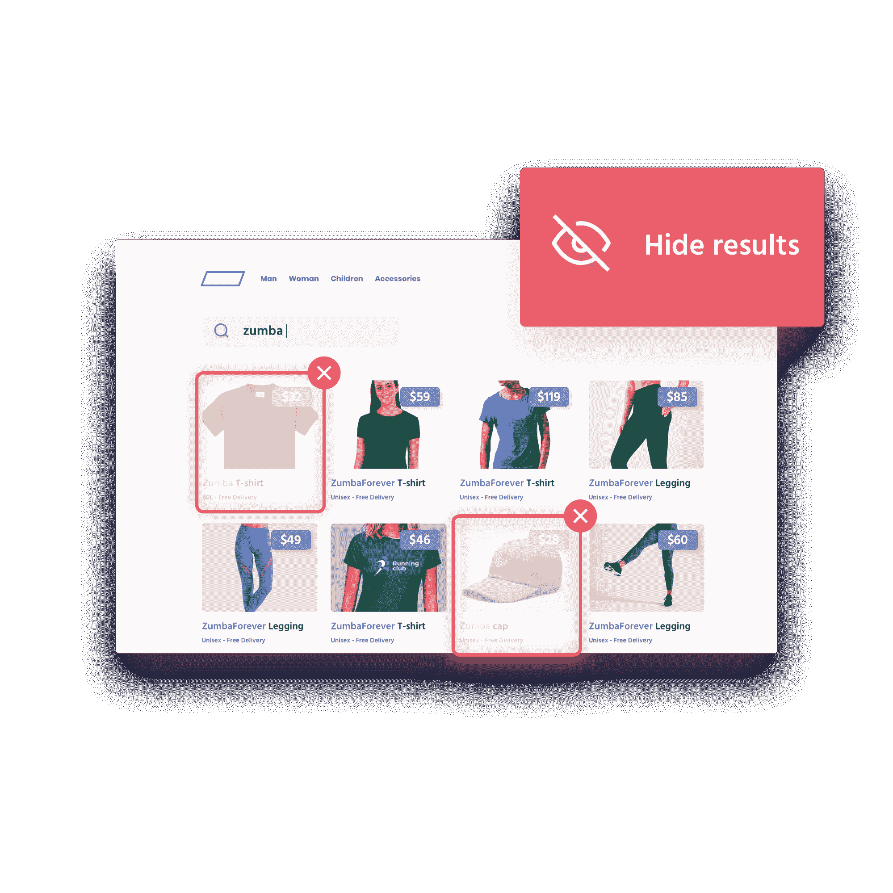
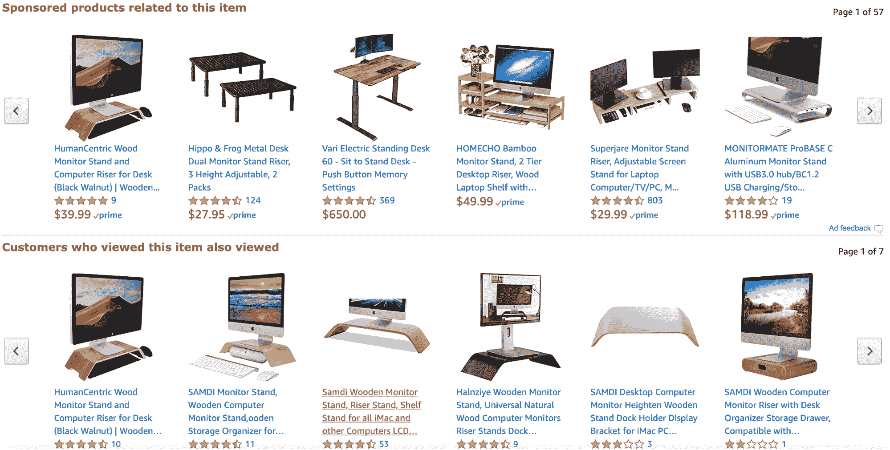

# 为什么发现对今天的电子商务搜索引擎至关重要

> 原文：<https://www.algolia.com/blog/ecommerce/search-and-discovery-for-e-commerce-search-engines/>

很少有电子商务搜索引擎真正做好自己的工作:帮助客户轻松找到他们想要的东西。这里的关键词是“容易”。整体产品搜索体验中的挫折导致了不可接受的流失和流失水平:根据 Forrester 的数据，[高达 68%。](https://www.forrester.com/report/Googleize+Your+SiteSearch+Experience/-/E-RES124541)

同样精确的百分比——68%—适用于被发现提供[差的搜索结果排序选项的网站数量](https://firebearstudio.com/blog/the-best-ecommerce-search-engines.html),并且整整 72%的网站完全没有达到[的网站搜索预期](https://www.bigcommerce.com/blog/ecommerce-site-search/#meet-the-consumers-who-use-on-site-search)。

“你只有一份工作！”想起来了。

显然，我们需要更好的电子商务搜索引擎。但是补救措施不一定要让电子商务搜索引擎更像搜索引擎。这是为了让他们更像——这个词从 2015 年左右开始，我们看到到处都在出现——体验。

这就是发现的来源。

## 搜索 vs .搜索与发现:有什么区别？

当客户确切地知道他们在找什么(例如，一个“四英尺高的黑色书架”)并且电子商务搜索引擎找到它，或者至少试图找到它时，电子商务搜索就发生了。

在电子商务刚刚起步的时候，这种关系还不错。在任何给定的电子商务网站上都没有太多可供选择的商品，网站总体上提供的主要是交易体验:要么你想要的产品在那里，要么没有。但随着数据量和网上可用产品的数量呈指数级增长，电子商务搜索对公司来说变得越来越困难，对用户来说导航也越来越令人沮丧。

以上面的搜索词“四尺高的黑色书柜”为例。在全球最大的电子商务家具零售商之一的主页搜索栏左上角输入这些特定的词， [Crate & Barrel，](https://www.crateandbarrel.com/)你会得到两条有些矛盾的信息。一个是根本没有搜索结果，另一个是实际上有 440 个搜索结果。

唉，这些结果是类似于一个四英尺高的黑色书柜，但实际上根本不是这样。第一排是你期望看到你的物品的地方，有几个非常高的棕色书架和一个矮的白色儿童书架。

此外，当你点击左上方的“类型”过滤器时，出现的并不是你所希望和期待的:按高度过滤的选项。相反，第一个选项是令人困惑的“书柜”，其他选项是与书柜几乎无关的项目，如娱乐中心。

在这一点上，寻找四英尺高的黑色书架的客户很可能会选择更快、更直观的电子商务搜索体验。

与搜索者不感兴趣也不需要的半相关、半相关项目的铺天盖地的迷宫不同，出色的搜索和发现体验不仅会为确切的搜索词提供精确的结果，还会弹出一个高度上下文相关的推荐和过滤器的简化界面，针对特定搜索者的年龄、[地理位置](https://blog.algolia.com/how-geo-search-improves-search-and-discovery/)、正在使用的设备、以前对网站的访问等等进行个性化。这将使搜索者感到被认识和理解，并使他们不仅容易找到黑色书架，而且容易找到他们以前可能没有意识到他们需要的其他东西。

## 电子商务搜索和发现的工具

搜索和发现是如何做到这一点的？

通过一套工具和技术，共同提供完全上下文相关的、愉快的电子商务搜索体验，使搜索变得富有冒险性和教育性，而不是费力和事务性的。

让我们开始吧。

### 利用搜索栏

搜索栏本身可以成为发现的窗口。您很可能遇到过这样的情况:当您键入一个查询时，会出现一个下拉框，提供更具体或更流行的查询建议。

这种[自动完成](https://blog.algolia.com/autocomplete-how-search-suggestions-increase-conversions/)体验——也称为预测搜索、提前键入、自动建议或边键入边搜索——在用户在搜索栏中键入时给他们搜索建议，使用上下文来预测他们可能在寻找什么。自动完成功能可以将销售额和转化率提高 24 %( T4)。

### 导航

出色的电子商务搜索和发现包括强大而直观的浏览体验，无需搜索栏也能轻松工作。想想网飞，那里的整个体验都是基于发现的。

在电子商务领域，这可能类似于 Artsper 的体验，arts per 是一个艺术买卖网站，通过点击顶部导航类别之一，如“绘画”，将提供浏览页面。“发现”类别提供了真实的发现体验，可以引导用户购买他们以前可能没有考虑过的意想不到的有趣商品。

### 

### 过滤和刻面

我们大多数人都熟悉搜索过滤器，它使我们能够将搜索结果缩小到适用于我们所寻找的类别。例如，我们可以通过选择品牌或类别来缩小耳机的搜索范围。

但是，当我们专门搜索一款*蓝牙*耳机时，我们的体验是，如果所提供的过滤器缩小到仅适用于蓝牙耳机，效果会好得多。

这就是方面的作用:它们确保只有匹配结果集的过滤器才是可用的。除了带来更流畅、更快速的发现体验之外，facets 还防止了可怕的“无结果”页面，如果相同的过滤器出现在您的“耳机”和“蓝牙耳机”搜索中，就会出现这种情况。

过滤器和刻面经常互换使用；关于这两者之间细微差别的解释，请看尼尔森-诺曼集团的这篇文章。

### 提供统一的搜索和发现体验

你应该允许你的用户既是搜索者又是浏览者。

搜索者追求找到他们正在寻找的东西(例如，某一品牌、颜色和尺寸的一条牛仔裤)。另一方面，浏览者有得到某些东西的潜在意图，但是可能不确切地确定是什么(例如，可能包括一条牛仔裤的商务休闲服装)。

您的电子商务网站搜索应该使用户能够从搜索或导航开始，然后通过利用其他策略进一步细化他们的结果，例如在用户执行搜索后提供方面，或者使过滤器和方面可搜索。

这是一个使用类别页面搜索框来增强过滤/分面体验的例子。

https://www.algolia.com/doc/guides/solutions/

### 商业排名和商品销售

除了向用户提供基于纯文本匹配的最相关的结果，你的电子商务业务还有一个很好的机会向他们提供他们最有可能*采取行动*的内容或产品。例如，您可以跟踪产品的转换率，并显示具有最高转换率的第一个结果，或者根据产品的受欢迎程度、新颖程度或可用性自定义排名。有了这种根据你的业务指标修改搜索结果的能力——我们称之为“业务排名”——你还可以测试你的客户想要哪些产品，并根据实验结果进一步完善排名。

这就是营销的用武之地。使用您的搜索和发现工具来反映促销活动、商品关键字(如“t 恤”)、商品类别页面、锁定特定商品或隐藏商品。

### 建议

推荐可以给搜索者一组匹配的结果、品牌和类别，让他们轻松地深入到他们想要的东西。理想情况下，这些推荐包含关键的用户数据，比如他们过去的搜索历史或人口统计数据。这也是电子商务企业提供赞助结果、高利润项目等的机会。

亚马逊在这方面做得很好(尽管有人可能会说他们的推荐算法有时会做得更好):

https://www . algolia . com/doc/guides/solutions/gallery/related-items/

### 地理搜索

[地理搜索](https://blog.algolia.com/how-geo-search-improves-search-and-discovery/)，也称为基于位置的搜索或本地搜索，是另一个强大的电子商务搜索和发现工具，它通过让客户知道您的哪些产品在附近并且可用来改善搜索体验。

## 电子商务搜索和发现的力量

以统一、流畅的方式使用搜索和发现将为您的客户提供清晰、直观的搜索体验，这将缩短他们的购物车路径，让他们对您的网站感到满意，并乐意再次购买。

想想这个:电子商务现在无处不在。像 Instagram 和脸书这样的社交媒体平台拥有本地购物工具，个人助理允许消费者使用他们的语音进行购买。用户在你的数字财产上找到他们正在寻找的和他们可能想要的越强大和越容易——即使他们可能还不知道他们想要它——将使你的电子商务搜索引擎成为商业驱动的巨头。