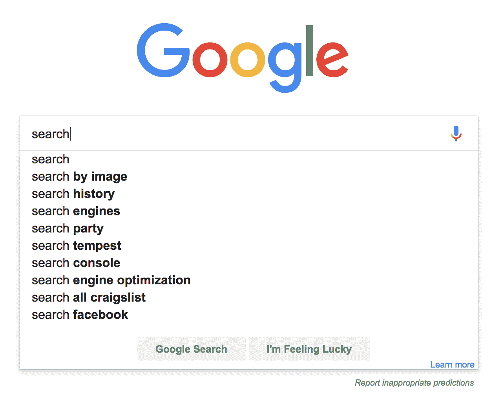
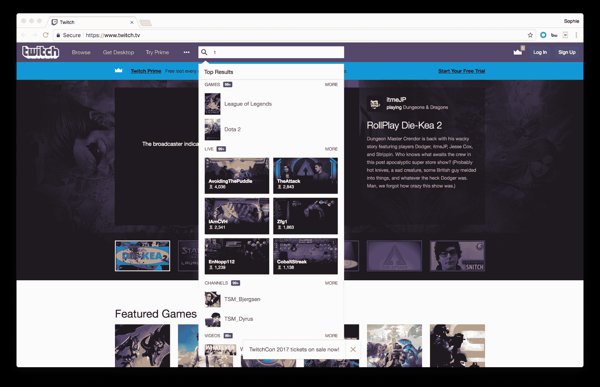
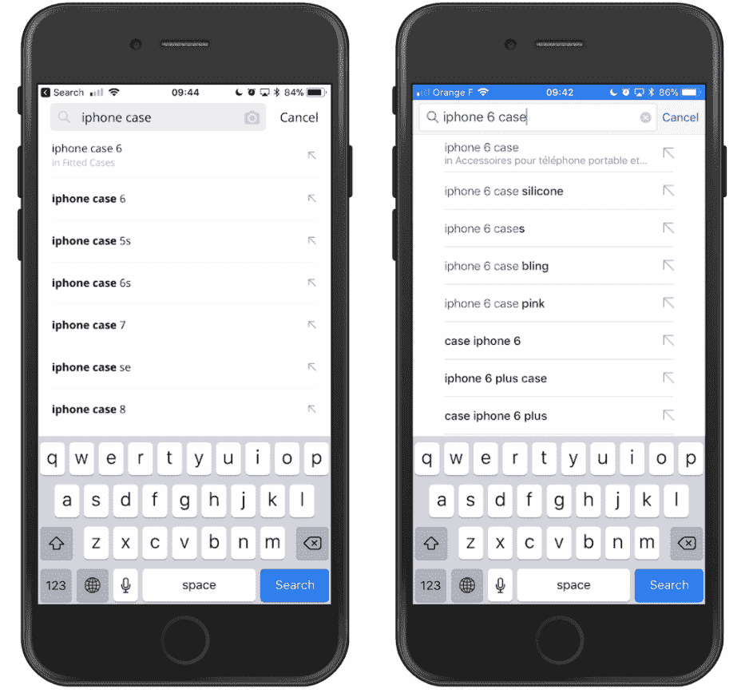
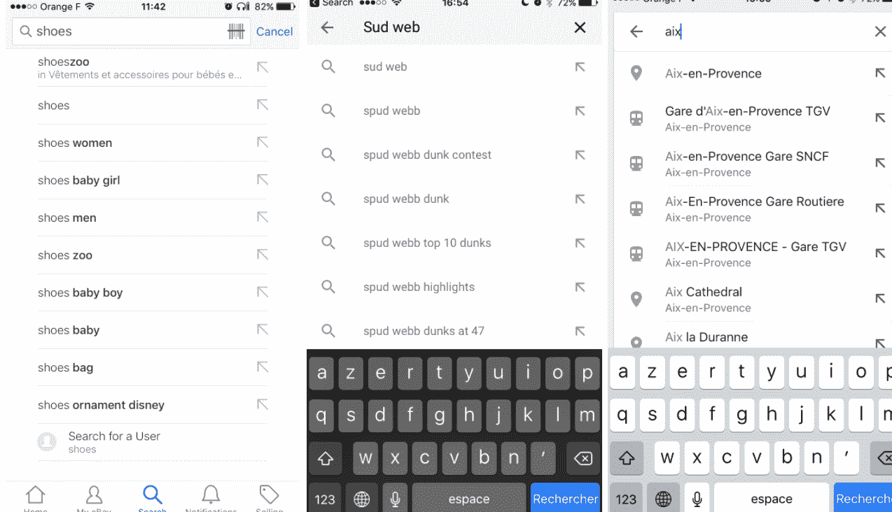
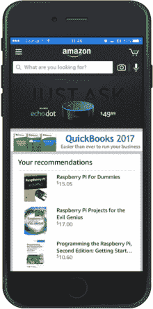
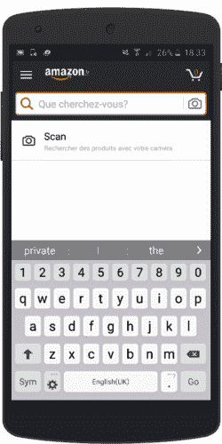
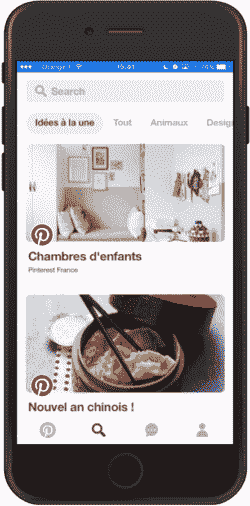
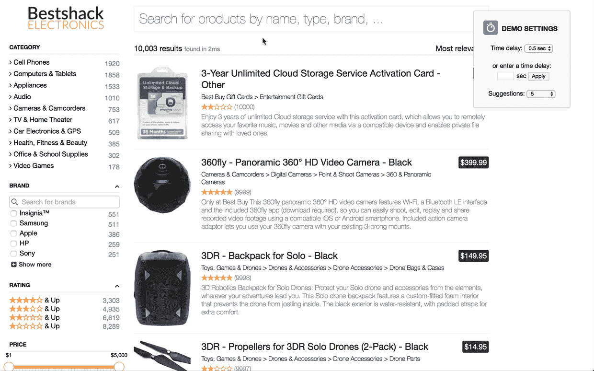

# 移动搜索自动完成的三个最佳实践

> 原文：<https://www.algolia.com/blog/ecommerce/search-autocomplete-on-mobile/>

使用搜索建议是一种已经存在多年的常见模式，在回顾了数千个实现之后，我们想与您分享一些最佳实践。以下是你需要知道的。

# 自动完成还是自动建议？几个名字，相同的模式

无论你称之为自动完成还是自动建议，一种用于显示查询建议或搜索预测的模式，很可能你说的是同一种搜索体验。这种模式已经存在多年了，你可能每天都在谷歌或亚马逊等网站上使用它:

Example of an autocomplete that provides search suggestions as you type

这个概念非常简单:搜索引擎会给出一些预测，以便在您键入时自动完成您的查询。搜索建议在移动设备和电子商务市场上尤其强大。显示实际结果而不是完成用户查询的即时搜索体验是其他用例中正确模式的一个很好的例子。

Example of a rich autocomplete that goes beyond search suggestions

# 一种移动上的省力模式

你需要为手机设计一些限制:有限的屏幕空间，和“胖手指”效应(触摸界面更容易让用户出错！).

这些限制说明了为什么搜索建议是比在手机上直接显示搜索结果更好的选择。使用自动完成功能可以最大限度地减少需要输入的字符数量，从而减少潜在的打字错误(尽管你的搜索技术应该[处理它们](https://www.algolia.com/doc/guides/managing-results/optimize-search-results/typo-tolerance/))。在一个屏幕上显示 3-5 个建议也更容易，尤其是因为你可以期待键盘被打开。显示结果往往需要更多的空间(图片+平均 2-3 个属性)。

建议也有助于扩展查询。例如，你可能不会自己输入“iphone 车载磁性”，但让它建议可能会帮助用户找到准确的词来描述他们想要的东西，从而使它更精确，并导致更相关的结果。它还指导你的用户并设定他们的期望:如果一个建议存在，那意味着它背后有实际的结果(否则，为什么它会被建议？).

出于所有这些原因，建议可能有助于您的用户更快地找到正确的内容。然而，一个先决条件是获得正确的实现。

# 实现——做得好

## 速度:随打随体验

显示建议应该非常快。几项研究已经证明，在用户感觉受到控制的体验和让他们感觉像在等待机器回答的体验之间，存在 100 毫秒的阈值。

建议应该从第一个字符开始。这并不是说用户会期望只有一个字母的完美建议，但是他们会马上看到自动补全功能可以提供帮助。等待几个角色出现可能会(令人不快地)让他们吃惊，他们可能会完全忽略它们。

## 凸显差异

突出显示在搜索中至关重要，因为它帮助用户理解为什么结果符合他们的要求，并允许他们快速决定首先选择哪个结果。如果不突出显示，用户选择糟糕结果的几率会更高，这会导致对你的产品的失望体验。

常见的做法是突出显示与用户输入相匹配的部分；然而，当提供搜索建议时，情况正好相反:突出显示被建议的部分是很重要的。这种方法在视觉上帮助用户区分不同的建议，因为它突出了不同之处。

On the left, Ali Express. On the right, a better implementation by eBay – even though the contrast could be improved.

## 预敲模式

你注意过建议旁边的这个图标吗？

好好看看你手机上安装的应用程序，你会发现它无处不在。

Many apps are using the tap-ahead pattern. From left to right: eBay, Youtube and Google Maps.

你知道这不仅是一个图标，而且是用于一个特定的行动吗？如果没有，不要担心——我们自己的研究表明，我们小组中 80%的人不知道有这个东西存在——但是那些大量使用它的人知道。

Amazon on iOS: a perfect implementation of the tap-ahead pattern

当点击图标时，建议将取代搜索框中的初始查询，用户可以继续输入。这是减少输入量的一个好方法，同时有非常精确的查询。在这个例子中，我只输入了“I ”,四次点击就找到了我需要的东西。

良好的实施需要:

1.使用指向搜索框的箭头图标

2.点击，用建议填充搜索框

3.保持相同的视图，同时根据新的查询即时更新其他建议

非常简单，但即使是亚马逊也很难保持其平台之间的一致性(这里，第 3 点失败了):

如果你想了解更多关于提前轻拍模式的信息，我能找到的最早的提及是在 2011 年的一篇[轰动杂志文章](https://www.smashingmagazine.com/2011/04/tap-ahead-design-pattern-mobile-auto-suggest-on-steroids/)。

# 建筑相关建议

只有相关的建议才有帮助。我们已经提到了每个建议应该如何导致实际结果。这些建议大多是通过分析用户在你的应用上搜索的内容(热门或趋势查询)而构建的。

但是，要注意:千万不要盲目相信用户生成的内容。法国家装工具和用品零售商 Castorama 在 2016 年经历了惨痛的教训。他们的一些在线访问者意识到，连续多次键入同一个查询就足以让它开始出现在每个人的自动完成功能中。只花了几分钟，网站就被不合适的建议淹没了，我不会在本文中分享这些建议。Castorama 不得不关闭他们的网站数周，错过了许多销售机会。

# 超越建议

搜索建议只是搜索世界中一种有趣的模式。你可以做更多的事情来创造一个好的搜索体验。

Pinterest is doing a fabulous job of mixing suggestions with top results for People and Boards

将建议和即时搜索结合起来是值得尝试的，而且不仅仅是在手机上。

在 Algolia，我们喜欢从技术和 UX 的角度推动搜索的极限。最近，我们一直在探索下面的模式，它同时显示结果和建议。

我们还没有证明或否定它，但我们正在努力。请随意亲自尝试一下[演示](https://preview.algolia.com/delayed-hits-demo/)，并请在下面的评论中或通过 Twitter 向我们发送反馈