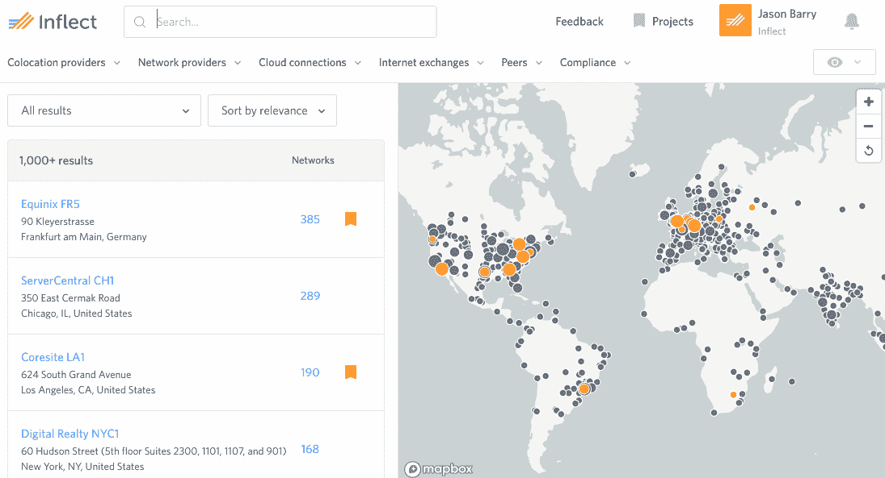
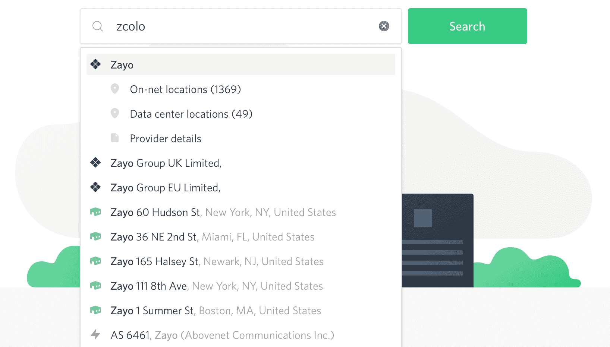
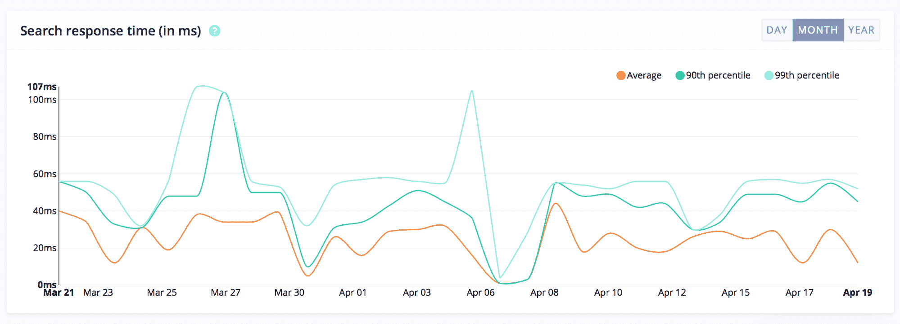

# Inflect + Algolia:购买基础设施产品的现代化

> 原文：<https://www.algolia.com/blog/customers/search-infrastructure-products-inflect/>

[Inflect](https://inflect.com/) 是唯一一个买卖互联网基础设施产品的全球中立在线市场。Inflect 的目标是让这个过程像预订酒店或机票一样简单。

Inflect 将其提供行业所需购买体验的能力在很大程度上归功于 Algolia 的搜索即服务平台。Algolia 允许 Inflect 工程团队将他们的开发工作集中在后端、数据标准化工作和整体用户体验上。

我们采访了 Inflect 的前端主管贾森·巴里，了解他的团队如何寻找搜索解决方案，他们的 Algolia 实现，以及各种搜索功能如何为他们的用户服务。

***告诉我们一点关于 Inflect 的事情:公司是做什么的，解决什么问题？***

互联网基础设施行业由两大类服务提供商组成——基础设施即服务(IaaS)和网络服务提供商(NSP)。IaaS 市场目前的估计规模为 650 亿美元，并以 21%的 CAGR 增长率增长，NSP 市场预计到 2020 年将达到 200 亿美元。

如今，Inflect 的主要客户要么是超大规模公司，要么是在全球寻找 [主机托管](https://searchmicroservices.techtarget.com/definition/colocation-colo) 和互联服务的企业。如今，这些服务中的大部分都是通过过时的手动销售方法购买的。客户没有简单的方法在多个供应商的产品中进行搜索，被迫单独查看每个服务提供商，并尝试拼凑自己的解决方案。

这意味着他们正在根据旧的数据和假设做出非常重要的决策。Inflects 旨在通过为行业创建一个记录系统并为每个人创建一个共同的交易市场来实现销售过程的现代化。

***是什么让你需要搜索？你是如何发现阿尔戈利亚的？***

搜索是我们用户体验的焦点。用户在主页上首先看到的是一个搜索栏。登录后，用户被重定向到搜索页面。我们的目标是让用户在最短的时间内找到符合他们需求的解决方案。

我们喜欢明智地使用我们的工程师时间:我们不想从头开始构建搜索引擎。相反，我们决定调查具有满足我们技术需求的特性集的服务。我们需要一个客户端搜索库，它具有连接到分布式网络的强大性能、全面的在线文档以及灵活性和可定制性。作为前端工程师，我们不想花时间调整列索引或优化 SQL 查询——我们想在不妨碍搜索的情况下构建我们的产品。

我们最初看到了 Swiftype，但在之前的工作中使用过之后，我推荐了 Algolia。

***给我们介绍一下实现过程。***

得益于 Algolia 的文档和对开源的贡献，实现变得轻而易举。我们决定使用algoliasearchNPM 包，因为它轻量级且简单明了。

如何实现特定的功能——有什么有趣的细节吗？

**自动完成**

我们最近在搜索栏中添加了自动完成功能。顾客的反应非常积极。我们跟踪的每一种类型的东西都会被自动完成返回:位置、数据中心、服务提供商、对等网络和互联网交换。为此，我们创建了两个在每次击键时都会被查询的索引:一个是位置索引，另一个是所有其他内容的索引。

我们的位置索引由城市、州、国家、大洲、口语区(如硅谷)和机场组成。我们编写了一个脚本来获取每种类型的项目的边界框，并将它们放入 Algolia 索引中。我们在排名公式中使用一个自定义权重属性来控制平局情况下的排名，以便热门位置总是首先显示。

我们的另一个索引包含了来自 datacenter_search 索引的关于搜索方面的信息。从该自动完成索引中选择一个项目将触发与选择 datacenter_search 索引上的复选框相同的操作:例如，选择“InterXion”将显示 InterXion 是主机托管提供商的所有数据中心。

### *我们的第 99 百分位自动完成响应时间是 14ms。*

响应如此之快，以至于我们不必对文本输入进行去抖——去抖实际上使感知的响应时间变得更慢。

**地理定位**

我们使用 Mapbox 在交互式地图上显示 Algolia 的搜索结果。Algolia 使这变得非常容易，支持开箱即用的地理位置搜索。通过在每条记录上设置一个_ geoloca键，可以添加 aroundLatLng 搜索参数，按给定的 lat/lng 对进行查询。在平移或缩放结束时，我们可以使用当前的搜索查询和过滤器以及地图的边界框创建一个新的 Algolia 查询。这有助于我们避免仅在视窗外部可见的大量数据响应。

我们自己实现这个功能需要花费大量的时间，但是使用 Algolia，就像向函数传递一个参数一样简单。

**兼并/收购和普通名称的同义词**

在我们这个行业，并购很常见。较大的服务提供商收购较小的公司，并改变他们所拥有的数据中心的营销名称。问题是用户仍然用他们原来的名字来称呼他们，即使新的名字有了新的所有权。

Algolia 的同义词功能让我们可以优雅地解决这个问题。我们将一系列已知的合并和收购设置为单向同义词，以便用户可以在他们以前的名称下找到数据中心及其提供商。设置这一点就像填写索引级别的 web 表单一样简单——其他一切都是自动发生的。

锦上添花的是，一个点击的 highlightResult 有适当的标记。例如，如果用户搜索“Telx”(一家被 Digital Realty 收购的公司)，Digital Realty 会首先显示结果，并在替代同义词的文本周围加粗。这也有助于找到市场营销名称实际上不同的通用名称的产品或数据中心。

从上面可以看到，搜索“zcolo”(一个用来指代 Zayo 产品和服务的短语)会返回关于 Zayo 的信息。

**合取和析取过滤**

我们有一套过滤器，包含数以千计的不同服务提供商、对等信息、合规性等。大多数时候，用户在选择过滤器时，都在寻找他们选择的复选框选项的交集——他们希望看到什么匹配 *这个* 和 *那个* 。

这适用于所有情况，除非一个方面的项目是互斥的。主机托管服务提供商往往属于这一类，因为对许多人来说，他们与数据中心之间的关系是一对一的。

我们希望对主机托管服务提供商的过滤是复选框选项的联合(OR ),其他的都是交集。Algolia 让开发人员可以控制哪些方面应该进行合取搜索，哪些方面应该进行析取搜索，从而使这变得非常容易。这样，只需勾选几个复选框，就可以支持类似“显示 Equinix *或* Digital Realty 拥有的具有 3 级 *和* Comcast on-net 的数据中心”的复杂查询。

**零结果查询**

我们越来越多地使用的一个功能是能够看到返回零结果的搜索查询。查看这些数据有助于我们填补客户期望的空白。从商业角度来看，这让我们在向公司索要数据时有了优势——我们可以通过这些零结果查询的频率来吸引他们加入我们的平台。

***使用 Algolia 对您的团队或用户有什么好处？***

[T39](https://blog-api.algolia.com/wp-content/uploads/2018/06/image3.png)

Algolia 给我们的一个重要好处是能够在不妨碍我们的情况下进行迭代。我们的后端工程师能够以我们想要的结构顺利上传数据，之后我们能够随心所欲地查询和配置索引，而无需寻求帮助。使用 Algolia 节省的时间让我们能够专注于构建我们的实际产品。

我们的客户对我们通过搜索功能解决业务问题的速度、相关性和能力感到满意。