# 当考虑搜索和浏览时，如何满足用户意图

> 原文：<https://www.algolia.com/blog/ecommerce/search-vs-browse-satisfying-user-intent/>

搜索与浏览——不同的活动，但相辅相成。每个网站应该至少有一个，最好两个都有。您选择包含什么取决于您的业务模型、专业领域和用户期望。

整合*T5*搜索和浏览涉及:

*   **满足用户意图** —用户想做什么:搜索特定的东西还是浏览你的目录？
*   **提供推荐** —你如何鼓励用户超越他们最初的意图，发现更多你的目录，而不干扰他们的搜索和浏览意图？

换句话说，最好的网站能够让用户 *拉* 自己需要的信息，同时无缝地 *推* 相关信息给用户。这对用户和企业来说都是双赢的:掌握这种拉/推动态可以提高客户满意度和参与度。这篇文章是关于如何做到这一点。

## 在考虑搜索与浏览时满足用户意图

我们首先将用户分为两个阵营:搜索者和浏览者，也就是那些想要 *找到* 的人和那些想要 *探索* 的人。我们这样做有两个原因:揭示搜索和浏览的潜在需求，以及定义满足这些需求的最佳用户体验。

但是我们并没有就此结束。浏览和搜索一起工作。一些行业更加以浏览为中心，另一些则依赖于强大的搜索；但所有网站都可以从两者的结合中受益，为所有用户提供最完整、最直观的购物体验。

从根本上说，用户的*查找* 或 *探索* ) 就是把 [从中搜索出来](https://uxdesign.cc/ux-cheat-sheet-searching-vs-browsing-221de84c51ed)

### **搜索者的意图是什么？**

搜索者的意图是 *获取* 或 *找到*——无论是特定的产品还是特定类别的产品。

他们称搜寻者为“矛鱼”，决心捕捉精确或相当明确的东西。越快越容易越好:挫败感加剧了搜索者的专一。当用户去亚马逊买电脑时，他们已经做了调查，他们只需要一个搜索框、一些界面和用户评论来做决定。

### **浏览器的意图是什么？**

浏览器的意图是 *探索* 和 *了解* 关于你所提供的东西，去 *发现* 。

浏览器撒网更广。他们有更多的时间和耐心——只要浏览体验允许他们轻松探索。虽然浏览器有时可能会转换角色，成为搜索者，但他们的最终目标是浏览页面，发现你所提供的内容，并从中获得灵感。在浏览场景中，搜索框不在中心位置(尽管它应该很容易获得)。什么是中央浏览是 *导航**展示* 你的产品和内容。导航涉及菜单和小平面；showcase 涉及类别页面和传送带。我们将在下面看到许多例子，但这里有一些优秀的浏览和发现体验的例子:

*   时尚购物者带着好奇心浏览一个品牌的特别系列
*   技术购买者探索和研究最新的高科技
*   房主利用沉浸式宜家体验想象不同的家居设计
*   旅行者一边浏览目的地，一边计划他们的假期
*   电影观众在选择电影之前浏览流派、主题和导演

### 容纳**搜索者和浏览者**

人们有时会在 [搜索和](https://idratherbewriting.com/2010/05/26/browse-versus-search-organizing-content-9/) 浏览之间切换。他们首先浏览一个网站，点击菜单、类别和不同的页面，如果这种体验富有成效，他们就会转向搜索特定的商品。

另一个场景是搜索到浏览，用户查询一个特定的项目来找到最佳的浏览起点。例如，他们在一个流行的市场上输入“电话”,而不是得到一个电话列表，他们会被带到网站上一个完全不同的智能手机部分。这被称为类别页面(如下图所示)，网站可以在其中显示不同的手机和配件作为推荐。

## 考虑搜索 vs 浏览时如何促进发现和参与

答:通过用 [推荐](https://www.algolia.com/products/recommendations/) ， [商品销售](https://www.algolia.com/search-inspiration-library/?refinementList%5BbizDevTools%5D%5B0%5D=Merchandising&page=1&configure%5BhitsPerPage%5D=9) ， [个性化](https://www.algolia.com/products/search-and-discovery/personalization/) ， [类别页面](https://www.algolia.com/doc/guides/solutions/ecommerce/browse/tutorials/category-pages/)——本质上是我们在本文中举例说明的所有面向浏览的 UI 组件。在接下来的部分中，我们将仔细研究这些浏览元素，看看它们如何能够 [鼓励进一步的发现](https://www.commonlounge.com/discussion/49e30440833e4a9db61042ea95128427) 。

成功的发现体验提供的不仅仅是用户想要做的事情。这在以浏览为中心的 UI 中很自然。必须对搜索 UI 给予更多的关注。搜索者很快会被太多的营销活动、传送带和信息分类页面搞得灰心丧气。过多的信息阻碍了他们搜索和浏览搜索结果的简单意图。搜索者需要更多的空间来搜索，更少的空间来鼓励进一步的发现。也就是说，微妙的销售、联合搜索(下面讨论)和相关项目是更有效的发现技术。但最终，搜索者自己应该选择转换角色。

正如我们将要展示的，在线发现的全部潜力涵盖了[广泛的搜索意图目标](https://www.hedgehogdigital.co.uk/search-intent-optimisation-a-comprehensive-guide/#chapter4)，只有设计良好的搜索和浏览界面才能满足这些目标。

## 一个搜索界面的组件

我们先来定义一下搜索者的基本需求:

*   寻找特定的东西
*   快速简单的流程
*   完成搜索任务的即时满足感
*   相关结果
*   易于导航/简单的用户界面

总之:搜索者需要一种简单的方法来挑选出他们需要的东西。这可以在第一次或第二次搜索时进行，并在 faceting 的帮助下向下钻取和减少他们的结果，直到获得他们需要的结果——没有困惑或沮丧。以下是一些基本的用户界面元素:

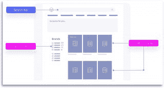

*   一个显眼的搜索框
*   即输即用的即时结果
*   轻松扫描结果
*   刻面
*   允许打字错误和同义词
*   高亮匹配关键词

### **用于搜索的高级组件**

值得考虑搜索的全部潜力。搜寻者试图

当考虑你自己或客户的内容中的搜索意图时，如果你想实现你的目标，识别五种关键类型的搜索意图是很重要的。这些是**信息**、**事务**、**商务调查**、**导航**或**基于位置的**

我们建议使用更丰富的用户界面超越标准搜索。这将增加搜索框的使用率，并确保您满足搜索者的需求。原因如下:用户并不总是 [知道如何搜索](https://www.asktog.com/columns/085BrowseVsSearch.html) ，或者如果他们的原始策略不起作用，如何适应和改变搜索策略。此外，一些用户对技术不够了解，无法充分利用标准搜索。他们需要更多的牵手。更好的搜索 UI 引导这些用户搜索 *继续搜索* 而不放弃。这就是你需要超越标准搜索的地方。

有许多同类最佳的功能来创造这种增强的搜索体验。这里有一个电子商务的例子，包括下面列出的许多功能。正如你所看到的，有了这些额外的特性，你可以为用户提供更多的选择和渠道来找到他们需要的东西。此外，他们可能会发现促销活动、畅销书或相关商品。

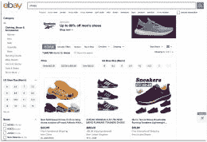

让我们仔细看看每个功能:

*   **查询建议**这些建议基于 analytics 收集的先前搜索行为。

此图片将建议的查询与建议的类别和产品结合在一起。

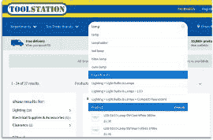

该图显示了查询建议与下一个元素联邦搜索的紧密联系。

*   **联合搜索** 显示单个查询的多个结果。结果可能来自不同的数据源。通常，您会将结果与博客、评论、类别和相关项目一起显示。

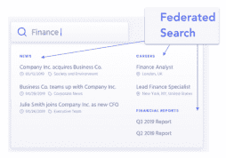

如这里所做的，其中查询“eye”返回建议的查询、产品、推荐的产品和 FAQ。使用一个查询的四组内容，来自四个不同的数据源。

**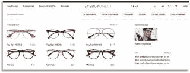**

*   **增强的刻面** 提供了更深入和相关的刻面。它们可以放在屏幕的不同部分，而不仅仅是左侧。

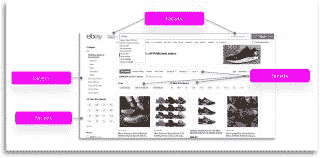

*   **销售** 提议或推广商品，开展活动和促销，展示横幅。

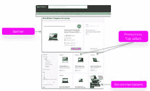

## 一个浏览界面的组件

许多行业使用浏览组件来满足用户的好奇心、各种需求以及他们对娱乐和信息的渴望。利用浏览的行业包括媒体、旅游、娱乐、新闻、社交媒体、图像浏览和应用商店。

通常专注于搜索的电子商务企业越来越多地开始将浏览元素集成到他们的用户界面中。你可以在时尚、科技和汽车购物中看到这样的例子。电子商务用户通常从好奇心开始，在做出决定之前寻找灵感和信息。

有一点需要注意的是，用户来你的网站是带着不同的意图的，取决于他们那一刻的需求。可能是新年前夜，也可能是夏天的开始。他们可能正在计划一次旅行或一场婚礼。

记住所有这些，让我们来定义浏览器在做什么。

*   不寻求答案，而是寻找多个项目和建议
*   为了研究，学习
*   为了娱乐而娱乐
*   受到启发，满足好奇心
*   抄底
*   查看社交媒体上的新闻标题或提要
*   以此类推。

### **高级浏览 UI 的组件**

与标准搜索相比，简单的浏览界面增加了相关商品、促销横幅和菜单导航:

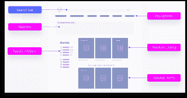

然而，你会想要建造更多的东西。这里列出了一些最常用的基于浏览的 UI 元素。这些 UI 组件的有趣之处在于，它们使用简单的想法来创建强大的最终结果。

*   **旋转式传送带** 显示多行按类别分组的醒目商品。例子包括在水平传送带上显示不同流派的网飞和其他流媒体服务，按主题或认证对课程进行分组的教育网站，创建在线通道的超市，以及按类别对其庞大目录进行分组的市场。

让我们来看看一个美食网站，它把每个转盘设计得像超市的过道:

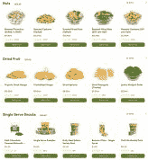

*   **分类页面** 在单个页面上展示一组相关的项目。例子包括浪漫喜剧的页面，所有的 iPhones 或苹果产品，秋季时装系列，或者在线杂志中的政治故事。

例如，一家家具公司给用户一个专门的“窗帘”类别页面，其中包括带有不同窗帘*sub*——类别和促销的传送带。它们还提供了允许进一步浏览的菜单。还有许多按钮允许用户开始搜索。总的效果是一个灵感和发现，轻微的鼓励从浏览切换到搜索。

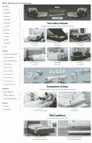

其他元素包括:

*   **菜单系统** 使用户能够直接导航到不同的项目或类别页面。
*   **相关项目和建议** 暗示进一步的可能性和相关性。
*   面包屑、书签、愿望清单让用户知道他们在哪里，并返回到他们曾经在的地方。

## 结合搜索和浏览的挑战

许多 UI 元素(如 [联合搜索](https://www.algolia.com/doc/guides/solutions/ecommerce/search/autocomplete/federated-search/) ， [商品销售](https://resources.algolia.com/merchandising/the-guide-to-ecommerce-merchandising) ， [刻面](https://www.algolia.com/blog/ux/filters-vs-facets-in-site-search/) )可以是 [，就像搜索](https://www.uxbooth.com/articles/searchers-and-browsers-the-personality-types-of-ux/) 一样适合浏览。这些特征使得搜索者能够容易地在两种模式之间切换。

但是，有一些特定的 UI 模式( [类别页面](https://www.algolia.com/doc/guides/solutions/ecommerce/browse/tutorials/category-pages/) ， [轮播](https://www.algolia.com/doc/guides/solutions/ecommerce/browse/product-carousels/static-product-carousels/) ，thumbnaked-info)*有时候* 只对浏览器起作用，对搜索者不起作用。

挑战在于如何在不破坏搜索体验的情况下引入类似旋转木马的浏览功能。

例如，浏览器需要以易于浏览和理解的方式突出显示信息。这就是为什么旋转木马以易于扫描的缩略图形式呈现信息，提供了比大量文字更好的浏览体验。是想用冗长的描述还是过多的信息分散浏览器的注意力？你真的想展示令人焦虑的价格吗？

然而——回到搜索者:如果你 *不* 显示价格和描述，搜索者如何比较、决定、购买？

这里有一个为浏览和搜索提供价格的界面——用户必须将鼠标悬停在图片上才能获得价格。

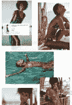

### **混合搜索和浏览取决于用例和 UI**

定义你的用例很重要。对于主要用例是帮助用户找到特定商品的企业，他们需要提供一个突出的搜索框、查询建议、相关结果和 faceting。这些功能还可以帮助用户“浏览”——也就是说，在购买之前进行比较、产生短暂的好奇心并获得灵感。但是他们的主要目的是搜索。例如，建筑工人寻找特定尺寸和大小的钉子或钻头。

对搜索者不起作用的一个例子是像苹果这样的品牌网站，其迷人而成功的用户界面是专为浏览和发现而设计的。如果搜索者不得不浏览许多产品、功能和交互式图形页面来找到写着“到此购买”的按钮，他们将会迷失和沮丧。

事情是这样的，苹果不需要组织搜索的视野。它的整个目标是令人惊叹的效果:启发和教学。服装设计师也是如此，他们的主要目标是展示他们最近的系列，并引导用户进入特殊场合和事件的页面。

但是有很多网站平衡了这两者，让浏览器很容易切换到搜索模式:

**行业-媒体**

让我们转向在线广播和流媒体杂志，它允许用户浏览标题和故事类别。他们提供相关链接和诱人的建议。他们还提供了一个搜索框和 faceting(特别是日期和主题)来确定最相关的故事。

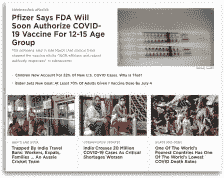

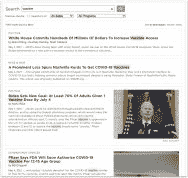

**行业—旅游/合作**

我们知道 Airbnb 的界面，它允许你在搜索公寓或住宅之前浏览你的目的地。在下面的例子中，我们展示了 WeWork 是如何遵循从浏览到搜索的模式，增加了一种额外的协作方式。通过提供一个包含办公室类型的登录页面，然后为每种办公室类型提供一个带有比较功能的分类页面，WeWork 为用户提供了足够的信息来探索并最终选择合适的工作环境。在这一点上，他们被带到一个地图驱动的预订过程，以搜索位置。

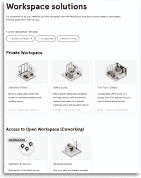

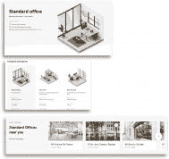

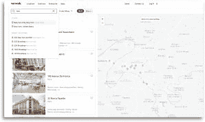

## 结论——那么谁赢了？搜索还是浏览？

[人们过去浏览网站的次数](https://measuringu.com/search-browse/) 多于搜索。当他们用谷歌、雅虎和其他互联网搜索引擎搜索 *网页* 时，当他们来到一个特定的网站时，他们的本能是浏览，这意味着使用菜单、点击链接和扫描不同的页面。

时代变了。我们已经知道“浏览”是一种伪装的低效搜索。如今，优质搜索在亚马逊等市场、Spotify 等流媒体服务、苹果等应用商店以及 Pinterest 等媒体收藏中扮演着同样重要的角色。一个搜索框是必不可少的，因为这些企业提供大量的、多样的和不断变化的服务。

也就是说，平衡已经达成。虽然网飞、Spotify、社交媒体平台和在线新闻期刊等企业主要依赖于 *而非* 搜索框浏览界面，但许多以搜索为中心的网站，如亚马逊和易贝，也开始采用这些相同的基于浏览的元素。一些网站，如 Airbnb 和 WeWork，正在创造两者的完美结合，这取决于用户处于旅程的哪个阶段:人们在搜索房屋之前浏览目的地。

在线企业正在认识到，建立一种像搜索一样高效浏览体验，以找到内容并获得灵感是多么重要。

这种 [之间的来回搜索和](https://articles.uie.com/browse_vs_search/) 的浏览还会继续。搜索和浏览是与网站交互的两种不同模式。没有赢家和输家。它们有很大的不同，但在在线业务的所有领域都同样重要，包括媒体、电子商务、教育服务、SaaS、旅游——基本上是每一种业务。