# 将语义、知识和问题回答添加到您的搜索页面

> 原文：<https://www.algolia.com/blog/ux/semantic-search-returns-knowledge-and-answers-your-questions/>

搜索已经走过了漫长的道路。

我们曾经盲目地按下回车键，希望能找到我们的宝藏。如果没有，我们将添加或删除一个单词，或者完全改写查询，然后再次单击 Enter。再一次。不要谈论打字错误——对于我们这些母语不是英语或者打字或拼写能力差的人来说，我们只能放弃。

几年前，当 SaaS(搜索即服务)公司上市并向我们展示了搜索应该如何: *快速和相关时，搜索发生了变化；当您键入即时结果时；充满活力的 UI/UX；刻面和过滤。*

回车键不见了。

SaaS 科技继续发展，增加了更多的产品细节、客户评论和评级、多张照片、推荐和商品销售——速度更快，相关性更强，导航更加便捷。

搜索现在已经成为网上购物必不可少的，以及盈利的进行竞争的网上商家。

不过还是那句话，搜索已经走了很长的路，达到了一个新的里程碑:**问答**和**知识。**看看这个:

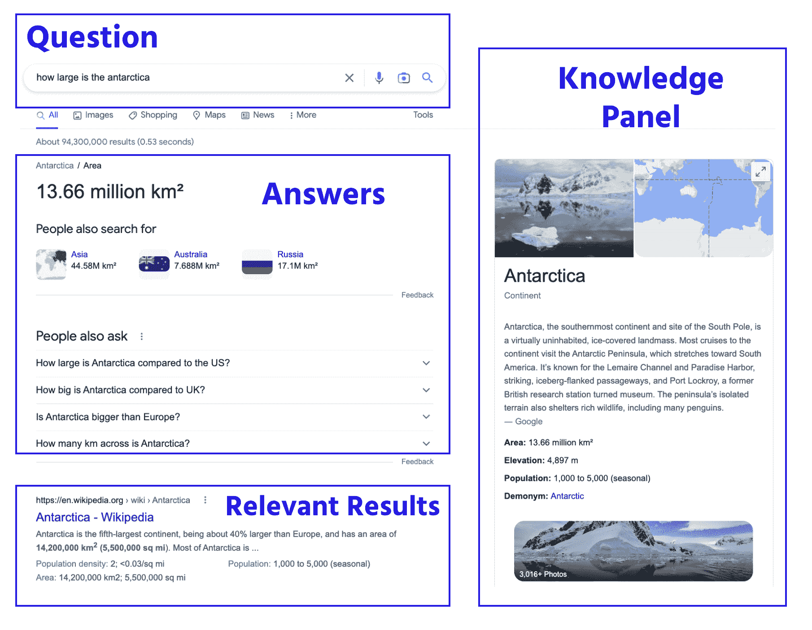

有了的知识，我们不再需要 离开 的搜索屏幕。我们可以留下来问更多的问题，接收多个答案，点击相关问题，阅读带有链接的主题摘要以进一步了解。

全部同单查询。或者声音，或者图像。(还没想好。)

而这仅仅是开始。GPT 就在眼前。搜索不再一样。

*商业* 不再相同。一个 ll 公司，无论大小，在任何领域——电子商务、媒体、旅游——都可以实施 *问答* 和 *知识面板* 作为其知识管理和数字平台的一部分。

为什么在搜索结果旁边展示知识改变了一切？

## 知识的重要性

在过去的好日子里，炼金术士秘密工作，贪婪地向他人隐瞒他们的知识。他们未能理解的是，他们的知识(无论对错)比他们未能创造的黄金更有价值。

他们没有体会到 *分享知识* 推进了人类的理解和表现。

**知识是一种资产。了解知识的货币和竞争价值的公司学会释放他们的数据，并为他们的员工、商业伙伴和客户进行个性化处理。**

由此可见， **知识管理的重要性** 。

## 知识管理从何入手？搜索栏。

任何成功的真正有用的知识管理系统的出发点都是理解人们在使用这样的系统时需要什么。没有比一开始更好的开始了，在那里首先获得知识: **搜索界面** 。

考虑**知识管理可以解决的三个搜索用例**:

*   **经典搜索:** 搜索某个特定的人、地点或事物，立即用它做一些事情，比如购买(电子商务)、播放(流媒体)或阅读。
*   **问题&答案:** 寻找精确问题的答案。
*   **知识:** 寻找有助于你执行任务的信息，浏览、研究、决策、与他人互动、学习新东西等等。本质上，希望提高你的大脑、表现和决策能力。

*注意，此列表中缺少 [语义搜索](https://www.algolia.com/blog/ai/semantic-search-and-why-it-matters-for-e-commerce/) 。那是因为语义搜索和任何人工智能搜索一样，比如 NLP、NLU、LMs 和 GPT，都不是*使用* *用例* 而是 *搜索技术* 可以在上述所有三种用例中使用。我们将继续讨论语义搜索。

### **那么，什么样的搜索界面能够满足这三种截然不同的用例呢？**

让我们将所有这些用例背后的意图合并成一个短语:

用户需要以正确的格式访问所有可用的、必要的和有用的信息，以满足他们的即时意图。T36

挺密集的，这个词组。这个怎么样:

*人们需要一个搜索界面，只需几个搜索词就能为他们提供所需的信息。*

当我们想到这样一个“系统”时，我们往往会跳到“信息”部分，并问:如何才能将我们许多单独的数据源和不同的格式和流程结合起来？这将我们带入系统架构、数据科学和应用编程。理应如此。但是它跳过了本质的一点——为什么—*为什么* 我们需要知识管理吗？

从最终用户体验(通过搜索获取信息)开始，我们将重点放在寻找和使用知识上。

换句话说，就是能够找到最好、最有用的信息。而 *数字* 寻找是从搜索栏或者语音助手开始的——或者是用我们所说的 **联合搜索** 。

### **什么是** **知识管理背景下的联邦搜索**

 **[联合搜索](https://www.algolia.com/blog/ux/what-is-federated-search/)，或多维搜索，是在一个搜索界面上仔细展示不同的信息片段。它为用户的每个查询提供了各种信息和选项。看一下下面的模式:

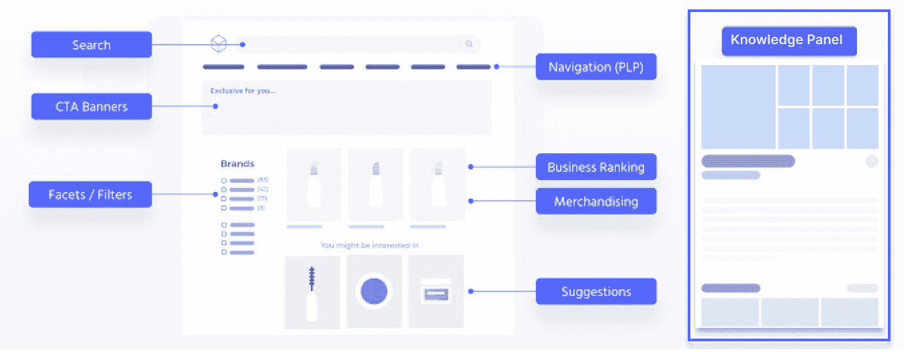

总的想法是， *单个查询* 显示各种信息，如标准结果、超链接、方面和过滤器、菜单、销售和推荐，以及一个更大的“知识面板”,提供一个问题的相当完整的答案或一些相关主题的摘要。

我们可以在 Birchbox 的搜索页面上看到联合搜索的运行。请注意右侧的产品列表、方面、类别以及常见问题和文章的“百科全书”:

一种知识管理电子商务的本质是一个 *各种各样的相关信息* 都可以如此方便快捷地找到。

在剩下的两节中，我们将仔细研究:

*   知识管理前端实例
*   从各种数据源生成知识的后端流程

## 前端-联合搜索界面上的知识管理

提醒一下，有三个用例:

*   经典搜索
*   提问&回答
*   知识内容

### **电子商务用例——将经典搜索与内容相结合**

经典的电子商务搜索会返回一个产品列表，包括简短描述、图片、价格等。利用这些信息，用户可以选择查看或购买商品，或者改变他们的搜索。大多数电子商务网站提供分面和过滤以及相关商品的推荐。亚马逊为大多数电子商务企业提供了模式。

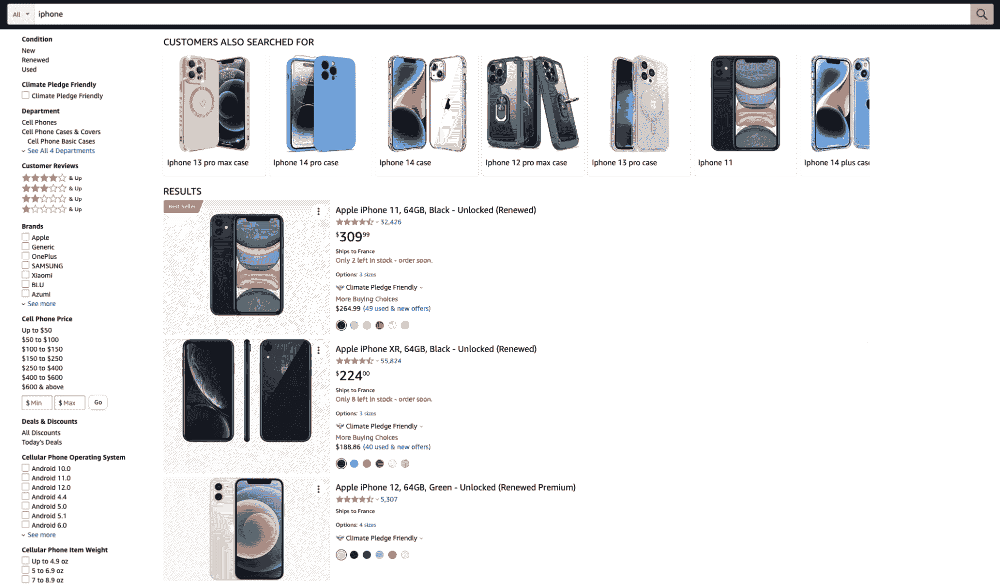

这就是 **经典搜索** 的样子。

但是你也可以在经典的搜索体验中加入知识。右边是空的，所以我们添加了一些额外的信息:

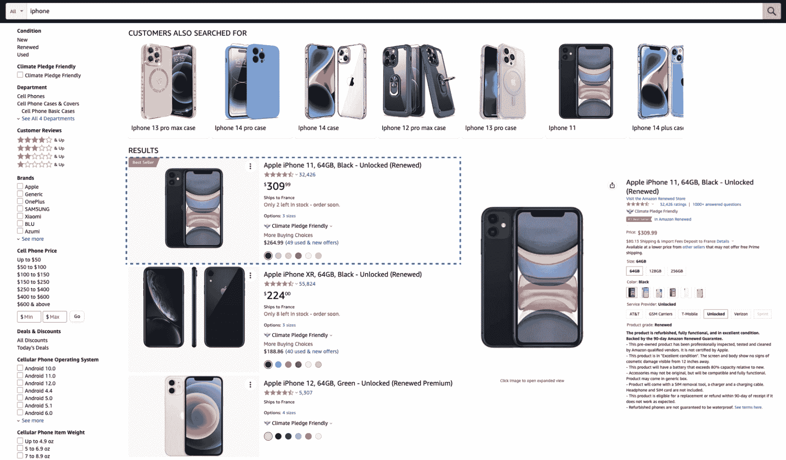

我们添加了第一个结果的信息快照。它包含手机的详细信息，评级，运输信息，选项和更多的总结。你也可以点击物品的选项或查看评论。

当你向下滚动搜索结果时，你可以看到每个项目的预览:

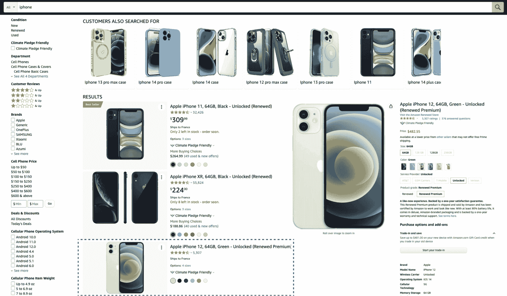

你会想要很好地设计体验，因为太多的知识会开始塞满你的屏幕。比如添加基于物品的配件和推荐很重要；但是需要设计好:

### **语义搜索——问题&答案+内容**

创造一个更自然的语义搜索怎么样？

谷歌通过其[知识小组](https://www.algolia.com/blog/ai/knowledge-graphs-and-ontologies-adding-knowledge-to-keyword-search/)，以及其回答问题和提出相关问题的能力，改变了我们的期望:

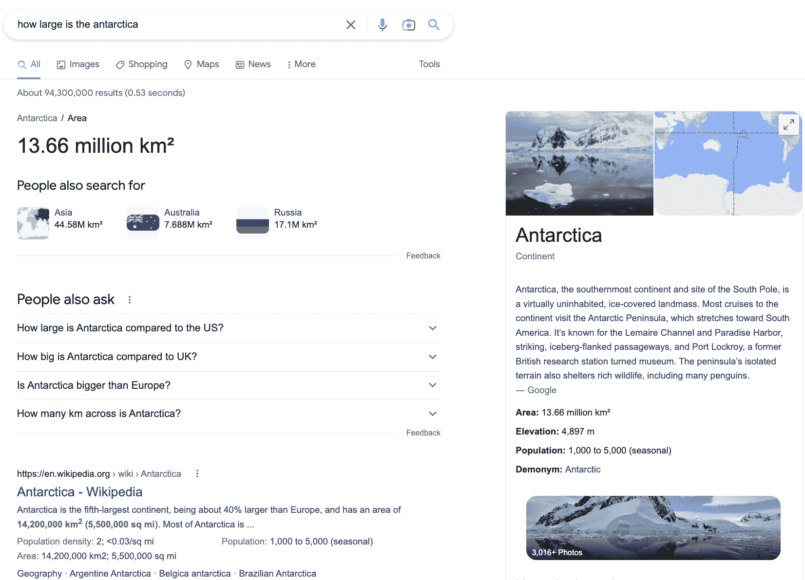

这里发生了很多事情:谷歌回答了这个问题(“南极洲有多大？”)，并提出其他问题。它还将南极洲的大小与其他国家进行了比较，并提供了南极洲的图片和链接摘要，以获得有关大小、人口和历史的更多信息。

没有理由离开这个屏幕，除非你想了解更多信息。

谷歌根据主题改变设计。艺术家得到不同的待遇。比如一个问题(“杰夫·贝克是谁？”)返回照片，轻松访问他的艺术，和一些传记信息:

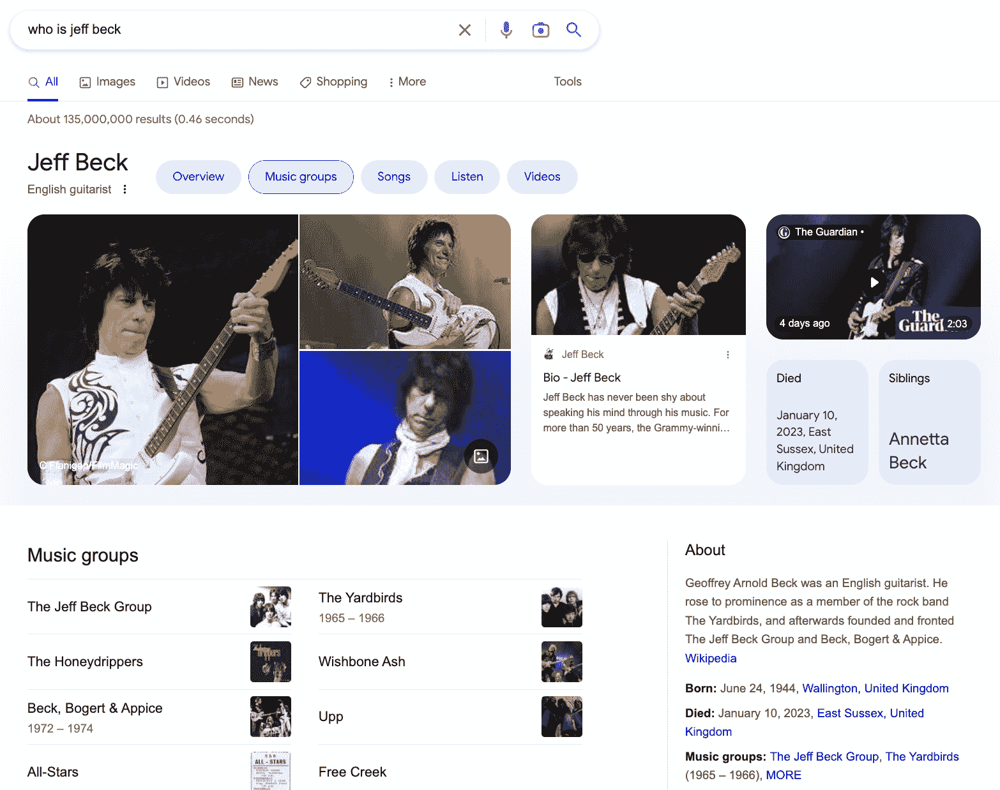

奇怪的是，谷歌并没有为新闻提供同样的知识，你可能会认为至少获得头条新闻更重要:

新闻杂志、博客或软件文档等信息驱动型网站可以在用户向下滚动搜索结果时添加内容快照:

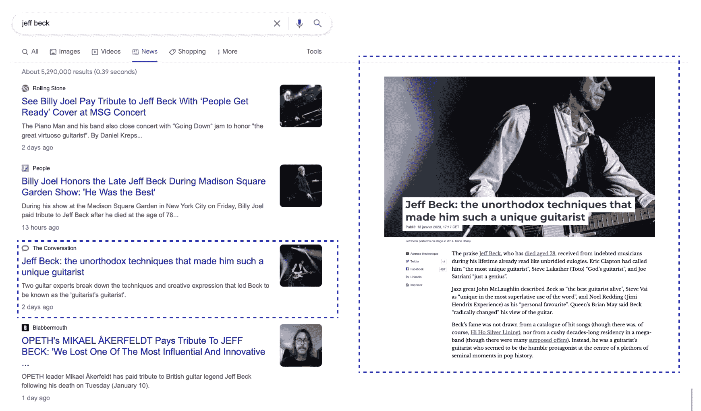

最后，文档网站经常使用相同的技术——显示页面的快照。这节省了开发人员的时间，因为他们不必筛选多个页面，直到找到他们的答案:

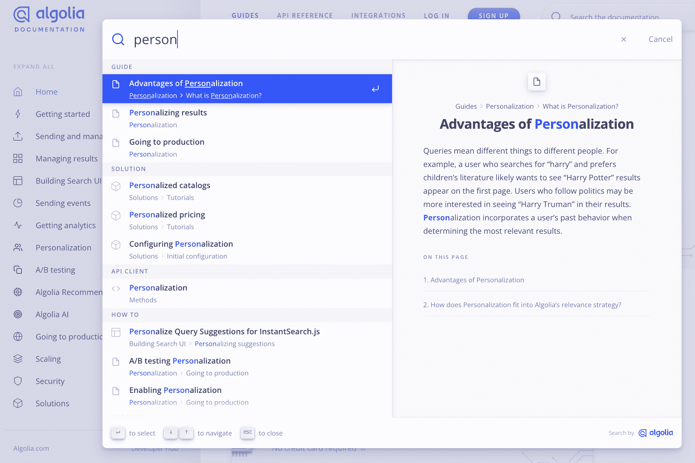

总之，基于知识的搜索就是以多种方式呈现信息，而不仅仅是提供链接。

现在让我们深入了解一下搜索引擎是如何做到这一点的。

## 后端——将数据整理成知识

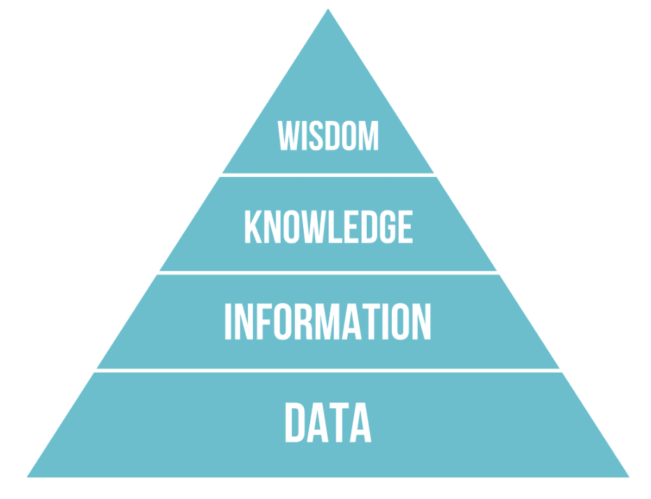

> 几十年来，人们一直在激烈争论这样一个事实，即一个有效的知识管理系统不能像任何软件系统那样安装在内部网中，知识也不能存储在文档或数据库中。随着知识图(KGs)的兴起，许多知识管理实践者问自己这样一个问题:KGs 是否仅仅是另一个数据库，或者它是否最终是 DIKW 金字塔中知识层与信息和数据层之间缺失的链接。

*—[Andreas blu mauer](https://www.linkedin.com/pulse/knowledge-management-better-graphs-andreas-blumauer/)，语义网公司创始人&CEO*

我们可以补充的是， *智慧* ，在企业和电子商务知识管理的背景下，与做出明智的决策、良好的表现、创造更好的营销活动以及增加客户满意度和在线收入等意图相关。

### **从数据到信息到知识**

数据需要上下文来赋予它意义。否则，它就是简单的原始信息，比如字符串(“A”，“A”，“B”，..)、数字以及代表真和假的二进制 0 和 1。客户的名字是一串数据。只有当有人搜索客户的名字或想要查看他们的销售活动时，它才成为一个有意义的字符串。

后端数据库和应用程序提供数据；前端搜索界面将数据显示为信息和知识。

### **流程&算法**

为了将数据从后端拿到前端，工程师和数据科学家需要构建一个 **数据管道** 来馈给 **中间层** 。中间层提供对前端的 API 访问， 使前端工程师能够构建一个联邦搜索接口。

我们来看两个中间层数据集:

1.  一个搜索索引
2.  (人工智能/机器学习向量或知识图的)知识库，如下文所述

### **搜索索引——为经典搜索**

大多数在线公司使用基于云计算的搜索索引。搜索索引由 *子集**相关* 信息组成，如可搜索的关键字和元数据(标题、品牌、颜色、价格等。)，以及更长的自由文本描述。它还包含用于在搜索界面上显示、排序和过滤信息的信息。

当处理(如产品目录、客户数据)的多个数据源时，工程师需要创建一条“数据管道”使 *将* 的各个数据源合并成 *一个* 的搜索索引。

这是后端应用程序到单个搜索索引之间的流程图:

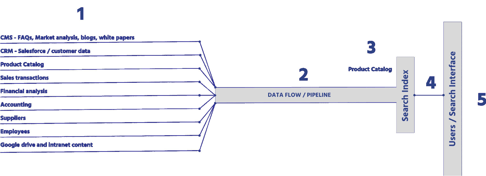

1.  在最左侧，您有许多典型的后端系统，它们为不同的用途提供重要信息，例如员工寻找工作所需的信息，客户搜索产品，营销人员和业务合作伙伴管理他们的产品目录。
2.  称为管道的数据流从每个系统获取相关信息的子集，并执行合并，这包括重新格式化和结构化数据源以供搜索。正是这个过程构建了搜索索引。
3.  搜索索引包含大量结构化数据，搜索引擎使用这些数据来执行所有查询并向用户显示所有相关信息。
4.  搜索 API 执行所有搜索请求，返回一组搜索结果显示在搜索界面上
5.  最后，在右边，你有搜索界面本身——结果、方面、推荐和其他用户交互的信息。

### **知识库——添加** ***知识********问题解答*****

 **知识管理，包括问答，来源于一个 *第二个* 中间层数据:

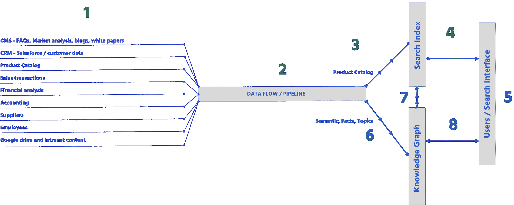

5.  知识管理改变了界面，用类似谷歌的超链接显示基于知识的信息(见上一节的例子)。它还显示问题的答案(参见上面的“谁是 jeff beck”示例)。
6.  添加知识时，数据管道流程和算法必须适应。之前它只喂搜索索引；现在，还有一个将公司数据映射到知识库的额外流程。此外，由于知识需要更多相关信息，数据管道需要做的不仅仅是格式化和结构化数据，其算法需要重新处理数据，以构建基于向量的分类和/或知识图 **。我们将在下面更详细地介绍如何建立知识库。**
7.  一旦知识库完成，它还可以向搜索索引发送一些摘要数据，并带有完整信息的链接。这样做是因为访问搜索索引通常会更快，其关键字搜索最适合管理整个搜索执行过程，尤其是相关性。这也将在下一节讨论。
8.  最后但并非最不重要的是，前端现在并行发出两个搜索请求:一个对搜索索引，另一个对知识图。这应该是[异步](https://www.algolia.com/blog/engineering/build-a-react-app-with-fast-indexing-and-instant-inventory-updates/)，搜索结果先出现后立即出现，额外的知识紧随其后出现。这种延迟通常是察觉不到的。

这就是将公司数据转化为相关用户知识的完美例子。当然，细节是最大的问题，有多种方法来构建它，但是这应该给出了所涉及内容的一个大概的概念。

## 用知识图和/或机器学习存储知识

储存知识的方法有很多种。它可以存储在一个搜索索引中，或者以向量和知识图等格式存储。我们将讨论后两者。

### **机器学习&语义与神经网络、向量和语言模型**

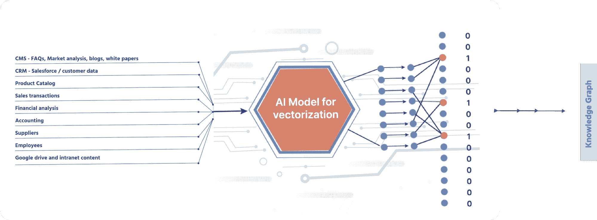

> *多年来，搜索引擎主要依赖关键词，就像你在书后面找到的索引一样。除非查询与索引中的关键字匹配，否则搜索引擎可能会空手而归。虽然“匹配”的概念传统上驱动着搜索引擎，但从“匹配”到“理解”的重大转变目前正在进行中。这是由人工智能驱动的，人工智能用于以数学方式表示文本，以便机器可以在概念上理解它。概念正在取代关键词，这对每个人来说都是好消息。*

*–*[*哈米什·奥美*](https://www.algolia.com/blog/ai/what-is-concept-search/) *、人工智能副总裁安戈利亚*

当机器“读取”大量(非常多)数据时，它们会自学理解这些内容，或者赋予其意义。借助 *的自动化* 的自我学习，他们可以完成以下任务:

*   查找单词中的相似性(检测同义词、单词相关性)
*   从文本中提取主题和主题层次
*   提供上下文以创建对文本的更深理解，从而实现推理和深层知识
*   预测下一个单词
*   生成内容

大多数 ML 技术(如神经网络)创建某种形式的矢量化数据集。矢量化是将单词转换为向量(数字)的过程，这使得它们的含义能够以数学方式进行编码和处理。你可以把向量想象成代表单词的一组数字。在实践中，向量用于自动化同义词、聚类 documents‍、检测查询中的特定含义和意图以及对结果进行排序。矢量化功能非常广泛，其他对象(如整个文档、图像、视频、音频等)也可以矢量化。

我们可以用一个简单的三维图来可视化矢量:

图像 [通过媒介](https://towardsdatascience.com/word2vec-research-paper-explained-205cb7eecc30) 显示向量空间维度。

你和我都能理解诸如“国王”、“女王”、“统治者”、“君主”和“皇室”等术语的含义和关系有了向量，计算机可以通过在 n 维空间中把它们聚集在一起来理解这些术语。在上面的三维例子中，每个术语可以用坐标(x，y，z)来定位，并且可以使用距离和角度来计算相似性。

然后可以应用机器学习模型来理解向量空间中靠近的单词(如“国王”和“王后”)是相关的，甚至更靠近的单词(如“王后”和“统治者”)可能是同义词。

向量也可以加减乘除，寻找意义，建立关系。最受欢迎的例子之一是国王——男人+女人=王后。机器可能使用这种关系来确定性别或理解性别关系。搜索引擎可以利用这种能力来确定一个地区最大的山脉，找到“最佳”的度假路线，或者确定健怡可乐的替代品。这些只是三个例子，但还有成千上万个！

### **AI 和知识管理有什么关系？**

通过寻找单词关系并建立事实和概念推理，机器学习使系统能够综合公司的独特知识。谷歌十多年来投入了数百万工程小时来设计其用于互联网搜索的深度学习 [BERT 语言模型](https://towardsdatascience.com/bert-explained-state-of-the-art-language-model-for-nlp-f8b21a9b6270) 和搜索基础设施。

在电子商务、媒体和其他在线服务中也可以做到这一点。

### **什么是知识图？**

> *在搜索的历史上，有许多不同的搜索方法，例如，经典的关键字搜索，它基于文本匹配或同义词来匹配单个单词或短语。本体和知识图通过添加主题匹配向前迈进了一步，其中属于相同主题或包含相同实体(不一定是相同单词)的项目和文档也被认为与查询相关。*

*–*[*朱利安·莱莫因*](https://www.algolia.com/blog/ai/knowledge-graphs-and-ontologies-adding-knowledge-to-keyword-search/) *、联合创始人&前安哥利亚 CTO*

让我们从“本体和层次”开始。知识图包含“节点”,如概念、主题、层次和其他分类信息的方式。它还包含显示节点之间关系的“边”。

通常，节点是名词，边是动词。我们用一个简单的例子:“牛”是“动物”，“动物”是“生物”，“牛”吃“草药”:

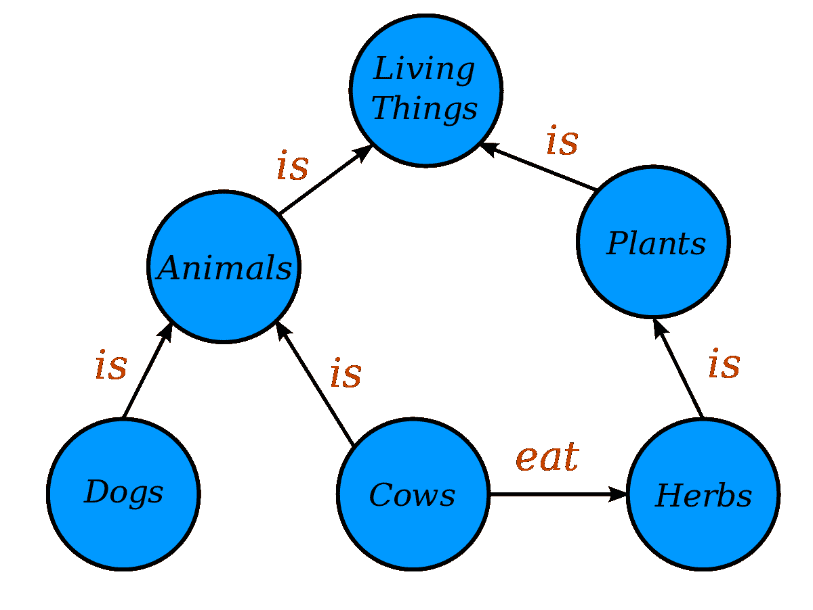

你可以看到生物是吃东西的植物。更重要的是，这个图式使我们能够做出 *的推论* ，比如生物需要吃哪种食物。

一旦分类到位，公司就可以将它的真实对象(产品、财务、客户和其他事实)分布到图表中。例如，一个特定的“生物”(雏菊)可以通过它的分类和与其他事实和对象的关系来理解。

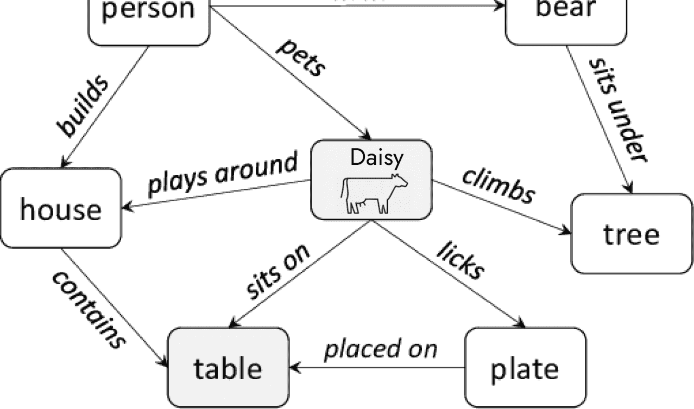

我们可以说，作为一种生物，雏菊需要吃东西，因此，我们可以推断它的一些行为与吃有关。因此，搜索“奶牛食品”可能不仅会显示不同品牌的奶牛食品，还会显示奶牛如何寻找食物、营养信息等知识。

从高层次来看，这就是知识图如何用事实(节点)、事实关系(边)和推理链来表示知识，从而提供一个摘要或讲述一个完整的故事。

理解知识图表中的一些挑战很重要:

*   对于大规模企业来说，知识图成功所需的大量事实和关系令人望而生畏。如果它的知识中有任何漏洞，或错误的信息，图表就变得不可用，如果重要的数据是误导性的，那么依赖它就有风险。
*   信息变化、过时或失效；旧数据可能是错误的或错误分类的；新数据有时需要重新思考旧的概念和关系；诸如此类。
*   知识图表通常依赖于该领域专家的繁琐的手动输入来加强数据的质量和数量。这需要他们花费大量宝贵的(也是昂贵的)时间来输入正确的东西。

从本质上讲，知识图要有用，并且不完整或不准确，就需要大量的数据和持续的维护。但是，控制这种情况的一个方法是专注于较小的目标。例如，一家电子商务公司可以通过为其在线服务创建一个小型知识图来限制其内容的广度，包括关于产品、销售、营销和客户的知识。另一方面，同一家电子商务公司可以为其员工创建第二个更大的知识图。但是后者可能最适合语义和矢量化。

值得一提:语义和知识图可以协同工作。知识图可以提供矢量化分类，因此中间层可以将经典搜索索引与基于强大语言模型(如 LLMs 和 GPT)的强大自动化人工智能索引相结合。

## 现在是什么，接下来是什么

多个结果、丰富的知识、问题的答案–全部在一个搜索界面上。[与我们聊天](https://www.algolia.com/contactus/)如果您想知道现在正在发生什么，接下来会发生什么，以及如何[构建您自己的](https://www.algolia.com/users/sign_up)知识丰富的联合搜索体验。****