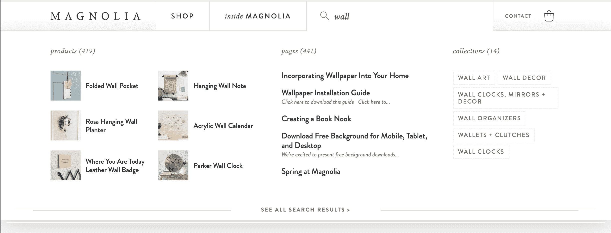

# 为您的商店提供便捷而强大的 Shopify 搜索

> 原文：<https://www.algolia.com/blog/ecommerce/shopify-search-experience/>

作为值得信赖的 Shopify 搜索合作伙伴，我们很高兴宣布与 Shopify 定价模式一致的新定价，并以更低的价格提供对我们许多高级功能的访问。

Algolia 提供搜索和发现体验，可以通过 Algolia 更新的 Shopify 插件快速部署。这种合作关系最早[始于 2016 年](https://blog.algolia.com/bringing-algolias-search-as-you-type-experience-to-shopify-stores/)，从那时起，我们不断改进我们的插件，以满足 Shopify 客户的需求并支持新的 Shopify 功能。

最近来自数字商务 360 的[研究显示，在搜索方面的投资有非常高的投资回报率，使许多电子商务网站的转换率翻了一番。](https://resources.algolia.com/home/site-search-high-converting-investment-when-done-right)

虽然 Shopify 的内置搜索是一个很好的起点，但 Algolia 提供了许多高级功能，可以改善搜索和发现体验，使客户更容易快速找到合适的产品。Algolia 通过实时索引、出色的搜索速度以及一系列搜索和发现功能，包括根据您的独特需求调整文本和业务相关性的能力，增强了 Shopify 购物体验。我们还提供用于配置销售策略的工具，这些工具适用于 Shopify 系列。

下面是一个自动完成菜单的很好的例子，它在用户输入时实时动态更新:

我们的新定价[于 7 月 1 日](https://blog.algolia.com/introducing-algolias-most-customer-friendly-pricing/)推出，旨在让任何商店都能更方便地进行搜索和发现。即使您是一家小型零售商，也可以轻松开始使用高级功能，并随着业务的增长享受批量折扣。这种新的定价模式使得 Algolia 的 Shopify 搜索对 Shopify 客户来说极具成本效益。

您可以在 [Shopify 应用商店](https://apps.shopify.com/algolia-search?surface_detail=algolia&surface_inter_position=1&surface_intra_position=2&surface_type=search) 上找到 Algolia，还可以在我们的 [网站](https://www.algolia.com/search-solutions/shopify/) 上获得更多关于 Algolia Shopify 集成的详细信息并下载插件 。