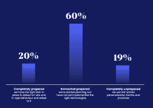

# 全渠道购物体验的秘密-欧洲购物网- Algolia

> 原文：<https://www.algolia.com/blog/ecommerce/shoptalk-europe-omnichannel-shopping/>

如今购物者没有非此即彼的选择。随着世界走向大流行后的现实，消费者已经开始重新接触他们最喜爱的品牌，无论是在线还是店内。为了取得成功，今天的零售商需要提供无缝体验，连贯地连接所有这些购物接触点。这个百万美元的问题是:你准备好为今天的混合现实提升你的客户体验了吗？

Algolia 的专家们正前往伦敦参加欧洲大陆最大、最具影响力的零售活动 Shoptalk Europe，分享在[电子商务](https://www.algolia.com/industries-and-solutions/ecommerce/)和现实世界接触点创造成功的混合零售体验的策略。从 6 月 6 日到 8 日，在 Algolia 的#K22 展位，了解如何利用强大的搜索和发现功能促进您的零售业务。

# **通过无缝、全渠道接触点提供卓越体验**

在经历了两年的零售挑战——疫情停工、供应链中断和陡峭的新技术障碍——之后，随着购物者蜂拥回到商店，实体零售商松了一口气。

回归面对面购物是一个令人兴奋的发展，但现在不是零售商开倒车的时候。在今天的环境中，顶级品牌通过拥有每一个客户接触点来取得成功:店内购物、电子商务和来回购物，以及混合购物，也称为“ [物理购物。](https://www.forbes.com/sites/gregpetro/2021/08/06/the-phygital-world-reinventing-the-in-store-experience-digitally/?sh=5e335c2a3863) “购物者不仅想要全渠道体验，而且以正确的方式接近混合零售可以让企业抓住不同购物者的脉搏，了解他们的偏好并建立持久的关系。

混合零售的成功之路意味着在正确的地点和时间将产品与人匹配，并在每个可用的接触点提供无缝互动。关键是在每次互动中利用行为数据来预测他们的需求。

鉴于劳动力和商品成本不断上涨，加倍发展混合零售的想法可能会令人望而生畏。在我们最近的 [电子商务趋势报告](https://www.algolia.com/dg/ecommerce-site-search-trends/) 中，Algolia 调查的 900 名电子商务决策者中，只有 20%认为自己有能力向客户提供个性化的数字购物体验。

在竞争激烈的零售环境中，全渠道体验可以带来巨大的变化。学会如何提供增强的混合体验的在线零售商是那些从专业、利基在线品牌中脱颖而出的**零售商，他们是那些站起来**对抗亚马逊、Overstock 和阿里巴巴等大型竞争对手的零售商。****

 ****## **在欧洲购物对话上了解如何通过 Algolia 提供混合购物体验**

在 K22 号展位，Algolia 的搜索专家将分享他们在帮助行业领先品牌如鳄鱼、保罗&鲨鱼、安德玛和 Gymshark 在混合零售方面取得成功的知识和专业技能。这些品牌正在利用 [Algolia 的 API-first 搜索平台](https://www.algolia.com/) 来增长转化率，增加产品互动，获得重复订单和客户访问。我们的专家可以向您展示如何通过个性化搜索、发现和推荐来构建和创建卓越的数字体验。

Algolia 是创造个性化、强大的电子商务搜索和发现体验的全球领导者，受到全球 11，000 多家客户的信赖。我们的 headless API-first 平台拥有业经验证的成功记录，帮助 Nuts.com 等品牌将转化率提高了 3 倍，Pentair 将在线产品浏览量提高了 500%，Gymshark 实现了 400%的收入增长。

在 Shoptalk Europe 上，我们的专家将分享关于人工智能搜索如何将用户和产品数据整合在一起以增强和扩展零售销售的见解和技术。我们将帮助您的业务团队发现新的销售增长方式，并保持购物者的参与度和回头率，包括:

*   [推荐](https://www.algolia.com/products/recommendations/) :根据高级行为分析展示和提炼商品和目录
*   人工智能功能:通过动态重新排序、动态同义词建议和个性化将用户意图转化为有意义的行动
*   简单的实验:灵活的微调和 A/B 测试，以监控和优化性能

Algolia 通过混合方式丰富客户参与度，将在线客户与实体店连接起来，为全渠道零售开辟了新的领域。我们每周为全球 11，000 多名客户提供 300 亿次搜索请求。这些伟大的功能使 Algolia 成为仅次于谷歌的世界第二大搜索引擎。

> *“Algolia 是 Lacoste 全球平台导航体验的重要组成部分。它不仅提供了以 Lacoste 闻名的一流用户体验，还将我们的全球销售额提高了一倍多。”*
> 
> *全球用户体验经理——Lacoste*

### **了解更多关于 Algolia 和 composable commerce shop talk Europe 的信息**

6 月 6 日，从超级游艇上的早餐开始吧！Algolia 专家将在英国夏令时晚上 8:30 到 12:30 回答关于可组合商务的问题。 坐稳最后几个剩余的空位， [此处](https://e2x.com/the-big-breakfast) 。

当天晚些时候，加入 Algolia 和马赫联盟网络的成员进行

Vagabond Wines 的鸡尾酒会，距离欧洲购物中心仅 20 分钟的地铁路程。从下午 5:30 到 7:00，与可组合软件领域的顶尖人物讨论电子商务。[点击此处注册](https://commerce-futures.com/events/mach-drinks-london)。点击阅读更多关于马赫联盟[的信息。](https://machalliance.org/)

### 

在 Algolia，我们一直在幕后进行一项激动人心的产品升级。安排一次会议，或者到 Algolia 的展位(#K22)参观，成为欧洲购物对话的第一批参与者！

[预定会议](https://go.algolia.com/ShoptalkEurope.html)

### **不参加欧洲购物对话？**

我们仍然希望向您展示像 Algolia 这样强大的搜索和发现解决方案如何帮助您提升混合购物体验。[免费预订，](https://www.algolia.com/demorequest/) [个性化演示](https://www.algolia.com/demorequest/) ，让 Algolia 专家对您网站的搜索和销售潜力进行审核。****