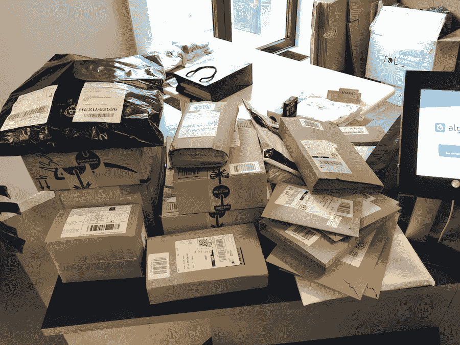
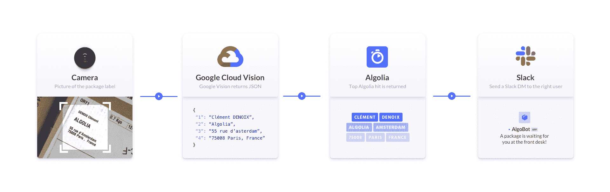

# 简化 Algolia 的包裹递送- Algolia 博客

> 原文：<https://www.algolia.com/blog/engineering/simplifying-parcel-delivery-algolia/>

> *注意:我们对这篇文章和我们的包装标签读取 OCR 应用程序进行了重大更新。请查看关于[如何将 OCR 集成到搜索](https://www.algolia.com/blog/engineering/integrate-ocr-into-search-in-a-package-label-scanning-app/) 的新文章。*

每天，Algolia 的员工都会在巴黎办公室收到大量包裹。到目前为止，我们的办公室协调员久美子一直在照顾他们。每次有新包裹到达，久美子都要搜索标签，找出是给谁的，然后找到 Slack 上的人，让他们知道他们的包裹在前台等着。

这种手工流程很有效，但 Algolia 正在快速发展:仅在去年，巴黎办事处的员工人数就增加了一倍多。Kumiko 开始用越来越多的时间手工处理包裹派送。在节日期间，它变得非常难以控制。

A typical day at Algolia, a month before Christmas

显然，手动操作无法扩展。

我在 Algolia 的内部工具小组工作。我们的使命是通过自动化低效的流程、制造工具和提供技术支持来提高 Algolia 团队的效率。我认为应该有一种**更快、更容易、可扩展的方式来帮助派送包裹。**

我决定为它构建一个 web 应用程序。我的目标是尽可能地自动化这个过程，从扫描标签到通知人们有空闲时间。

# 第一次尝试:条形码

我的第一个想法是使用标签上的条形码。我想我可以从中提取出雇员的姓和名。然而，我很快发现条形码不包含与二维码相同的数据。大多数时候，它们只包含 [EAN](https://en.wikipedia.org/wiki/International_Article_Number) 标识符。这些号码旨在查询私人承运商 API 以获取包裹的详细信息。

# 第二次尝试:OCR

我们为每位 Algolia 员工编制了一份 Algolia 索引，用于我们的[关于页面](https://www.algolia.com/about/)。我认为这可能是一个有趣的起点。想法是用光学字符识别引擎( [OCR](https://en.wikipedia.org/wiki/Optical_character_recognition) )来“读取”包裹标签，并将其与索引中的正确记录进行匹配。

## 第一步:阅读包装标签

有几个处理 OCR 部分的开源库。最受欢迎的是[宇宙魔方](https://github.com/tesseract-ocr/tesseract)。然而，在能够要求 Tesseract 识别字符(去饱和、对比度、去倾斜等)之前，您通常需要对图像执行[一些预处理。)还有，我们收到的一些包裹标签是手写的！宇宙魔方不擅长阅读手写文字，预处理部分工作量很大。因此，我认为这个解决方案是行不通的。](https://github.com/tesseract-ocr/tesseract/wiki/ImproveQuality)

我知道谷歌的[视觉 API](https://cloud.google.com/vision/) ，它提供 OCR 功能，我想尝试一下，所以我决定试一试。除其他外，它规定:

*   每月 1，000 次免费 API 调用(起步绰绰有余)。
*   手写字符检测(测试版)。

我创建了一个 React 应用程序，并安装了 [React 网络摄像头](https://www.npmjs.com/package/react-webcam)组件来访问设备的摄像头。在内部，这个 React 组件利用了 [getUserMedia](https://developer.mozilla.org/en-US/docs/Web/API/MediaDevices/getUserMedia) API。

一旦用户用手机捕捉到一个标签，应用程序会将其发送到快递后端。这负责将 base64 编码的图像代理到 Google Vision API。然后，Vision 返回一个 JSON 有效负载，其中包含文本形式的数据。

## 第二步:用 Algolia 搜索

标签不好看。它们包含许多噪音。相关信息放在某个地方，被其他数据包围着:只与送货人相关的字符、标签号、发件人地址等。此外，顺序不一致，信息也不总是完整的，所以在发送给 Algolia 之前，我们不能依靠单词排序或元素位置来提取相关部分。

显然，我不想为我们的办公室经理选择正确的部件增加额外的手动步骤。这将是很麻烦的，并挫败了应用程序的整个目的。

好在**Algolia 搜索 API 有一个有趣的参数** : [`removeWordsIfNoResults`](https://www.algolia.com/doc/api-reference/api-parameters/removeWordsIfNoResults/) 。

当您将此参数设置为`allOptional`并且引擎未能找到原始查询的任何结果时，它会进行第二次尝试，同时将所有单词视为可选。这相当于将单词之间隐含的`AND`运算符转换为`OR`。

通常，当查询过于严格时，这个参数有助于[改善结果](https://www.algolia.com/doc/guides/managing-results/optimize-search-results/empty-or-insufficient-results/in-depth/why-use-remove-words-if-no-results/)。在我的例子中，它允许我发送未经处理的提取数据；我相信 Algolia 引擎会“忽略”查询中无关的单词，只考虑重要的单词。

只剩下几个步骤:从 Algolia 搜索结果列表中提取第一个匹配项，并显示出来。从那里，我们的办公室经理可以确认结果，并自动向正确的员工发送 Slack 消息。

当 Kumiko 拍摄包装标签的照片时，该应用程序会通过 Express 后端将其发送到 Google Vision。Google Vision 返回一个包含已识别文本的 JSON 有效负载，后端将其作为搜索查询发送给 Algolia，并附带`removeWordsIfNoResults`选项。Algolia 返回匹配记录的列表，后端从中提取第一个匹配记录，并将其返回给 React 应用程序。这使得 Kumiko 只需轻轻一点就可以直接放松这个人。

[https://www.youtube.com/embed/gM0siS-4h0g](https://www.youtube.com/embed/gM0siS-4h0g)

视频

Algolia 是一个强大的搜索引擎，但是搜索并不局限于搜索框。只要有一点想象力，您就可以将 Algolia 的使用远远超出盒子的范围，并解决各种问题。

这得益于 Algolia 强大的文化。这个项目源于 Algolia 的核心价值观之一:关爱。我们尽量互相帮助。我是在 Algolia 的每月工程冲刺时做的，这让员工可以进行实验！