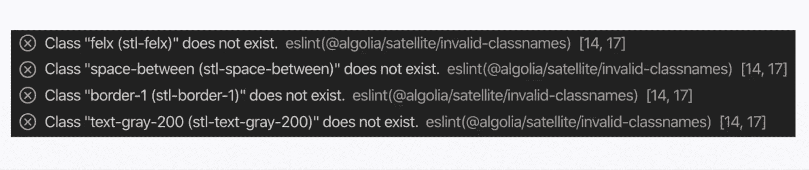
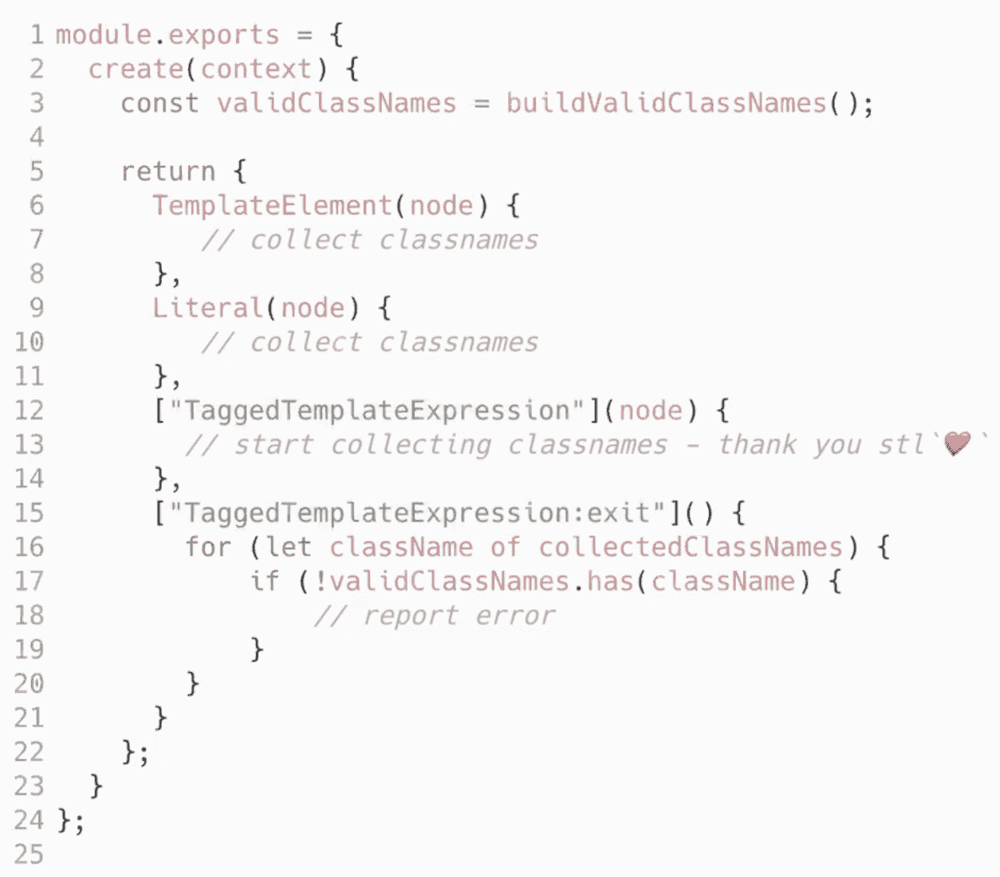
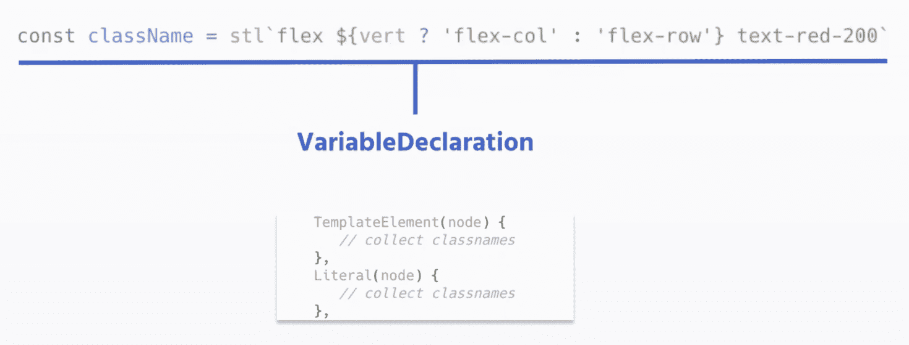
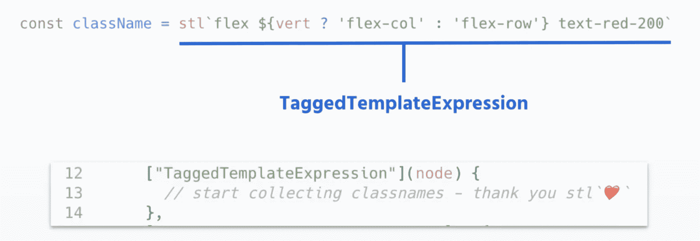
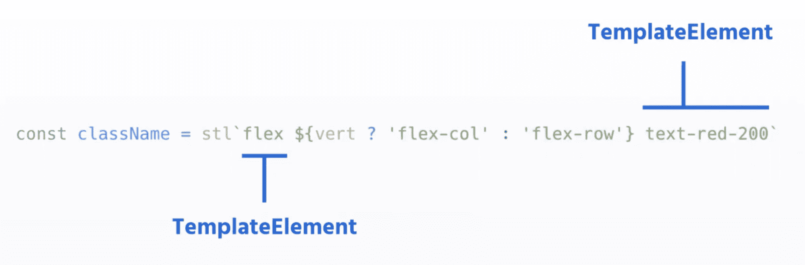
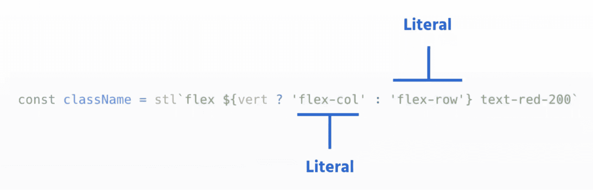
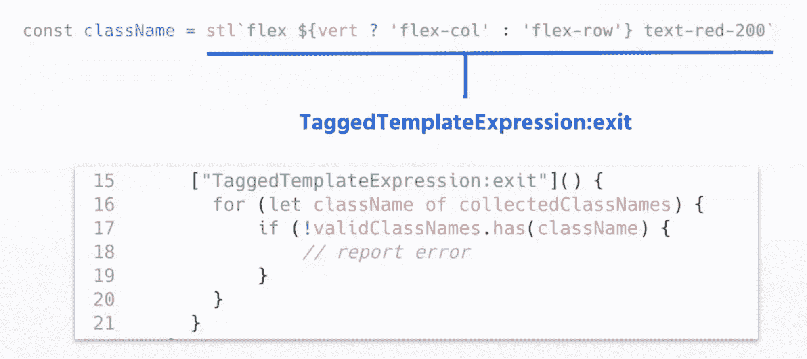
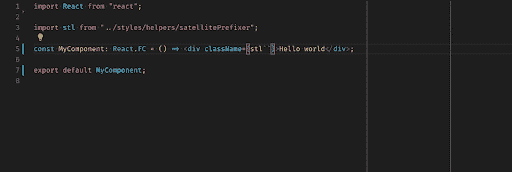

# 使用 ESLint、标记模板文字等来简化 Tailwind CSS

> 原文：<https://www.algolia.com/blog/engineering/simplifying-tailwind-css-with-eslint-tools-tagged-template-literals-and-a-lot-more/>

经过多年的开发，我们决定将我们最重要的产品之一——多应用仪表板的用户界面标准化。我们这样做是为了我们的客户和内部用户(易用性)以及我们的产品团队(更容易的设计过程、决策和编码)。我们还需要与我们公司的品牌更加一致。

为此，我们建立了一个内部设计系统，叫做卫星。在开发 Satellite 的过程中，我们研究了 UI 库的不同 CSS 解决方案，各有利弊: [Saas](https://sass-lang.com/) ， [css 模块](https://github.com/css-modules/css-modules) ，[CSS-in-js](https://cssinjs.org/?v=v10.9.0)。

考虑到框架类似于 Bootstrap，我们选定了 CSS 框架[Tailwind CSS](https://tailwindcss.com/)。为什么？

*   纯 CSS(无 JS 运行时)——性能良好
*   倾向于生成更小的 CSS 样式表文件(清除后)——对性能也有好处
*   开发新组件时，不要在 CSS 文件和 javascript 代码之间切换
*   没有时间浪费在寻找实用程序类的好名字上
*   有助于提高用户界面的一致性
*   允许你定义一个间距和颜色的集合，很好地映射到设计符号(“受限调色板”)

然而……顺风有一个缺点:复杂组件的可读性。当你不习惯它的类名时，顺风的汤可能很难消化。在我们的例子中，情况变得更糟，因为我们必须使用 CSS 类的前缀版本(`stl-`)来避免与我们的遗留 CSS 冲突，这给我们的类名字符串增加了更多的噪音和长度。

这篇文章展示了我们如何减轻可读性问题。首先，我们使用了几种 web 开发技术，比如标记文字和插值，来缩短字符串的长度。然后我们用 linter 工具 ESLint 简化了类名的使用，用两个工具提供了更好的 DX:

*   一个 ESLint 插件，因为当时没有 [官方 ESLint-Tailwind 插件](https://www.npmjs.com/package/eslint-plugin-tailwindcss) 。
*   一个 Visual Studio 代码扩展，通过提供对 Tailwind 的许多类的智能感知来简化使用。 [官方 ESLint VS extension](https://marketplace.visualstudio.com/items?itemName=bradlc.vscode-tailwindcss)对我们不起作用，因为它期望项目中存在一个配置文件(`tailwind.config.js`)，而我们当时使用的是预构建版本。在其他任务中，我们需要 VS 来处理我们的配置文件。

这或多或少就是背景。现在让我们进入实现阶段。

## [](#tailwind-%e2%80%93-classnames-are-good-but-can-get-complex)

### [](#classnames-are-good)类名不错

像[Tailwind](https://tailwindcss.com/)这样的实用程序优先的 CSS 框架附带了大量预先存在的实用程序类，您可以在 HTML 和 JavaScript 中直接使用它们。这些类实现了代码的一致性。而且它们是完全可配置的:有了相同的类名，我们可以很容易地用变体来标记我们的应用程序。因此，使用 Tailwind CSS 类名使我们能够创建一组一致的颜色、间距、字体——本质上是 CSS 的所有东西——并推出一个易于实现的设计系统。

### [](#but-tailwind-classes-can-get-complex)但是顺风类可以变复杂

我们想简化对 Tailwind 类的使用。为此，我们使用了标记模板文字、插值和条件等技术。

我们从一长串 CSS 类开始，如下所示:

```
const className = 'stl-inline-flex stl-items-center stl-justify-center stl-rounded-full stl-h-10 stl-w-10 stl-bg-blue-100';

```

但是我们很快意识到这并不容易读懂。此外，它包含了不必要的噪声，比如前缀`stl-`，用来避免与其他类冲突。因此，我们求助于 [标记的模板文字](https://www.freecodecamp.org/news/a-quick-introduction-to-tagged-template-literals-2a07fd54bc1d/) 来移除字符串中的前缀。我们创建了一个`stl` *标签:*

```
const className = stl 'inline-flex items-center justify-center rounded-full h-10 w-10 bq-blue-100';

```

最后，我们想要更多的可读性。所以我们加了:

*   为了更好的可读性和公共元素的分组，使用单独的行
*   内联标记模板文字插值
*   更强大、适应性更强的造型条件

结果是一段优雅的(CSS)代码:

```
const className = stl '
inline-flex items-center justify-center
h-10 w-10
${round && 'rounded-full'}
${iscool ? 'bg-blue-100' : 'bq-red-100'}
;

```

## [](#eslint-%e2%80%93-effortlessly-correcting-human-error)ESLint——毫不费力地纠正人为错误

优雅是一回事。正确是另一回事。很容易拼错类，尤其是当在 Tailwind 中有很多类需要学习的时候。

这里有一个可能出错的例子

```
cost className = stl 'felx space-between text-gray-200’;

```

你能发现这些错误吗？

*   切换字母(felx 代表 flex)
*   不完整或不存在的类(空格分隔)
*   美式 vs 英式拼写(灰色)

### [](#eslint-to-the-rescue-%e2%80%93-creating-an-eslint-plugin)ESLint 来拯救——创建 ESLint 插件

我们需要验证人们使用的类是正确的。所以我们使用了 linter 工具[ESLint](https://eslint.org/)来解析代码，分析它，并报告错误。为了保证代码质量，我们创建了一个 ESLint 插件来报告不存在的类名错误。



下面是进行验证的中央 ESLint 代码:



ESLint 使用抽象语法树(AST ),可以访问单独的代码行。AST 本质上将代码的字符串转换成节点，您可以将节点解析为集合和元素。

下面是 ESLint 解析代码的细节。整个表达式是一个类型为`VariableDeclataion` : 的`node`



我们想要解析右边的表达式，即`TaggedTemplateExpression`。如您所见，有一个回调函数处理这种表达式:

【T2

在`TaggedTemplateExpression`回调中，我们收集模板中的所有字符串。例如:





一旦收集完成，就会有另一个注册的回调循环遍历收集到的类名，并确认它们是否存在。它对集合`validClassNames` : 执行此操作



就这样。我们马上知道创建这个验证插件是正确的，因为我们实际上在我们的系统以及现有的仪表板代码库中发现了一些拼写错误！

### [](#proposing-suggestions-with-our-eslint-visualstudio-extension)用我们的 ESLint VisualStudio 扩展提出建议

我们创建的最后一个工具是 Visual Studio 代码中的一个扩展。使用与我们插件中相同的逻辑，ESLint 建议开发人员键入类型脚本类。这种智能感知使开发人员不必猜测或去 Tailwind 网站搜索和找到正确的类。



正如你在 GIF 中看到的，它不仅给出了类名，还显示了每个建议的颜色或有用的图标。

有了 Tailwind CSS 和 ESLint，我们已经能够通过改进 DX 来执行我们的标准(在 Github 上可以内部访问)。