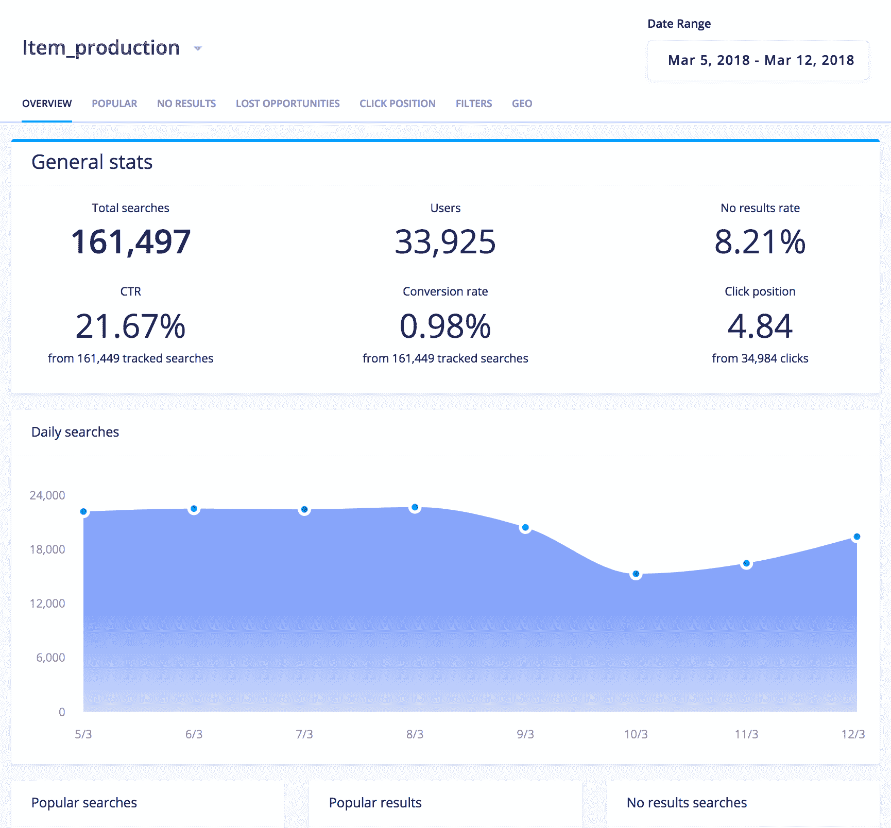

# 搜索分析:从用户搜索数据中获得洞察力

> 原文：<https://www.algolia.com/blog/product/supercharging-search-analytics/>

通过分析你的用户搜索什么，你可以了解他们想要什么，他们使用哪些关键词。通过观察他们如何与搜索结果互动，你可以了解你的服务如何满足他们的愿望。

最重要的是，通过搜索，你可以获得关于用户意图的宝贵反馈:这些反馈可以加速他们的数字化之旅，从而增加你的收入。但这只有在你积极使用他们通过搜索提供给你的数据的情况下才是真的——如果你收集、分析和展示这些数据的话。

## 我们的新分析

我们的分析功能将首次全程跟踪搜索流程——从开始到结束。我们不仅分析输入的查询和使用的过滤器，还分析检索到的结果以及用户如何与它们交互。人们点击结果列表吗？他们会在购物车中添加产品、阅读文章或观看视频吗？

今天，我们发布了一个新的分析功能，可通过 API 和最新更新的前端仪表板获得。它旨在跟踪搜索后的点击和转换事件。

## 新功能

### 分析 API

**搜索。** 提高查询和关键字用户类型的可见性，以及返回零结果的查询。为一次性有问题的查询设置 [查询规则](https://algolia.com/query-rules)—或者调整您的可搜索属性以解决系统性问题。

**滤镜。** Cr 根据用户搜索时选择的最常用过滤器，针对特定关键词预定义过滤器，从而加快转化速度。

**结果。我通过洞察用户在执行搜索时看到的结果来提高每个查询的相关性。识别和分析低质量的搜索结果，并找到有问题的查询，如常见的错别字、模糊的查询和查询重构，以改善内容和相关性。**

### 点击分析 API

**点击。**Ga 洞察用户正在点击什么结果，那些结果出现在什么位置，以及特定搜索查询的平均点击位置

**转换。** 加入搜索和转换数据，以了解哪些搜索结果正在转换，并改进导致用户放弃  的搜索查询

## 为什么有用  

搜索分析提供价值的主要方式有两种:给你可操作的商业洞察力，以及帮助你提高搜索引擎的相关性。  

### 商业见解

通过分析用户输入的查询，您可以获得对您的业务有用的见解:  

*   **完善你的产品目录或内容。** 例如，一个电子商务平台可以意识到客户经常询问某个特定产品，他们应该将该产品添加到他们的目录中。新闻媒体可以了解更多他们的观众想了解的话题。
*   **提升 SEO** 。如果你的用户在你的网站上搜索某些词，这些词很可能也是他们在谷歌上输入的词。
*   推动你的销售和营销计划。注意到像“健康”、“便宜”或“革命”这样的主题词的流行可以推动你未来的活动。

### 提高搜索的相关性  

分析表面提高搜索相关性的简单方法:  

*   查询“沙发”没有返回结果？也许你错过了“沙发”的同义词“沙发”。
    T39
*   查询“番茄”的点击率比你希望的低？也许你的关联配置检索到的“番茄汤”比实际的番茄要高，你需要改进你的关联策略。 
*   你搜索到的最多的文章与你最好的文章不相符？你可以更新你的排名来展示更多。

## 这只是开始！

自从我们创建 Algolia 以来，我们的目标一直是专注于打造最好的搜索引擎，而我们新的分析功能是这条道路上的又一步。它为我们引擎的强大基础增加了一个新的维度:文本和业务相关性、速度和可靠性。  

我们迫不及待地想看到您如何利用分析技术对您的搜索体验和业务做出有意义的改进。我们当然计划在这一过程中为您提供指导，并帮助您充分利用您的分析所带来的洞察力。  

[参加我们 4 月 5 日的网络研讨会](https://go.algolia.com/click_analytics_webinar)，了解搜索分析如何帮助提高转化率。另外，c 查看以下资源或 [联系我们进行演示](https://www.algolia.com/demorequest/) :

不要犹豫，联系并分享你的问题和反馈:[给我们发邮件](mailto:%20support@algolia.com)， [发推特给我们](https://twitter.com/algolia) ，评论这个帖子。