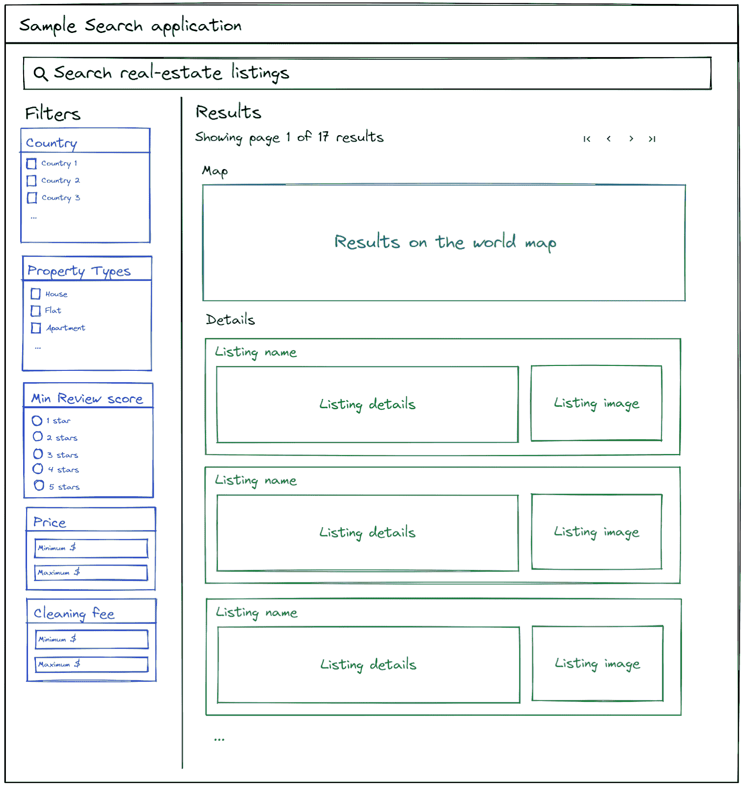
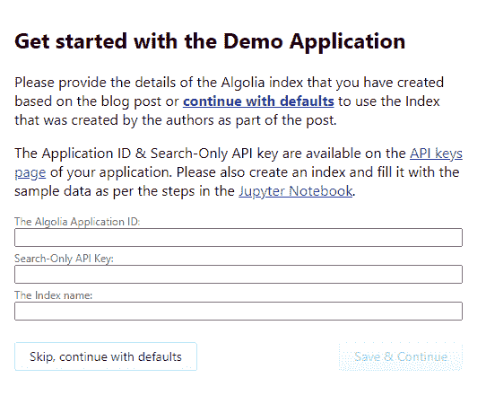
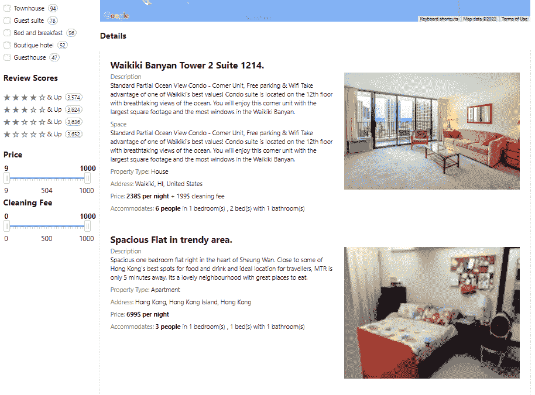

# Algolia+MongoDB–第 4 部分:前端实现和结论

> 原文：<https://www.algolia.com/blog/engineering/supercharging-search-for-ecommerce-solutions-with-algolia-and-mongodb-frontend-implementation-and-conclusion/>

我们邀请 Starschema 的朋友写一个结合使用 Algolia 和 MongoDB 的例子。我们希望您喜欢这个由全栈工程师 Soma Osvay 撰写的四部分系列。

如果你想回顾一下，以下是其他链接:

[第 1 部分——用例、架构和当前挑战](https://www.algolia.com/blog/engineering/supercharging-search-for-ecommerce-solutions-with-algolia-and-mongodb-use-case-architecture-and-current-challenges/)

[第 2 部分–建议的解决方案和设计](https://www.algolia.com/blog/engineering/supercharging-search-for-ecommerce-solutions-with-algolia-and-mongodb-proposed-solution-and-design/)

[第 3 部分–数据管道实施](https://www.algolia.com/blog/engineering/supercharging-search-for-ecommerce-solutions-with-algolia-and-mongodb-data-pipeline-implementation/)

* * *

在这篇文章中，我将实现使用我们在本系列第 3 部分中创建的 Algolia 索引的前端。创建的 web 应用程序在这里可用:[https://algolia-listings.starschema.com/](https://algolia-listings.starschema.com/)。默认情况下，您可以使用我们的示例数据来尝试它，但是如果您一直遵循并尝试我们在上一篇文章中使用的格式，您可以连接自己的索引！应用程序的代码可在 GitHub 的 [上](https://github.com/algolia-samples/algolia-mongodb)[获得。在](https://stackblitz.com/github/serionist/algolia-mongodb-frontend/tree/master?file=src%2Falgolia.js) [StackBlitz](https://stackblitz.com/github/algolia-samples/algolia-mongodb/tree/main/search-web-application?file=src%2Falgolia.js) 上举办了一场公开演示。

## [](#step-0-planning)第 0 步。规划

我们现有的面向消费者的应用程序的前端是用 jQuery 和普通 JavaScript 编写的，所以我需要确保我正在开发的 Algolia 示例应用程序与这些技术兼容。幸运的是，Algolia 的 [InstantSearch.js](https://www.algolia.com/doc/guides/building-search-ui/what-is-instantsearch/js/) 无需任何定制就可以与 vanilla 前端兼容，所以我可以使用 Algolia 文档中的默认示例实现。在开始之前，我画了一个我想用 Algolia 搜索 UI 创建的快速草图。我将我们现有的搜索页面作为基线，并添加了一些我们目前缺少的额外功能:



我使用官方的 Algolia [入门指南](https://www.algolia.com/doc/guides/building-search-ui/getting-started/js/)来设置我的项目并开始编码。 [`npx create-instantsearch-app`创建了一个准备充分、结构良好的应用程序](https://www.algolia.com/blog/engineering/journey-better-dx-create-instantsearch-app/)，我可以修改它来匹配我的用例。

在开始 Algolia 特定的开发之前，我必须确保我的 Algolia 应用程序 ID 和 API 密钥没有硬编码在我的应用程序中，以便我可以轻松地共享源代码。为此，我们创建了一个表单，要求您提供 Algolia 凭据，并将它们存储在浏览器`localStorage`中，以便在查询中使用。



## [](#step-1-modify-html-and-css)第一步。修改 HTML 和 CSS

首先，我必须改变与项目一起创建的生成的`index.html`文件的布局。这是因为我希望有一个不同于 Algolia 最初根据我的 UI 计划为我创建的搜索布局。经过几次迭代，我实际上偏离了我最初的计划:我在过滤器部分的顶部添加了一个 Clear Refinements 按钮，取消了分页，因为我意识到 Algolia 支持[无限滚动](https://www.algolia.com/doc/guides/building-search-ui/ui-and-ux-patterns/infinite-scroll/js/)，我决定实现 [GeoSearch](https://www.algolia.com/doc/guides/building-search-ui/ui-and-ux-patterns/geo-search/js/) (这样我们的最终用户除了文本之外还可以通过位置进行搜索)。我更新的特定于 Algolia 的 HTML 和 CSS 如下所示:

```
<!--Used to host the Algolia search UI-->
<div id="algolia-container">
	<!-- The search box. Located on the top of the page, spanning the entire width -->
	<div id="searchbox"></div>
	<!-- The filters section, located on the left -->
	<div class="filters">
		<h2>Filters</h2>
		<!-- Clear filters button location -->
		<div id="clear-refinements"></div>
		<!-- Country filter location -->
		<h3>Country</h3>
		<div id="country-list"></div>
		<!-- Property Types filter location -->
		<h3>Property Types</h3>
		<div id="property-list"></div>
		<!-- Review scores filter location -->
		<h3>Review Scores</h3>
		<div id="review-scores"></div>
		<!-- Price filter location -->
		<h3>Price</h3>
		<div id="price"></div>
		<!-- Cleaning fee filter location -->
		<h3>Cleaning Fee</h3>
		<div id="cleaning-fee"></div>
	</div>
	<!-- The results panel, located to the right side from the filters -->
	<div class="results">
		<h2>Results</h2>
		<!-- The pagination container, which was later changed to infinite scroll results container -->
		<div class="pagination-container">
			<!-- The container which displays the number of results, and a link which can load the next set of results. These are modified from js -->
			<div id="result-count">
				<span></span>
				<a href="#"></a>
			</div>
			<!-- The location of the control that controls how many results are loaded at once -->
			<div id="per-page"></div>
		</div>
		<!-- The location for the map which shows the results on the world map -->
		<div id="map-display">
			<h3>Map</h3>
			<div id="geo-search"></div>
		</div>
		<!-- The location of the search result details -->
		<div id="details-display">
			<h3>Details</h3>
			<div id="hits"></div>
		</div>
	</div>
</div> 
```

Algolia 的 InstantSearch.js 能够自动创建自己的控件，所以我只需提供布局本身。

我还用了一些 CSS 来使它看起来更好:

```
#algolia-container {
    max-width: 1200px;
    margin: 0 auto;
    padding: 1rem;
    display: grid;
    grid-template-columns: 200px 1fr;
    grid-template-rows: auto auto;
    gap: 20px;
}

#searchbox {
    grid-column: 1 / 3;
    grid-row: 1;
}
.filters {
    grid-row: 2;
    grid-column: 1;
}
.results {
    grid-row: 2;
    grid-column: 2;
}
.pagination-container {
    display: grid;
    grid-template-columns: 1fr auto auto;
    gap: 20px;
}

.ais-GeoSearch-map {
    height: 500px; /* You can change this height */
} 
```

## [](#step-2-initialize-algolia-instantsearch-js)第二步。初始化 Algolia 即时搜索. js

接下来，我初始化了 Algolia JS 引擎，它将查询我的索引并显示结果。

```
const {
	algoliasearch,
	instantsearch
} = window;

// Initialize the Algolia Search client and connect to our index
const searchClient = algoliasearch(appId, searchKey);
const search = instantsearch({
	indexName: indexName,
	routing: true,
	searchClient,
}); 
```

## [](#step-3-add-widgets)第三步。添加小部件

Algolia 已经将他们的前端功能设计成了“widgets”，即你可以动态合并空的 HTML 节点的 UI 组件。Algolia 使用这些来添加搜索框、过滤和分面界面、无限滚动和许多其他功能。我们可以通过调用`addWidgets`来添加小部件，并以数组的形式提供所需的小部件。

```
search.addWidgets([
	// The widget definitions go here
]); 
```

我将逐步介绍我使用的所有小部件，但是请记住，下面的代码示例都发生在`addWidgets`的数组参数中。

1.  [搜索框](https://www.algolia.com/doc/api-reference/widgets/search-box/js/)。这将向页面添加基本搜索栏。

    ```
    instantsearch.widgets.searchBox({
 	container: '#searchbox',
 	placeholder: 'Search real-estate listings',
 	autofocus: true
 }) 
    ```

2.  [InfiniteHits](https://www.algolia.com/doc/api-reference/widgets/infinite-hits/js/). This is where our search results will populate. I used `InfiniteHits` instead of just `Hits` to enable infinite scrolling.

    ```
    instantsearch.widgets.infiniteHits({
    	container: '#hits',
    	templates: {
    		// Item template will be filled out later
    		item: `Sample item template`
    	}
    }) 
    ```

    该控件将包含 item 模板，这是一段显示单个搜索结果的 HTML 代码。我会回到这个问题上——现在这里只有一个占位符。

3.  [每页点击量](https://www.algolia.com/doc/api-reference/widgets/hits-per-page/js/)。这个小部件允许用户选择一次加载的项目数量。

    ```
    instantsearch.widgets.hitsPerPage({
 	container: '#per-page',
 	items: [{
 			label: 'Load 5 results per page',
 			value: 5
 		},
 		{
 			label: 'Load 10 results per page',
 			value: 10
 		},
 		{
 			label: 'Load 20 results per page',
 			value: 20
 		},
 		{
 			label: 'Load 50 results per page',
 			value: 50,
 			default: true
 		},
 		{
 			label: 'Load 100 results per page',
 			value: 100
 		},
 		{
 			label: 'Load 200 results per page',
 			value: 200
 		}
 	]
 }) 
    ```

4.  [清除滤镜](https://www.algolia.com/doc/api-reference/widgets/clear-refinements/js/)按钮。用户可以按下此按钮清除所有优化。

    ```
    instantsearch.widgets.clearRefinements({
 	container: '#clear-refinements',
 	templates: {
 		resetLabel: 'Clear filters',
 	},
 }) 
    ```

5.  针对酒店类型和国家过滤器的[细化列表](https://www.algolia.com/doc/api-reference/widgets/refinement-list/js/)。这提供了复选框，允许用户过滤特定属性类型和位于特定国家/地区的结果。

    ```
    instantsearch.widgets.refinementList({
   container: '#property-list',
   attribute: 'property_type'
 }),
 instantsearch.widgets.refinementList({
   container: '#country-list',
   attribute: 'address.country'
 }) 
    ```

6.  一个[分级菜单](https://www.algolia.com/doc/api-reference/widgets/rating-menu/js/)，用于过滤某些分级的列表。我原本想为此创建一个简单的单选按钮菜单，但我意识到 Algolia 支持这种开箱即用的控件。

    ```
    instantsearch.widgets.ratingMenu({
 	container: '#review-scores',
 	attribute: 'scores.stars'
 }) 
    ```

7.  [列表价格和清洁费的范围滑块](https://www.algolia.com/doc/api-reference/widgets/range-slider/js/)。最初，我想将文本输入限制在某个范围内，但是我发现滑块使用起来更直观。

    ```
    instantsearch.widgets.rangeSlider({
 	container: '#price',
 	attribute: 'price',
 	precision: 10
 }),
 instantsearch.widgets.rangeSlider({
 	container: '#cleaning-fee',
 	attribute: 'cleaning_fee',
 	precision: 5
 }) 
    ```

8.  [地图小工具](https://www.algolia.com/doc/api-reference/widgets/geo-search/js/+)用于在世界地图上显示结果。我还为地图上的标记添加了一个 click 事件，稍后我将实现该事件来滚动到被单击的列表的详细信息。

    ```
    instantsearch.widgets.geoSearch({
 	container: '#geo-search',
 	googleReference: window.google,
 	initialPosition: {
 		lat: 48.864716,
 		lng: 2.349014,
 	},
 	initialZoom: 10,
 	builtInMarker: {
 		createOptions(item) {
 			return {
 				title: item.name,
 			};
 		},
 		events: {
 			click({
 				event,
 				item,
 				marker,
 				map
 			}) {
 				// to be implemented later
 			},
 		},
 	},
 }) 
    ```

9.  I also added a custom connector for [infinite hits](https://www.algolia.com/doc/api-reference/widgets/infinite-hits/js/#full-example). Custom connectors let you hijack the functionality of a widget but provide your own HTML, so it’s entirely customizable and dynamic. The reason that I went this route is that Algolia didn’t provide an existing widget to show the result information exactly the way I wanted to due to the layout of our existing search page. Essentially, I give the array of widgets my own custom widget name like this:

    ```
    customInfiniteHits({}) 
    ```

    然后，在小部件数组之外，我创建了一个自定义函数，当点击次数发生变化时运行该函数，并为点击列表返回新的 HTML。我将它配置为在当前地理搜索没有搜索结果或根本没有搜索结果时拥有定制的视图。当有结果时，它显示结果计数，并允许用户请求将下一页结果附加到当前页的底部。

    ```
    // Define custom logic that runs when the results changed.
    // This will call a function that displays the total result count and allows the user to Load more or clear filters if needed.
    // The hitsChanged method is defined below to keep the initialization code clean.
    // Documentation: <https://www.algolia.com/doc/api-reference/widgets/infinite-hits/js/>
    const renderInfiniteHits = hitsChanged;
    const customInfiniteHits = instantsearch.connectors.connectInfiniteHits(
    	renderInfiniteHits
    );
    // This function is called every time the search results change
    // It checks how many results there are in total and either:
    // - displays a 'No results found' message to the user along with the possibility to Clear Filters. It also hides the result container and possibly the map too
    // - displays information about how many total results there are, and how many are currently displayed. It also allows the users to click a 'Load more' button on the top of the page.
    function hitsChanged(renderOptions) {
    	// if this is an initial render and we got no results object, skip
    	if (!renderOptions.results) {
    		return;
    	}
    	// get the reference for the Result Count elements on the UI (its text and link as well)
    	const resultCountElement = document.getElementById('result-count');
    	const textEl = resultCountElement.querySelector('span');
    	const linkEl = resultCountElement.querySelector('a');
    	// check if we have any results
    	const hasHits = renderOptions.results.nbHits !== 0;
    	// check if we have any search query
    	const hasQuery = !!renderOptions.results.query;
    	// check if we have any geo bounding box (query made on map)
    	const hasGeoQuery = !!renderOptions.results._state.insideBoundingBox;
    	// We show/hide result Details depending if we have results or not
    	document.getElementById('details-display').style.display = hasHits ? 'block' : 'none';
    	// We hide the Map display if we have no results AND there was no map query applied (so the query can be undone)
    	document.getElementById('map-display').style.display = hasHits || hasGeoQuery ? 'block' : 'none';
    	// Update the Result count container to display information about results
    	if (hasHits) {
    		// if there are any results
    		if (renderOptions.isLastPage) {
    			// if we are on last page, show text and a link to clear filters
    			textEl.innerText = `Showing all ${renderOptions.hits.length} results`;
    			linkEl.style.display = 'none';
    			linkEl.innerText = 'Clear all filters';
    			linkEl.href = '.';
    			linkEl.style.display = 'inline';
    			linkEl.onclick = null;
    		} else {
    			// if we are not on last page, show text and link to load more items
    			textEl.innerText = `Showing top ${renderOptions.hits.length} results of ${renderOptions.results.nbHits}`;
    			linkEl.href = '';
    			linkEl.innerText = 'Load more';
    			linkEl.style.display = 'inline';
    			linkEl.href = "#";
    			linkEl.onclick = () => {
    				renderOptions.showMore();
    				return false;
    			};
    		}
    	} else {
    		// if we have no results, construct message
    		let statusMessage = 'No results have been found';
    		if (hasQuery) {
    			statusMessage += ` for '${renderOptions.results.query}'`;
    		}
    		if (hasGeoQuery) {
    			statusMessage += ' in selected map area';
    		}
    		// show message and link to clear filters
    		textEl.innerText = statusMessage
    		linkEl.innerText = 'Clear all filters';
    		linkEl.href = '.';
    		linkEl.style.display = 'inline';
    		linkEl.onclick = null;
    	}
    } 
    ```

添加我的小部件后，UI 如下所示:


## [](#step-4-modify-the-item-template)第四步。修改项目模板

在添加小部件时，我将搜索结果模板留空，因此项目细节还没有正确显示。我将`InfiniteHits`小部件配置更改为:

```
instantsearch.widgets.infiniteHits({
  container: '#hits',
  templates: {
    // We use no 'empty' template, as our results container will be hidden if there are no results.
    // The item template is heavily modified to draw the details of a listing in detail
    item: `
      <article id="hit-{{objectID}}">
        <div class="name-container">
          <h1 class="name">{{#helpers.highlight}}{ "attribute": "name" }{{/helpers.highlight}}</h1>
          {{#scores}}
            <div class="stars">
              <svg aria-hidden="true">
                {{#scores.has_one}}
                  <use xlink:href="#ais-RatingMenu-starSymbol"></use>
                {{/scores.has_one}}
                {{^scores.has_one}}
                  <use xlink:href="#ais-RatingMenu-starEmptySymbol"></use>
                {{/scores.has_one}}
              </svg>
              <svg aria-hidden="true">
                {{#scores.has_two}}
                  <use xlink:href="#ais-RatingMenu-starSymbol"></use>
                {{/scores.has_two}}
                {{^scores.has_two}}
                  <use xlink:href="#ais-RatingMenu-starEmptySymbol"></use>
                {{/scores.has_two}}
              </svg>
              <svg aria-hidden="true">
                {{#scores.has_three}}
                  <use xlink:href="#ais-RatingMenu-starSymbol"></use>
                {{/scores.has_three}}
                {{^scores.has_three}}
                  <use xlink:href="#ais-RatingMenu-starEmptySymbol"></use>
                {{/scores.has_three}}
              </svg>
              <svg aria-hidden="true">
                {{#scores.has_four}}
                  <use xlink:href="#ais-RatingMenu-starSymbol"></use>
                {{/scores.has_four}}
                {{^scores.has_four}}
                  <use xlink:href="#ais-RatingMenu-starEmptySymbol"></use>
                {{/scores.has_four}}
              </svg>
              <svg aria-hidden="true">
                {{#scores.has_five}}
                  <use xlink:href="#ais-RatingMenu-starSymbol"></use>
                {{/scores.has_five}}
                {{^scores.has_five}}
                  <use xlink:href="#ais-RatingMenu-starEmptySymbol"></use>
                {{/scores.has_five}}
              </svg>
            </div>
          {{/scores}}
        </div>
        {{#description}}
          <div class="description">
            <div class="title">Description{{}}</div>
            <p class="desc">{{#helpers.highlight}}{ "attribute": "description" }{{/helpers.highlight}}</p>
          </div>
        {{/description}}
        {{#summary}}
          <div class="summary">
            <div class="title">Summary</div>
            <p class="desc">{{#helpers.highlight}}{ "attribute": "summary" }{{/helpers.highlight}}</p>
          </div>
        {{/summary}}
        {{#space}}
          <div class="space">
            <div class="title">Space</div>
            <p class="desc">{{#helpers.highlight}}{ "attribute": "space" }{{/helpers.highlight}}</p>
          </div>
        {{/space}}
        {{#neighborhood}}
          <div class="neigh">
            <div class="title">Neighborhood</div>
            <p class="desc">{{#helpers.highlight}}{ "attribute": "neighborhood_overview" }{{/helpers.highlight}}</p>
          </div>
        {{/neighborhood}}
        {{#transit}}
          <div class="transit">
            <div class="title">Transit</div>
            <p class="desc">{{#helpers.highlight}}{ "attribute": "transit" }{{/helpers.highlight}}</p>
          </div>
        {{/transit}}
        <div class="info">
          {{#property_type}}
            <div>
              <span class="title">Property Type:</span>
              <span>{{property_type}}</span>
            </div>
          {{/property_type}}
          {{#address}}
            <div>
              <span class="title">Address:</span>
              <span>{{#helpers.highlight}}{ "attribute": "address.street" }{{/helpers.highlight}}</span>
            </div>
          {{/address}}
          {{#price}}
            <div>
              <span class="title">Price:</span>
              <b>{{price}}$ per night</b>
              {{#cleaning_fee}}
                <span> + {{cleaning_fee}}$ cleaning fee</span>
              {{/cleaning_fee}}
              {{#security_deposit}}
                <span> + {{security_deposit}}$ security deposit</span>
              {{/security_deposit}}
            </div>
          {{/price}}
          {{#accommodates}}
            <div>
              <span class="title">Accommodates:</span>
              <b>{{accommodates}} people</b>
              {{#bedrooms}}
                <span> in {{bedrooms}} bedroom(s)</span>
              {{/bedrooms}}
              {{#beds}}
                <span>, {{beds}} bed(s)</span>
              {{/beds}}
              {{#bathrooms}}
                <span> with {{bathrooms}} bathroom(s)</span>
              {{/bathrooms}}
            </div>
          {{/accommodates}}
        </div>
        {{#images.picture_url}}
          
        {{/images.picture_url}}
      </article>
		`
  }
}) 
```

Algolia 项目模板使用 [Mustache](https://mustache.github.io/mustache.5.html) 添加变量。在创建索引时将变量添加为`attributesToRetrieve`很重要，这样当 Algolia 构建项目的 HTML 时，它们就会出现在代码中。我还添加了以下 CSS 来正确显示项目:

```
article {
    display: grid;
    width: 100%;
    grid-template-columns: 1fr 400px;
    column-gap: 20px;
    grid-template-rows: auto auto auto auto auto auto auto 1fr;
}

article .title {
    margin-top: 8px;
    font-size: 14px;
    color: gray;
}
article p {
    display: block;
    margin: 0px;
}

article .name-container {
    grid-row: 1;
    grid-column: 1 / 3;
}
article .name-container > * {
    display: inline-block;
    vertical-align: middle;
}

.stars {
    margin-left: 8px;
    height: 24px;
}
.stars svg {
    width: 24px;
    height: 24px;
    display: inline-block;
    fill: yellowgreen;
}

article .description {
    grid-row: 2;
    grid-column: 1;
}
article .summary {
    grid-row: 3;
    grid-column: 1;
}
article .space {
    grid-row: 4;
    grid-column: 1;
}
article .neigh {
    grid-row: 5;
    grid-column: 1;
}
article .transit {
    grid-row: 6;
    grid-column: 1;
}
article .info {
    grid-row: 7;
    grid-column: 1;
}
article .info > * {
    margin-top: 8px;
}
article .image {
    grid-column: 2;
    grid-row: 2 / 9;
    margin-top: 8px;
    width: 100%;
}
article .properties {
    display: grid;
    grid-template-columns: auto auto;
    gap: 4px;
    grid-auto-flow: column;
    width: fit-content;
}
article .properties .key {
    color: gray;
    font-size: 12px;
}
article .properties .value {
    font-size: 12px;
} 
```

现在搜索结果是这样的:



## [](#lessons-learned)吸取教训

总的来说，我发现 Algolia InstantSearch.js 框架为在 web 应用程序中创建自己的搜索界面提供了一种非常灵活的方式。UI 构建感觉很流畅，小部件系统是一个非常好的工具，可以非常快速地构建好看的界面。使用定制连接器，我还意识到 Algolia 也可以适应更复杂的用例，这需要更定制的方法。生成的 HTML 可以很容易地进行样式化，看起来与原型大不相同。

我的整个 Algolia 前端实现只有几百行代码，相比之下，如果我自己要实现这种功能，我必须编写数千行代码。大部分代码都被我的自定义泛化和连接器逻辑占用了，Algolia 让我只用几个命令就将所有这些复杂的特性与默认的 InstantSearch.js 小部件捆绑在一起。

搜索速度惊人的快，指数超出我的预期相当多。平均搜索或过滤操作在 60 毫秒内显示结果，比我们通常预期的整整一秒钟要快得多。

[](https://www.algolia.com/developers/code-exchange/backend-tools/integrate-mongo-db-with-algolia/)

## [](#overall-conclusion)总体结论

在概念验证过程中，我发现:

*   Algolia 的搜索速度和准确性超过了我迄今为止见过的任何现有的解决方案。
*   Algolia 索引结构简单，不需要深入的技术知识。
*   搜索优先级、排名、地理搜索和其他属性都是可定制的，不需要大量的维护。
*   Algolia 搜索索引无缝集成到我们现有的数据管道中。它还公开了一个很棒的 Python API，因此脚本可以由我们热爱 Python 的数据工程师编写和维护。
*   Algolia 前端 SDK 是有据可查的。我向我们的一些前端开发人员展示了我的应用程序，在检查了代码之后，他们对自己使用 InstantSearch.js 感到非常兴奋。
*   由于 Algolia 是云托管的，这让我们的基础设施团队很高兴，因为没有必要在我们的环境中引入另一个系统。它可以自动扩展，并且提供的 SLA 符合我们的要求。
*   我们根本不需要修改我们的应用程序后端，这为我们节省了大量的时间和成本。

基于这些发现，我肯定会向我的团队推荐我们在生产中使用 Algolia。